<h1>Informe del Trabajo Final </h1>
<h3 style="text-align: center;"> Universidad Peruana de Ciencias Aplicadas </h3>

<h5 style="text-align: center"> Ingeniería de Software </h5>

<h5 style="text-align: center"> Aplicaciones para Dispositivos Móviles - 14649 </h5>

<h5 style="text-align: center"> Docente: David Gerardo Quevedo Velasco </h5>

<h5 style="text-align: center"> Startup: Selling Cars Quickly - SCQ - Mobile Application</h5>

<h5 style="text-align: center"> Producto: Certiweb </h5>

## Team members:
| Nombre |Código|
|:-------:|:----------:|
|||
|Alcántara Cruz, Rodrigo Alonso|U202216698|
|Agama Espinoza, Eric Fabrizio|U202213358|
|Barturen Guzman, Alejandro Nicolas|U202214406|
|Mechan Chumpitaz, Rodrigo Nicolas|U202114649|
|Ortiz Alarcón, Victor Nicolas|U202312899|

<h5 style="text-align: center"> Ciclo 2025-02 </h5>

### Registro de Versiones del Informe
| Versión | Fecha      | Autor      | Descripción de Modificación                                                                 | 
|---------|------------|------------|---------------------------------------------------------------------------------------------|
|    |  |     |    |

### Project Report Collaboration Insights

| Repositorio Selling Cars Quickly | [Selling-Cars Quickly-Mobile-Application](https://github.com/Selling-Cars-Quickly-Mobile-Application) |
|--------------------------|-----------------------------------------------|

### Student Outcome

| Criterio Específico | Acciones Realizadas | Conclusiones |
|---------------------|---------------------|--------------|
| Actualiza conceptos y   conocimientos necesarios para su   desarrollo profesional y en especial   para su proyecto en   soluciones de software. | **Rodrigo, Alcántara** TB1: [texto] TP: [texto] TB2: [texto] TF: [texto] **Eric, Agama** TB1: [texto] TP: [texto] TB2: [texto] TF: [texto] **Alejandro, Barturen** TB1: [texto] TP: [texto]. TB2: [Texto] TF: [Texto] **Rodrigo, Mechan** TB1: [texto] TP: [texto] TB2: [texto] TF: [texto] **Victor, Ortiz** TB1: [texto] TP: [texto] TB2: [texto] TF: [texto]. | [texto_Conclusiones] |
| Reconoce la necesidad del   aprendizaje permanente para el    desempeño profesional y el   desarrollo de proyectos en   soluciones de software. | **Rodrigo, Alcántara** TB1: [texto] TP: [texto] TB2: [texto] TF: [texto] **Eric, Agama** TB1: [texto] TP: [texto] TB2: [texto] TF: [texto] **Alejandro, Barturen** TB1: [texto] TP: [texto] TB2: [texto] TF: [Texto] **Rodrigo, Mechan** TB1: [texto] TP: [texto] TB2: [texto] TF: [texto] **Victor, Ortiz** TB1: [texto] TP: [texto] TB2: [texto] TF: [texto]| [texto_Conclusiones] |

# Índice

- [Capítulo I: Presentación](#capítulo-i-presentación)
  - [1.1. Startup Profile](#11-startup-profile)
    - [1.1.1. Descripción de la Startup](#111-descripción-de-la-startup)
    - [1.1.2. Perfiles de integrantes del equipo](#112-perfiles-de-integrantes-del-equipo)
    - [1.2. Solution Profile](#12-solution-profile)
      - [1.2.1. Antecedentes y problemática](#121-antecedentes-y-problemática)
      - [1.2.2. Lean UX Process](#122-lean-ux-process)
        - [1.2.2.1. Lean UX Problem Statements](#1221-lean-ux-problem-statements)
        - [1.2.2.2. Lean UX Assumptions](#1222-lean-ux-assumptions)
        - [1.2.2.3. Lean UX Hypothesis Statements](#1223-lean-ux-hypothesis-statements)
        - [1.2.2.4. Lean UX Canvas](#1224-lean-ux-canvas)
    - [1.3. Segmentos objetivo](#13-segmentos-objetivo)

- [Capítulo II: Requirements Development and Software Solution Design](#capítulo-ii-requirements-development-and-software-solution-design)
  - [2.1. Competidores](#21-competidores)
    - [2.1.1. Análisis competitivo](#211-análisis-competitivo)
    - [2.1.2. Estrategias y tácticas frente a competidores](#212-estrategias-y-tácticas-frente-a-competidores)
  - [2.2. Entrevistas](#22-entrevistas)
    - [2.2.1. Diseño de entrevistas](#221-diseño-de-entrevistas)
    - [2.2.2. Registro de entrevistas](#222-registro-de-entrevistas)
    - [2.2.3. Análisis de entrevistas](#223-análisis-de-entrevistas)
  - [2.3. Needfinding](#23-needfinding)
    - [2.3.1. User Personas](#231-user-personas)
    - [2.3.2. User Task Matrix](#232-user-task-matrix)
    - [2.3.3. User Journey Mapping](#233-user-journey-mapping)
    - [2.3.4. Empathy Mapping](#234-empathy-mapping)
    - [2.3.5. Ubiquitous Language](#235-ubiquitous-language)
  - [2.4. Requirements specification](#24-requirements-specification)
    - [2.4.1. User Stories](#241-user-stories)
    - [2.4.2. Impact Mapping](#242-impact-mapping)
    - [2.4.3. Product Backlog](#243-product-backlog)
  - [2.5. Strategic-Level Domain-Driven Design](#25-strategic-level-domain-driven-design)
    - [2.5.1. EventStorming](#251-eventstorming)
      - [2.5.1.1. Candidate Context Discovery](#2511-candidate-context-discovery)
      - [2.5.1.2. Domain Message Flows Modeling](#2512-domain-message-flows-modeling)
      - [2.5.1.3. Bounded Context Canvases](#2513-bounded-context-canvases)
    - [2.5.2. Context Mapping](#252-context-mapping)
    - [2.5.3. Software Architecture](#253-software-architecture)
      - [2.5.3.1. Software Architecture Context Level Diagrams](#2531-software-architecture-context-level-diagrams)
      - [2.5.3.2. Software Architecture Container Level Diagrams](#2532-software-architecture-container-level-diagrams)
      - [2.5.3.3. Software Architecture Deployment Diagrams](#2533-software-architecture-deployment-diagrams)
  - [2.6. Tactical-Level Domain-Driven Design](#26-tactical-level-domain-driven-design)
    - [2.6.1. Bounded Context: IAM](#261-bounded-context-iam)
      - [2.6.1.1. Domain Layer](#2611-domain-layer)
      - [2.6.1.2. Interface Layer](#2612-interface-layer)
      - [2.6.1.3. Application Layer](#2613-application-layer)
      - [2.6.1.4 Infrastructure Layer](#2614-infrastructure-layer)
      - [2.6.1.5. Bounded Context Software Architecture Component Level Diagrams](#2615-bounded-context-software-architecture-component-level-diagrams)
      - [2.6.1.6. Bounded Context Software Architecture Code Level Diagrams](#2616-bounded-context-software-architecture-code-level-diagrams)
      - [2.6.1.6.1. Bounded Context Domain Layer Class Diagrams](#26161-bounded-context-domain-layer-class-diagrams)
      - [2.6.1.6.2. Bounded Context Database Design Diagram](#26162-bounded-context-database-design-diagram)
    - [2.6.2. Bounded Context: Certificaciones](#262-bounded-context-certificaciones)
      - [2.6.2.1. Domain Layer](#2621-domain-layer)
      - [2.6.2.2. Interface Layer](#2622-interface-layer)
      - [2.6.2.3. Application Layer](#2623-application-layer)
      - [2.6.2.4 Infrastructure Layer](#2624-infrastructure-layer)
      - [2.6.2.5. Bounded Context Software Architecture Component Level Diagrams](#2625-bounded-context-software-architecture-component-level-diagrams)
      - [2.6.2.6. Bounded Context Software Architecture Code Level Diagrams](#2626-bounded-context-software-architecture-code-level-diagrams)
      - [2.6.2.6.1. Bounded Context Domain Layer Class Diagrams](#26261-bounded-context-domain-layer-class-diagrams)
      - [2.6.2.6.2. Bounded Context Database Design Diagram](#26262-bounded-context-database-design-diagram)
    - [2.6.3. Bounded Context: Reservacion](#263-bounded-context-reservacion)
      - [2.6.3.1. Domain Layer](#2631-domain-layer)
      - [2.6.3.2. Interface Layer](#2632-interface-layer)
      - [2.6.3.3. Application Layer](#2633-application-layer)
      - [2.6.3.4 Infrastructure Layer](#2634-infrastructure-layer)
      - [2.6.3.5. Bounded Context Software Architecture Component Level Diagrams](#2635-bounded-context-software-architecture-component-level-diagrams)
      - [2.6.3.6. Bounded Context Software Architecture Code Level Diagrams](#2636-bounded-context-software-architecture-code-level-diagrams)
      - [2.6.3.6.1. Bounded Context Domain Layer Class Diagrams](#26361-bounded-context-domain-layer-class-diagrams)
      - [2.6.3.6.2. Bounded Context Database Design Diagram](#26362-bounded-context-database-design-diagram)
    - [2.6.4. Bounded Context: Usuarios](#264-bounded-context-usuarios)
      - [2.6.4.1. Domain Layer](#2641-domain-layer)
      - [2.6.4.2. Interface Layer](#2642-interface-layer)
      - [2.6.4.3. Application Layer](#2643-application-layer)
      - [2.6.4.4 Infrastructure Layer](#2644-infrastructure-layer)
      - [2.6.4.5. Bounded Context Software Architecture Component Level Diagrams](#2645-bounded-context-software-architecture-component-level-diagrams)
      - [2.6.4.6. Bounded Context Software Architecture Code Level Diagrams](#2646-bounded-context-software-architecture-code-level-diagrams)
      - [2.6.4.6.1. Bounded Context Domain Layer Class Diagrams](#26461-bounded-context-domain-layer-class-diagrams)
      - [2.6.4.6.2. Bounded Context Database Design Diagram](#26462-bounded-context-database-design-diagram)

- [Capítulo III: Solution UI/UX Design](#capítulo-iii-solution-uiux-design)
  - [3.1. Product design](#31-product-design)
    - [3.1.1. Style Guidelines](#311-style-guidelines)
      - [3.1.1.1. General Style Guidelines](#3111-general-style-guidelines)
    - [3.1.2. Information Architecture](#312-information-architecture)
      - [3.1.2.1. Organization Systems](#3121-organization-systems)
      - [3.1.2.2. Labelling Systems](#3122-labelling-systems)
      - [3.1.2.3. SEO Tags and Meta Tags](#3123-seo-tags-and-meta-tags)
      - [3.1.2.4. Searching Systems](#3124-searching-systems)
      - [3.1.2.5. Navigation Systems](#3125-navigation-systems)
    - [3.1.3. Landing Page UI Design](#313-landing-page-ui-design)
      - [3.1.3.1. Landing Page Wireframe](#3131-landing-page-wireframe)
      - [3.1.3.2. Landing Page Mock-up](#3132-landing-page-mock-up)
    - [3.1.4. Mobile Applications UX/UI Design](#314-mobile-applications-uxui-design)
      - [3.1.4.1. Mobile Applications Wireframes](#3141-mobile-applications-wireframes)
      - [3.1.4.2. Mobile Applications Wireflow Diagrams](#3142-mobile-applications-wireflow-diagrams)
      - [3.1.4.3. Mobile Applications Mock-ups](#3143-mobile-applications-mock-ups)
      - [3.1.4.4. Mobile Applications User Flow Diagrams](#3144-mobile-applications-user-flow-diagrams)
      - [3.1.4.5. Mobile Applications Prototyping](#3145-mobile-applications-prototyping)

- [Capítulo IV: Product Implementation & Validation](#capítulo-iv-product-implementation--validation)
  - [4.1. Software Configuration Management](#41-software-configuration-management)
    - [4.1.1. Software Development Environment Configuration](#411-software-development-environment-configuration)
    - [4.1.2. Source Code Management](#412-source-code-management)
    - [4.1.3. Source Code Style Guide & Conventions](#413-source-code-style-guide--conventions)
    - [4.1.4. Software Deployment Configuration](#414-software-deployment-configuration)
  - [4.2. Landing Page & Mobile Application Implementation](#42-landing-page--mobile-application-implementation)
    - [4.2.1. Sprint n](#421-sprint-n)
      - [4.2.1.1. Sprint Planning n](#4211-sprint-planning-n)
      - [4.2.1.2. Sprint Backlog n](#4212-sprint-backlog-n)
      - [4.2.1.3. Development Evidence for Sprint Review](#4213-development-evidence-for-sprint-review)
      - [4.2.1.4. Testing Suite Evidence for Sprint Review](#4214-testing-suite-evidence-for-sprint-review)
      - [4.2.1.5. Execution Evidence for Sprint Review](#4215-execution-evidence-for-sprint-review)
      - [4.2.1.6. Services Documentation Evidence for Sprint Review](#4216-services-documentation-evidence-for-sprint-review)
      - [4.2.1.7. Software Deployment Evidence for Sprint Review](#4217-software-deployment-evidence-for-sprint-review)
      - [4.2.1.8. Team Collaboration Insights during Sprint](#4218-team-collaboration-insights-during-sprint)
  - [4.3. Validation Interviews](#43-validation-interviews)
    - [4.3.1. Diseño de Entrevistas](#431-diseño-de-entrevistas)
    - [4.3.2. Registro de Entrevistas](#432-registro-de-entrevistas)
    - [4.3.3. Evaluaciones según heurísticas](#433-evaluaciones-según-heurísticas)

- [Conclusiones](#conclusiones)
- [Conclusiones y recomendaciones.](#conclusiones-y-recomendaciones)
- [Video App Validation](#video-app-validation)
- [Video About the product](#video-about-the-product)
- [Video About the team](#video-about-the-team)
- [Glosario](#glosario)
- [Bibliografía](#bibliografía)
- [Anexos](#anexos)

<h1 id="capítulo-i-presentación">Capítulo I: Presentación</h1>
<h3 id="11-startup-profile">1.1. Startup Profile</h3>
<h4 id="111-descripción-de-la-startup">1.1.1. Descripción de la Startup</h4>

Certiweb es un servicio especializado en la inspección y certificación de vehículos usados. Su objetivo es evaluar técnicamente el estado de los autos antes de ser puestos a la venta, mediante una revisión profesional de más de 100 puntos clave. A través de un informe detallado y un sello de certificación, Certiweb ayuda a generar confianza en los compradores, permitiendo que los vendedores individuales o revendedores puedan vender sus autos más rápido y a un mejor precio.

<h4 id="112-perfiles-de-integrantes-del-equipo">1.1.2. Perfiles de integrantes del equipo</h4>

| Nombre | Descripción |
|--------|-------------|
|        |             |
|        |             |
|        |             |
|        |             |
|        |             |

<h3 id="12-solution-profile">1.2. Solution Profile</h3>
<h4 id="121-antecedentes-y-problemática">1.2.1. Antecedentes y problemática</h4>

En el mercado de autos usados, la desconfianza es uno de los principales obstáculos para concretar una venta. Muchos compradores temen adquirir vehículos con fallas mecánicas ocultas, documentación incompleta o precios inflados. Por otro lado, los vendedores —especialmente los individuales y pequeños revendedores— encuentran difícil demostrar la calidad de sus autos y destacar en un mercado cada vez más competitivo.
Certiweb, el startup impulsado por la empresa Selling Cars Quickly (SCQ), nace como respuesta a esta problemática. Su propósito es brindar un servicio imparcial de inspección técnica y certificación vehicular que incremente la confianza entre ambas partes del proceso de compra-venta.

Aplicación de las 5 W’s y 2 H’s  

Who (¿Quiénes?):  
Clientes: Vendedores individuales, revendedores y compradores de autos usados.  
Empresa: Selling Cars Quickly (SCQ), a través de su solución Certiweb.

What (¿Qué?):  
Un taller de inspección y certificación vehicular que revisa más de 100 puntos técnicos y documentales de autos usados, generando un informe profesional con sello de calidad.

Where (¿Dónde?):  
En los talleres Certiweb, ubicados estratégicamente para facilitar el acceso de los clientes (con posibilidad futura de expansión).

When (¿Cuándo?):  
Antes de poner en venta un auto usado, como parte del proceso de preparación y publicación en plataformas.

Why (¿Por qué?):  
Para generar transparencia, reducir el riesgo de fraude y acelerar el proceso de venta mediante la confianza que otorga una certificación técnica imparcial.

How (¿Cómo?):  
Mediante una inspección profesional, la emisión de un informe detallado (con fotos, diagnóstico y precio sugerido) y la entrega de un sello que certifica el estado del vehículo.

How Much (¿Cuánto?):  
El servicio está disponible mediante suscripciones mensuales (para revendedores) y anuales (para vendedores ocasionales), con beneficios adicionales como prioridad y descuentos.

<h4 id="122-lean-ux-process">1.2.2. Lean UX Process</h4>
<h5 id="1221-lean-ux-problem-statements">1.2.2.1. Lean UX Problem Statements</h5>

<ul style="list-style-type: none; padding-left: 0; font-family: Arial, sans-serif; line-height: 1.6;">
  <li style="margin-bottom: 1.5rem;">
    <h3 style="color: #2c3e50; border-bottom: 2px solid #e74c3c; display: inline-block;">Domain</h3>
    <ul style="padding-left: 20px;">
      <li>Mercado de compra-venta de vehículos usados en Perú</li>
      <li><strong>Problema central:</strong> Confianza baja en el estado de los autos + alto riesgo de fraude</li>
    </ul>
  </li>

  <li style="margin-bottom: 1.5rem;">
    <h3 style="color: #2c3e50; border-bottom: 2px solid #3498db; display: inline-block;">Customer Segments</h3>
    <ul style="padding-left: 20px; list-style-type: square;">
      <li>Vendedores individuales: Buscan vender rápido y seguro</li>
      <li>Revendedores: Necesitan certificaciones constantes para múltiples unidades</li>
      <li>Compradores: Demandan autos con respaldo técnico confiable</li>
    </ul>
  </li>

  <li style="margin-bottom: 1.5rem;">
    <h3 style="color: #2c3e50; border-bottom: 2px solid #9b59b6; display: inline-block;">Pain Points</h3>
    <ul style="padding-left: 20px; list-style-type: circle;">
      <li> Desconfianza en el estado real del vehículo</li>
      <li> Dificultad para diferenciarse en el mercado</li>
      <li> Procesos de venta lentos por falta de transparencia</li>
      <li> Ausencia de certificadores imparciales</li>
    </ul>
  </li>

  <li style="margin-bottom: 1.5rem; background: #f8f9fa; padding: 10px; border-radius: 5px;">
    <h3 style="color: #d35400;">Gap (Vacío en el mercado)</h3>
    <blockquote style="margin-left: 20px; color: #7f8c8d; border-left: 3px solid #34495e; padding-left: 10px;">
      "No existe un servicio accesible, imparcial y profesional que certifique el estado técnico de vehículos usados <strong>sin estar vinculado a su venta o intermediación</strong>"
    </blockquote>
  </li>

  <li style="margin-bottom: 1.5rem;">
    <h3 style="color: #2c3e50; border-bottom: 2px solid #27ae60; display: inline-block;">Vision / Strategy</h3>
    <ul style="padding-left: 20px;">
      <li> Crear un <strong>software de gestión</strong> para inspección/certificación vehicular</li>
      <li> Aumentar transparencia + acelerar ventas + reducir riesgos</li>
    </ul>
  </li>

  <li>
    <h3 style="color: #2c3e50; border-bottom: 2px solid #f39c12; display: inline-block;">Initial Segment</h3>
    <ul style="padding-left: 20px;">
      <li> Vendedores individuales con poca experiencia</li>
      <li> Pequeños revendedores que buscan ventaja competitiva</li>
    </ul>
  </li>
</ul>

<h5 id="1222-lean-ux-assumptions">1.2.2.2. Lean UX Assumptions</h5>

<ul style="font-family: Arial, sans-serif; line-height: 1.8; color: #333; padding-left: 20px;">
  <li style="margin-bottom: 25px;">
    <strong style="color: #e74c3c; font-size: 1.1em;">Business Assumptions</strong>
      <ul style="list-style-type: disc; padding-left: 30px;">
        <li>Existe una oportunidad de negocio en el sector de autos usados ofreciendo un servicio de inspección y certificación imparcial</li>
        <li>Los vendedores están dispuestos a pagar por un servicio que les permita vender sus autos más rápido y a mejor precio</li>
        <li>Revendedores frecuentes buscarán planes de suscripción para optimizar costos y tiempos</li>
        <li>Certiweb puede posicionarse como un referente confiable sin participar en la venta directa</li>
      </ul>
  </li>

  <li style="margin-bottom: 25px;">
    <strong style="color: #3498db; font-size: 1.1em;">Business Outcomes</strong>
      <ul style="list-style-type: square; padding-left: 30px;">
        <li>Incrementar el volumen de certificaciones realizadas por mes</li>
        <li>Reducir el tiempo promedio de venta de autos con certificación Certiweb</li>
        <li>Aumentar la tasa de renovación de suscripciones (mensuales/anuales)</li>
        <li>Lograr una tasa de satisfacción del cliente mayor al 85%</li>
      </ul>
  </li>

  <li style="margin-bottom: 25px;">
    <strong style="color: #2ecc71; font-size: 1.1em;">User Assumptions</strong>
      <ul style="list-style-type: circle; padding-left: 30px;">
        <li>Los vendedores quieren diferenciarse en los portales de venta mediante una certificación técnica</li>
        <li>Los compradores confían más en un vehículo con un informe profesional y sellado</li>
        <li>Los revendedores necesitan un servicio rápido, económico y estandarizado</li>
        <li>Los usuarios valoran la imparcialidad del servicio</li>
      </ul>
  </li>

  <li style="margin-bottom: 25px;">
    <strong style="color: #9b59b6; font-size: 1.1em;">User Outcomes</strong>
      <ul style="list-style-type: '→ '; padding-left: 30px;">
        <li>Vendedores individuales pueden concretar ventas en menos tiempo</li>
        <li>Compradores reducen el riesgo de adquirir un vehículo defectuoso</li>
        <li>Revendedores pueden certificar múltiples autos y aumentar el volumen de ventas</li>
        <li>Los usuarios recomiendan el servicio y repiten su uso</li>
      </ul>
  </li>

  <li style="margin-bottom: 25px; background: #f8f9fa; padding: 15px; border-radius: 8px;">
    <strong style="color: #e67e22; font-size: 1.1em;">Feature Assumptions</strong>
      <ul style="list-style-type: '✓ '; padding-left: 30px;">
        <li>Informe con diagnóstico técnico, imágenes y precio sugerido aumentará la confianza</li>
        <li>El sello Certiweb será un elemento diferenciador visible</li>
        <li>La plataforma permitirá agendar inspecciones y gestionar suscripciones</li>
        <li>La automatización reducirá errores y mejorará la experiencia</li>
      </ul>
  </li>

  <li style="margin-bottom: 15px;">
    <strong style="color: #1abc9c; font-size: 1.1em;">Feature Outcomes</strong>
      <ul style="list-style-type: none; padding-left: 30px;">
        <li>80% de los autos certificados se venden en menos de 30 días</li>
        <li>90% de los compradores confía más en autos con el sello Certiweb</li>
        <li>Revendedores gestionan 5+ inspecciones/mes</li>
        <li>Minimizan errores humanos en informes gracias a la plataforma digital</li>
      </ul>
  </li>

</ul>

<h5 id="1223-lean-ux-hypothesis-statements">1.2.2.3. Lean UX Hypothesis Statements</h5>

<strong><li>Sí ofrecemos un informe técnico detallado con un sello de certificación visual (Certiweb), entonces los compradores confiarán más en el auto, lo que permitirá que los vendedores concreten ventas en menos tiempo.</li>

<li>Si los revendedores cuentan con un plan de suscripción que les permita realizar múltiples inspecciones a bajo costo, entonces usarán nuestro servicio recurrentemente para mantener su stock certificado y competitivo.</li> 

<li>Si desarrollamos una plataforma digital que permita a los usuarios agendar inspecciones, visualizar informes y administrar suscripciones fácilmente, entonces mejoraremos la experiencia de usuario y aumentaremos la retención.</li> 

<li>Si los autos certificados por Certiweb son destacados en plataformas de venta online, entonces recibirán más visitas e interés que autos sin certificación, aumentando la posibilidad de venta.</li></strong>

<h5 id="1224-lean-ux-canvas">1.2.2.4. Lean UX Canvas</h5>

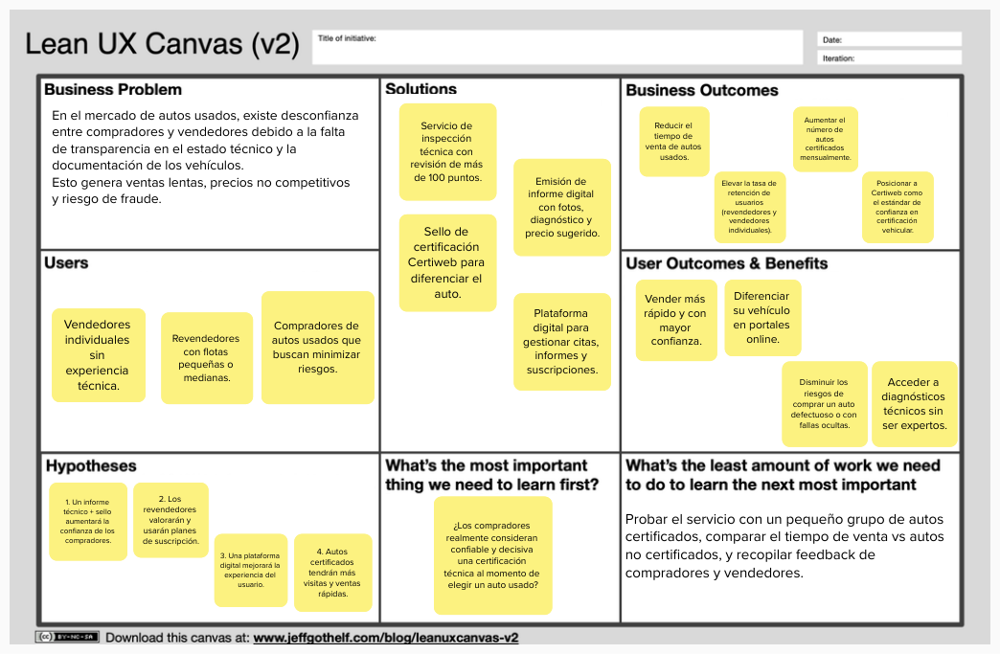

[Link del Canvas](https://app.mural.co/t/certiwerb1488/m/certiwerb1488/1744410865572/59e706ebe76d0e4606051edfad70dcd865593dee?sender=u14a78cec8f790f32120e9679)

<h4 id="13-segmentos-objetivo">1.3. Segmentos objetivo</h4>

Certiweb se dirige a segmentos específicos dentro del mercado de compra y venta de vehículos usados, identificando tanto necesidades como patrones de comportamiento. Los principales segmentos objetivo se clasifican en tres grupos:

<ul style="font-family: 'Segoe UI', sans-serif; line-height: 1.7; color: #333; padding-left: 0;">

  <!-- 1. Vendedores Individuales -->
  <li style="margin-bottom: 30px; border-left: 4px solid #e74c3c; padding-left: 15px;">
    <strong style="color: #e74c3c; font-size: 1.2em;">1. Vendedores individuales de autos usados</strong>
    <ul style="list-style-type: none; padding-left: 20px;">
      <!-- Demográficos -->
      <li><strong>📊 Características demográficas:</strong>
        <ul style="list-style-type: circle; color: #7f8c8d;">
          <li>Edad: 25-55 años</li>
          <li>Ubicación: Lima, Arequipa, Trujillo, Piura</li>
          <li>NSE: Medio y medio-alto</li>
          <li>Conocimientos técnicos: Limitados</li>
        </ul>
      </li>
      <!-- Comportamiento -->
      <li><strong>🔄 Comportamiento y necesidades:</strong>
        <ul style="list-style-type: square; color: #34495e;">
          <li>Venden 1 auto cada 2-5 años</li>
          <li>Buscan diferenciar sus publicaciones</li>
          <li>Necesitan cerrar ventas rápidamente</li>
        </ul>
      </li>
      <!-- Sustento Estadístico -->
      <li><strong>📈 Sustento Estadístico:</strong>
        <ul style="list-style-type: none; background: #f8f9fa; padding: 10px; border-radius: 5px;">
          <li>70% transacciones entre particulares (AAP 2023)</li>
          <li>64% compradores usan plataformas online</li>
        </ul>
      </li>
    </ul>
  </li>

  <!-- 2. Revendedores -->
  <li style="margin-bottom: 30px; border-left: 4px solid #3498db; padding-left: 15px;">
    <strong style="color: #3498db; font-size: 1.2em;">2. Revendedores o pequeños comerciantes de autos usados</strong>
    <ul style="list-style-type: none; padding-left: 20px;">
      <!-- Demográficos -->
      <li><strong>📊 Características demográficas:</strong>
        <ul style="list-style-type: circle; color: #7f8c8d;">
          <li>Edad: 30-60 años</li>
          <li>Base operativa: Capitales regionales</li>
          <li>Perfil: Informales o pequeños emprendimientos</li>
        </ul>
      </li>
      <!-- Comportamiento -->
      <li><strong>🔄 Comportamiento y necesidades:</strong>
        <ul style="list-style-type: square; color: #34495e;">
          <li>Manejan 3-15 vehículos/mes</li>
          <li>Requieren inspecciones rápidas</li>
          <li>Prefieren herramientas digitales</li>
        </ul>
      </li>
      <!-- Sustento Estadístico -->
      <li><strong>📈 Sustento Estadístico:</strong>
        <ul style="list-style-type: none; background: #f8f9fa; padding: 10px; border-radius: 5px;">
          <li>20% mercado controlado por revendedores</li>
          <li>Falta de sistemas estandarizados actualmente</li>
        </ul>
      </li>
    </ul>
  </li>

  <!-- 3. Compradores -->
  <li style="border-left: 4px solid #2ecc71; padding-left: 15px;">
    <strong style="color: #2ecc71; font-size: 1.2em;">3. Compradores</strong>
    <ul style="list-style-type: none; padding-left: 20px;">
      <!-- Demográficos -->
      <li><strong>📊 Características demográficas:</strong>
        <ul style="list-style-type: circle; color: #7f8c8d;">
          <li>Edad: 22-50 años</li>
          <li>Zonas: Lima (60%), regiones clave</li>
          <li>Perfil: Jóvenes profesionales/familias</li>
        </ul>
      </li>
      <!-- Comportamiento -->
      <li><strong>🔄 Comportamiento y necesidades:</strong>
        <ul style="list-style-type: square; color: #34495e;">
          <li>Buscan primer/segundo vehículo</li>
          <li>Priorizan seguridad sobre lujo</li>
          <li>Desconfían de publicaciones sin respaldo</li>
        </ul>
      </li>
      <!-- Sustento Estadístico -->
      <li><strong>📈 Sustento Estadístico:</strong>
        <ul style="list-style-type: none; background: #f8f9fa; padding: 10px; border-radius: 5px;">
          <li>86% autos vendidos son usados (2023)</li>
          <li>60% comprados por personas naturales</li>
          <li>Confianza = principal barrera (INEI/AAP)</li>
        </ul>
      </li>
    </ul>
  </li>
</ul>

<h1 id="capítulo-ii-requirements-development-and-software-solution-design">Capítulo II: Requirements Development and Software Solution Design</h1>
<h3 id="21-competidores">2.1. Competidores</h3>

Certiweb compite con diversas plataformas de compraventa e inspección vehicular. Estos son los principales competidores:

### 1. Neoauto (Perú) - Competidor Directo
<ul>
  <li><strong>Sitio web:</strong> <a href="https://www.neoauto.com" target="_blank">neoauto.com</a></li>
  <li><strong>Descripción:</strong> Portal líder de compraventa en Perú con publicaciones para vendedores y concesionarios</li>
  <li><strong>Modelo:</strong> Anuncios pagados con reportes técnicos básicos (sin inspecciones profundas)</li>
  <li><strong>Relación con Certiweb:</strong> Competencia directa en verificación vehicular</li>
  <li><strong>Ventaja Certiweb:</strong> 
    <ul>
      <li>Diagnóstico 100% imparcial (no participa en compraventa)</li>
      <li>Sello de confianza usable en cualquier plataforma</li>
      <li>Inspección técnica profesional con 100+ puntos de revisión</li>
    </ul>
  </li>
</ul>

### 2. AutoTrader (Reino Unido) - Competidor Internacional
<ul>
  <li><strong>Sitio web:</strong> <a href="https://www.autotrader.co.uk" target="_blank">autotrader.co.uk</a></li>
  <li><strong>Descripción:</strong> Plataforma británica líder con servicios de verificación e inspecciones</li>
  <li><strong>Modelo:</strong> Reportes históricos y conexión con talleres asociados</li>
  <li><strong>Relación con Certiweb:</strong> Modelo de referencia para certificación integrada</li>
  <li><strong>Ventaja Certiweb:</strong>
    <ul>
      <li>Adaptado al mercado peruano con atención personalizada</li>
      <li>Estandarización superior en inspecciones (100+ puntos)</li>
      <li>Costo accesible para el contexto local</li>
    </ul>
  </li>
</ul>

### 3. Cars.com (EEUU) - Competidor Internacional
<ul>
  <li><strong>Sitio web:</strong> <a href="https://www.cars.com" target="_blank">cars.com</a></li>
  <li><strong>Descripción:</strong> Portal estadounidense con herramientas de evaluación vehicular</li>
  <li><strong>Modelo:</strong> Informes de condición y calificaciones mecánicas previas</li>
  <li><strong>Relación con Certiweb:</strong> Ejemplo de integración de certificación en ventas</li>
  <li><strong>Ventaja Certiweb:</strong>
    <ul>
      <li>Servicio 100% local con soporte en Perú</li>
      <li>Reportes más detallados y visuales</li>
      <li>Precio sugerido basado en mercado peruano</li>
    </ul>
  </li>
</ul>

### 4. Talleres Mecánicos Tradicionales - Competencia Indirecta
<ul>
  <li><strong>Descripción:</strong> Talleres físicos que realizan diagnósticos previos a ventas</li>
  <li><strong>Modelo:</strong> Servicio presencial sin estandarización digital</li>
  <li><strong>Relación con Certiweb:</strong> Alternativa básica para inspecciones</li>
  <li><strong>Ventaja Certiweb:</strong>
    <ul>
      <li>Certificación profesional documentada (fotos + informe)</li>
      <li>Plataforma digital con historial accesible</li>
      <li>Sello de garantía transferible al comprador</li>
    </ul>
  </li>
</ul>

<h4 id="211-análisis-competitivo">2.1.1. Análisis competitivo</h4>

<h2>Análisis del Panorama Competitivo</h1>

<strong>¿Por qué llevar a cabo este análisis?</strong>

<blockquote>
  
Este análisis permite identificar fortalezas y debilidades frente a competidores clave en el mercado de inspección y venta de autos usados. Así se puede fortalecer la propuesta de valor de Certiweb y detectar oportunidades de diferenciación.

</blockquote>

<strong>Pregunta u Objetivo del Análisis:</strong>

<blockquote>
  
¿Cómo se posiciona Certiweb frente a sus competidores en términos de propuesta de valor, estrategias de marketing, productos y servicios?

</blockquote>

<h2>Tabla Comparativa</h2>

<table class="competitive-analysis-table">
  <thead>
    <tr>
      <th colspan="2"></th>
      <th>CertiWeb</th>
      <th>Neoauto</th>
      <th>Cars</th>
      <th>Talleres mecánicos</th>
    </tr>
  </thead>
  <tbody>
    <tr>
      <td rowspan="2" class="category-header">Perfil</td>
      <td>Overview</td>
      <td>Certiweb es un taller especializado en inspecciones y certificaciones de autos usados que busca acelerar la venta con mayor confianza y seguridad.</td>
      <td>Neoauto es un portal de anuncios para comprar y vender autos nuevos y usados, líder en visibilidad en Perú.</td>
      <td>Cars.com es una plataforma internacional que conecta compradores con concesionarios y ofrece herramientas de valoración e historial.</td>
      <td>Talleres mecánicos tradicionales ofrecen revisión técnica básica para evaluar el estado del vehículo antes de la compra o venta.</td>
    </tr>
    <tr>
      <td>Ventaja competitiva ¿Qué valor ofrece a los clientes?</td>
      <td>Certificación imparcial con revisión de más de 100 puntos, informe técnico detallado con fotos, y sello de confianza que aumenta la velocidad de venta.</td>
      <td>Alta visibilidad, volumen de tráfico web y variedad de publicaciones para encontrar autos rápidamente.</td>
      <td>Acceso a historial del vehículo, valoración en línea y conexión directa con concesionarios.</td>
      <td>Costos bajos y diagnósticos inmediatos, aunque sin documentación formal ni sello de confianza para venta.</td>
    </tr>
    <tr>
      <td rowspan="2" class="category-header">Perfil de Marketing</td>
      <td>Mercado objetivo</td>
      <td>Vendedores particulares, revendedores y compradores de autos usados que buscan mayor seguridad y agilidad en el proceso.</td>
      <td>Vendedores particulares y concesionarios que desean publicar autos a gran escala.</td>
      <td>Usuarios en EE.UU. interesados en comprar o vender vehículos con acceso a herramientas digitales.</td>
      <td>Propietarios que necesitan diagnóstico mecánico o compradores que desean revisar el vehículo antes de pagar.</td>
    </tr>
    <tr>
      <td>Estrategias de marketing</td>
      <td>Campañas digitales, redes sociales, alianzas con portales de venta, uso de casos de éxito reales y posicionamiento local (SEO).</td>
      <td>Publicidad en buscadores, redes sociales, publicaciones destacadas y planes premium dentro de su plataforma.</td>
      <td>SEO global, marketing de contenido, convenios con concesionarios y reviews de usuarios.</td>
      <td>Publicidad boca a boca, recomendaciones y presencia física en zonas de alta demanda.</td>
    </tr>
    <tr>
      <td rowspan="2" class="category-header">Perfil de Producto</td>
      <td>Productos & Servicios</td>
      <td>Inspección profesional, informe con fotos y diagnóstico técnico, sello Certiweb, suscripciones mensuales y anuales.</td>
      <td>Publicación de autos, filtros de búsqueda avanzada, fotos y planes publicitarios.</td>
      <td>Publicaciones, historial del vehículo, calculadora de valor estimado, contacto con dealers.</td>
      <td>Revisión mecánica básica, pruebas de carretera y verificación de fallas, sin documentación formal.</td>
    </tr>
    <tr>
      <td>Precios & Costos</td>
      <td>Precios flexibles ajustados según el perfil del cliente y vigencia. Estos precios varían tanto dependiendo el plan que elija. Free que tendrán ciertas funciones limitadas y como su nombre lo indica será sin costo alguno. El plan mensual (S/.50) contará con certificación completa del vehículo, informes detallados, precios sugeridos y soporte técnico. Finalmente, el plan anual (S/.250) cuenta con todos los beneficios del plan mensual además de descuentos adicionales, certificaciones ilimitadas y soporte prioritario 24/7.</td>
      <td>Para vendedor de un auto desde S/ 150.00 con vigencia de 60 dias, y para revendedores desde S/ 297 con vigencia de 30 dias.</td>
      <td>Para la certificación de un auto con vigencia de 30 dias S/ 150.00. </td>
      <td>Promedio por auto de S/ 200.00 para la certificación con vigencia de 30 dias.</td>
    </tr>
  </tbody>
</table>

<h4 id="212-estrategias-y-tácticas-frente-a-competidores">2.1.2. Estrategias y tácticas frente a competidores</h4>

## Estrategias Clave

1. **Diferenciación a través de la certificación imparcial**
   - Posicionamiento como tercero confiable que no compra ni vende vehículos
   - Certificaciones independientes vs competidores vinculados a compraventa

2. **Enfoque en confianza y rapidez de venta**
   - Promesa clara: "Vende tu auto más rápido y con más seguridad"
   - Beneficio tangible vs competidores con solo publicación o diagnóstico básico

3. **Alianzas estratégicas**
   - Convenios con portales (Neoauto, Todoautos) para ofrecer sello Certiweb
   - Integración como valor añadido en publicaciones vehiculares

4. **Educación del cliente sobre riesgos**
   - Creación de contenido educativo (reels, blogs, videos)
   - Enfoque en: estafas comunes y fallas ocultas en autos usados

5. **Segmentación clara del mercado**
   - Mensajes adaptados para:
     1. Revendedores
     2. Vendedores particulares
     3. Compradores finales

## Tácticas Implementadas

1. **Promociones para usuarios tempranos**
   - Precios promocionales o inspecciones gratuitas para primeros clientes
   - Incentivos por compartir experiencias

2. **Certificado visual impactante**
   - Diseño de sello Certiweb atractivo para:
     - Publicaciones online
     - Uso físico en vehículos inspeccionados

3. **Campañas en redes sociales geolocalizadas**
   - Publicidad segmentada en:
     - Facebook
     - Instagram
     - TikTok
   - Enfoque en zonas de alto flujo (Ej: Surquillo, San Miguel en Lima)

4. **Sistema de referidos**
   - Programa que premia:
     1. Cliente que refiere
     2. Nuevo cliente referido
   - Generación de tracción orgánica

5. **Suscripciones flexibles para revendedores**
   - Opciones de suscripción:
     - Mensual
     - Anual (con descuentos)
   - Beneficios adicionales:
     - Prioridad en inspecciones
     - Asesoramiento en valorización

6. **Informes desde el portal web**
   - Funcionalidades clave:
     - Generación de PDFs compartibles
     - Integración en proceso de venta
     - Panel web accesible para clientes

<h3 id="22-entrevistas">2.2. Entrevistas</h3>
<h4 id="221-diseño-de-entrevistas">2.2.1. Diseño de entrevistas</h4>

# Diseño de Entrevistas para Investigación de Mercado

<h2 style="color: #2c3e50;">Segmento 1: Vendedores Particulares</h2>
<h3 style="color: #3498db;">Objetivo:</h3> 

Conocer motivaciones, temores y experiencia al vender autos usados

<h3 style="color: #3498db;">Información a recolectar:</h3>
<ul>
  <li>Datos demográficos (edad, género, distrito)</li>
  <li>Experiencia previa en ventas</li>
  <li>Canales de venta utilizados</li>
  <li>Problemas enfrentados</li>
  <li>Conocimiento de servicios de inspección</li>
</ul>

<h3 style="color: #3498db;">Preguntas clave:</h3>
  <ol>
    <li>¿Has vendido un auto usado anteriormente? ¿Cómo fue la experiencia?</li>
    <li>¿Cuál fue tu principal preocupación al momento de vender?</li>
    <li>¿Dónde sueles publicar un auto en venta?</li>
    <li>¿Qué tanto confías en los compradores que te contactan por internet?</li>
    <li>¿Te ha pasado que los compradores desconfiaban del estado del auto?</li>
    <li>¿Alguna vez has mentido u omitido detalles al vender tu auto? ¿Por qué?</li>
    <li>¿Qué haces para que confíen en que tu auto está en buen estado?</li>
    <li>¿Conoces algún servicio que certifique el estado de un auto antes de venderlo?</li>
    <li>¿Pagarías por un servicio que te ayude a vender más rápido? ¿Cuánto?</li>
    <li>¿Qué valoras más: vender rápido o vender a mejor precio?</li>
    <li>¿Qué tan complicado es conseguir un mecánico de confianza?</li>
    <li>¿Te sentirías más seguro si un experto validara que tu auto está bien?</li>
    <li>¿A qué te dedicas? ¿Te deja tiempo para lidiar con una venta de auto?</li>
    <li>¿Qué edad tienes y dónde vives?</li>
    <li>¿Qué redes sociales usas con más frecuencia?</li>
    <li>¿Compraste ese auto nuevo o de segunda? ¿Cómo fue esa compra?</li>
    <li>¿Qué dispositivos usas más para hacer tus búsquedas? (Celular, PC, etc.)</li>
    <li>¿Tienes familia o dependientes a los que involucres en tus decisiones?</li>
    <li>¿Qué frustraciones has tenido al vender autos en el pasado?</li>
    <li>Si tuvieras una herramienta que agilice y dé más confianza al proceso de venta, ¿la usarías?</li>
  </ol>

<h2 style="color: #2c3e50;">Segmento 2: Revendedores</h2>
<h3 style="color: #3498db;">Objetivo:</h3>

Entender proceso comercial y uso de certificaciones

<h3 style="color: #3498db;">Información a recolectar:</h3>
<ul>
  <li>Volumen de venta mensual</li>
  <li>Uso de mecánicos/talleres</li>
  <li>Necesidad de rotación rápida</li>
  <li>Canales de venta principales</li>
  <li>Presupuesto para inspecciones</li>
</ul>

<h3 style="color: #3498db;">Preguntas clave:</h3>
  <ol>
    <li>¿A cuántos autos les das rotación al mes?</li>
    <li>¿Cómo aseguras la calidad mecánica antes de venderlos?</li>
    <li>¿Tienes un mecánico fijo o trabajas con varios talleres?</li>
    <li>¿Sueles invertir en diagnósticos antes de vender?</li>
    <li>¿Te ha pasado que un cliente devolvió o se quejó del auto vendido?</li>
    <li>¿Qué importancia tiene la confianza para cerrar una venta?</li>
    <li>¿Has usado servicios de certificación antes? ¿Cuáles?</li>
    <li>¿Con qué portales trabajas para publicar tus autos?</li>
    <li>¿Crees que un sello de certificación ayudaría a vender más rápido?</li>
    <li>¿Qué valoras más: ahorro de tiempo o validación técnica?</li>
    <li>¿Cuánto estarías dispuesto a pagar por un servicio mensual de inspección?</li>
    <li>¿Qué tipo de clientes te exigen más pruebas de calidad?</li>
    <li>¿Cómo gestionas el papeleo y documentación?</li>
    <li>¿Te ha beneficiado tener informes técnicos o fotos detalladas del auto?</li>
    <li>¿Crees que hay mucha competencia en tu zona? ¿Qué te diferencia?</li>
    <li>¿Qué edad tienes y en qué distrito trabajas?</li>
    <li>¿Qué dispositivos usas para tus operaciones? ¿WhatsApp, Facebook, OLX, etc.?</li>
    <li>¿Cuál es tu mayor frustración al vender autos?</li>
    <li>¿Qué marcas prefieres revender y por qué?</li>
    <li>¿Estarías dispuesto a incluir el costo de inspección como parte del precio final?</li>
  </ol>

<h2 style="color: #2c3e50;">Segmento 3: Compradores</h2>
<h3 style="color: #3498db;">Objetivo:</h3>

Identificar temores y proceso de evaluación

<h3 style="color: #3498db;">Información a recolectar:</h3>
<ul>
  <li>Motivaciones de compra</li>
  <li>Nivel de conocimiento técnico</li>
  <li>Canales de búsqueda</li>
  <li>Riesgos percibidos</li>
  <li>Métodos de validación</li>
</ul>

<h3 style="color: #3498db;">Preguntas clave:</h3>
  <ol>
    <li>¿Has comprado un auto usado alguna vez? ¿Cómo fue la experiencia?</li>
    <li>¿Qué es lo que más te preocupa al comprar un auto de segunda?</li>
    <li>¿Cómo sueles verificar que el auto esté en buen estado?</li>
    <li>¿Conoces algún taller o mecánico de confianza?</li>
    <li>¿Te has sentido estafado o engañado en alguna compra anterior?</li>
    <li>¿Qué tan importante es para ti que el auto tenga un informe técnico?</li>
    <li>¿Confías en los vendedores de autos en general?</li>
    <li>¿Te parece útil que un auto tenga un certificado de inspección antes de comprarlo?</li>
    <li>¿Pagarías más por un auto que tenga esa certificación?</li>
    <li>¿Dónde sueles buscar autos: Marketplace, OLX, portales especializados?</li>
    <li>¿Qué redes sociales usas más para revisar o buscar autos?</li>
    <li>¿Qué dispositivos usas para hacer búsquedas?</li>
    <li>¿Qué edad tienes, dónde vives y a qué te dedicas?</li>
    <li>¿Tomas la decisión solo o con tu pareja/familia?</li>
    <li>¿Qué aspectos del auto revisas tú mismo antes de comprar?</li>
    <li>¿Cómo decides si confiar en un vendedor?</li>
    <li>¿Qué marcas o modelos te generan más confianza?</li>
    <li>¿Te gustaría recibir asesoría profesional para tu próxima compra?</li>
    <li>¿Qué contenido te parecería útil: videos, checklist, informes descargables?</li>
    <li>¿Has tenido malas experiencias post-compra? ¿Cuáles?</li>
  </ol>

<h4 id="222-registro-de-entrevistas">2.2.2. Registro de entrevistas</h4>

| Entrevista 1 | Christian Trillo |
|------------------|----------------------|
| Edad         | 45 años              |
| Distrito     | La Victoria          |
|   | Nunca ha vendido un auto usado, pero le preocupa encontrar plataformas confiables para publicar (como Marketplace o letreros físicos). Desconfía de compradores por internet y cree que la transparencia es clave. Para generar confianza, muestra mantenimientos al día y sugiere que el comprador lleve un mecánico. Conoce talleres que certifican autos, pero depende del comprador validarlo. Prefiere vender a buen precio antes que rápido y destaca la dificultad de encontrar mecánicos de confianza.|
| URL de la grabación | [Link](https://youtu.be/PCCgQrpIDJs?si=5rWZaluun-HzSOoU&t=2)            |
| Timming      | 00:00 - 07:29           |
 

| Entrevista 2 | Germán Espinoza |
|------------------|----------------------|
| Edad         | 27 años              |
| Distrito     | Ate Vitarte          |
|   | Vendió su auto el año pasado, pero el proceso fue frustrante por compradores indecisos y regateos. Publicó en Marketplace y OLX, pero desconfía de los interesados (muchos preguntan pero no concretan). Insiste en ser transparente para generar confianza y muestra comprobantes de mantenimiento. Considera útil un servicio de certificación, pagaría hasta 200 soles si agiliza la venta.|
| URL de la grabación | [Link](https://youtu.be/PCCgQrpIDJs?si=LPMD3yZgh_geO01K&t=457)            |
| Timming      | 07:36 - 12:20           |
 

| Entrevista 3 | Romulo Mucho |
|------------------|----------------------|
| Edad         | 21 años              |
| Distrito     | La Molina         |
|   | Vendió un Honda Civic 2004; el proceso fue agotador por mensajes constantes y compradores poco serios. Publicó en Marketplace y grupos de WhatsApp. Valora vender rápido (incluso a menor precio) y reconoce la dificultad de encontrar mecánicos confiables. Pagaría 80-100 soles por un servicio que evite pérdida de tiempo. Un informe técnico independiente le daría seguridad a los compradores. |
| URL de la grabación | [Link](https://youtu.be/PCCgQrpIDJs?si=nEhGzcHJCSvWN6yy&t=744)            |
| Timming      | 12:24 - 18:11           |
 

# Segmento 2

| Entrevista 1 | Boris Arana |
|------------------|----------------------|
| Edad         | 49 años              |
| Distrito     | Lima         |
|   | Enfatiza la importancia de revisiones técnicas previas a la venta (compresión del motor, frenos, suspensión, etc.). Critica el fraude del kilometraje alterado y apoya la certificación técnica para generar confianza. Sugiere que el informe incluya pruebas de manejo, frenado y estado de autopartes. Confiaría en el servicio si demuestra seriedad y garantía.|
| URL de la grabación | [Link](https://youtu.be/PCCgQrpIDJs?si=xggXM3BkGd0ERmf3&t=1099)            |
| Timming      | 18:19 - 29:29           |
 

| Entrevista 2 | Crhistabell |
|------------------|----------------------|
| Edad         | 30 años              |
| Distrito     | Lima          |
|   | Vende autos en Marketplace y NeoAuto. Realiza inspecciones básicas en su taller, pero cree que una certificación técnica sería útil solo si la marca es reconocida. Propone que los informes incluyan historial de choques y legales (como en EE.UU.).  Estaría dispuesto a probar el servicio si demuestra confiabilidad. |
| URL de la grabación | [Link](https://youtu.be/PCCgQrpIDJs?si=Flv4lI5k60DShIrX&t=1773)            |
| Timming      | 29:33 - 41:40           |
 

| Entrevista 3 | Juan Carlos Ramirez |
|------------------|----------------------|
| Edad         | 38 años              |
| Distrito     | Lima          |
|   | Rota 2-3 autos mensuales, revisados por un mecánico fijo. Usa informes como Total Check para verificar historial. Considera clave la confianza y el precio competitivo.  Pagaría hasta 80 soles por certificación básica, pero duda de su valor sin propuesta clara. |
| URL de la grabación | [Link](https://youtu.be/PCCgQrpIDJs?si=NMHNuR3arRq4bcgp&t=2505)            |
| Timming      | 41:45 - 53:35            |
 

# Segmento 3

| Entrevista 1 | Jorge Andres |
|------------------|----------------------|
| Edad         | 22 años              |
| Distrito     | Lima          |
|   | Busca autos en Marketplace y valora los informes técnicos para evitar fallas ocultas. Confía en mecánicos propios y prefiere marcas premium (BMW, Mercedes).  Pagaría más por certificación y sugiere videos y checklist como herramientas útiles. |
| URL de la grabación | [Link](https://youtu.be/PCCgQrpIDJs?si=Zp6Jhys5Qd-bNnWL&t=3218)            |
| Timming      | 53:38 - 58:17           |
 

| Entrevista 2 | Carlos |
|------------------|----------------------|
| Edad         | 25 años              |
| Distrito     | Lima          |
|   | Carlos, un analista financiero de 25 años de Lima, ha tenido una experiencia positiva y otra negativa comprando autos usados, lo que aumentó su desconfianza hacia los vendedores. Su principal preocupación son fallas ocultas, por lo que lleva los autos a un taller de confianza en San Miguel para revisarlos. Valora mucho los informes técnicos y estaría dispuesto a pagar un extra razonable por ellos. Busca autos en Facebook Marketplace, OLX, Neo Auto e Instagram, usando su celular, y prefiere marcas confiables como Toyota, Hyundai y Nissan. Aunque consulta a sus padres, la decisión final la toma él. Le gustaría recibir asesoría profesional y usa videos y checklists para guiarse. Tras enfrentar gastos inesperados en reparaciones, prioriza la seguridad, la transparencia y la certificación en sus futuras compras.|
| URL de la grabación | [Link](https://youtu.be/PCCgQrpIDJs?si=3lmut_3RamZOcpxD&t=3502)            |
| Timming      | 58:22 - 01:02:34          |
 

| Entrevista 3 | Rodrigo Salvador |
|------------------|----------------------|
| Edad         | 24 años              |
| Distrito     | Lima         |
|   | Rodrigo, un técnico en redes de telecomunicaciones de 24 años de Lima, compró su primer auto usado el año pasado en un proceso largo y estresante debido a su falta de experiencia. Sus principales preocupaciones al comprar un auto de segunda son las fallas ocultas, especialmente en el motor y los frenos, y problemas de papeleo. Para verificar el estado, revisa aspectos básicos como arranque, neumáticos y luces, y confía en un mecánico conocido. Aunque no se ha sentido estafado, ha percibido falta de transparencia en vendedores, a quienes generalmente no confía. Considera crucial contar con un informe técnico y estaría dispuesto a pagar más por un auto con certificado de inspección. Suele buscar autos en Facebook Marketplace y grupos de Facebook, usando principalmente su celular. Consulta a su hermano mayor antes de comprar, pero toma la decisión final solo. Prefiere marcas como Toyota, Suzuki y Chevrolet, valora la asesoría profesional y encuentra útiles los videos explicativos y los checklists. Tras su compra, experimentó un problema de dirección no detectado inicialmente, lo que refuerza su necesidad de más seguridad en futuras adquisiciones. |
| URL de la grabación | [Link](https://youtu.be/PCCgQrpIDJs?si=5_BjjUsmW3llsm0V&t=3760)            |
| Timming      | 01:02:40 - 01:13:00           |
 

<h4 id="223-análisis-de-entrevistas">2.2.3. Análisis de entrevistas</h4>

A continuación, se presenta el análisis de las entrevistas realizadas, agrupado por segmento objetivo. Se identifican las características objetivas y subjetivas más comunes, respaldadas por porcentajes calculados sobre el total de entrevistados por segmento (3 por segmento).

**Segmento 1: Vendedores Individuales**

*   **Experiencia y Motivación:**
    *   El **67%** (2 de 3) ha tenido experiencias previas de venta, describiendo el proceso como frustrante o agotador debido a compradores indecisos o poco serios.
    *   El **67%** (2 de 3) considera la transparencia fundamental para generar confianza, mostrando mantenimientos o sugiriendo revisiones mecánicas.
    *   Las motivaciones de venta varían: **33%** (1 de 3) prioriza vender rápido (incluso a menor precio), mientras que otro **33%** (1 de 3) prioriza obtener un buen precio.
*   **Plataformas y Confianza:**
    *   El **67%** (2 de 3) utiliza plataformas digitales como Facebook Marketplace u OLX para publicar sus vehículos.
    *   Existe una desconfianza generalizada hacia los compradores online (**67%**, 2 de 3).
    *   El **67%** (2 de 3) reconoce la dificultad de encontrar mecánicos de confianza para validar el estado del vehículo.
*   **Percepción del Servicio de Certificación:**
    *   El **67%** (2 de 3) considera útil un servicio de certificación y estaría dispuesto a pagar por él (rangos mencionados: 80-100 soles, hasta 200 soles) si esto agiliza la venta o evita pérdidas de tiempo.
    *   Se percibe que un informe técnico independiente podría aumentar la seguridad para los compradores (**33%**, 1 de 3).

**Segmento 2: Revendedores / Vendedores con Experiencia**

*   **Proceso de Venta y Verificación:**
    *   El **100%** (3 de 3) enfatiza la importancia de realizar revisiones técnicas previas a la venta.
    *   El **67%** (2 de 3) cuenta con mecánicos o talleres fijos para realizar estas revisiones.
    *   El **67%** (2 de 3) expresa preocupación por fraudes comunes como la alteración del kilometraje o la ocultación del historial del vehículo.
    *   Utilizan plataformas como Marketplace y NeoAuto (**33%**, 1 de 3) y herramientas como informes de historial (Total Check) (**33%**, 1 de 3).
*   **Percepción del Servicio de Certificación:**
    *   El **100%** (3 de 3) valora la idea de una certificación técnica para generar confianza, aunque con matices: uno lo ve útil si la marca es reconocida, otro duda de su valor sin una propuesta clara.
    *   El **67%** (2 de 3) estaría dispuesto a probar o pagar por el servicio bajo ciertas condiciones (demostrar seriedad, precio razonable por certificación básica - hasta 80 soles).
    *   Se sugiere que los informes incluyan historial de choques y aspectos legales (**33%**, 1 de 3).
*   **Factores Clave:**
    *   La confianza y un precio competitivo son considerados clave para la venta (**33%**, 1 de 3).

**Segmento 3: Compradores**

*   **Preocupaciones y Confianza:**
    *   La principal preocupación para el **100%** (3 de 3) son las fallas mecánicas ocultas.
    *   El **67%** (2 de 3) ha tenido experiencias negativas previas o siente desconfianza general hacia los vendedores de autos usados.
    *   El **100%** (3 de 3) confía en mecánicos propios o conocidos para realizar la revisión del vehículo antes de comprar.
*   **Proceso de Búsqueda:**
    *   El **100%** (3 de 3) utiliza plataformas digitales (Marketplace, Grupos de Facebook, OLX, NeoAuto, Instagram) para buscar vehículos.
    *   El **67%** (2 de 3) realiza la búsqueda principalmente desde su celular.
    *   El **67%** (2 de 3) consulta a familiares (padres, hermano) antes de tomar la decisión, aunque la decisión final es personal.
*   **Valoración de la Certificación y Herramientas:**
    *   El **100%** (3 de 3) valora positivamente los informes técnicos y las certificaciones.
    *   El **100%** (3 de 3) estaría dispuesto a pagar un extra por un vehículo que cuente con un certificado de inspección.
    *   El **100%** (3 de 3) encuentra útiles herramientas como videos explicativos y checklists durante el proceso de compra.
*   **Preferencias:**
    *   Mencionan preferencia por marcas consideradas confiables (Toyota, Hyundai, Nissan, Suzuki, Chevrolet) o premium (BMW, Mercedes).

<h3 id="23-needfinding">2.3. Needfinding</h3>
<h4 id="231-user-personas">2.3.1. User Personas</h4>

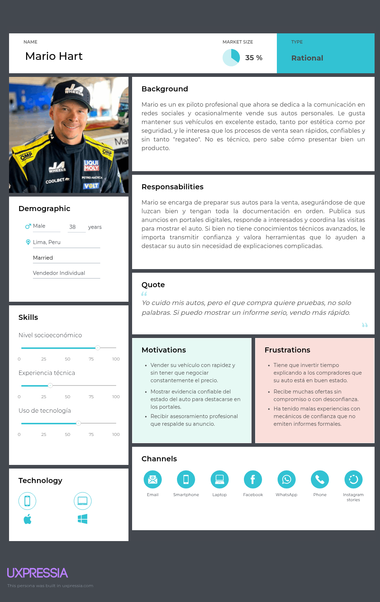
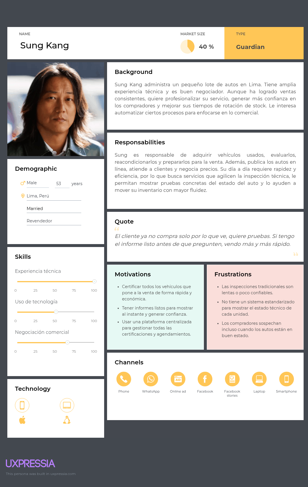
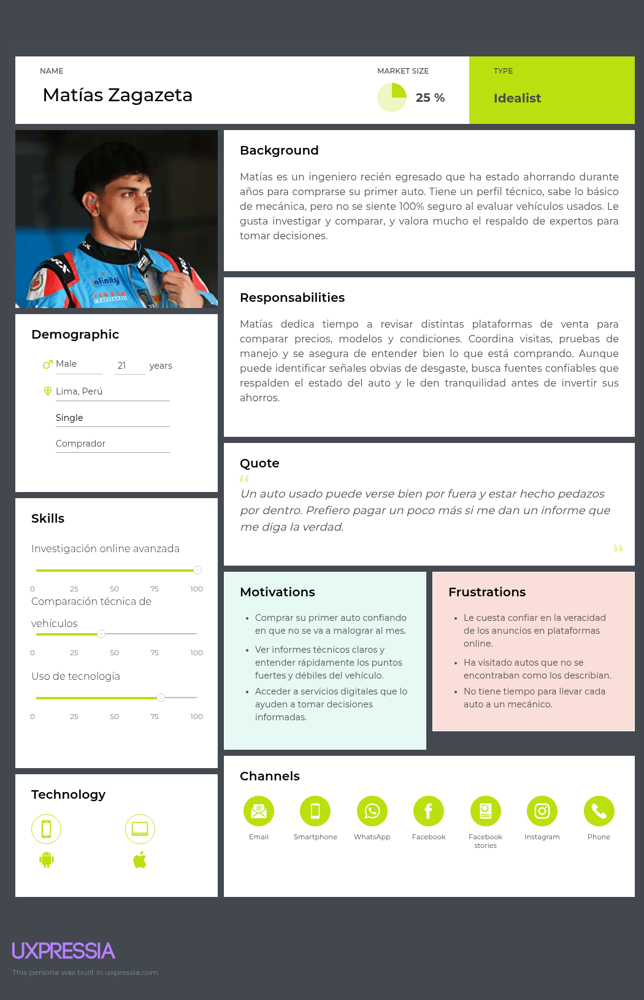

<h4 id="232-user-task-matrix">2.3.2. User Task Matrix</h4>

| TASK                                                            | Revendedor(a) FREQUENCY | Revendedor(a) IMPORTANCE | Concencionario(a) FREQUENCY | Concencionario(a) IMPORTANCE | Comprador(a) FREQUENCY  | Comprador(a) IMPORTANCE  |
|-----------------------------------------------------------------|-------------------------|--------------------------|-----------------------------|------------------------------|-------------------------|--------------------------|
| Preparar vehículo para venta                                    | Always                  | High                     | Never                       | Low                          | Always                  | High                     |
| Publicar anuncios en plataformas                                | Always                  | High                     | Never                       | Low                          | Always                  | High                     |
| Coordinar visitas para mostrar el auto                          | Sometimes               | Medium                   | Sometimes                   | Medium                       | Always                  | High                     |
| Revisar vehículos en venta (búsqueda y comparación)             | Never                   | Low                      | Always                      | High                         | Sometimes               | Medium                   |
| Coordinar inspecciones o revisiones mecánicas                   Sometimes                 | Medium                   | Sometimes                   | High                         | Always                  | High                     |
| Verificar documentación legal y técnica del auto                | Always                  | High                     | Always                      | High                         | Always                  | High                     |
| Negociar el precio                                              | Always                  | High                     | Sometimes                   | Medium                       | Always                  | High                     |
| Generar confianza frente al otro usuario (vendedor o comprador) | Always                  | High                     | Always                      | High                         | Always                  | High                     |
| Validar estado técnico del auto de forma objetiva               | Sometimes               | High                     | Always                      | High                         | Always                  | High                     |
| Concretar la venta o compra con seguridad                       | Always                  | High                     | Always                      | High                         | Always                  | High                     |

<h4 id="233-user-journey-mapping">2.3.3. User Journey Mapping</h4>

Journey Map Vendedores individuales de autos usados
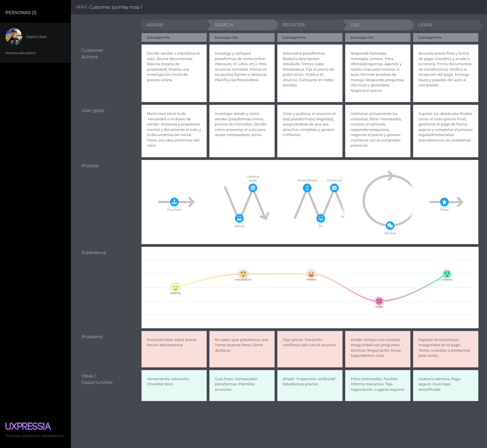

Journey Map Revendedores o pequeños comerciantes de autos usados
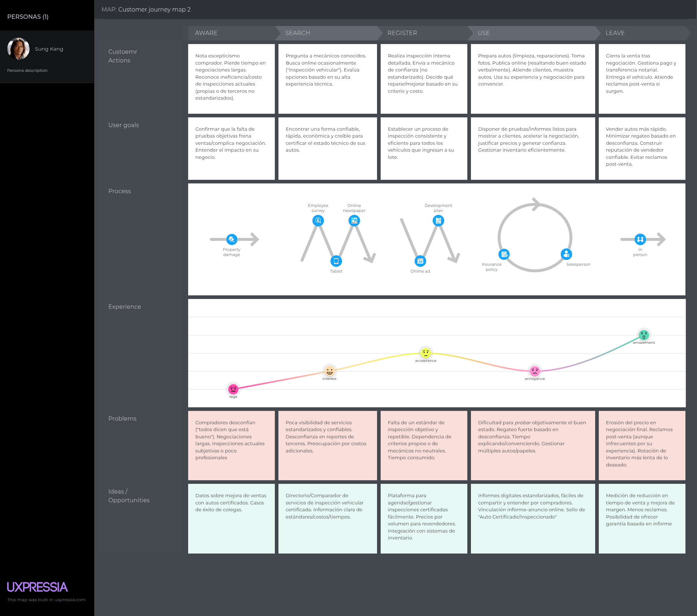

Journey Map Compradores
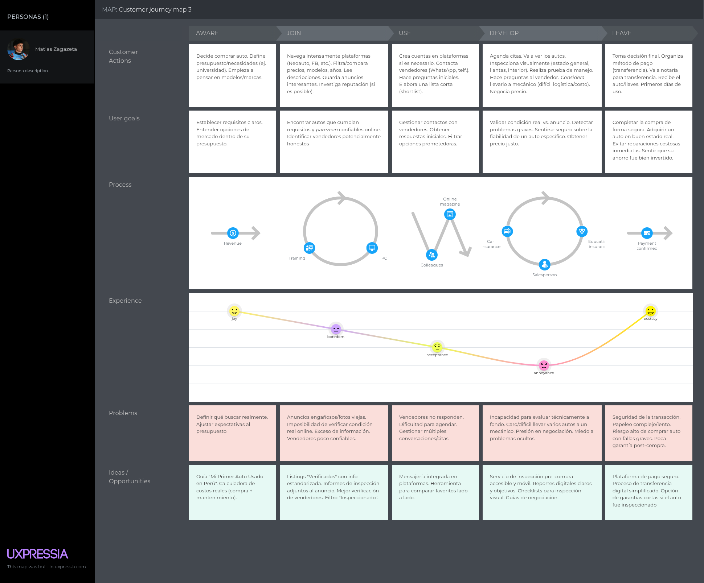

<h4 id="234-empathy-mapping">2.3.4. Empathy Mapping</h4>

Empathy Mapping Vendedores individuales de autos usados

Empathy Mapping Revendedores o pequeños comerciantes de autos usados
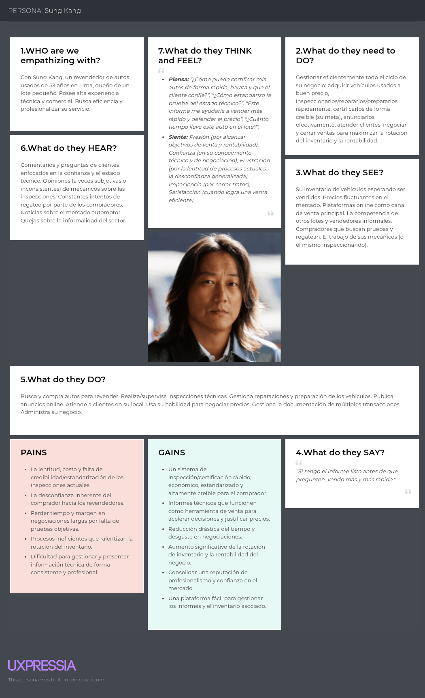

Empathy Mapping Compradores

<h4 id="235-ubiquitous-language">2.3.5. Ubiquitous Language</h4>

<table style="width:100%; border-collapse: collapse; font-family: sans-serif; font-size: 14px;">
  <thead style="background-color: #f8f8f8; text-align: left;">
    <tr>
      <th style="border: 1px solid #ddd; padding: 8px;">Término (Inglés)</th>
      <th style="border: 1px solid #ddd; padding: 8px;">Término (Español)</th>
      <th style="border: 1px solid #ddd; padding: 8px;">Definición</th>
    </tr>
  </thead>
  <tbody>
    <tr>
      <td style="border: 1px solid #ddd; padding: 8px;">Used Car</td>
      <td style="border: 1px solid #ddd; padding: 8px;">Auto usado</td>
      <td style="border: 1px solid #ddd; padding: 8px;">Vehículo que ya ha tenido uno o más dueños previos y se encuentra actualmente en condición de reventa.</td>
    </tr>
    <tr>
      <td style="border: 1px solid #ddd; padding: 8px;">Private Seller</td>
      <td style="border: 1px solid #ddd; padding: 8px;">Vendedor individual</td>
      <td style="border: 1px solid #ddd; padding: 8px;">Persona natural que vende su auto personal sin ser parte de una empresa o negocio de compraventa de vehículos.</td>
    </tr>
    <tr>
      <td style="border: 1px solid #ddd; padding: 8px;">Reseller</td>
      <td style="border: 1px solid #ddd; padding: 8px;">Revendedor</td>
      <td style="border: 1px solid #ddd; padding: 8px;">Persona o empresa que compra autos usados con el propósito de reacondicionarlos y venderlos a otros compradores, buscando una ganancia.</td>
    </tr>
    <tr>
      <td style="border: 1px solid #ddd; padding: 8px;">First-time Buyer</td>
      <td style="border: 1px solid #ddd; padding: 8px;">Comprador primerizo</td>
      <td style="border: 1px solid #ddd; padding: 8px;">Persona que está adquiriendo un vehículo por primera vez y tiene poca o ninguna experiencia previa en el proceso de compraventa automotriz.</td>
    </tr>
    <tr>
      <td style="border: 1px solid #ddd; padding: 8px;">Vehicle Inspection</td>
      <td style="border: 1px solid #ddd; padding: 8px;">Inspección vehicular</td>
      <td style="border: 1px solid #ddd; padding: 8px;">Proceso técnico mediante el cual se revisa el estado mecánico, estético y funcional de un auto antes de su venta.</td>
    </tr>
    <tr>
      <td style="border: 1px solid #ddd; padding: 8px;">Certification Seal</td>
      <td style="border: 1px solid #ddd; padding: 8px;">Sello de certificación</td>
      <td style="border: 1px solid #ddd; padding: 8px;">Distintivo otorgado por Certiweb que valida que un vehículo ha pasado exitosamente una inspección técnica completa.</td>
    </tr>
    <tr>
      <td style="border: 1px solid #ddd; padding: 8px;">Inspection Report</td>
      <td style="border: 1px solid #ddd; padding: 8px;">Informe de inspección</td>
      <td style="border: 1px solid #ddd; padding: 8px;">Documento generado por Certiweb que detalla los resultados de la revisión técnica del vehículo, incluyendo observaciones, fallas y recomendaciones.</td>
    </tr>
    <tr>
      <td style="border: 1px solid #ddd; padding: 8px;">Vehicle Condition</td>
      <td style="border: 1px solid #ddd; padding: 8px;">Estado del vehículo</td>
      <td style="border: 1px solid #ddd; padding: 8px;">Nivel de conservación, funcionamiento y apariencia de un auto al momento de ser inspeccionado o vendido.</td>
    </tr>
    <tr>
      <td style="border: 1px solid #ddd; padding: 8px;">Sales Listing</td>
      <td style="border: 1px solid #ddd; padding: 8px;">Publicación de venta</td>
      <td style="border: 1px solid #ddd; padding: 8px;">Anuncio que contiene información del auto en venta (precio, modelo, fotos, detalles técnicos) y que es publicado en plataformas de venta.</td>
    </tr>
    <tr>
      <td style="border: 1px solid #ddd; padding: 8px;">Vehicle History</td>
      <td style="border: 1px solid #ddd; padding: 8px;">Historial del vehículo</td>
      <td style="border: 1px solid #ddd; padding: 8px;">Registro de eventos relevantes en la vida del auto: propietarios anteriores, accidentes, mantenimiento, entre otros.</td>
    </tr>
    <tr>
      <td style="border: 1px solid #ddd; padding: 8px;">Ownership Transfer</td>
      <td style="border: 1px solid #ddd; padding: 8px;">Transferencia de propiedad</td>
      <td style="border: 1px solid #ddd; padding: 8px;">Trámite legal mediante el cual el auto cambia oficialmente de dueño en registros públicos o notariales.</td>
    </tr>
    <tr>
      <td style="border: 1px solid #ddd; padding: 8px;">Pre-purchase Evaluation</td>
      <td style="border: 1px solid #ddd; padding: 8px;">Evaluación precompra</td>
      <td style="border: 1px solid #ddd; padding: 8px;">Revisión técnica realizada antes de cerrar la compra para asegurar que el auto está en buenas condiciones y el precio es justo.</td>
    </tr>
    <tr>
      <td style="border: 1px solid #ddd; padding: 8px;">Trust in Seller</td>
      <td style="border: 1px solid #ddd; padding: 8px;">Confianza en el vendedor</td>
      <td style="border: 1px solid #ddd; padding: 8px;">Percepción del comprador sobre la honestidad y transparencia del vendedor durante el proceso de venta.</td>
    </tr>
    <tr>
      <td style="border: 1px solid #ddd; padding: 8px;">Trust in Vehicle</td>
      <td style="border: 1px solid #ddd; padding: 8px;">Confianza en el vehículo</td>
      <td style="border: 1px solid #ddd; padding: 8px;">Seguridad que tiene el comprador sobre el estado real del auto, basándose en informes, inspecciones o la transparencia del vendedor.</td>
    </tr>
    <tr>
      <td style="border: 1px solid #ddd; padding: 8px;">Listing Platform</td>
      <td style="border: 1px solid #ddd; padding: 8px;">Plataforma de anuncios</td>
      <td style="border: 1px solid #ddd; padding: 8px;">Sitio web o aplicación donde se publican autos en venta, como OLX, Mercado Libre Autos o Marketplace.</td>
    </tr>
    <tr>
      <td style="border: 1px solid #ddd; padding: 8px;">Photo Session</td>
      <td style="border: 1px solid #ddd; padding: 8px;">Sesión de fotos</td>
      <td style="border: 1px solid #ddd; padding: 8px;">Proceso de capturar imágenes del auto para su publicación, idealmente en alta calidad y mostrando diferentes ángulos.</td>
    </tr>
    <tr>
      <td style="border: 1px solid #ddd; padding: 8px;">Buyer Decision Process</td>
      <td style="border: 1px solid #ddd; padding: 8px;">Proceso de decisión del comprador</td>
      <td style="border: 1px solid #ddd; padding: 8px;">Etapas mentales y emocionales que atraviesa un comprador antes de concretar la adquisición de un auto.</td>
    </tr>
    <tr>
      <td style="border: 1px solid #ddd; padding: 8px;">Post-sale Assurance</td>
      <td style="border: 1px solid #ddd; padding: 8px;">Seguridad postventa</td>
      <td style="border: 1px solid #ddd; padding: 8px;">Garantía o tranquilidad que siente el comprador luego de adquirir un auto, especialmente si fue certificado o revisado previamente.</td>
    </tr>
  </tbody>
</table>

<h3 id="24-requirements-specification">2.4. Requirements specification</h3>
<h4 id="241-user-stories">2.4.1. User Stories</h4>

| Epic/Story ID | Título | Descripción |
|----------------|--------|-------------|
| EP01 | Landing Page Informativa | Como visitante, quiero entender qué es Certiweb y cómo funciona, para decidir si quiero utilizar el servicio. |
| EP02 | Gestión y Publicación de Certificaciones Vehiculares | Como vendedor, quiero gestionar inspecciones y mostrar resultados en mi anuncio, para generar confianza en potenciales compradores. |
| EP03 | Gestión Avanzada para Revendedores | Como revendedor de autos, quiero gestionar múltiples vehículos de manera eficiente, para optimizar mi flujo de trabajo. |
| EP04 | Experiencia de Compra Segura | Como comprador, quiero tener acceso a la verificación técnica del auto, para tomar decisiones informadas y seguras. |
| EP05 | API de Gestión Vehicular | Como developer, quiero implementar endpoints para gestionar la inspección de vehículos, para que los datos estén disponibles para la aplicación. |
 

| Epic/Story ID | Título | Descripción | Criterios de Aceptación | Relacionado con (Epic ID) |
|----------------|--------|-------------|-------------------------|--------------------------|
| US01 | Información clara sobre Certiweb | Como visitante quiero entender de inmediato qué es Certiweb y qué beneficios ofrece para decidir si usarlo. | Escenario 1:  <strong>Dado</strong> que ingreso a la landing page,  <strong>Cuando</strong> leo el contenido destacado,  <strong>Entonces</strong> entiendo claramente que Certiweb ofrece inspección técnica y certificación para autos usados.   Escenario 2: <strong>Dado</strong> que soy un visitante interesado, <strong>Cuando</strong> bajo por la página, <strong>Entonces</strong> veo ejemplos visuales (sellos, informes, beneficios) que explican los servicios. | EPIC01 |
| US02 | Testimonios y casos de éxito | Como visitante quiero leer experiencias de otros usuarios para ganar confianza en el servicio. | Escenario 1: <strong>Dado</strong> que estoy navegando en la landing, <strong>Cuando</strong> bajo hasta la sección de testimonios, <strong>Entonces</strong> veo citas reales de compradores,revendedores o vendedores satisfechos.   Escenario 2: <strong>Dado</strong> que estoy interesado en el servicio, <strong>Cuando</strong> hago clic en un testimonio, <strong>Entonces</strong> puedo leer una historia completa de éxito. | EPIC01 |
| US03 | Botón de acción claro | Como visitante quiero ver botones visibles para registrarme o solicitar una inspección para comenzar fácilmente. | Escenario 1: <strong>Dado</strong> que estoy en la página principal, <strong>Cuando</strong> llego al primer scroll, <strong>Entonces</strong> veo botones como “Solicita tu inspección” o “Empieza ahora” que me llevan al registro o agendamiento.   Escenario 2: <strong>Dado</strong> que estoy en una sección específica, <strong>Cuando</strong> veo un botón de acción, <strong>Entonces</strong> puedo acceder directamente al formulario de contacto. | EPIC01 |
| US04 | Compatibilidad móvil del Landing Page | Como visitante desde celular quiero que el sitio web se vea bien y sea fácil de usar desde mi dispositivo para navegar sin complicaciones. | Escenario 1: <strong>Dado</strong> que ingreso a la página desde mi teléfono, <strong>Cuando</strong> navego por las secciones, <strong>Entonces</strong> todos los elementos deben ajustarse correctamente al tamaño de pantalla sin desbordes ni errores de maquetación. Escenario 2: <strong>Dado</strong> que estoy usando la navegación móvil, <strong>Cuando</strong> toco botones o enlaces, <strong>Entonces</strong> estos deben ser accesibles con el dedo y tener un diseño táctil adecuado. | EPIC01 |
| US05 | Solicitud de inspección | Como vendedor individual quiero solicitar la inspección técnica de mi auto para poder publicarlo con respaldo técnico. | Escenario 1: <strong>Dado</strong> que ingreso a la página desde mi teléfono, <strong>Cuando</strong> navego por las secciones, <strong>Entonces</strong> todos los elementos deben ajustarse correctamente al tamaño de pantalla sin desbordes ni errores de maquetación. Escenario 2: <strong>Dado</strong> que estoy usando la navegación móvil, <strong>Cuando</strong> toco botones o enlaces, <strong>Entonces</strong> estos deben ser accesibles con el dedo y tener un diseño táctil adecuado. | EPIC02 |
| US06 | Visualización del informe técnico | Como vendedor individual quiero ver el informe técnico de mi auto para compartirlo con interesados. | Escenario 1: <strong>Dado</strong> que la inspección ha sido completada, <strong>Cuando</strong> ingreso al panel del vehículo, <strong>Entonces</strong> puedo ver y descargar el informe generado.  Escenario 2: <strong>Dado</strong> que necesito compartir el informe, <strong>Cuando</strong> selecciono la opción de compartir, <strong>Entonces</strong> puedo enviar un enlace directo a los interesados. | EPIC02 |
| US07 | Publicación del sello de certificación | Como vendedor individual quiero incluir un sello de certificación en mi anuncio en línea para generar mayor confianza. | Escenario 1: <strong>Dado</strong> que el auto cuenta con una inspección aprobada, <strong>Cuando</strong> accedo a la ficha del vehículo, <strong>Entonces</strong> puedo copiar el código para incluir el sello en portales de autos.   Escenario 2: <strong>Dado</strong> que estoy editando mi anuncio, <strong>Cuando</strong> inserto el código del sello, <strong>Entonces</strong> el sello se muestra correctamente en la vista previa. | EPIC02 |
| US08 | Historial de inspecciones | Como vendedor individual quiero ver un historial de las inspecciones realizadas a mis autos para tener trazabilidad técnica de cada uno. | Escenario 1: <strong>Dado</strong> que tengo vehículos inspeccionados anteriormente, <strong>Cuando</strong> accedo a mi historial, <strong>Entonces</strong> puedo ver fecha, resultados y descargar informes antiguos.  Escenario 2: <strong>Dado</strong> que necesito revisar un informe específico, <strong>Cuando</strong> busco por fecha o vehículo, <strong>Entonces</strong> puedo acceder rápidamente al informe deseado. | EPIC02 |
| US09 | Registro masivo de vehículos | Como revendedor quiero registrar varios vehículos a la vez para ahorrar tiempo en la gestión de inspecciones. | Escenario 1: <strong>Dado</strong> que tengo múltiples vehículos, <strong>Cuando</strong> subo un archivo con sus datos, <strong>Entonces</strong> el sistema los registra y muestra un resumen de carga.  Escenario 2: <strong>Dado</strong> que algunos datos están incompletos, <strong>Cuando</strong> reviso el resumen de carga, <strong>Entonces</strong> puedo corregir y completar la información antes de finalizar el registro. | EP03 |
| US010 | Estado de inspecciones | Como revendedor quiero ver el estado de inspección de mis vehículos para saber cuáles están listos para vender. | Escenario 1: <strong>Dado</strong> que tengo autos inspeccionados y otros en proceso, <strong>Cuando</strong> accedo al panel de gestión, <strong>Entonces</strong> veo una lista con estado “pendiente”, “en inspección” o “certificado”.  Escenario 2: <strong>Dado</strong> que necesito priorizar ventas, <strong>Cuando</strong> filtro por estado, <strong>Entonces</strong> puedo ver solo los vehículos listos para vender. | EP03 |
| US011 | Enlace compartible para clientes | Como revendedor quiero compartir el enlace al informe técnico de un auto para que el cliente lo revise fácilmente. | Escenario 1: <strong>Dado</strong> que un informe ya fue generado, <strong>Cuando</strong> copio o envío el enlace, <strong>Entonces</strong> el comprador puede acceder sin necesidad de login.  Escenario 2: <strong>Dado</strong> que el cliente ha recibido el enlace, <strong>Cuando</strong> hace clic en el enlace, <strong>Entonces</strong> puede ver el informe completo en su navegador sin requerir autenticación adicional. | EP03 |
| US012 | Notificaciones de progreso | Como revendedor quiero recibir notificaciones cuando cambie el estado de una inspección para mantenerme informado sin tener que revisar constantemente. | Escenario 1: <strong>Dado</strong> que tengo autos en proceso de inspección, <strong>Cuando</strong> se actualiza su estado, <strong>Entonces</strong> recibo una notificación por correo o en la plataforma.  Escenario 2: <strong>Dado</strong> que prefiero notificaciones en tiempo real, <strong>Cuando</strong> configuro mis preferencias, <strong>Entonces</strong> recibo alertas instantáneas en mi dispositivo móvil. | EP03 |
| US013 | Verificación de inspección antes de comprar | Como comprador quiero ver si un auto publicado está certificado por Certiweb para tomar decisiones más seguras. | Escenario 1: <strong>Dado</strong> que estoy viendo un anuncio con sello Certiweb, <strong>Cuando</strong> hago clic en el sello, <strong>Entonces</strong> puedo acceder al informe técnico del vehículo.  Escenario 2: <strong>Dado</strong> que quiero verificar la autenticidad, <strong>Cuando</strong> ingreso el código del informe, <strong>Entonces</strong> el sistema confirma su validez y detalles. | EP04 |
| US014 | Comparación de vehículos certificados | Como comprador quiero comparar dos o más autos con inspección Certiweb para elegir el que tenga mejor estado. | Escenario 1: <strong>Dado</strong> que tengo varios links a informes Certiweb, <strong>Cuando</strong> accedo a la herramienta de comparación, <strong>Entonces</strong> puedo ver un resumen lado a lado de sus condiciones.  Escenario 2: <strong>Dado</strong> que necesito más detalles, <strong>Cuando</strong> selecciono un vehículo, <strong>Entonces</strong> puedo ver un análisis detallado de su estado técnico. | EP04 |
| US015 | Reportar inconsistencia | Como comprador quiero reportar una posible inconsistencia en un informe para asegurar transparencia en el proceso. | Escenario 1: <strong>Dado</strong> que noto un problema en el contenido del informe, <strong>Cuando</strong> envío una observación desde el sitio, <strong>Entonces</strong> el sistema registra el caso y notifica a Certiweb.  Escenario 2: <strong>Dado</strong> que quiero seguimiento, <strong>Cuando</strong> reviso el estado de mi reporte, <strong>Entonces</strong> puedo ver actualizaciones y respuestas del equipo de Certiweb. | EP04 |
| US016 | Validación de informe Certiweb | Como comprador quiero validar un código de informe Certiweb para asegurarme de que es auténtico. | Escenario 1: <strong>Dado</strong> que tengo un código o link de un informe, <strong>Cuando</strong> lo ingreso en la sección de validación, <strong>Entonces</strong> el sistema muestra si el informe es oficial y vigente.  Escenario 2: <strong>Dado</strong> que necesito más información, <strong>Cuando</strong> el informe es válido, <strong>Entonces</strong> puedo ver detalles adicionales sobre la inspección. | EP04 |
| TS01 | Endpoint para crear inspección vehicular | Como developer quiero crear un endpoint `POST /reservation` para registrar una solicitud de inspección técnica. | Escenario 1: <strong>Dado</strong> que un usuario envía una solicitud con los datos del vehículo, <strong>Cuando</strong> la petición es válida, <strong>Entonces</strong> se registra en la base de datos y retorna ID y estado “pendiente”.   Escenario 2: <strong>Dado</strong> que los datos son incompletos, <strong>Cuando</strong> intento registrar la inspección, <strong>Entonces</strong> el sistema devuelve un error con detalles de los campos faltantes.| EP05 |
| TS02 | Endpoint para visualizar informe | Como developer quiero implementar un endpoint `GET /cars/{id}/pdf` que devuelva el informe técnico en formato JSON. | Escenario 1: <strong>Dado</strong> que se hace una solicitud con un ID válido, <strong>Cuando</strong> existe el informe, <strong>Entonces</strong> se retorna con los datos técnicos y estado de certificación.  Escenario 2: <strong>Dado</strong> que el ID no es válido, <strong>Cuando</strong> se realiza la solicitud, <strong>Entonces</strong> el sistema devuelve un error 404 indicando que el informe no se encontró. | EP05 |
| TS03 | Crear endpoint `GET /cars/{id}/pdf` | Desarrollar endpoint para comprobar la autenticidad de un informe | Escenario 1: <strong>Dado</strong> un código de informe válido, <strong>Cuando</strong> se consulta la API, <strong>Entonces</strong> debe retornar si es válido, certificado y su estado actual.  Escenario 2: <strong>Dado</strong> un código inválido, <strong>Cuando</strong> se realiza la consulta, <strong>Entonces</strong> el sistema devuelve un mensaje de error indicando que el código no es válido. | EP05 |
| TS04 | Endpoint para consulta de informes técnicos | Como developer quiero un endpoint `GET /cars/{id}/pdf` para que se pueda obtener el informe técnico de un vehículo inspeccionado. | Escenario 1: <strong>Dado</strong> que el vehicleId existe, <strong>Cuando</strong> se consulta el endpoint, <strong>Entonces</strong> se retorna un JSON con el informe técnico completo. Escenario 2: <strong>Dado</strong> que el vehicleId no existe, <strong>Cuando</strong> se hace la solicitud, <strong>Entonces</strong> el sistema devuelve un error 404 con el mensaje "Informe no encontrado". | EP05 |
| TS05 | Implementación de hashing de contraseñas | Como developer quiero implementar hashing seguro de contraseñas para proteger las credenciales de los usuarios en la base de datos. | Escenario 1: <strong>Dado</strong> que un usuario se registra con una contraseña, <strong>Cuando</strong> se almacena en la base de datos, <strong>Entonces</strong> la contraseña debe estar hasheada con un algoritmo seguro (bcrypt). Escenario 2: <strong>Dado</strong> que un usuario intenta autenticarse, <strong>Cuando</strong> ingresa su contraseña, <strong>Entonces</strong> el sistema debe comparar el hash almacenado con la contraseña ingresada. | EP05 |
| TS06 | Sistema de WebToken de autorización | Como developer quiero implementar un sistema de JWT para manejar la autorización de usuarios de manera segura y stateless. | Escenario 1: <strong>Dado</strong> que un usuario se autentica correctamente, <strong>Cuando</strong> el login es exitoso, <strong>Entonces</strong> el sistema debe generar un JWT válido con información del usuario. Escenario 2: <strong>Dado</strong> que se recibe una petición con JWT, <strong>Cuando</strong> se valida el token, <strong>Entonces</strong> el sistema debe verificar su autenticidad y extraer la información del usuario. | EP05 |
| TS07 | Implementación de Anti Corruption Layer (ACL) | Como developer quiero implementar un ACL para proteger el dominio de la aplicación de dependencias externas y mantener la integridad arquitectural. | Escenario 1: <strong>Dado</strong> que se reciben datos de servicios externos, <strong>Cuando</strong> estos datos ingresan al sistema, <strong>Entonces</strong> el ACL debe transformarlos al formato del dominio interno. Escenario 2: <strong>Dado</strong> que el dominio necesita comunicarse con servicios externos, <strong>Cuando</strong> se envían datos, <strong>Entonces</strong> el ACL debe convertir los objetos del dominio al formato requerido por el servicio externo. | EP05 |

<h4 id="242-impact-mapping">2.4.2. Impact Mapping</h4>

<h4 id="243-product-backlog">2.4.3. Product Backlog</h4>

| # Orden | User Story Id | Título | Descripción | Story Points (1 / 2 / 3 / 5 / 8) | Prioridad |
|---------|---------------|--------|-------------|----------------------------------|-----------|
| 1       | US01          | Información clara sobre Certiweb | Como visitante quiero entender de inmediato qué es Certiweb y qué beneficios ofrece para decidir si usarlo. | 3 | Alta |
| 2       | US02          | Testimonios y casos de éxito | Como visitante quiero leer experiencias de otros usuarios para ganar confianza en el servicio. | 2 | Alta |
| 3       | US03          | Botón de acción claro | Como visitante quiero ver botones visibles para registrarme o solicitar una inspección para comenzar fácilmente. | 2 | Alta |
| 4       | US04          | Compatibilidad móvil del Landing Page | Como visitante desde celular quiero que el sitio web se vea bien y sea fácil de usar desde mi dispositivo para navegar sin complicaciones. | 3 | Media |
| 5       | US05          | Solicitud de inspección | Como vendedor individual quiero solicitar la inspección técnica de mi auto para poder publicarlo con respaldo técnico. | 5 | Media |
| 6       | US06          | Visualización del informe técnico | Como vendedor individual quiero ver el informe técnico de mi auto para compartirlo con interesados. | 3 | Media |
| 7       | US07          | Publicación del sello de certificación | Como vendedor individual quiero incluir un sello de certificación en mi anuncio en línea para generar mayor confianza. | 2 | Media |
| 8       | US08          | Historial de inspecciones | Como vendedor individual quiero ver un historial de las inspecciones realizadas a mis autos para tener trazabilidad técnica de cada uno. | 3 | Baja |
| 9       | US09          | Registro masivo de vehículos | Como revendedor quiero registrar varios vehículos a la vez para ahorrar tiempo en la gestión de inspecciones. | 5 | Baja |
| 10      | US010         | Estado de inspecciones | Como revendedor quiero ver el estado de inspección de mis vehículos para saber cuáles están listos para vender. | 3 | Baja |
| 11      | US011         | Enlace compartible para clientes | Como revendedor quiero compartir el enlace al informe técnico de un auto para que el cliente lo revise fácilmente. | 2 | Baja |
| 12      | US012         | Notificaciones de progreso | Como revendedor quiero recibir notificaciones cuando cambie el estado de una inspección para mantenerme informado sin tener que revisar constantemente. | 3 | Baja |
| 13      | US013         | Verificación de inspección antes de comprar | Como comprador quiero ver si un auto publicado está certificado por Certiweb para tomar decisiones más seguras. | 3 | Baja |
| 14      | US014         | Comparación de vehículos certificados | Como comprador quiero comparar dos o más autos con inspección Certiweb para elegir el que tenga mejor estado. | 5 | Baja |
| 15      | US015         | Reportar inconsistencia | Como comprador quiero reportar una posible inconsistencia en un informe para asegurar transparencia en el proceso. | 2 | Baja |
| 16      | US016         | Validación de informe Certiweb | Como comprador quiero validar un código de informe Certiweb para asegurarme de que es auténtico. | 3 | Baja |

<h3 id="25-strategic-level-domain-driven-design">2.5. Strategic-Level Domain-Driven Design</h3>
<h4 id="251-eventstorming">2.5.1. EventStorming</h4>

Event Storming es una herramienta que nos permite descubrir el comportamiento de un negocio, recopilando eventos clave, los actores involucrados, servicios de terceros y otros elementos relevantes. Para implementar esta sección, se llevaron a cabo entrevistas con los segmentos objetivos, lo que nos permitió identificar los eventos principales y desarrollar un entendimiento compartido.

A continuación, presentamos los pasos que seguimos para elaborar correctamente el Event Storming utilizando la herramienta Lucidchart:

Paso 1: Unstructured Exploration
En esta etapa, se llevó a cabo una lluvia de ideas sobre los eventos del dominio relacionados con el negocio que se está explorando. Esta actividad nos permitió identificar los eventos clave y las interacciones entre ellos, brindando una visión inicial de los procesos y dinámicas del negocio.

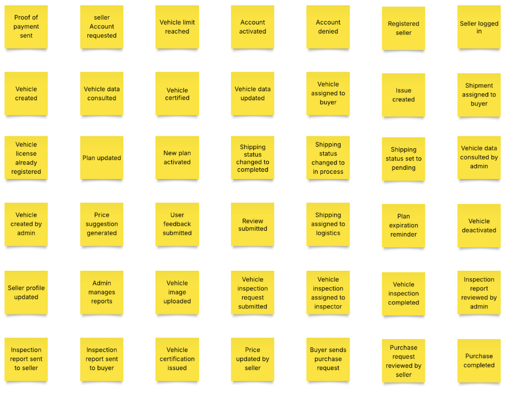

Paso 2: Timelines
En esta sección, los eventos previamente identificados son agrupados en subgrupos, cada uno liderado por el evento principal, que encapsula la funcionalidad clave de ese grupo. Estos eventos siguen el flujo que describe el escenario exitoso del negocio (Happy path), y también cubren los escenarios alternativos que podrían ocurrir durante el proceso de compra y venta de vehículos. El objetivo es mapear cada paso del flujo de trabajo de la plataforma, asegurando que todos los posibles resultados sean considerados para mejorar la experiencia del usuario y la eficiencia del sistema.

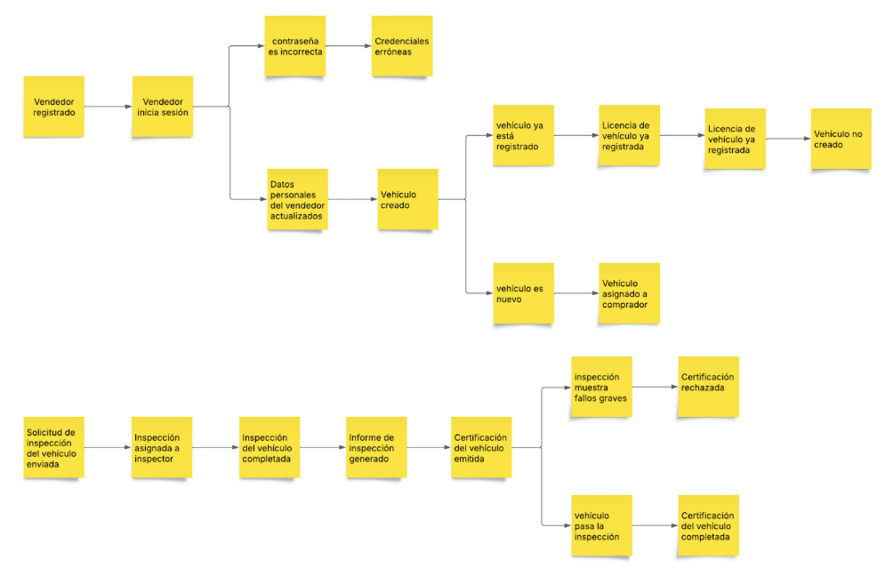
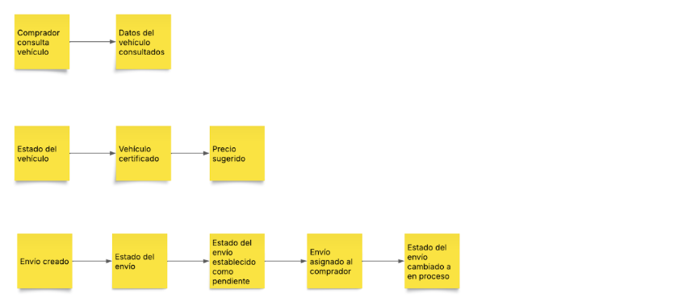

Paso 3: Paint Points
En esta fase, identificamos los puntos problemáticos o Paint Points, que son las áreas donde los usuarios podrían experimentar dificultades al realizar una acción específica dentro de la aplicación. Estos puntos son cruciales para mejorar la experiencia de usuario (UX) y asegurar que Certiweb ofrezca una aplicación eficiente, fácil de usar y sin fricciones.

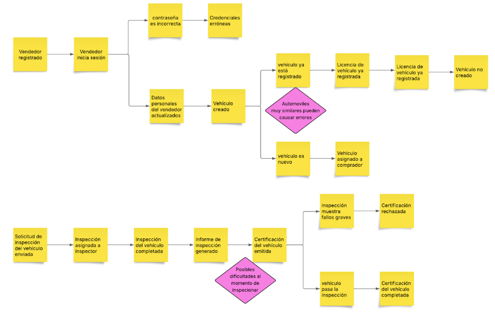
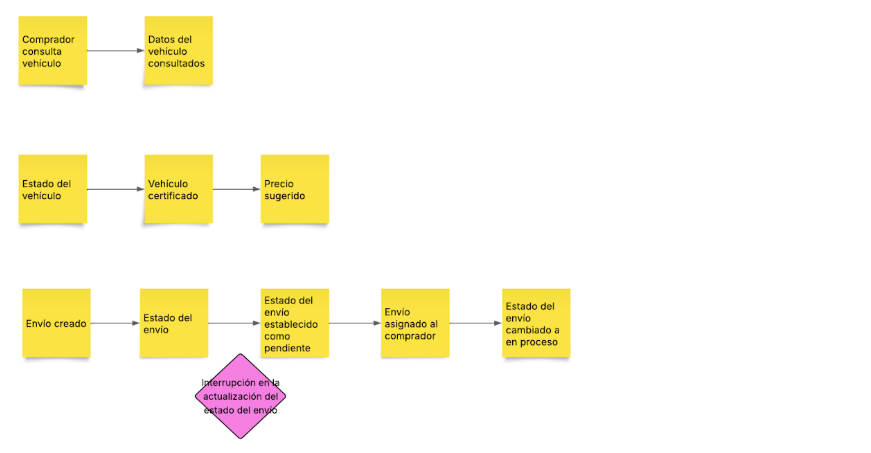

Paso 4: Pivotal Points
En esta fase, nos enfocamos en identificar los puntos cruciales dentro del flujo de trabajo de Certiweb, que tienen un impacto significativo en la operatividad del sistema o el comportamiento del usuario. Estos puntos son vitales para el éxito de los procesos empresariales y ayudan a priorizar qué áreas deben ser optimizadas o revisadas con mayor detalle. Al mejorar estos puntos, podemos asegurar una experiencia de usuario fluida y eficiente, impactando directamente en la satisfacción y en los resultados comerciales.

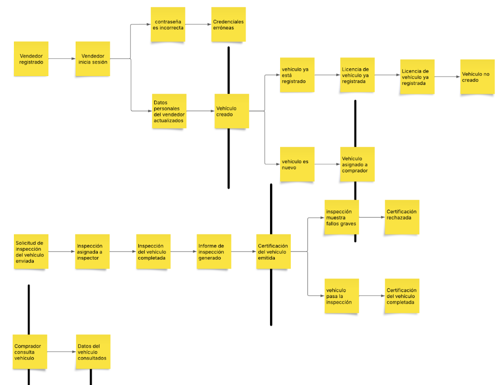
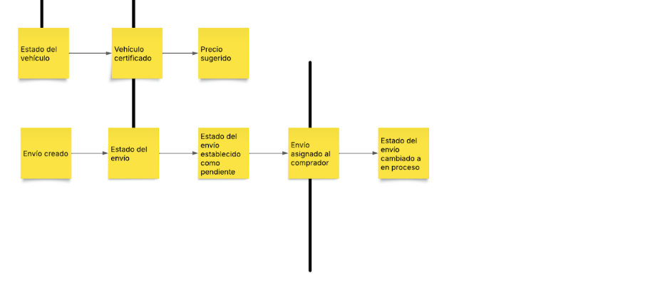

Paso 5: Commands
Los comandos representan las acciones que los actores del sistema (vendedores, compradores, administradores) pueden ejecutar dentro de Certiweb. Durante esta fase, mapeamos qué acciones desencadenan los eventos clave dentro del sistema y qué actores son responsables de ejecutarlas. Esto nos permite estructurar la lógica de negocio en torno a acciones claras y específicas, facilitando la implementación de las reglas del negocio y asegurando un flujo coherente y eficiente de las transacciones

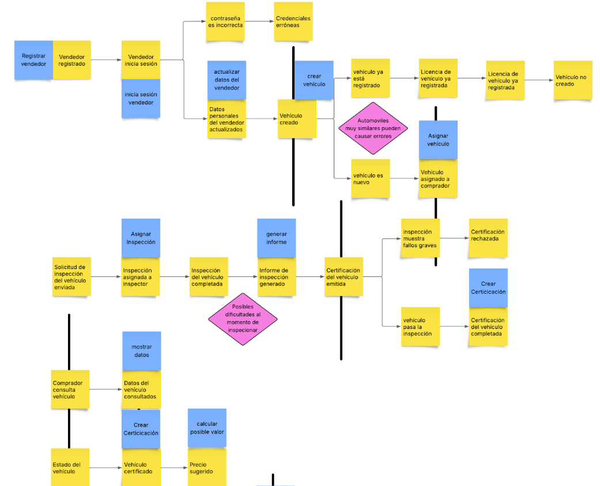
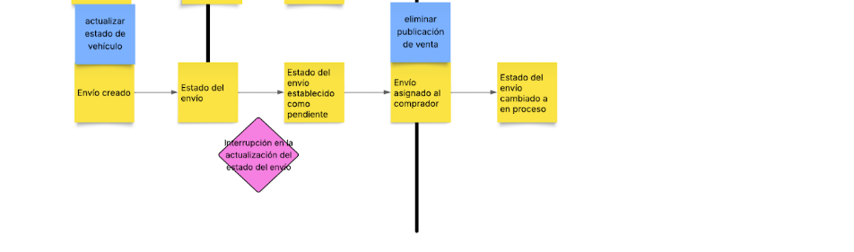

Paso 6: Policies
Las políticas son las reglas de negocio o condiciones que deben cumplirse para que un comando pueda ejecutarse o un evento pueda ocurrir. Las políticas son esenciales para garantizar que el flujo de eventos dentro de la plataforma sea coherente con las reglas del negocio, estableciendo lasrestricciones del sistema y asegurando que los procesos sean sólidos, justos y transparentes.
En Certiweb, las políticas definen los requisitos para que los vendedores, compradores, administradores y logística puedan interactuar con la plataforma de manera correcta y eficiente. A continuación, se presentan algunas políticas clave que se aplican en la plataforma.

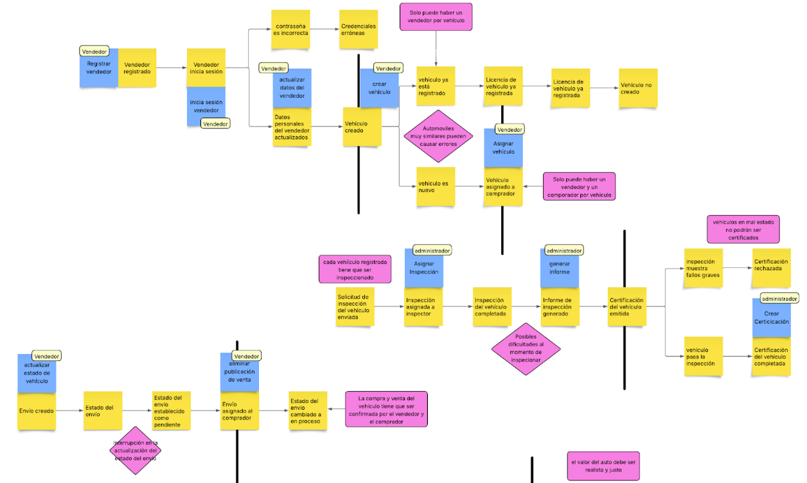
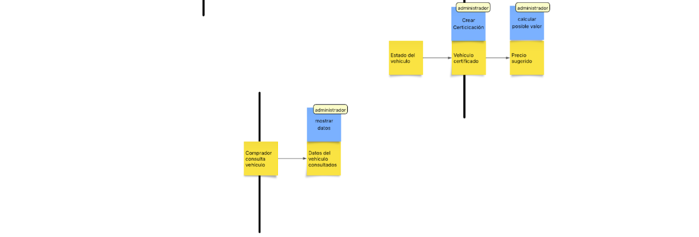

Paso 7: Read Models
Los Read Models son representaciones del estado del sistema, optimizadas para la consulta por parte de los usuarios o procesos internos. Estos modelos permiten que la información se presente de manera eficiente y clara, facilitando la toma de decisiones y mejorando la experiencia del usuario. Durante este paso, definimos qué información necesita ser accesible en momentos clave del flujo de trabajo y cómo debe ser presentada, asegurando que todos los actores (vendedores, compradores, administradores) puedan visualizar el estado del sistema de manera rápida y efectiva.

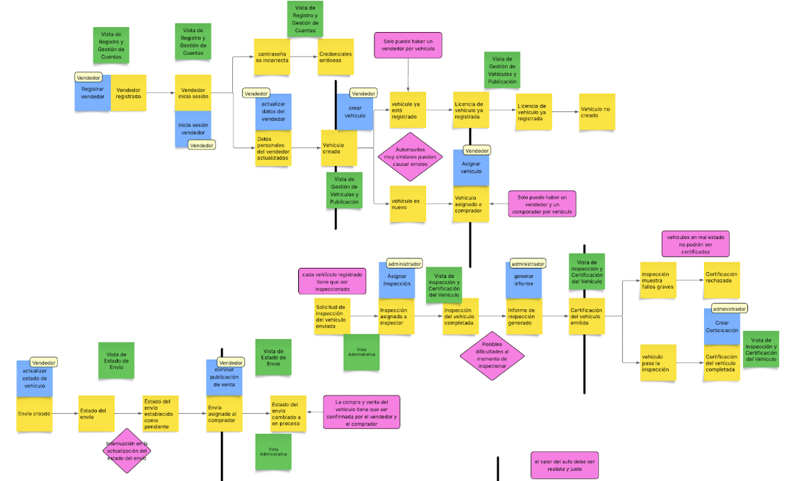
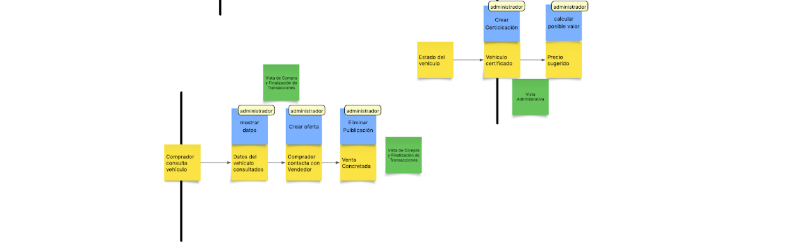

Paso 8: External Systems
En esta fase, identificamos los sistemas externos que interactúan con el dominio de Certiweb. Esto incluye las conexiones con servicios de terceros o sistemas independientes que influyen en los eventos del negocio. Comprender cómo estos sistemas externos afectan los flujos dentro de la plataforma es crucial, ya que nos permite asegurar que las integraciones sean correctas y optimizadas.
A continuación, se detallan los sistemas externos clave que interactúan con Certiweb, y cómo sus integraciones impactan los procesos dentro de la plataforma.

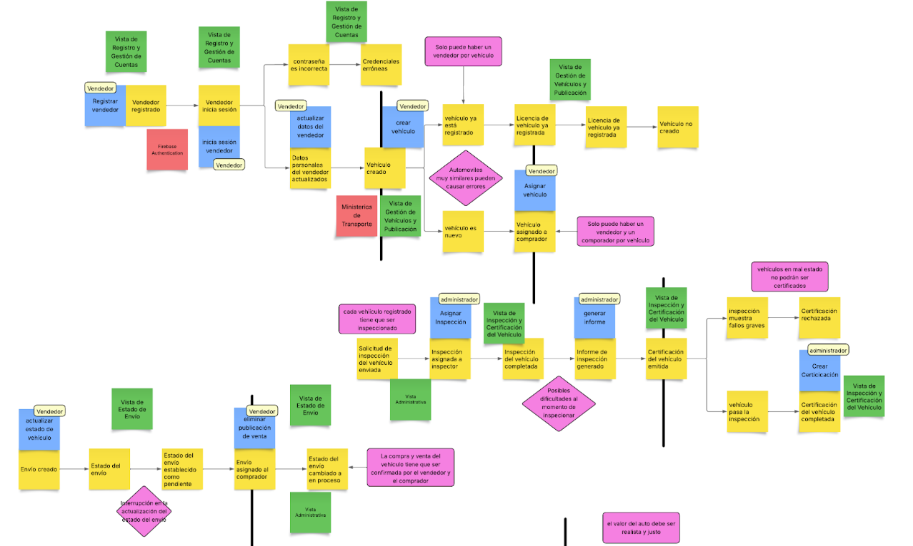
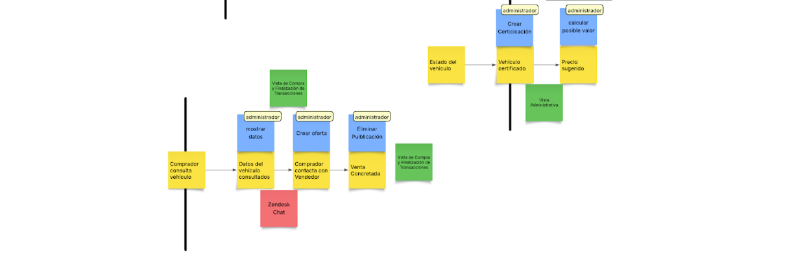

Paso 9: Aggregates
En este paso, agrupamos los eventos y comandos que pertenecen a un agregado específico, con el objetivo de garantizar que todas las operaciones dentro de un contexto estén alineadas y mantengan la consistencia del sistema. Los Aggregates son una colección de objetos dentro de un dominio que tienen una lógica de negocio coherente y son tratados como una unidad. Al agrupar estos eventos y comandos, se asegura que el sistema sea consistente, eficiente y cumpla con las reglas de negocio.

Para Certiweb, definimos los siguientes Aggregates clave, cada uno con sus respectivos eventos y comandos que gestionan las entidades del sistema.

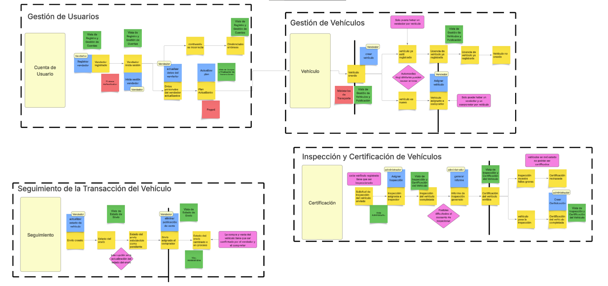
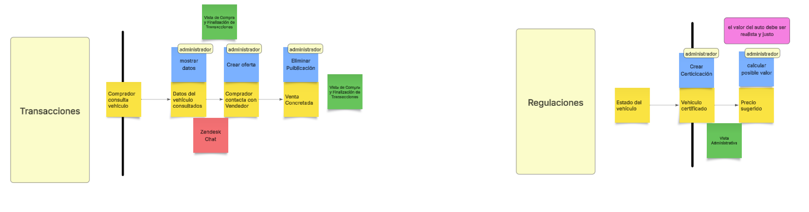

<h5 id="2511-candidate-context-discovery">2.5.1.1. Candidate Context Discovery</h5>

<h5 id="2512-domain-message-flows-modeling">2.5.1.2. Domain Message Flows Modeling</h5>

<h5 id="2513-bounded-context-canvases">2.5.1.3. Bounded Context Canvases</h5>

<h4 id="252-context-mapping">2.5.2. Context Mapping</h4>

<h4 id="253-software-architecture">2.5.3. Software Architecture</h4>
<h5 id="2531-software-architecture-context-level-diagrams">2.5.3.1. Software Architecture Context Level Diagrams</h5>

<h5 id="2532-software-architecture-container-level-diagrams">2.5.3.2. Software Architecture Container Level Diagrams</h5>

<h5 id="2533-software-architecture-deployment-diagrams">2.5.3.3. Software Architecture Deployment Diagrams</h5>

<h3 id="26-tactical-level-domain-driven-design">2.6. Tactical-Level Domain-Driven Design</h3>
<h4 id="261-bounded-context-iam">2.6.1. Bounded Context: IAM</h4>
<h5 id="2611-domain-layer">2.6.1.1. Domain Layer</h5>

En esta capa modelamos la identidad y acceso de administradores del sistema, cuidando las invariantes de autenticación y trazabilidad.

Aggregate 1: AdminUser

| Nombre     | Categoría        | Descripción |
|------------|------------------|-------------|
| AdminUser  | Entity (Aggregate Root) | Representa a un usuario administrador del sistema para tareas administrativas. Custodia credenciales seguras y metadatos de auditoría. |

Attributes

| Nombre       | Tipo de dato       | Visibilidad | Descripción |
|--------------|--------------------|-------------|-------------|
| id           | Integer            | Private     | Identificador único del administrador. |
| name         | String             | Private     | Nombre del administrador (requerido, máx. 100). |
| email        | Email (String)     | Private     | Correo electrónico único y validado (máx. 255). |
| password     | String             | Private     | Contraseña almacenada como hash (BCrypt). |
| createdDate  | DateTimeOffset?    | Private     | Fecha de creación para auditoría. |
| updatedDate  | DateTimeOffset?    | Private     | Fecha de última actualización. |

Methods

| Nombre y firma                                     | Tipo de retorno | Visibilidad | Descripción |
|----------------------------------------------------|-----------------|-------------|-------------|
| login(email: Email, password: String)              | Token (JWT)     | Public      | Valida credenciales del administrador y emite un JWT a través de servicios de hashing y token. |
| verifyPassword(candidate: String)                  | Boolean         | Private     | Verifica una contraseña candidata contra el hash almacenado (delegado en servicio de hashing). |
| changePassword(newPassword: String)                | Void            | Public      | Actualiza la contraseña del administrador (persistiendo el hash). |
| updateProfile(name: String, email: Email)          | Void            | Public      | Actualiza datos básicos del perfil (nombre y correo). |

Nota: Aunque la entidad no expone métodos en el código actual, estos representan las capacidades del agregado dentro del dominio IAM y se materializan vía servicios y controladores.

<h5 id="2612-interface-layer">2.6.1.2. Interface Layer</h5>

Expone endpoints REST para capacidades de IAM (administradores):

- POST /api/v1/admin_user/login: Autenticación de administrador y emisión de JWT.
- GET /api/v1/admin_user: Listado de administradores.
- GET /api/v1/admin_user/{id}: Obtiene un administrador por ID.
- GET /api/v1/admin_user/by-email/{email}: Obtiene un administrador por email.
- POST /api/v1/admin_user/migrate-passwords: Migra contraseñas en texto plano a hash BCrypt.
- POST /api/v1/admin_user/test-password: Verifica contraseñas contra el hash almacenado (debug).

<h5 id="2613-application-layer">2.6.1.3. Application Layer</h5>

Orquesta flujos de autenticación y consulta usando servicios de dominio:

- Query Service: IAdminUserQueryService (búsqueda por id, email y listado).
- Facade ACL: IamContextFacade (exposición controlada de capacidades de IAM hacia otros contextos).
- Contracts CQRS del BC: Queries y Commands.

Cuadros adicionales (Servicios de Aplicación relevantes):

Servicios de autenticación y emisión de tokens

| Servicio/Componente | Responsabilidad | Métodos clave |
|---------------------|-----------------|---------------|
| HashingService      | Hash y verificación de contraseñas (BCrypt) | HashPassword(plain: String): String; VerifyPassword(plain: String, hash: String): Boolean |
| TokenService (JWT)  | Generación de tokens de acceso para el usuario autenticado | GenerateToken(user: User): String |

Contratos y flujos

| Contrato | Descripción | Uso en flujo |
|----------|-------------|--------------|
| LoginAdminRequest | DTO con email y password | Entrada del endpoint /api/v1/admin_user/login |
| AuthenticatedUserResource | DTO de salida con Id, Name, Email, Plan, Token | Respuesta con JWT una vez autenticado |

JWT Token (estructura y claims)

| Claim/Propiedad | Tipo/Valor | Descripción |
|-----------------|------------|-------------|
| alg             | HS256      | Algoritmo de firma HMAC-SHA256. |
| exp             | Date (+7d) | Expiración establecida a 7 días desde la emisión. |
| sid             | String     | Identificador del usuario (ClaimTypes.Sid). |
| name            | String     | Nombre del usuario (ClaimTypes.Name). |

<h5 id="2614-infrastructure-layer">2.6.1.4 Infrastructure Layer</h5>

Implementa acceso a datos y servicios técnicos:

- Repositorio del agregado AdminUser: IAdminUserRepository (FindByEmailAsync, GetAllAsync, CRUD vía IBaseRepository).
- Persistencia EFC: carpeta de implementación con Entity Framework Core y manejo de Created/UpdatedDate.

<h5 id="2615-bounded-context-software-architecture-component-level-diagrams">2.6.1.5. Bounded Context Software Architecture Component Level Diagrams</h5>

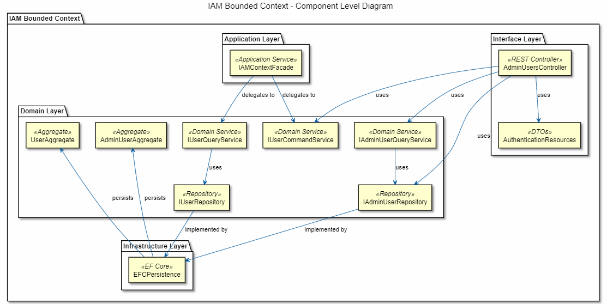

<h5 id="2616-bounded-context-software-architecture-code-level-diagrams">2.6.1.6. Bounded Context Software Architecture Code Level Diagrams</h5>

<h6 id="26161-bounded-context-domain-layer-class-diagrams">2.6.1.6.1. Bounded Context Domain Layer Class Diagrams</h6>

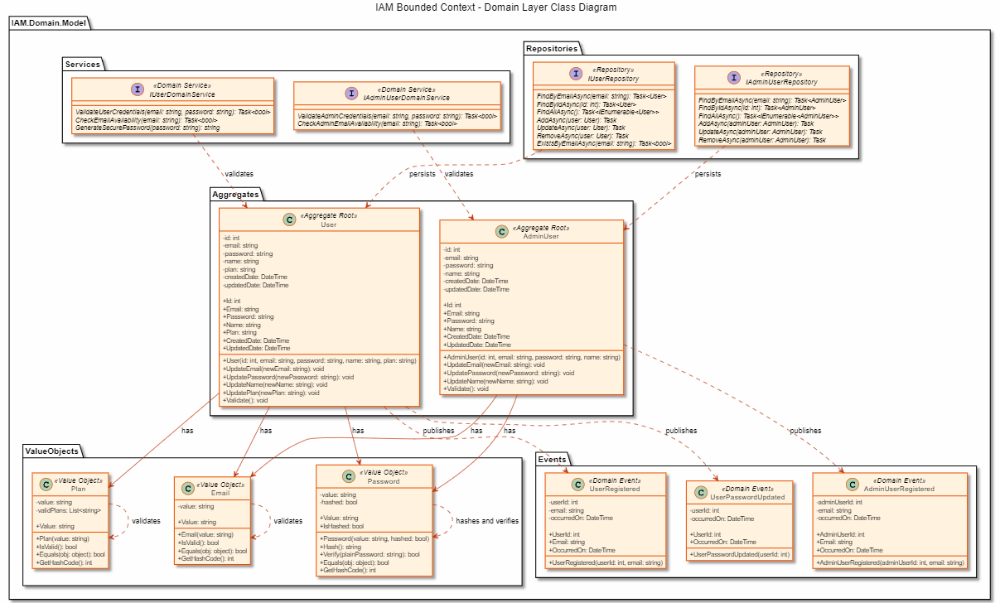

<h6 id="26162-bounded-context-database-design-diagram">2.6.1.6.2. Bounded Context Database Design Diagram</h6>

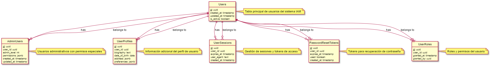

<h4 id="262-bounded-context-certificaciones">2.6.2. Bounded Context: Certificaciones</h4>
<h5 id="2621-domain-layer">2.6.2.1. Domain Layer</h5>

En esta capa modelamos la certificación de vehículos (carros) y el catálogo de marcas, cuidando invariantes como placa única, año válido, precio no negativo y PDF de certificación válido.

Aggregate 1: Car

| Nombre | Categoría | Descripción |
|--------|-----------|-------------|
| Car | Entity (Aggregate Root) | Representa una certificación de vehículo con datos del propietario, marca, modelo y documentación (PDF). |

Attributes (Car)

| Nombre | Tipo de dato | Visibilidad | Descripción |
|--------|---------------|-------------|-------------|
| id | Integer | Private | Identificador único del vehículo certificado. |
| title | String | Private | Título o nombre corto del vehículo (requerido, máx. 200). |
| owner | String | Private | Nombre del propietario (requerido, máx. 100). |
| ownerEmail | Email (String) | Private | Correo del propietario (requerido, máx. 100). |
| year | Year (Value Object) | Private | Año del vehículo (entre 1900 y año actual + 1). |
| brandId | Integer | Private | Identificador de la marca asociada. |
| brand | Brand | Private | Referencia a la marca (cargada por repositorio). |
| model | String | Private | Modelo del vehículo (requerido, máx. 100). |
| description | String? | Private | Descripción opcional (máx. 500). |
| pdfCertification | PdfCertification (Value Object) | Private | Certificado en Base64 (mín. 10 caracteres; limpia prefijo data:application/pdf;base64, si existe). |
| imageUrl | String? | Private | URL de imagen opcional (máx. 500). |
| price | Price (Value Object) | Private | Precio no negativo; moneda por defecto "SOL". |
| licensePlate | LicensePlate (Value Object) | Private | Placa entre 6 y 10 caracteres, normalizada a mayúsculas. |
| originalReservationId | Integer | Private | ID de la reservación original asociada. |

Methods (Car)

| Nombre y firma | Tipo de retorno | Visibilidad | Descripción |
|----------------|-----------------|-------------|-------------|
| create(command: CreateCarCommand) | Car | Public | Crea una certificación de vehículo garantizando invariantes y unicidad (placa y reservación). |
| update(command: UpdateCarCommand) | Void | Public | Actualiza datos del vehículo (marca, placa, PDF, precio, etc.). |
| delete(id: Integer) | Boolean | Public | Elimina la certificación si existe. |
| assignBrand(brandId: Integer) | Void | Public | Asigna/actualiza la marca del vehículo. |
| changeLicensePlate(value: String) | Void | Public | Cambia la placa validando unicidad y formato. |
| attachPdf(base64Pdf: String) | Void | Public | Adjunta o sustituye el PDF de certificación (Base64). |

Nota: Aunque muchas capacidades se materializan vía servicios de aplicación y controladores, estas operaciones reflejan el comportamiento esperado del agregado.

Aggregate 2: Brand

| Nombre | Categoría | Descripción |
|--------|-----------|-------------|
| Brand | Entity (Aggregate Root) | Representa la marca del vehículo (catálogo administrado). |

Attributes (Brand)

| Nombre | Tipo de dato | Visibilidad | Descripción |
|--------|---------------|-------------|-------------|
| id | Integer | Private | Identificador único de la marca. |
| name | String | Private | Nombre de la marca (requerido, máx. 100). |
| isActive | Boolean | Private | Indicador de marca activa. |

Methods (Brand)

| Nombre y firma | Tipo de retorno | Visibilidad | Descripción |
|----------------|-----------------|-------------|-------------|
| activate() | Void | Public | Activa la marca para su uso. |
| deactivate() | Void | Public | Desactiva la marca (no visible para selección). |
| rename(name: String) | Void | Public | Cambia el nombre de la marca validando no vacío. |

Value Objects e invariantes

| VO | Regla(s) principal(es) |
|----|------------------------|
| Year | Entre 1900 y (año actual + 1). |
| LicensePlate | Longitud 6..10; no vacío; se normaliza a mayúsculas. |
| Price | No negativo; moneda obligatoria (por defecto "SOL"). |
| PdfCertification | Base64 mínimo 10 caracteres; opcionalmente se valida que sea Base64; elimina prefijo data URL si existe. |

<h5 id="2622-interface-layer">2.6.2.2. Interface Layer</h5>

Expone endpoints REST para capacidades de certificación de vehículos y marcas:

- POST /api/v1/cars: Crea una certificación de vehículo.
- GET /api/v1/cars: Lista todas las certificaciones.
- GET /api/v1/cars/{carId}: Obtiene una certificación por ID.
- GET /api/v1/cars/brand/{brandId}: Lista certificaciones por marca.
- GET /api/v1/cars/owner/{ownerEmail}: Lista certificaciones por correo del propietario.
- PATCH /api/v1/cars/{carId}: Actualiza parcialmente una certificación.
- GET /api/v1/cars/{id}/pdf: Obtiene el PDF de certificación (Base64 con prefijo data URL).
- DELETE /api/v1/cars/{carId}: Elimina una certificación.
- GET /api/v1/brands: Lista de marcas activas.

<h5 id="2623-application-layer">2.6.2.3. Application Layer</h5>

Orquesta flujos de comandos y consultas del dominio:

- Command Service: ICarCommandService (creación, actualización y eliminación de Car).
- Query Service: ICarQueryService (listado, por id, por marca y por email del propietario).
- Reglas de negocio: validación de VO y unicidad (placa y reservación) delegadas a repositorios y VO.
- Contracts CQRS del BC: Commands (CreateCarCommand, UpdateCarCommand, DeleteCarCommand) y Queries (GetAllCarsQuery, GetCarByIdQuery, GetCarsByBrandQuery, GetCarsByOwnerEmailQuery).

Contratos y flujos

| Contrato | Descripción | Uso en flujo |
|----------|-------------|--------------|
| CreateCarResource | DTO con los campos para crear una certificación (incluye PDF Base64, precio, placa, etc.). | Entrada del endpoint POST /api/v1/cars |
| UpdateCarResource | DTO para actualización parcial de una certificación. | Entrada del endpoint PATCH /api/v1/cars/{carId} |
| CarResource | DTO de salida con los datos del vehículo y banderas derivadas (ej. HasPdfCertification). | Respuesta en endpoints GET/POST/PATCH de cars |
| BrandResource | DTO de salida de marca (Id, Name, IsActive). | Respuesta de GET /api/v1/brands |

<h5 id="2624-infrastructure-layer">2.6.2.4 Infrastructure Layer</h5>

Implementa acceso a datos y servicios técnicos del BC:

- Repositorio del agregado Car: ICarRepository (ListAsync con Include Brand, FindByIdAsync con Include, FindCarsByBrandIdAsync, FindCarsByOwnerEmailAsync, FindCarByLicensePlateAsync, FindCarByReservationIdAsync).
- Repositorio del agregado Brand: IBrandRepository (FindBrandByIdAsync, GetActiveBrandsAsync y CRUD vía IBaseRepository).
- Persistencia EFC: implementaciones concretas con Entity Framework Core; uso de UnitOfWork para completar transacciones.

<h5 id="2625-bounded-context-software-architecture-component-level-diagrams">2.6.2.5. Bounded Context Software Architecture Component Level Diagrams</h5>

<h5 id="2626-bounded-context-software-architecture-code-level-diagrams">2.6.2.6. Bounded Context Software Architecture Code Level Diagrams</h5>

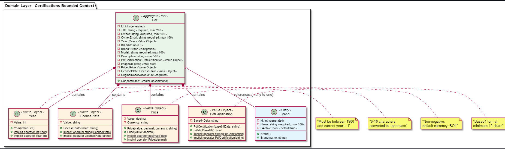

<h6 id="26261-bounded-context-domain-layer-class-diagrams">2.6.2.6.1. Bounded Context Domain Layer Class Diagrams</h6>

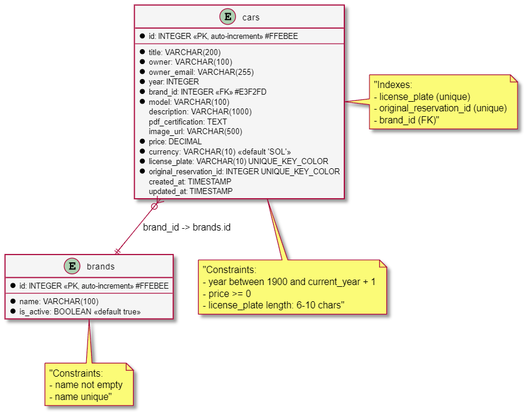

<h6 id="26262-bounded-context-database-design-diagram">2.6.2.6.2. Bounded Context Database Design Diagram</h6>

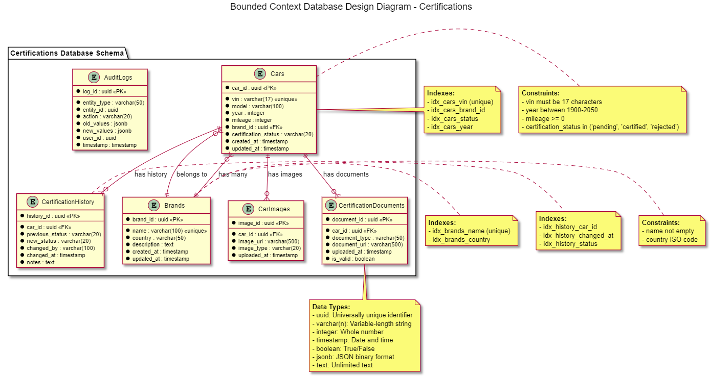

<h4 id="263-bounded-context-reservacion">2.6.3. Bounded Context: Reservacion</h4>
<h5 id="2631-domain-layer">2.6.3.1. Domain Layer</h5>

Este BC modela la reserva de inspecciones vehiculares, con foco en evitar duplicidades por placa/fecha-hora y en un ciclo de vida simple de estados.

Aggregate: Reservation

| Nombre | Categoría | Descripción |
|--------|-----------|-------------|
| Reservation | Entity (Aggregate Root) | Representa una reserva de inspección para un vehículo y un horario específico. |

Attributes (Reservation)

| Nombre | Tipo de dato | Visibilidad | Descripción |
|--------|---------------|-------------|-------------|
| id | Integer | Private | Identificador único de la reserva. |
| userId | Integer | Private | Id del usuario que realiza la reserva. |
| reservationName | String | Private | Nombre de quien reserva. |
| reservationEmail | Email (String) | Private | Correo de quien reserva. |
| imageUrl | String | Private | URL de imagen del vehículo. |
| brand | String | Private | Marca del vehículo. |
| model | String | Private | Modelo del vehículo. |
| licensePlate | String | Private | Placa en formato XXX-XXX; se normaliza a mayúsculas y con guion (helper interno). |
| inspectionDateTime | DateTime | Private | Fecha-hora de inspección; validación de duplicidad por placa/fecha-hora. |
| price | String | Private | Precio (representación textual). |
| status | String | Private | Estado de reserva: pending, accepted, rejected. |
| createdDate | DateTimeOffset? | Private | Marca de auditoría de creación. |
| updatedDate | DateTimeOffset? | Private | Marca de auditoría de actualización. |

Methods (Reservation)

| Nombre y firma | Tipo de retorno | Visibilidad | Descripción |
|----------------|-----------------|-------------|-------------|
| create(command: CreateReservationCommand) | Reservation | Public | Crea una reserva con placa formateada y estado inicial pending. |
| updateStatus(reservationId: Integer, status: String) | Reservation | Public | Actualiza estado validando valores permitidos. |
| delete(reservationId: Integer) | Boolean | Public | Elimina la reserva si existe. |

Reglas clave

- Placa: se limpia y formatea a XXX-XXX (3+3 alfanuméricos, mayúsculas). Evitar reservaciones duplicadas por placa y fecha-hora (comparando día y hora). 
- Estados permitidos: pending, accepted, rejected.

<h5 id="2632-interface-layer">2.6.3.2. Interface Layer</h5>

Endpoints REST expuestos por ReservationsController:

- POST /api/v1/reservations: Crea una reserva.
- GET /api/v1/reservations: Lista todas las reservas.
- GET /api/v1/reservations/{reservationId}: Obtiene reserva por ID.
- GET /api/v1/reservations/user/{userId}: Lista reservas de un usuario.
- GET /api/v1/reservations/status/{status}: Lista reservas por estado.
- PUT /api/v1/reservations/{reservationId}/status: Actualiza estado (body: string status).
- PUT /api/v1/reservations/{reservationId}: Actualiza reserva (usa UpdateReservationResource con Status).
- DELETE /api/v1/reservations/{reservationId}: Elimina una reserva.

<h5 id="2633-application-layer">2.6.3.3. Application Layer</h5>

Servicios y orquestación de CQRS:

- Command Service: IReservationCommandService con Handle(CreateReservationCommand), Handle(UpdateReservationStatusCommand), Handle(DeleteReservationCommand).
- Query Service: IReservationQueryService con Handle(GetAllReservationsQuery), Handle(GetReservationByIdQuery), Handle(GetReservationsByUserIdQuery), Handle(GetReservationsByStatusQuery).
- Reglas de negocio clave en comandos: validación de placa (máx. 6 alfanuméricos, formato XXX-XXX y normalización), control de duplicidad por placa/fecha-hora, validación de estados permitidos.

Contratos/DTOs

| Contrato | Descripción | Uso |
|----------|-------------|-----|
| CreateReservationResource | Datos de entrada para crear reserva. | POST /api/v1/reservations |
| UpdateReservationResource | Datos de actualización (Status). | PUT /api/v1/reservations/{reservationId} |
| ReservationResource | Respuesta estándar de reservas. | Todas las respuestas GET/POST/PUT |

Comandos y Consultas (CQRS)

| Tipo | Nombre |
|------|--------|
| Command | CreateReservationCommand |
| Command | UpdateReservationStatusCommand |
| Command | DeleteReservationCommand |
| Query | GetAllReservationsQuery |
| Query | GetReservationByIdQuery |
| Query | GetReservationsByUserIdQuery |
| Query | GetReservationsByStatusQuery |

<h5 id="2634-infrastructure-layer">2.6.3.4 Infrastructure Layer</h5>

Persistencia y repositorios (EF Core):

- IReservationRepository: FindReservationsByUserIdAsync, FindReservationsByStatusAsync, ExistsReservationForLicensePlateAndDateTimeAsync.
- Implementación EFC: ReservationRepository con normalización de placa y comparación por fecha y hora exacta.
- Unit of Work: coordinación de transacciones al crear/actualizar/eliminar reservas.

<h5 id="2635-bounded-context-software-architecture-component-level-diagrams">2.6.3.5. Bounded Context Software Architecture Component Level Diagrams</h5>

<h5 id="2636-bounded-context-software-architecture-code-level-diagrams">2.6.3.6. Bounded Context Software Architecture Code Level Diagrams</h5>

<h6 id="26361-bounded-context-domain-layer-class-diagrams">2.6.3.6.1. Bounded Context Domain Layer Class Diagrams</h6>

<h6 id="26362-bounded-context-database-design-diagram">2.6.3.6.2. Bounded Context Database Design Diagram</h6>

<h4 id="264-bounded-context-usuarios">2.6.4. Bounded Context: Usuarios</h4>
<h5 id="2641-domain-layer">2.6.4.1. Domain Layer</h5>

Este BC modela a los usuarios finales del sistema (no administradores IAM), incluyendo registro, autenticación y plan de suscripción.

Aggregate: User

| Nombre | Categoría | Descripción |
|--------|-----------|-------------|
| User | Entity (Aggregate Root) | Representa a un usuario del sistema con credenciales y plan de suscripción. |

Attributes (User)

| Nombre | Tipo de dato | Visibilidad | Descripción |
|--------|---------------|-------------|-------------|
| id | Integer | Private | Identificador único del usuario. |
| name | String | Private | Nombre del usuario (requerido, 2-100). |
| email | Email (String) | Private | Correo del usuario (único, validado). |
| password | String | Private | Contraseña hasheada (BCrypt). |
| plan | String | Private | Plan de suscripción. |
| createdDate | DateTimeOffset? | Private | Marca de auditoría de creación. |
| updatedDate | DateTimeOffset? | Private | Marca de auditoría de actualización. |

Métodos/Regras clave

- Creación: hash de contraseña antes de persistir (servicio de hashing). 
- Autenticación: validación por email y verificación de contraseña hasheada; emisión de JWT con claims sid y name.

<h5 id="2642-interface-layer">2.6.4.2. Interface Layer</h5>

Endpoints REST expuestos

- UsersController
  - GET /api/v1/users: Lista usuarios.
  - GET /api/v1/users/{userId}: Obtiene usuario por id.
  - POST /api/v1/users/migrate-passwords: Migra contraseñas texto plano a hash (uso puntual).
  - POST /api/v1/users/test-password: Verifica contraseña vs hash (diagnóstico).

- AuthenticationController
  - POST /api/v1/auth/register: Registra usuario y retorna token.
  - POST /api/v1/auth/login: Autentica usuario (email+password) y retorna token.

<h5 id="2643-application-layer">2.6.4.3. Application Layer</h5>

Servicios y CQRS

- Command Service: IUserCommandService con Handle(CreateUserCommand) -> retorna AuthenticatedUserResource (incluye JWT).
- Query Service: IUserQueryService con Handle(GetAllUsersQuery), Handle(GetUserByIdQuery), Handle(GetUserByEmail), Handle(GetUserByEmailAndPassword).
- Outbound Services: IHashingService (BCrypt), ITokenService (JWT HS256, exp +7d, claims sid/name).

Contratos/DTOs

| Contrato | Descripción | Uso |
|----------|-------------|-----|
| CreateUserResource | Datos de entrada para registro. | POST /api/v1/auth/register |
| LoginRequest | Email y password para login. | POST /api/v1/auth/login |
| UserResource | DTO estándar de usuario (incluye password hasheado). | GET endpoints de UsersController |
| AuthenticatedUserResource | DTO de salida con Id, Name, Email, Plan, Token | Respuestas de register/login |

Comandos y Consultas (CQRS)

| Tipo | Nombre |
|------|--------|
| Command | CreateUserCommand |
| Query | GetAllUsersQuery |
| Query | GetUserByIdQuery |
| Query | GetUserByEmail |
| Query | GetUserByEmailAndPassword |

<h5 id="2644-infrastructure-layer">2.6.4.4 Infrastructure Layer</h5>

Persistencia y servicios técnicos

- IUserRepository: extiende IBaseRepository<User>; operación específica FindUserByEmailAsync.
- Implementación EFC: UserRepository con FindUserByEmailAsync.
- Hashing: implementación BCrypt de IHashingService.
- Tokens: implementación JWT de ITokenService con HS256, exp 7 días, claims sid y name.
- Middleware: RequestAuthorizationMiddleware valida token y extrae userId.
- Inyección de dependencias: servicios y repositorios registrados en Program.cs.

<h5 id="2645-bounded-context-software-architecture-component-level-diagrams">2.6.4.5. Bounded Context Software Architecture Component Level Diagrams</h5>

<h5 id="2646-bounded-context-software-architecture-code-level-diagrams">2.6.4.6. Bounded Context Software Architecture Code Level Diagrams</h5>

<h6 id="26461-bounded-context-domain-layer-class-diagrams">2.6.4.6.1. Bounded Context Domain Layer Class Diagrams</h6>

<h6 id="26462-bounded-context-database-design-diagram">2.6.4.6.2. Bounded Context Database Design Diagram</h6>

<h1 id="capítulo-iii-solution-uiux-design">Capítulo III: Solution UI/UX Design</h1>
<h3 id="31-product-design">3.1. Product design</h3>
<h4 id="311-style-guidelines">3.1.1. Style Guidelines</h4>

<h5 id="3111-general-style-guidelines">3.1.1.1. General Style Guidelines</h5>

<h4 id="312-information-architecture">3.1.2. Information Architecture</h4>

<h5 id="3121-organization-systems">3.1.2.1. Organization Systems</h5>

<h5 id="3122-labelling-systems">3.1.2.2. Labelling Systems</h5>

<h5 id="3123-seo-tags-and-meta-tags">3.1.2.3. SEO Tags and Meta Tags</h5>

<h5 id="3124-searching-systems">3.1.2.4. Searching Systems</h5>

<h5 id="3125-navigation-systems">3.1.2.5. Navigation Systems</h5>

<h4 id="313-landing-page-ui-design">3.1.3. Landing Page UI Design</h4>

<h5 id="3131-landing-page-wireframe">3.1.3.1. Landing Page Wireframe</h5>

<h5 id="3132-landing-page-mock-up">3.1.3.2. Landing Page Mock-up</h5>

<h4 id="314-mobile-applications-uxui-design">3.1.4. Mobile Applications UX/UI Design</h4>

<h5 id="3141-mobile-applications-wireframes">3.1.4.1. Mobile Applications Wireframes</h5>

<h5 id="3142-mobile-applications-wireflow-diagrams">3.1.4.2. Mobile Applications Wireflow Diagrams</h5>

<h5 id="3143-mobile-applications-mock-ups">3.1.4.3. Mobile Applications Mock-ups</h5>

<h5 id="3144-mobile-applications-user-flow-diagrams">3.1.4.4. Mobile Applications User Flow Diagrams</h5>

<h5 id="3145-mobile-applications-prototyping">3.1.4.5. Mobile Applications Prototyping</h5>

<h1 id="capítulo-iv-product-implementation--validation">Capítulo IV: Product Implementation & Validation</h1>
<h3 id="41-software-configuration-management">4.1. Software Configuration Management</h3>
<h4 id="411-software-development-environment-configuration">4.1.1. Software Development Environment Configuration</h4>

<h4 id="412-source-code-management">4.1.2. Source Code Management</h4>

<h4 id="413-source-code-style-guide--conventions">4.1.3. Source Code Style Guide & Conventions</h4>

<h4 id="414-software-deployment-configuration">4.1.4. Software Deployment Configuration</h4>

<h3 id="42-landing-page--mobile-application-implementation">4.2. Landing Page & Mobile Application Implementation</h3>

<h4 id="421-sprint-n">4.2.1. Sprint n</h4>
<h5 id="4211-sprint-planning-n">4.2.1.1. Sprint Planning n</h5>

<h5 id="4212-sprint-backlog-n">4.2.1.2. Sprint Backlog n</h5>

<h5 id="4213-development-evidence-for-sprint-review">4.2.1.3. Development Evidence for Sprint Review</h5>

<h5 id="4214-testing-suite-evidence-for-sprint-review">4.2.1.4. Testing Suite Evidence for Sprint Review</h5>

<h5 id="4215-execution-evidence-for-sprint-review">4.2.1.5. Execution Evidence for Sprint Review</h5>

<h5 id="4216-services-documentation-evidence-for-sprint-review">4.2.1.6. Services Documentation Evidence for Sprint Review</h5>

<h5 id="4217-software-deployment-evidence-for-sprint-review">4.2.1.7. Software Deployment Evidence for Sprint Review</h5>

<h5 id="4218-team-collaboration-insights-during-sprint">4.2.1.8. Team Collaboration Insights during Sprint</h5>

<h3 id="43-validation-interviews">4.3. Validation Interviews</h3>

<h4 id="431-diseño-de-entrevistas">4.3.1. Diseño de Entrevistas</h4>

<h4 id="432-registro-de-entrevistas">4.3.2. Registro de Entrevistas</h4>

<h4 id="433-evaluaciones-según-heurísticas">4.3.3. Evaluaciones según heurísticas</h4>

<h1 id="conclusiones">Conclusiones</h1>
<h1 id="conclusiones-y-recomendaciones">Conclusiones y recomendaciones.</h1>

<h1 id="video-app-validation">Video App Validation</h1>

<h1 id="video-about-the-product">Video About the product</h1>

<h1 id="video-about-the-team">Video About the team</h1>

<h1 id="glosario">Glosario</h1>

<h1 id="bibliografía">Bibliografía</h1>

<h1 id="anexos">Anexos</h1>

