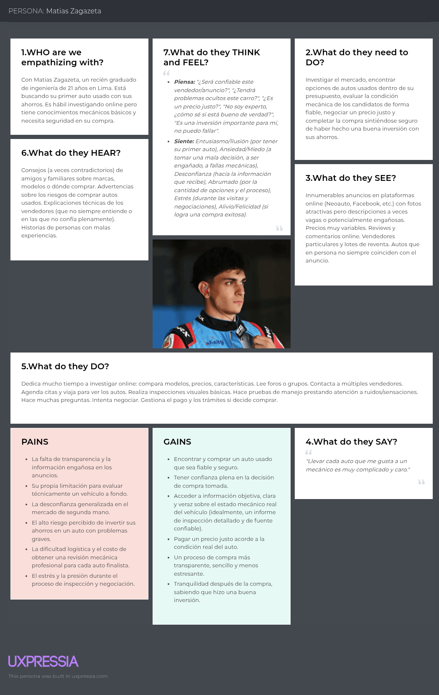
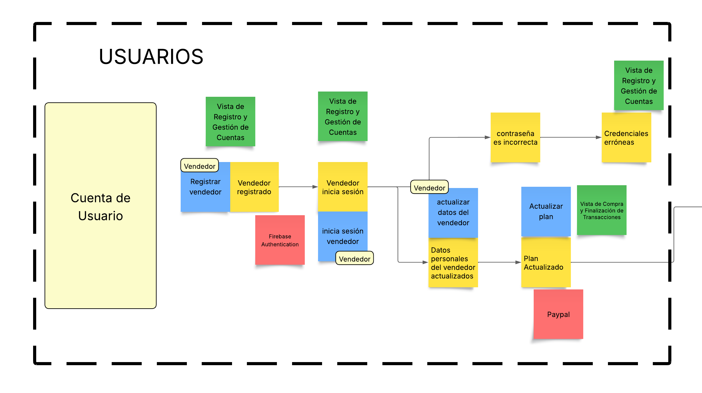
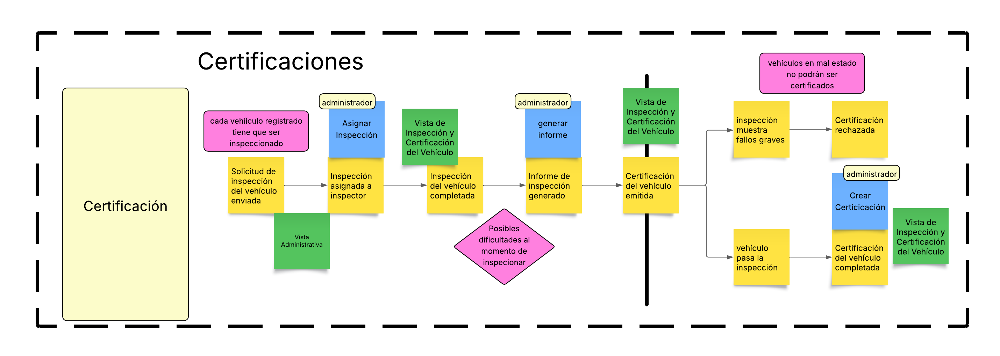
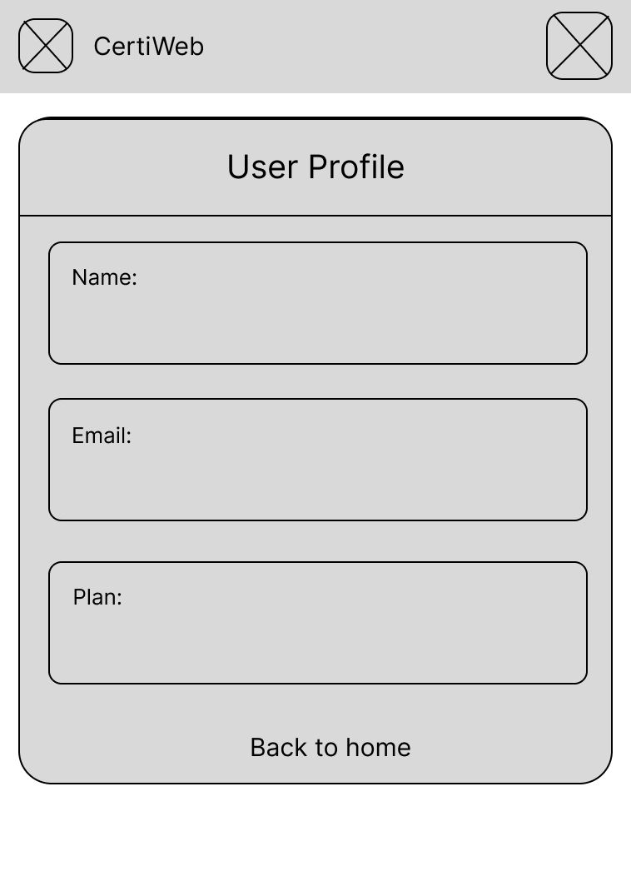
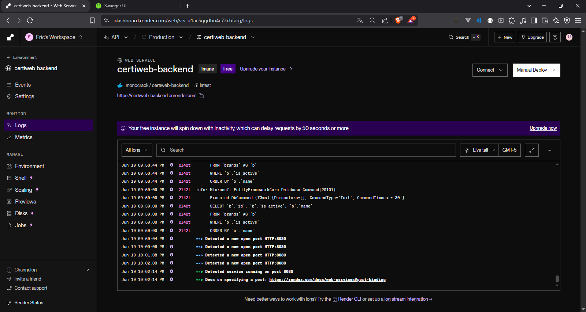

<h3 style="text-align: center;"> Universidad Peruana de Ciencias Aplicadas </h3>
<h5 style="text-align: center"> Ingeniería de Software </h5>

<h5 style="text-align: center"> Periodo 202520 </h5>

<h5 style="text-align: center"> 1ACC0238 | Aplicaciones para Dispositivos Móviles </h5>
<h5 style="text-align: center"> NRC: 14649 </h5>

<h5 style="text-align: center"> Docente: David Gerardo Quevedo Velasco </h5>

<h1 style="text-align: center"> Informe de Trabajo Final </h1>

<h5 style="text-align: center"> Startup: Selling Cars Quickly - SCQ - Mobile Application</h5>

<h5 style="text-align: center"> Producto: Certiweb </h5>

## Integrantes:

- u202213358 Agama Espinoza, Eric Fabrizio 
- u202216698 Alcántara Cruz, Rodrigo Alonso 
- u202214406 Barturen Guzman, Alejandro Nicolas 
- u202114649 Mechan Chumpitaz, Rodrigo Nicolas 
- u202312899 Ortiz Alarcón, Victor Nicolas 


<h5 style="text-align: center"> Diciembre 2025 </h5>

<br>
<br>
<br>
<br>
<br>
<br>
<br>
<br>
<br>
<br>
<br>
<br>
<br>

### Registro de Versiones del Informe
| Versión | Fecha      | Autor      | Descripción de Modificación                                                                 | 
|---------|------------|------------|---------------------------------------------------------------------------------------------|
| 1.0     | 2025-09-18 | Alcántara Cruz, Rodrigo Alonso; Agama Espinoza, Eric Fabrizio; Barturen Guzman, Alejandro Nicolas; Mechan Chumpitaz, Rodrigo Nicolas; Ortiz Alarcón, Victor Nicolas | Versión inicial del informe: carátula, miembros, índice general y estructura de capítulos I–IV; redacción inicial del Capítulo I (1.1.1). |
| 1.1     | 2025-09-18 | Alcántara Cruz, Rodrigo Alonso; Agama Espinoza, Eric Fabrizio; Barturen Guzman, Alejandro Nicolas; Mechan Chumpitaz, Rodrigo Nicolas; Ortiz Alarcón, Victor Nicolas | Inclusión de la sección Student Outcome (SO7) y registro de Acciones realizadas de TB1 para todos los integrantes en ambos criterios, referenciando Capítulos I–II. |
| 1.2     | 2025-09-18 | Alcántara Cruz, Rodrigo Alonso; Agama Espinoza, Eric Fabrizio; Barturen Guzman, Alejandro Nicolas; Mechan Chumpitaz, Rodrigo Nicolas; Ortiz Alarcón, Victor Nicolas | Ajuste de las Acciones TB1 para reflejar trabajo transversal en Cap. I (1.1–1.3) y Cap. II (2.1–2.6), y adición de Conclusiones TB1 por criterio. |
| 1.3     | 2025-09-18 | Alcántara Cruz, Rodrigo Alonso; Agama Espinoza, Eric Fabrizio; Barturen Guzman, Alejandro Nicolas; Mechan Chumpitaz, Rodrigo Nicolas; Ortiz Alarcón, Victor Nicolas | Creación y documentación de este Registro de Versiones del Informe, consolidando los cambios recientes en Student Outcome TB1. |
| 1.4     | 2025-10-10 | Alcántara Cruz, Rodrigo Alonso; Agama Espinoza, Eric Fabrizio; Barturen Guzman, Alejandro Nicolas; Mechan Chumpitaz, Rodrigo Nicolas; Ortiz Alarcón, Victor Nicolas | Entrega Sprint 1: landing page desplegado (MVP), backend implementado al 70%, pantallas core visibles; inclusión en el informe de Capítulo III (Solution UI/UX Design) y Capítulo IV (Product Implementation & Validation) y Sprint 1. |
| 1.5 | 2025-11-13 | Alcántara Cruz, Rodrigo Alonso; Agama Espinoza, Eric Fabrizio; Barturen Guzman, Alejandro Nicolas; Mechan Chumpitaz, Rodrigo Nicolas; Ortiz Alarcón, Victor Nicolas |Entrega Sprint 2: Entrega Sprint 2: funcionalidades core de la app móvil implementadas (inspecciones, informes, vehículos y carga de documentos), pruebas funcionales/unitarias realizadas en Android e iOS; integración completa con backend y documentación incluida en Capítulo IV (Product Implementation & Validation) |


### Project Report Collaboration Insights


| Repositorio Selling Cars Quickly | [Selling-Cars Quickly-Mobile-Application](https://github.com/Selling-Cars-Quickly-Mobile-Application) |
|--------------------------|-----------------------------------------------|


### Student Outcome

| Criterio Específico | Acciones Realizadas | Conclusiones |
|---------------------|---------------------|--------------|
| Actualiza conceptos y <br> conocimientos necesarios para su <br> desarrollo profesional y en especial <br> para su proyecto en <br> soluciones de software. | **Rodrigo, Alcántara**<br>TB1:<br>- Contribuyó transversalmente al Capítulo I (1.1–1.3) y Capítulo II (2.1–2.6), articulando la visión de la solución con el diseño técnico.<br>- En Cap. I: apoyó 1.1 Startup Profile y 1.2 Solution Profile; participó en 1.2.2 Lean UX (problemas, hipótesis, canvas).<br>- En Cap. II: colaboró en 2.5 DDD estratégico (EventStorming, Context Mapping) y 2.5.3 Arquitectura (Context, Containers, Deployment), vinculándolo con 2.6 DDD táctico.<br>- Integró evidencias y referencias cruzadas en el README y la carpeta Images/ para mantener trazabilidad.<br>TP:<br>En esta entrega me encargué de la elaboración del capitulo 3 , los userflow y wireflow diagrams y la primera versión de la aplicación movil.<br>TB2:<br>- Durante el Sprint 2 actualicé conocimientos en Flutter avanzado, gestión de estado (Provider/Riverpod) y consumo de APIs REST para implementar las funciones core de la app. Apliqué patrones de arquitectura limpia móvil y realicé pruebas funcionales en Android e iOS. Integré estas prácticas en la actualización del Capítulo IV, evidenciando la trazabilidad entre lógica de dominio, endpoints y vistas móviles.<br>TF:<br>Coordiné el despliegue de las aplicaciones móviles (Flutter y Kotlin) en Firebase, orquesté releases y validaciones smoke, documenté el proceso de publicación y preparé checklist de revisión. Definí DoR/DoD, responsabilidades y flujo de aprobaciones para asegurar entregas predecibles.<br>**Eric, Agama**<br>TB1:<br>- Contribuyó a Cap. I (1.1–1.3) y Cap. II (2.1–2.6) desde el soporte a prototipado y validación temprana.<br>- En Cap. I: apoyó 1.2 Solution Profile y 1.2.2 Lean UX materializando supuestos en un prototipo base.<br>- En Cap. II: colaboró en 2.2 Entrevistas y 2.3 Needfinding (preparación de guion, registro, síntesis) y levantó un servidor mock para pruebas de 2.4–2.6.<br>- Documentó pautas de estilo y configuraciones de entorno para mantener coherencia entre requisitos y UI.<br>TP:<br>Capítulo III: diseñó y prototipó la UI del landing (estructura, navegación, componentes); Capítulo IV: implementó el landing con html, integró mock APIs y validó accesibilidad básica; Sprint 1: dejó desplegable el MVP y documentó criterios de aceptación y evidencias.<br>TB2:<br>- Para el Sprint 2 reforcé conocimientos en integración móvil–backend, optimización de UI en Flutter y validación de formularios, aplicándolos en los módulos de inspecciones, carga de archivos y navegación. Documenté criterios de diseño técnico para móviles e incorporé evidencias y flujos actualizados en el Capítulo IV, alineando implementación con las pruebas realizadas.<br>TF:<br>Configuré y mantuve workflows de CI/CD para deploy a Firebase, empaqueté builds, ejecuté pruebas smoke post‑publicación y documenté entornos/variables. Consolidé evidencias y métricas de despliegue en el Capítulo IV, con trazabilidad entre historias, endpoints y vistas.<br>**Alejandro, Barturen**<br>TB1:<br>- Focalizó su aporte en Cap. I (1.2.2 Lean UX) y Cap. II (2.1, 2.2, 2.3), asegurando coherencia entre problema, usuarios y requisitos.<br>- En Cap. I: elaboró problem statements, hipótesis y canvas; definió segmentos y pain points.<br>- En Cap. II: diseñó entrevistas (2.2.1), registró y analizó resultados (2.2.2–2.2.3); desarrolló Personas, Empathy Maps y Journey (2.3).<br>- Integró hallazgos en 2.4 (User Stories, Impact Mapping) para alimentar el backlog inicial.<br>TP:<br>Capítulo III: diseñó microcopy y contenidos de UI, revisó wireframes y coherencia de flujos; Capítulo IV: preparó casos de validación y métricas con entrevistas; Sprint 1: consolidó insights para el backlog y verificó el CTA del landing.<br>TB2:<br>- En el Sprint 2 actualicé conocimientos en diseño de experiencia móvil, flujos de interacción y prácticas de validación de usabilidad para mejorar la primera versión de las pantallas de inspecciones, informes y vehículos. Apliqué estas mejoras en la documentación del Capítulo IV y consolidé criterios de contenido, mensajes de error y estados vacíos para la app.<br>TF:<br>Elaboré guías de publicación, notas de versión y checklist de QA/accesibilidad. Organicé ceremonias y coordinación de tareas para releases, dejando documentación de validación y criterios de aceptación alineados con la app móvil.<br>**Rodrigo, Mechan**<br>TB1:<br>- Articuló el puente Cap. I → Cap. II transformando hallazgos de Lean UX en modelos y backlog priorizado.<br>- En Cap. I: consolidó visión y supuestos de 1.2.2 Lean UX.<br>- En Cap. II: condujo sesiones de 2.5.1 EventStorming y 2.5.2 Context Mapping; definió historias y priorización (2.4.1–2.4.3) y preparó evidencias.<br>- Alineó criterios de aceptación y Definition of Done con el lenguaje del dominio.<br>TP:<br>Capítulo III: definió user flows y navegación end‑to‑end; Capítulo IV: sostuvo trazabilidad de eventos y endpoints planificados; Sprint 1: coordinó priorización y validación del `GET /cars/{id}/pdf` y flujos principales.<br>TB2:<br>- Reforcé conceptos de integración DDD → app móvil, estructuración de endpoints y traducción de comandos/eventos a pantallas funcionales. Apliqué estos aprendizajes para asegurar consistencia entre dominio, backend y Flutter durante el Sprint 2, y actualicé en Capítulo IV la trazabilidad entre historias, endpoints y vistas implementadas.<br>TF:<br>Estandaricé GitFlow (branching, PRs, releases), checklist de QA y criterios de aceptación; coordiné cortes de versión y soporte a despliegue, mejorando trazabilidad entre móviles y backend y la estabilidad de entregas.<br>**Victor, Ortiz**<br>TB1:<br>- Aseguró consistencia entre la definición del producto (Cap. I) y el diseño de datos/servicios (Cap. II).<br>- En Cap. I: revisó objetivos, alcance y segmentos (1.1, 1.2, 1.3) para alinear el modelo de información.<br>- En Cap. II: modeló entidades y relaciones por bounded context (2.6) y validó flujos de información; preparó colecciones de prueba para 2.5.3/2.6.<br>- Mantuvo referencias de artefactos y checklist de calidad en el repositorio para trazabilidad.<br>TP:<br>Capítulo III: aportó lineamientos de UI para estados y consumo de datos; Capítulo IV: diseñó modelos y endpoints REST que soportan el frontend y armó colecciones de prueba; Sprint 1: habilitó validaciones y APIs necesarias para el landing y reportes.<br>TB2:<br>- En el Sprint 2 profundicé en diseño de APIs, manejo de archivos (imágenes/documentos) y optimización de respuestas para la app móvil. Apliqué estos conocimientos al completar los servicios necesarios para inspecciones, vehículos y documentos. Actualicé el Capítulo IV con los modelos, endpoints finales y evidencias de integración móvil–backend.<br>TF:<br>Preparé y validé servicios para despliegue (endpoints finales, Swagger, colecciones de prueba, scripts DB), configuré entornos y monitoreo, y documenté procedimientos de liberación para mejorar la confiabilidad del release. | TB1: Integramos de forma consistente los entregables de Capítulo I (perfil de startup, segmentos y Lean UX) y Capítulo II (entrevistas/needfinding, historias, DDD estratégico y táctico, arquitectura), actualizando y aplicando conceptos directamente al proyecto; el resultado fue un set de requisitos priorizados y un diseño técnico trazable desde el problema hasta la solución, reduciendo ambigüedades y alineando dominio, datos y servicios.<br>TP: Se desplegó el landing page (MVP), el backend alcanzó 70% de implementación y se presentaron pantallas core; se evidenció la articulación entre Capítulo III (UI/UX) y Capítulo IV (Implementación y Validación) con entregables y métricas del Sprint 1. <br>TB2: El aprendizaje de técnicas avanzadas en Flutter y gestión de APIs permitió resolver eficientemente la complejidad de la integración móvil-backend. Esta actualización constante de conocimientos se tradujo en una mejora tangible de la calidad del código y la documentación del Sprint 2.<br>TF: La adopción de prácticas de DevOps y estandarización de QA elevó el nivel profesional del equipo, permitiendo gestionar el ciclo de vida completo de la aplicación. La experiencia adquirida en el despliegue y cierre del proyecto sienta las bases para futuros desarrollos de software escalables.<br> |
| Reconoce la necesidad del <br> aprendizaje permanente para el <br>  desempeño profesional y el <br> desarrollo de proyectos en <br> soluciones de software. | **Rodrigo, Alcántara**<br>TB1:<br>- Se capacitó en DDD, Clean Architecture y C4 Model para enlazar Cap. I con Cap. II (2.5–2.6).<br>- Practicó elaboración de diagramas y versionado de API para sostener arquitectura y trazabilidad entre capítulos.<br>- Participó en revisiones internas compartiendo lecciones aprendidas del Cap. I–II.<br>- Registró aprendizajes y gaps para los siguientes sprints.<br>TP:<br>Se capacitó para la elaboración de los user flow y wireflow diagrams, también se capacitó para elaborar la priemra versión de la aplicación movil<br>TB2:<br>- En el Sprint 2 reforcé mi aprendizaje en pruebas móviles, buenas prácticas de UI responsiva y optimización del consumo de APIs en Flutter. Mantener un aprendizaje continuo me permitió resolver problemas de integración, mejorar los flujos implementados y documentar evidencias más completas en el Capítulo IV.<br>TF:<br>Coordiné el despliegue de las aplicaciones móviles (Flutter y Kotlin) en Firebase, orquesté releases y validaciones smoke, documenté el proceso de publicación y preparé checklist de revisión. Definí DoR/DoD, responsabilidades y flujo de aprobaciones para asegurar entregas predecibles.<br>**Eric, Agama**<br>TB1:<br>- Reforzó Lean UX básico para interpretar 1.2.2 y traducirlo a prototipos; estudió Vue (Composition API/Router) y mock APIs para validar 2.4–2.6.<br>- Experimentó con accesibilidad y pruebas de componentes para elevar la calidad del Cap. II.<br>- Adoptó convenciones de commits y versionado semántico para ordenar la documentación técnica.<br>- Compartió micro-sesiones sobre estructura de frontend y consumo de APIs con el equipo.<br>TP:<br>Capítulo III: profundizó en diseño de componentes y accesibilidad; Capítulo IV: implementó el landing y pruebas de integración con mock APIs; Sprint 1: entregó un MVP funcional y registró aprendizajes y evidencias.<br>TB2:<br>- Practiqué nuevas herramientas de inspección visual y debug para Flutter, aprendí mejores prácticas de manejo de formularios y estructura de carpetas para proyectos móviles. Este aprendizaje constante permitió mejorar la calidad del módulo de inspecciones y consolidar mejores métricas en la validación del Sprint 2.<br>TF:<br>Configuré y mantuve workflows de CI/CD para deploy a Firebase, empaqueté builds, ejecuté pruebas smoke post‑publicación y documenté entornos/variables. Consolidé evidencias y métricas de despliegue en el Capítulo IV, con trazabilidad entre historias, endpoints y vistas.<br>**Alejandro, Barturen**<br>TB1:<br>- Estudió heurísticas de Nielsen, técnicas de entrevista y síntesis de insights aplicadas en 2.2–2.3.<br>- Revisó guías de Lean UX para robustecer 1.2.2 y su impacto en requisitos (2.4).<br>- Formalizó criterios de redacción y registro de evidencias para reproducibilidad de Cap. I–II.<br>- Lideró espacios de feedback para homogeneizar el lenguaje del dominio en el documento.<br>TP:<br>Capítulo III: refinó UX writing, jerarquía visual y revisión de wireframes; Capítulo IV: definió criterios de validación y métricas; Sprint 1: cerró historias de contenido y verificación del CTA.<br>TB2:<br>- Fortalecí mis habilidades en UX writing móvil, diseño de microinteracciones y patrones comunes de navegación para mejorar la experiencia del Sprint 2. El aprendizaje continuo permitió mejorar los flujos, estados de carga y mensajes dentro de la app, contribuyendo a la documentación del Capítulo IV y a la validación funcional.<br>TF:<br>Elaboré guías de publicación, notas de versión y checklist de QA/accesibilidad. Organicé ceremonias y coordinación de tareas para releases, dejando documentación de validación y criterios de aceptación alineados con la app móvil.<br>**Rodrigo, Mechan**<br>TB1:<br>- Se formó en EventStorming, especificación de historias y priorización para conectar hallazgos de Cap. I con el diseño de Cap. II.<br>- Profundizó en GitFlow y manejo de issues para coordinar el avance entre capítulos.<br>- Practicó validación de flujos (comandos, eventos, políticas) con ejemplos guiados.<br>- Documentó lecciones aprendidas y acciones de mejora continua del equipo.<br>TP:<br>Capítulo III: detalló user flows y navegación; Capítulo IV: priorizó historias y alineó UI con servicios; Sprint 1: validó flujos críticos y documentación del endpoint de autenticidad.<br>TB2:<br>- Me capacité en mejores prácticas de refinamiento de historias, criterios de aceptación y flujos end-to-end aplicados a apps móviles. Este aprendizaje me permitió coordinar la integración backend–Flutter, asegurar la coherencia del Sprint 2 y actualizar las evidencias técnicas de Capítulo IV.<br>TF:<br>Estandaricé GitFlow (branching, PRs, releases), checklist de QA y criterios de aceptación; coordiné cortes de versión y soporte a despliegue, mejorando trazabilidad entre móviles y backend y la estabilidad de entregas.<br>**Victor, Ortiz**<br>TB1:<br>- Aprendió modelado orientado al dominio y diseño de APIs REST para sustentar 2.6 a partir de la visión del Cap. I.<br>- Reforzó SQL y normalización para proponer esquemas iniciales alineados al dominio.<br>- Preparó guías de prueba y un glosario de términos para acelerar el aprendizaje del equipo.<br>- Se comprometió con el seguimiento de métricas de calidad para iteraciones futuras.<br>TP:<br>Capítulo III: colaboró en componentes UI orientados a datos; Capítulo IV: diseñó APIs y esquemas SQL de soporte; Sprint 1: entregó colecciones de prueba y validaciones para integrar el landing.<br>TB2:<br>-Aprendí técnicas para optimizar el rendimiento de APIs y mejorar el manejo de datos móviles, lo que permitió integrar los servicios requeridos por Flutter sin afectar tiempos de respuesta. Este aprendizaje mejoró la calidad técnica entregada en Sprint 2 y se reflejó en la documentación del Capítulo IV.<br>TF:<br>Preparé y validé servicios para despliegue (endpoints finales, Swagger, colecciones de prueba, scripts DB), configuré entornos y monitoreo, y documenté procedimientos de liberación para mejorar la confiabilidad del release.| TB1: Mantuvimos un plan de aprendizaje activo y colaborativo (DDD, Clean Architecture, C4, UX Research, pruebas y GitFlow), con micro-sesiones internas, práctica guiada y registro de lecciones; esto fortaleció la calidad de los entregables de los Capítulos I–II y nuestra capacidad de iteración continua, impactando en una documentación más clara, un diseño más coherente y mejores criterios de validación.<br>TP: El plan de aprendizaje aplicado (UI/UX, accesibilidad, APIs REST y GitFlow) habilitó el despliegue del landing, el avance del backend al 70% y la entrega de pantallas core con evidencias del Sprint 1 y documentación trazable.<br>TB2: Consolidamos la arquitectura móvil y la integración de servicios REST, completando las funcionalidades core del Sprint 2 con un enfoque en calidad y experiencia de usuario. La aplicación de pruebas y revisiones de código garantizó la estabilidad de los entregables.<br>TF: Ejecutamos el despliegue final de la solución móvil en Firebase, implementando pipelines de CI/CD y validaciones de seguridad. La gestión estructurada del proyecto y la documentación de cierre aseguraron la conformidad con todos los requisitos del Student Outcome.<br> |
| Actualiza conceptos y <br> conocimientos necesarios para su <br> desarrollo profesional y en especial <br> para su proyecto en <br> soluciones de software. | **Rodrigo, Alcántara**<br>TB1:<br>- Contribuyó transversalmente al Capítulo I (1.1–1.3) y Capítulo II (2.1–2.6), articulando la visión de la solución con el diseño técnico.<br>- En Cap. I: apoyó 1.1 Startup Profile y 1.2 Solution Profile; participó en 1.2.2 Lean UX (problemas, hipótesis, canvas).<br>- En Cap. II: colaboró en 2.5 DDD estratégico (EventStorming, Context Mapping) y 2.5.3 Arquitectura (Context, Containers, Deployment), vinculándolo con 2.6 DDD táctico.<br>- Integró evidencias y referencias cruzadas en el README y la carpeta Images/ para mantener trazabilidad.<br>TP:<br>En esta entrega me encargué de la elaboración del capitulo 3 , los userflow y wireflow diagrams y la primera versión de la aplicación movil.<br>TB2:<br>- Durante el Sprint 2 actualicé conocimientos en Flutter avanzado, gestión de estado (Provider/Riverpod) y consumo de APIs REST para implementar las funciones core de la app. Apliqué patrones de arquitectura limpia móvil y realicé pruebas funcionales en Android e iOS. Integré estas prácticas en la actualización del Capítulo IV, evidenciando la trazabilidad entre lógica de dominio, endpoints y vistas móviles.<br>TF:<br>[texto]<br>**Eric, Agama**<br>TB1:<br>- Contribuyó a Cap. I (1.1–1.3) y Cap. II (2.1–2.6) desde el soporte a prototipado y validación temprana.<br>- En Cap. I: apoyó 1.2 Solution Profile y 1.2.2 Lean UX materializando supuestos en un prototipo base.<br>- En Cap. II: colaboró en 2.2 Entrevistas y 2.3 Needfinding (preparación de guion, registro, síntesis) y levantó un servidor mock para pruebas de 2.4–2.6.<br>- Documentó pautas de estilo y configuraciones de entorno para mantener coherencia entre requisitos y UI.<br>TP:<br>Capítulo III: diseñó y prototipó la UI del landing (estructura, navegación, componentes); Capítulo IV: implementó el landing con html, integró mock APIs y validó accesibilidad básica; Sprint 1: dejó desplegable el MVP y documentó criterios de aceptación y evidencias.<br>TB2:<br>- Para el Sprint 2 reforcé conocimientos en integración móvil–backend, optimización de UI en Flutter y validación de formularios, aplicándolos en los módulos de inspecciones, carga de archivos y navegación. Documenté criterios de diseño técnico para móviles e incorporé evidencias y flujos actualizados en el Capítulo IV, alineando implementación con las pruebas realizadas.<br>TF:<br>[texto]<br>**Alejandro, Barturen**<br>TB1:<br>- Focalizó su aporte en Cap. I (1.2.2 Lean UX) y Cap. II (2.1, 2.2, 2.3), asegurando coherencia entre problema, usuarios y requisitos.<br>- En Cap. I: elaboró problem statements, hipótesis y canvas; definió segmentos y pain points.<br>- En Cap. II: diseñó entrevistas (2.2.1), registró y analizó resultados (2.2.2–2.2.3); desarrolló Personas, Empathy Maps y Journey (2.3).<br>- Integró hallazgos en 2.4 (User Stories, Impact Mapping) para alimentar el backlog inicial.<br>TP:<br>Capítulo III: diseñó microcopy y contenidos de UI, revisó wireframes y coherencia de flujos; Capítulo IV: preparó casos de validación y métricas con entrevistas; Sprint 1: consolidó insights para el backlog y verificó el CTA del landing.<br>TB2:<br>- En el Sprint 2 actualicé conocimientos en diseño de experiencia móvil, flujos de interacción y prácticas de validación de usabilidad para mejorar la primera versión de las pantallas de inspecciones, informes y vehículos. Apliqué estas mejoras en la documentación del Capítulo IV y consolidé criterios de contenido, mensajes de error y estados vacíos para la app.<br>TF:<br>[Texto]<br>**Rodrigo, Mechan**<br>TB1:<br>- Articuló el puente Cap. I → Cap. II transformando hallazgos de Lean UX en modelos y backlog priorizado.<br>- En Cap. I: consolidó visión y supuestos de 1.2.2 Lean UX.<br>- En Cap. II: condujo sesiones de 2.5.1 EventStorming y 2.5.2 Context Mapping; definió historias y priorización (2.4.1–2.4.3) y preparó evidencias.<br>- Alineó criterios de aceptación y Definition of Done con el lenguaje del dominio.<br>TP:<br>Capítulo III: definió user flows y navegación end‑to‑end; Capítulo IV: sostuvo trazabilidad de eventos y endpoints planificados; Sprint 1: coordinó priorización y validación del `GET /cars/{id}/pdf` y flujos principales.<br>TB2:<br>- Reforcé conceptos de integración DDD → app móvil, estructuración de endpoints y traducción de comandos/eventos a pantallas funcionales. Apliqué estos aprendizajes para asegurar consistencia entre dominio, backend y Flutter durante el Sprint 2, y actualicé en Capítulo IV la trazabilidad entre historias, endpoints y vistas implementadas.<br>TF:<br>[texto]<br>**Victor, Ortiz**<br>TB1:<br>- Aseguró consistencia entre la definición del producto (Cap. I) y el diseño de datos/servicios (Cap. II).<br>- En Cap. I: revisó objetivos, alcance y segmentos (1.1, 1.2, 1.3) para alinear el modelo de información.<br>- En Cap. II: modeló entidades y relaciones por bounded context (2.6) y validó flujos de información; preparó colecciones de prueba para 2.5.3/2.6.<br>- Mantuvo referencias de artefactos y checklist de calidad en el repositorio para trazabilidad.<br>TP:<br>Capítulo III: aportó lineamientos de UI para estados y consumo de datos; Capítulo IV: diseñó modelos y endpoints REST que soportan el frontend y armó colecciones de prueba; Sprint 1: habilitó validaciones y APIs necesarias para el landing y reportes.<br>TB2:<br>- En el Sprint 2 profundicé en diseño de APIs, manejo de archivos (imágenes/documentos) y optimización de respuestas para la app móvil. Apliqué estos conocimientos al completar los servicios necesarios para inspecciones, vehículos y documentos. Actualicé el Capítulo IV con los modelos, endpoints finales y evidencias de integración móvil–backend.<br>TF:<br>[texto]. | TB1: Integramos de forma consistente los entregables de Capítulo I (perfil de startup, segmentos y Lean UX) y Capítulo II (entrevistas/needfinding, historias, DDD estratégico y táctico, arquitectura), actualizando y aplicando conceptos directamente al proyecto; el resultado fue un set de requisitos priorizados y un diseño técnico trazable desde el problema hasta la solución, reduciendo ambigüedades y alineando dominio, datos y servicios.<br>TP: Se desplegó el landing page (MVP), el backend alcanzó 70% de implementación y se presentaron pantallas core; se evidenció la articulación entre Capítulo III (UI/UX) y Capítulo IV (Implementación y Validación) con entregables y métricas del Sprint 1. <br>TB2:<br>Consolidamos y aplicamos aprendizajes avanzados (Flutter, consumo de APIs REST, pruebas móviles y arquitectura limpia) para completar funcionalidades core de la app e integrar móvil–backend. Actualizamos el Capítulo IV con evidencias, métricas y trazabilidad entre historias, endpoints y vistas, elevando la calidad y coherencia del producto. |
| Reconoce la necesidad del <br> aprendizaje permanente para el <br>  desempeño profesional y el <br> desarrollo de proyectos en <br> soluciones de software. | **Rodrigo, Alcántara**<br>TB1:<br>- Se capacitó en DDD, Clean Architecture y C4 Model para enlazar Cap. I con Cap. II (2.5–2.6).<br>- Practicó elaboración de diagramas y versionado de API para sostener arquitectura y trazabilidad entre capítulos.<br>- Participó en revisiones internas compartiendo lecciones aprendidas del Cap. I–II.<br>- Registró aprendizajes y gaps para los siguientes sprints.<br>TP:<br>Se capacitó para la elaboración de los user flow y wireflow diagrams, también se capacitó para elaborar la priemra versión de la aplicación movil<br>TB2:<br>- En el Sprint 2 reforcé mi aprendizaje en pruebas móviles, buenas prácticas de UI responsiva y optimización del consumo de APIs en Flutter. Mantener un aprendizaje continuo me permitió resolver problemas de integración, mejorar los flujos implementados y documentar evidencias más completas en el Capítulo IV.<br>TF:<br>[texto]<br>**Eric, Agama**<br>TB1:<br>- Reforzó Lean UX básico para interpretar 1.2.2 y traducirlo a prototipos; estudió Vue (Composition API/Router) y mock APIs para validar 2.4–2.6.<br>- Experimentó con accesibilidad y pruebas de componentes para elevar la calidad del Cap. II.<br>- Adoptó convenciones de commits y versionado semántico para ordenar la documentación técnica.<br>- Compartió micro-sesiones sobre estructura de frontend y consumo de APIs con el equipo.<br>TP:<br>Capítulo III: profundizó en diseño de componentes y accesibilidad; Capítulo IV: implementó el landing y pruebas de integración con mock APIs; Sprint 1: entregó un MVP funcional y registró aprendizajes y evidencias.<br>TB2:<br>- Practiqué nuevas herramientas de inspección visual y debug para Flutter, aprendí mejores prácticas de manejo de formularios y estructura de carpetas para proyectos móviles. Este aprendizaje constante permitió mejorar la calidad del módulo de inspecciones y consolidar mejores métricas en la validación del Sprint 2.<br>TF:<br>[texto]<br>**Alejandro, Barturen**<br>TB1:<br>- Estudió heurísticas de Nielsen, técnicas de entrevista y síntesis de insights aplicadas en 2.2–2.3.<br>- Revisó guías de Lean UX para robustecer 1.2.2 y su impacto en requisitos (2.4).<br>- Formalizó criterios de redacción y registro de evidencias para reproducibilidad de Cap. I–II.<br>- Lideró espacios de feedback para homogeneizar el lenguaje del dominio en el documento.<br>TP:<br>Capítulo III: refinó UX writing, jerarquía visual y revisión de wireframes; Capítulo IV: definió criterios de validación y métricas; Sprint 1: cerró historias de contenido y verificación del CTA.<br>TB2:<br>- Fortalecí mis habilidades en UX writing móvil, diseño de microinteracciones y patrones comunes de navegación para mejorar la experiencia del Sprint 2. El aprendizaje continuo permitió mejorar los flujos, estados de carga y mensajes dentro de la app, contribuyendo a la documentación del Capítulo IV y a la validación funcional.<br>TF:<br>[Texto]<br>**Rodrigo, Mechan**<br>TB1:<br>- Se formó en EventStorming, especificación de historias y priorización para conectar hallazgos de Cap. I con el diseño de Cap. II.<br>- Profundizó en GitFlow y manejo de issues para coordinar el avance entre capítulos.<br>- Practicó validación de flujos (comandos, eventos, políticas) con ejemplos guiados.<br>- Documentó lecciones aprendidas y acciones de mejora continua del equipo.<br>TP:<br>Capítulo III: detalló user flows y navegación; Capítulo IV: priorizó historias y alineó UI con servicios; Sprint 1: validó flujos críticos y documentación del endpoint de autenticidad.<br>TB2:<br>- Me capacité en mejores prácticas de refinamiento de historias, criterios de aceptación y flujos end-to-end aplicados a apps móviles. Este aprendizaje me permitió coordinar la integración backend–Flutter, asegurar la coherencia del Sprint 2 y actualizar las evidencias técnicas de Capítulo IV.<br>TF:<br>[texto]<br>**Victor, Ortiz**<br>TB1:<br>- Aprendió modelado orientado al dominio y diseño de APIs REST para sustentar 2.6 a partir de la visión del Cap. I.<br>- Reforzó SQL y normalización para proponer esquemas iniciales alineados al dominio.<br>- Preparó guías de prueba y un glosario de términos para acelerar el aprendizaje del equipo.<br>- Se comprometió con el seguimiento de métricas de calidad para iteraciones futuras.<br>TP:<br>Capítulo III: colaboró en componentes UI orientados a datos; Capítulo IV: diseñó APIs y esquemas SQL de soporte; Sprint 1: entregó colecciones de prueba y validaciones para integrar el landing.<br>TB2:<br>-Aprendí técnicas para optimizar el rendimiento de APIs y mejorar el manejo de datos móviles, lo que permitió integrar los servicios requeridos por Flutter sin afectar tiempos de respuesta. Este aprendizaje mejoró la calidad técnica entregada en Sprint 2 y se reflejó en la documentación del Capítulo IV.<br>TF:<br>[texto]| TB1: Mantuvimos un plan de aprendizaje activo y colaborativo (DDD, Clean Architecture, C4, UX Research, pruebas y GitFlow), con micro-sesiones internas, práctica guiada y registro de lecciones; esto fortaleció la calidad de los entregables de los Capítulos I–II y nuestra capacidad de iteración continua, impactando en una documentación más clara, un diseño más coherente y mejores criterios de validación.<br>TP: El plan de aprendizaje aplicado (UI/UX, accesibilidad, APIs REST y GitFlow) habilitó el despliegue del landing, el avance del backend al 70% y la entrega de pantallas core con evidencias del Sprint 1 y documentación trazable. <br> TB2:<br>Reforzamos el aprendizaje continuo con prácticas de rendimiento, validación y accesibilidad en móvil, mejorando módulos de inspecciones, manejo de archivos y navegación. Reducimos incidencias y consolidamos la documentación del Sprint 2 en el Capítulo IV con trazabilidad técnica completa. |


# Índice

- [Capítulo I: Presentación](#capítulo-i-presentación)
  - [1.1. Startup Profile](#11-startup-profile)
    - [1.1.1. Descripción de la Startup](#111-descripción-de-la-startup)
    - [1.1.2. Perfiles de integrantes del equipo](#112-perfiles-de-integrantes-del-equipo)
    - [1.2. Solution Profile](#12-solution-profile)
      - [1.2.1. Antecedentes y problemática](#121-antecedentes-y-problemática)
      - [1.2.2. Lean UX Process](#122-lean-ux-process)
        - [1.2.2.1. Lean UX Problem Statements](#1221-lean-ux-problem-statements)
        - [1.2.2.2. Lean UX Assumptions](#1222-lean-ux-assumptions)
        - [1.2.2.3. Lean UX Hypothesis Statements](#1223-lean-ux-hypothesis-statements)
        - [1.2.2.4. Lean UX Canvas](#1224-lean-ux-canvas)
    - [1.3. Segmentos objetivo](#13-segmentos-objetivo)

- [Capítulo II: Requirements Development and Software Solution Design](#capítulo-ii-requirements-development-and-software-solution-design)
  - [2.1. Competidores](#21-competidores)
    - [2.1.1. Análisis competitivo](#211-análisis-competitivo)
    - [2.1.2. Estrategias y tácticas frente a competidores](#212-estrategias-y-tácticas-frente-a-competidores)
  - [2.2. Entrevistas](#22-entrevistas)
    - [2.2.1. Diseño de entrevistas](#221-diseño-de-entrevistas)
    - [2.2.2. Registro de entrevistas](#222-registro-de-entrevistas)
    - [2.2.3. Análisis de entrevistas](#223-análisis-de-entrevistas)
  - [2.3. Needfinding](#23-needfinding)
    - [2.3.1. User Personas](#231-user-personas)
    - [2.3.2. User Task Matrix](#232-user-task-matrix)
    - [2.3.3. User Journey Mapping](#233-user-journey-mapping)
    - [2.3.4. Empathy Mapping](#234-empathy-mapping)
    - [2.3.5. Ubiquitous Language](#235-ubiquitous-language)
  - [2.4. Requirements specification](#24-requirements-specification)
    - [2.4.1. ](#241-user-stories)
    - [2.4.2. Impact Mapping](#242-impact-mapping)
    - [2.4.3. Product Backlog](#243-product-backlog)
  - [2.5. Strategic-Level Domain-Driven Design](#25-strategic-level-domain-driven-design)
    - [2.5.1. EventStorming](#251-eventstorming)
      - [2.5.1.1. Candidate Context Discovery](#2511-candidate-context-discovery)
      - [2.5.1.2. Domain Message Flows Modeling](#2512-domain-message-flows-modeling)
      - [2.5.1.3. Bounded Context Canvases](#2513-bounded-context-canvases)
    - [2.5.2. Context Mapping](#252-context-mapping)
    - [2.5.3. Software Architecture](#253-software-architecture)
      - [2.5.3.1. Software Architecture Context Level Diagrams](#2531-software-architecture-context-level-diagrams)
      - [2.5.3.2. Software Architecture Container Level Diagrams](#2532-software-architecture-container-level-diagrams)
      - [2.5.3.3. Software Architecture Deployment Diagrams](#2533-software-architecture-deployment-diagrams)
  - [2.6. Tactical-Level Domain-Driven Design](#26-tactical-level-domain-driven-design)
    - [2.6.1. Bounded Context: IAM](#261-bounded-context-iam)
      - [2.6.1.1. Domain Layer](#2611-domain-layer)
      - [2.6.1.2. Interface Layer](#2612-interface-layer)
      - [2.6.1.3. Application Layer](#2613-application-layer)
      - [2.6.1.4 Infrastructure Layer](#2614-infrastructure-layer)
      - [2.6.1.5. Bounded Context Software Architecture Component Level Diagrams](#2615-bounded-context-software-architecture-component-level-diagrams)
      - [2.6.1.6. Bounded Context Software Architecture Code Level Diagrams](#2616-bounded-context-software-architecture-code-level-diagrams)
      - [2.6.1.6.1. Bounded Context Domain Layer Class Diagrams](#26161-bounded-context-domain-layer-class-diagrams)
      - [2.6.1.6.2. Bounded Context Database Design Diagram](#26162-bounded-context-database-design-diagram)
    - [2.6.2. Bounded Context: Certificaciones](#262-bounded-context-certificaciones)
      - [2.6.2.1. Domain Layer](#2621-domain-layer)
      - [2.6.2.2. Interface Layer](#2622-interface-layer)
      - [2.6.2.3. Application Layer](#2623-application-layer)
      - [2.6.2.4 Infrastructure Layer](#2624-infrastructure-layer)
      - [2.6.2.5. Bounded Context Software Architecture Component Level Diagrams](#2625-bounded-context-software-architecture-component-level-diagrams)
      - [2.6.2.6. Bounded Context Software Architecture Code Level Diagrams](#2626-bounded-context-software-architecture-code-level-diagrams)
      - [2.6.2.6.1. Bounded Context Domain Layer Class Diagrams](#26261-bounded-context-domain-layer-class-diagrams)
      - [2.6.2.6.2. Bounded Context Database Design Diagram](#26262-bounded-context-database-design-diagram)
    - [2.6.3. Bounded Context: Reservacion](#263-bounded-context-reservacion)
      - [2.6.3.1. Domain Layer](#2631-domain-layer)
      - [2.6.3.2. Interface Layer](#2632-interface-layer)
      - [2.6.3.3. Application Layer](#2633-application-layer)
      - [2.6.3.4 Infrastructure Layer](#2634-infrastructure-layer)
      - [2.6.3.5. Bounded Context Software Architecture Component Level Diagrams](#2635-bounded-context-software-architecture-component-level-diagrams)
      - [2.6.3.6. Bounded Context Software Architecture Code Level Diagrams](#2636-bounded-context-software-architecture-code-level-diagrams)
      - [2.6.3.6.1. Bounded Context Domain Layer Class Diagrams](#26361-bounded-context-domain-layer-class-diagrams)
      - [2.6.3.6.2. Bounded Context Database Design Diagram](#26362-bounded-context-database-design-diagram)
    - [2.6.4. Bounded Context: Usuarios](#264-bounded-context-usuarios)
      - [2.6.4.1. Domain Layer](#2641-domain-layer)
      - [2.6.4.2. Interface Layer](#2642-interface-layer)
      - [2.6.4.3. Application Layer](#2643-application-layer)
      - [2.6.4.4 Infrastructure Layer](#2644-infrastructure-layer)
      - [2.6.4.5. Bounded Context Software Architecture Component Level Diagrams](#2645-bounded-context-software-architecture-component-level-diagrams)
      - [2.6.4.6. Bounded Context Software Architecture Code Level Diagrams](#2646-bounded-context-software-architecture-code-level-diagrams)
      - [2.6.4.6.1. Bounded Context Domain Layer Class Diagrams](#26461-bounded-context-domain-layer-class-diagrams)
      - [2.6.4.6.2. Bounded Context Database Design Diagram](#26462-bounded-context-database-design-diagram)

- [Capítulo III: Solution UI/UX Design](#capítulo-iii-solution-uiux-design)
  - [3.1. Product design](#31-product-design)
    - [3.1.1. Style Guidelines](#311-style-guidelines)
      - [3.1.1.1. General Style Guidelines](#3111-general-style-guidelines)
    - [3.1.2. Information Architecture](#312-information-architecture)
      - [3.1.2.1. Organization Systems](#3121-organization-systems)
      - [3.1.2.2. Labelling Systems](#3122-labelling-systems)
      - [3.1.2.3. SEO Tags and Meta Tags](#3123-seo-tags-and-meta-tags)
      - [3.1.2.4. Searching Systems](#3124-searching-systems)
      - [3.1.2.5. Navigation Systems](#3125-navigation-systems)
    - [3.1.3. Landing Page UI Design](#313-landing-page-ui-design)
      - [3.1.3.1. Landing Page Wireframe](#3131-landing-page-wireframe)
      - [3.1.3.2. Landing Page Mock-up](#3132-landing-page-mock-up)
    - [3.1.4. Mobile Applications UX/UI Design](#314-mobile-applications-uxui-design)
      - [3.1.4.1. Mobile Applications Wireframes](#3141-mobile-applications-wireframes)
      - [3.1.4.2. Mobile Applications Wireflow Diagrams](#3142-mobile-applications-wireflow-diagrams)
      - [3.1.4.3. Mobile Applications Mock-ups](#3143-mobile-applications-mock-ups)
      - [3.1.4.4. Mobile Applications User Flow Diagrams](#3144-mobile-applications-user-flow-diagrams)
      - [3.1.4.5. Mobile Applications Prototyping](#3145-mobile-applications-prototyping)

- [Capítulo IV: Product Implementation & Validation](#capítulo-iv-product-implementation--validation)
  - [4.1. Software Configuration Management](#41-software-configuration-management)
    - [4.1.1. Software Development Environment Configuration](#411-software-development-environment-configuration)
    - [4.1.2. Source Code Management](#412-source-code-management)
    - [4.1.3. Source Code Style Guide & Conventions](#413-source-code-style-guide--conventions)
    - [4.1.4. Software Deployment Configuration](#414-software-deployment-configuration)
  - [4.2. Landing Page & Mobile Application Implementation](#42-landing-page--mobile-application-implementation)
    - [4.2.1. Sprint 1](#421-sprint-n)
      - [4.2.1.1. Sprint Planning 1](#4211-sprint-planning-n)
      - [4.2.1.2. Sprint Backlog 1](#4212-sprint-backlog-n)
      - [4.2.1.3. Development Evidence for Sprint Review](#4213-development-evidence-for-sprint-review)
      - [4.2.1.4. Testing Suite Evidence for Sprint Review](#4214-testing-suite-evidence-for-sprint-review)
      - [4.2.1.5. Execution Evidence for Sprint Review](#4215-execution-evidence-for-sprint-review)
      - [4.2.1.6. Services Documentation Evidence for Sprint Review](#4216-services-documentation-evidence-for-sprint-review)
      - [4.2.1.7. Software Deployment Evidence for Sprint Review](#4217-software-deployment-evidence-for-sprint-review)
      - [4.2.1.8. Team Collaboration Insights during Sprint](#4218-team-collaboration-insights-during-sprint)

  - [4.2.2. Sprint 2](#422-sprint-n)
      - [4.2.2.1. Sprint Planning 2](#4211-sprint-planning-n)
      - [4.2.2.2. Sprint Backlog 2](#4222-sprint-backlog-n)
      - [4.2.2.3. Development Evidence for Sprint Review](#4223-development-evidence-for-sprint-review)
      - [4.2.2.4. Testing Suite Evidence for Sprint Review](#4224-testing-suite-evidence-for-sprint-review)
      - [4.2.2.5. Execution Evidence for Sprint Review](#4225-execution-evidence-for-sprint-review)
      - [4.2.2.6. Services Documentation Evidence for Sprint Review](#4226-services-documentation-evidence-for-sprint-review)
      - [4.2.2.7. Software Deployment Evidence for Sprint Review](#4227-software-deployment-evidence-for-sprint-review)
      - [4.2.2.8. Team Collaboration Insights during Sprint](#4228-team-collaboration-insights-during-sprint)

    - [4.2.3. Sprint 3](#423-sprint-3)
      - [4.2.3.1. Sprint Planning 3](#4231-sprint-planning-3)
      - [4.2.3.2. Sprint Backlog 3](#4232-sprint-backlog-3)
      - [4.2.3.3. Development Evidence for Sprint Review](#4233-development-evidence-for-sprint-review)
      - [4.2.3.4. Testing Suite Evidence for Sprint Review](#4234-testing-suite-evidence-for-sprint-review)
      - [4.2.3.5. Execution Evidence for Sprint Review](#4235-execution-evidence-for-sprint-review)
      - [4.2.3.6. Services Documentation Evidence for Sprint Review](#4236-services-documentation-evidence-for-sprint-review)
      - [4.2.3.7. Software Deployment Evidence for Sprint Review](#4237-software-deployment-evidence-for-sprint-review)
      - [4.2.3.8. Team Collaboration Insights during Sprint](#4238-team-collaboration-insights-during-sprint)

  - [4.3. Validation Interviews](#43-validation-interviews)
    - [4.3.1. Diseño de Entrevistas](#431-diseño-de-entrevistas)
    - [4.3.2. Registro de Entrevistas](#432-registro-de-entrevistas)
    - [4.3.3. Evaluaciones según heurísticas](#433-evaluaciones-según-heurísticas)

- [Conclusiones](#conclusiones)
- [Conclusiones y recomendaciones.](#conclusiones-y-recomendaciones)
- [Video App Validation](#video-app-validation)
- [Video About the product](#video-about-the-product)
- [Video About the team](#video-about-the-team)
- [Glosario](#glosario)
- [Bibliografía](#bibliografía)
- [Anexos](#anexos)

<h1 id="capítulo-i-presentación">Capítulo I: Presentación</h1>
<h3 id="11-startup-profile">1.1. Startup Profile</h3>
<h4 id="111-descripción-de-la-startup">1.1.1. Descripción de la Startup</h4>

Certiweb es un servicio especializado en la inspección y certificación de vehículos usados. Su objetivo es evaluar técnicamente el estado de los autos antes de ser puestos a la venta, mediante una revisión profesional de más de 100 puntos clave. A través de un informe detallado y un sello de certificación, Certiweb ayuda a generar confianza en los compradores, permitiendo que los vendedores individuales o revendedores puedan vender sus autos más rápido y a un mejor precio.

<h4 id="112-perfiles-de-integrantes-del-equipo">1.1.2. Perfiles de integrantes del equipo</h4>

| Nombre | Descripción |
|--------|-------------|
|     | Tengo 21 años y estoy en la Carrera de Ingeniería de Software de la Universidad Peruana de Ciencias Aplicadas. Ye tengo experiencia realizando trabajos grupales, me considero alguien bastante eficiente y comunicativo que siempre busca la realización del trabajo de la mejor forma posible          |
|      | Mi nombre es Rodrigo Alonso Alcantara Cruz y tengo 20 años. Soy estudiante de la carrera de Ingeniería de Software en la Universidad Peruana de Ciencias Aplicadas (UPC). Considero que soy una persona que busca el aprendizaje continuo y siempre intento resolver los problemas de forma rapida y eficaz. Tengo conocimiento en lenguajes de programación. Por lo general siempre intento mejorar mi metodo de estudio para poder expandir mi conocimiento.            |
|        | Soy estudiante del quinto ciclo de la carrera de ingeniería de software de la universidad UPC y escogí esta carrera porque me interesa el desarrollo de aplicaciones web y base de datos. Me gustan los videojuegos y el deporte.            |
|         |  Estudiante de 5to ciclo de Ingeniería de Software apasionado por la tecnología, con habilidades en trabajo en equipo y enfoque en la solución de problemas. Domino fundamentos de programación, estructuras de datos, bases de datos, algoritmos y tengo habilidades en trabajo en equipo, resolución de problemas y pensamiento lógico.           |
|        | Soy Eric Agama, estudiante de Ingeniería de Software. Me caracterizo por ser responsable y comprometido en mis trabajos, y siempre busco optimizar la organización dentro del equipo. Tengo experiencia con el lenguaje Luau en Roblox Studio.            |


<h3 id="12-solution-profile">1.2. Solution Profile</h3>
<h4 id="121-antecedentes-y-problemática">1.2.1. Antecedentes y problemática</h4>

En el mercado de autos usados, la desconfianza es uno de los principales obstáculos para concretar una venta. Muchos compradores temen adquirir vehículos con fallas mecánicas ocultas, documentación incompleta o precios inflados. Por otro lado, los vendedores —especialmente los individuales y pequeños revendedores— encuentran difícil demostrar la calidad de sus autos y destacar en un mercado cada vez más competitivo.
Certiweb, el startup impulsado por la empresa Selling Cars Quickly (SCQ), nace como respuesta a esta problemática. Su propósito es brindar un servicio imparcial de inspección técnica y certificación vehicular que incremente la confianza entre ambas partes del proceso de compra-venta.

Aplicación de las 5 W’s y 2 H’s <br>

Who (¿Quiénes?): <br>
Clientes: Vendedores individuales, revendedores y compradores de autos usados. <br>
Empresa: Selling Cars Quickly (SCQ), a través de su solución Certiweb.

What (¿Qué?): <br>
Un taller de inspección y certificación vehicular que revisa más de 100 puntos técnicos y documentales de autos usados, generando un informe profesional con sello de calidad.

Where (¿Dónde?): <br>
En los talleres Certiweb, ubicados estratégicamente para facilitar el acceso de los clientes (con posibilidad futura de expansión).

When (¿Cuándo?): <br>
Antes de poner en venta un auto usado, como parte del proceso de preparación y publicación en plataformas.

Why (¿Por qué?): <br>
Para generar transparencia, reducir el riesgo de fraude y acelerar el proceso de venta mediante la confianza que otorga una certificación técnica imparcial.

How (¿Cómo?): <br>
Mediante una inspección profesional, la emisión de un informe detallado (con fotos, diagnóstico y precio sugerido) y la entrega de un sello que certifica el estado del vehículo.

How Much (¿Cuánto?): <br>
El servicio está disponible mediante suscripciones mensuales (para revendedores) y anuales (para vendedores ocasionales), con beneficios adicionales como prioridad y descuentos.


<h4 id="122-lean-ux-process">1.2.2. Lean UX Process</h4>
<h5 id="1221-lean-ux-problem-statements">1.2.2.1. Lean UX Problem Statements</h5>

<ul style="list-style-type: none; padding-left: 0; font-family: Arial, sans-serif; line-height: 1.6;">
  <li style="margin-bottom: 1.5rem;">
    <h3 style="color: #2c3e50; border-bottom: 2px solid #e74c3c; display: inline-block;">Domain</h3>
    <ul style="padding-left: 20px;">
      <li>Mercado de compra-venta de vehículos usados en Perú</li>
      <li><strong>Problema central:</strong> Confianza baja en el estado de los autos + alto riesgo de fraude</li>
    </ul>
  </li>

  <li style="margin-bottom: 1.5rem;">
    <h3 style="color: #2c3e50; border-bottom: 2px solid #3498db; display: inline-block;">Customer Segments</h3>
    <ul style="padding-left: 20px; list-style-type: square;">
      <li><span style="color: #e67e22;">Vendedores individuales</span>: Buscan vender rápido y seguro</li>
      <li><span style="color: #e67e22;">Revendedores</span>: Necesitan certificaciones constantes para múltiples unidades</li>
      <li><span style="color: #e67e22;">Compradores</span>: Demandan autos con respaldo técnico confiable</li>
    </ul>
  </li>

  <li style="margin-bottom: 1.5rem;">
    <h3 style="color: #2c3e50; border-bottom: 2px solid #9b59b6; display: inline-block;">Pain Points</h3>
    <ul style="padding-left: 20px; list-style-type: circle;">
      <li> Desconfianza en el estado real del vehículo</li>
      <li> Dificultad para diferenciarse en el mercado</li>
      <li> Procesos de venta lentos por falta de transparencia</li>
      <li> Ausencia de certificadores imparciales</li>
    </ul>
  </li>

  <li style="margin-bottom: 1.5rem; background: #f8f9fa; padding: 10px; border-radius: 5px;">
    <h3 style="color: #d35400;">Gap (Vacío en el mercado)</h3>
    <blockquote style="margin-left: 20px; color: #7f8c8d; border-left: 3px solid #34495e; padding-left: 10px;">
      "No existe un servicio accesible, imparcial y profesional que certifique el estado técnico de vehículos usados <strong>sin estar vinculado a su venta o intermediación</strong>"
    </blockquote>
  </li>

  <li style="margin-bottom: 1.5rem;">
    <h3 style="color: #2c3e50; border-bottom: 2px solid #27ae60; display: inline-block;">Vision / Strategy</h3>
    <ul style="padding-left: 20px;">
      <li> Crear un <strong>software de gestión</strong> para inspección/certificación vehicular</li>
      <li> Aumentar transparencia + acelerar ventas + reducir riesgos</li>
    </ul>
  </li>

  <li>
    <h3 style="color: #2c3e50; border-bottom: 2px solid #f39c12; display: inline-block;">Initial Segment</h3>
    <ul style="padding-left: 20px;">
      <li> Vendedores individuales con poca experiencia</li>
      <li> Pequeños revendedores que buscan ventaja competitiva</li>
    </ul>
  </li>
</ul>


<h5 id="1222-lean-ux-assumptions">1.2.2.2. Lean UX Assumptions</h5>

<ul style="font-family: Arial, sans-serif; line-height: 1.8; color: #333; padding-left: 20px;">
  <li style="margin-bottom: 25px;">
    <strong style="color: #e74c3c; font-size: 1.1em;">Business Assumptions</strong>
      <ul style="list-style-type: disc; padding-left: 30px;">
        <li>Existe una oportunidad de negocio en el sector de autos usados ofreciendo un servicio de inspección y certificación imparcial</li>
        <li>Los vendedores están dispuestos a pagar por un servicio que les permita vender sus autos más rápido y a mejor precio</li>
        <li>Revendedores frecuentes buscarán planes de suscripción para optimizar costos y tiempos</li>
        <li>Certiweb puede posicionarse como un referente confiable sin participar en la venta directa</li>
      </ul>
  </li>

  <li style="margin-bottom: 25px;">
    <strong style="color: #3498db; font-size: 1.1em;">Business Outcomes</strong>
      <ul style="list-style-type: square; padding-left: 30px;">
        <li>Incrementar el volumen de certificaciones realizadas por mes</li>
        <li>Reducir el tiempo promedio de venta de autos con certificación Certiweb</li>
        <li>Aumentar la tasa de renovación de suscripciones (mensuales/anuales)</li>
        <li>Lograr una tasa de satisfacción del cliente mayor al 85%</li>
      </ul>
  </li>

  <li style="margin-bottom: 25px;">
    <strong style="color: #2ecc71; font-size: 1.1em;">User Assumptions</strong>
      <ul style="list-style-type: circle; padding-left: 30px;">
        <li>Los vendedores quieren diferenciarse en los portales de venta mediante una certificación técnica</li>
        <li>Los compradores confían más en un vehículo con un informe profesional y sellado</li>
        <li>Los revendedores necesitan un servicio rápido, económico y estandarizado</li>
        <li>Los usuarios valoran la imparcialidad del servicio</li>
      </ul>
  </li>

  <li style="margin-bottom: 25px;">
    <strong style="color: #9b59b6; font-size: 1.1em;">User Outcomes</strong>
      <ul style="list-style-type: '→ '; padding-left: 30px;">
        <li>Vendedores individuales pueden concretar ventas en menos tiempo</li>
        <li>Compradores reducen el riesgo de adquirir un vehículo defectuoso</li>
        <li>Revendedores pueden certificar múltiples autos y aumentar el volumen de ventas</li>
        <li>Los usuarios recomiendan el servicio y repiten su uso</li>
      </ul>
  </li>

  <li style="margin-bottom: 25px; background: #f8f9fa; padding: 15px; border-radius: 8px;">
    <strong style="color: #e67e22; font-size: 1.1em;">Feature Assumptions</strong>
      <ul style="list-style-type: '✓ '; padding-left: 30px;">
        <li>Informe con diagnóstico técnico, imágenes y precio sugerido aumentará la confianza</li>
        <li>El sello Certiweb será un elemento diferenciador visible</li>
        <li>La plataforma permitirá agendar inspecciones y gestionar suscripciones</li>
        <li>La automatización reducirá errores y mejorará la experiencia</li>
      </ul>
  </li>

  <li style="margin-bottom: 15px;">
    <strong style="color: #1abc9c; font-size: 1.1em;">Feature Outcomes</strong>
      <ul style="list-style-type: none; padding-left: 30px;">
        <li><span style="color: #16a085; font-weight: bold;">80%</span> de los autos certificados se venden en menos de 30 días</li>
        <li><span style="color: #16a085; font-weight: bold;">90%</span> de los compradores confía más en autos con el sello Certiweb</li>
        <li>Revendedores gestionan <span style="color: #16a085; font-weight: bold;">5+ inspecciones/mes</span></li>
        <li>Minimizan errores humanos en informes gracias a la plataforma digital</li>
      </ul>
  </li>

</ul>

<h5 id="1223-lean-ux-hypothesis-statements">1.2.2.3. Lean UX Hypothesis Statements</h5>
<ul style="list-style-type: none; padding-left: 0; line-height: 1.8;">
  <li style="margin-bottom: 14px;">
    <strong>Hipótesis 1 — Confianza del comprador</strong><br>
    <em>Problema:</em> Los compradores perciben alto riesgo de fallas mecánicas ocultas y desconfían de anuncios sin respaldo técnico.<br>
    <em>Hipótesis:</em> Si ofrecemos un informe técnico detallado con sello visual (Certiweb), entonces los compradores confiarán más en el vehículo y los vendedores concretarán ventas en menos tiempo.<br>
    <em>Confirmación:</em> Se valida cuando los autos con informe Certiweb reducen el tiempo medio de venta vs. control, aumenta el CTR del CTA en la landing y la confianza reportada supera el 85% en encuestas.
  </li>
  <li style="margin-bottom: 14px;">
    <strong>Hipótesis 2 — Escala de revendedores</strong><br>
    <em>Problema:</em> Los revendedores enfrentan alto costo/tiempo para certificar múltiples unidades de forma consistente.<br>
    <em>Hipótesis:</em> Si ofrecemos un plan de suscripción y un flujo eficiente de inspecciones, entonces utilizarán el servicio de manera recurrente para mantener su stock certificado y competitivo.<br>
    <em>Confirmación:</em> Se valida cuando cada revendedor realiza ≥5 inspecciones/mes, certifica ≥60% de su stock y la retención a 2 meses es ≥70%.
  </li>
  <li style="margin-bottom: 14px;">
    <strong>Hipótesis 3 — Fricción operativa</strong><br>
    <em>Problema:</em> Existe fricción para agendar inspecciones y gestionar informes/suscripciones, afectando la adopción y la satisfacción.<br>
    <em>Hipótesis:</em> Si desarrollamos una plataforma para agendar, visualizar informes y administrar suscripciones fácilmente, entonces mejorará la experiencia y aumentará la retención.<br>
    <em>Confirmación:</em> Se valida cuando ≥70% de agendamientos se realizan digitalmente, se reduce ≥30% el tiempo promedio del proceso y el NPS es ≥8.
  </li>
  <li style="margin-bottom: 0;">
    <strong>Hipótesis 4 — Visibilidad en portales</strong><br>
    <em>Problema:</em> Los anuncios carecen de diferenciación y visibilidad, lo que limita visitas e interés de compradores.<br>
    <em>Hipótesis:</em> Si destacamos autos certificados en portales (sello/enlace al informe), entonces recibirán más visitas e interés que los no certificados.<br>
    <em>Confirmación:</em> Se valida cuando se incrementa ≥25% las visitas y ≥15% los leads vs. control, y el CTR del sello supera el 3%.
  </li>
</ul>

<h5 id="1224-lean-ux-canvas">1.2.2.4. Lean UX Canvas</h5>


[Link del Canvas](https://app.mural.co/t/certiwerb1488/m/certiwerb1488/1744410865572/59e706ebe76d0e4606051edfad70dcd865593dee?sender=u14a78cec8f790f32120e9679)

<h4 id="13-segmentos-objetivo">1.3. Segmentos objetivo</h4>

Certiweb se dirige a segmentos específicos dentro del mercado de compra y venta de vehículos usados, identificando tanto necesidades como patrones de comportamiento. Los principales segmentos objetivo se clasifican en tres grupos:

<ul style="font-family: 'Segoe UI', sans-serif; line-height: 1.7; color: #333; padding-left: 0;">

  <!-- 1. Vendedores Individuales -->
  <li style="margin-bottom: 30px; border-left: 4px solid #e74c3c; padding-left: 15px;">
    <strong style="color: #e74c3c; font-size: 1.2em;">1. Vendedores individuales de autos usados</strong>
    <ul style="list-style-type: none; padding-left: 20px;">
      <!-- Demográficos -->
      <li><strong>📊 Características demográficas:</strong>
        <ul style="list-style-type: circle; color: #7f8c8d;">
          <li>Edad: 25-55 años</li>
          <li>Ubicación: Lima, Arequipa, Trujillo, Piura</li>
          <li>NSE: Medio y medio-alto</li>
          <li>Conocimientos técnicos: Limitados</li>
        </ul>
      </li>
      <!-- Comportamiento -->
      <li><strong>🔄 Comportamiento y necesidades:</strong>
        <ul style="list-style-type: square; color: #34495e;">
          <li>Venden 1 auto cada 2-5 años</li>
          <li>Buscan diferenciar sus publicaciones</li>
          <li>Necesitan cerrar ventas rápidamente</li>
        </ul>
      </li>
      <!-- Sustento Estadístico -->
      <li><strong>📈 Sustento Estadístico:</strong>
        <ul style="list-style-type: none; background: #f8f9fa; padding: 10px; border-radius: 5px;">
          <li>70% transacciones entre particulares (AAP 2023)</li>
          <li>64% compradores usan plataformas online</li>
        </ul>
      </li>
    </ul>
  </li>

  <!-- 2. Revendedores -->
  <li style="margin-bottom: 30px; border-left: 4px solid #3498db; padding-left: 15px;">
    <strong style="color: #3498db; font-size: 1.2em;">2. Revendedores o pequeños comerciantes de autos usados</strong>
    <ul style="list-style-type: none; padding-left: 20px;">
      <!-- Demográficos -->
      <li><strong>📊 Características demográficas:</strong>
        <ul style="list-style-type: circle; color: #7f8c8d;">
          <li>Edad: 30-60 años</li>
          <li>Base operativa: Capitales regionales</li>
          <li>Perfil: Informales o pequeños emprendimientos</li>
        </ul>
      </li>
      <!-- Comportamiento -->
      <li><strong>🔄 Comportamiento y necesidades:</strong>
        <ul style="list-style-type: square; color: #34495e;">
          <li>Manejan 3-15 vehículos/mes</li>
          <li>Requieren inspecciones rápidas</li>
          <li>Prefieren herramientas digitales</li>
        </ul>
      </li>
      <!-- Sustento Estadístico -->
      <li><strong>📈 Sustento Estadístico:</strong>
        <ul style="list-style-type: none; background: #f8f9fa; padding: 10px; border-radius: 5px;">
          <li>20% mercado controlado por revendedores</li>
          <li>Falta de sistemas estandarizados actualmente</li>
        </ul>
      </li>
    </ul>
  </li>

  <!-- 3. Compradores -->
  <li style="border-left: 4px solid #2ecc71; padding-left: 15px;">
    <strong style="color: #2ecc71; font-size: 1.2em;">3. Compradores</strong>
    <ul style="list-style-type: none; padding-left: 20px;">
      <!-- Demográficos -->
      <li><strong>📊 Características demográficas:</strong>
        <ul style="list-style-type: circle; color: #7f8c8d;">
          <li>Edad: 22-50 años</li>
          <li>Zonas: Lima (60%), regiones clave</li>
          <li>Perfil: Jóvenes profesionales/familias</li>
        </ul>
      </li>
      <!-- Comportamiento -->
      <li><strong>🔄 Comportamiento y necesidades:</strong>
        <ul style="list-style-type: square; color: #34495e;">
          <li>Buscan primer/segundo vehículo</li>
          <li>Priorizan seguridad sobre lujo</li>
          <li>Desconfían de publicaciones sin respaldo</li>
        </ul>
      </li>
      <!-- Sustento Estadístico -->
      <li><strong>📈 Sustento Estadístico:</strong>
        <ul style="list-style-type: none; background: #f8f9fa; padding: 10px; border-radius: 5px;">
          <li>86% autos vendidos son usados (2023)</li>
          <li>60% comprados por personas naturales</li>
          <li>Confianza = principal barrera (INEI/AAP)</li>
        </ul>
      </li>
    </ul>
  </li>
</ul>

<h1 id="capítulo-ii-requirements-development-and-software-solution-design">Capítulo II: Requirements Development and Software Solution Design</h1>
<h3 id="21-competidores">2.1. Competidores</h3>

Certiweb compite con diversas plataformas de compraventa e inspección vehicular. Estos son los principales competidores:

### 1. Neoauto (Perú) - Competidor Directo
<ul>
  <li><strong>Sitio web:</strong> <a href="https://www.neoauto.com" target="_blank">neoauto.com</a></li>
  <li><strong>Descripción:</strong> Portal líder de compraventa en Perú con publicaciones para vendedores y concesionarios</li>
  <li><strong>Modelo:</strong> Anuncios pagados con reportes técnicos básicos (sin inspecciones profundas)</li>
  <li><strong>Relación con Certiweb:</strong> Competencia directa en verificación vehicular</li>
  <li><strong>Ventaja Certiweb:</strong> 
    <ul>
      <li>Diagnóstico 100% imparcial (no participa en compraventa)</li>
      <li>Sello de confianza usable en cualquier plataforma</li>
      <li>Inspección técnica profesional con 100+ puntos de revisión</li>
    </ul>
  </li>
</ul>

### 2. AutoTrader (Reino Unido) - Competidor Internacional
<ul>
  <li><strong>Sitio web:</strong> <a href="https://www.autotrader.co.uk" target="_blank">autotrader.co.uk</a></li>
  <li><strong>Descripción:</strong> Plataforma británica líder con servicios de verificación e inspecciones</li>
  <li><strong>Modelo:</strong> Reportes históricos y conexión con talleres asociados</li>
  <li><strong>Relación con Certiweb:</strong> Modelo de referencia para certificación integrada</li>
  <li><strong>Ventaja Certiweb:</strong>
    <ul>
      <li>Adaptado al mercado peruano con atención personalizada</li>
      <li>Estandarización superior en inspecciones (100+ puntos)</li>
      <li>Costo accesible para el contexto local</li>
    </ul>
  </li>
</ul>

### 3. Cars.com (EEUU) - Competidor Internacional
<ul>
  <li><strong>Sitio web:</strong> <a href="https://www.cars.com" target="_blank">cars.com</a></li>
  <li><strong>Descripción:</strong> Portal estadounidense con herramientas de evaluación vehicular</li>
  <li><strong>Modelo:</strong> Informes de condición y calificaciones mecánicas previas</li>
  <li><strong>Relación con Certiweb:</strong> Ejemplo de integración de certificación en ventas</li>
  <li><strong>Ventaja Certiweb:</strong>
    <ul>
      <li>Servicio 100% local con soporte en Perú</li>
      <li>Reportes más detallados y visuales</li>
      <li>Precio sugerido basado en mercado peruano</li>
    </ul>
  </li>
</ul>

### 4. Talleres Mecánicos Tradicionales - Competencia Indirecta
<ul>
  <li><strong>Descripción:</strong> Talleres físicos que realizan diagnósticos previos a ventas</li>
  <li><strong>Modelo:</strong> Servicio presencial sin estandarización digital</li>
  <li><strong>Relación con Certiweb:</strong> Alternativa básica para inspecciones</li>
  <li><strong>Ventaja Certiweb:</strong>
    <ul>
      <li>Certificación profesional documentada (fotos + informe)</li>
      <li>Plataforma digital con historial accesible</li>
      <li>Sello de garantía transferible al comprador</li>
    </ul>
  </li>
</ul>

<h4 id="211-análisis-competitivo">2.1.1. Análisis competitivo</h4>

<h2>Análisis del Panorama Competitivo</h1>

<p><strong>¿Por qué llevar a cabo este análisis?</strong></p>
<blockquote>
  <p>Este análisis permite identificar fortalezas y debilidades frente a competidores clave en el mercado de inspección y venta de autos usados. Así se puede fortalecer la propuesta de valor de Certiweb y detectar oportunidades de diferenciación.</p>
</blockquote>

<p><strong>Pregunta u Objetivo del Análisis:</strong></p>
<blockquote>
  <p>¿Cómo se posiciona Certiweb frente a sus competidores en términos de propuesta de valor, estrategias de marketing, productos y servicios?</p>
</blockquote>

<hr>

<h2>Tabla Comparativa</h2>

<table class="competitive-analysis-table">
  <thead>
    <tr>
      <th colspan="2"></th>
      <th>CertiWeb</th>
      <th>Neoauto</th>
      <th>Cars</th>
      <th>Talleres mecánicos</th>
    </tr>
  </thead>
  <tbody>
    <tr>
      <td rowspan="2" class="category-header">Perfil</td>
      <td>Overview</td>
      <td>Certiweb es un taller especializado en inspecciones y certificaciones de autos usados que busca acelerar la venta con mayor confianza y seguridad.</td>
      <td>Neoauto es un portal de anuncios para comprar y vender autos nuevos y usados, líder en visibilidad en Perú.</td>
      <td>Cars.com es una plataforma internacional que conecta compradores con concesionarios y ofrece herramientas de valoración e historial.</td>
      <td>Talleres mecánicos tradicionales ofrecen revisión técnica básica para evaluar el estado del vehículo antes de la compra o venta.</td>
    </tr>
    <tr>
      <td>Ventaja competitiva<br>¿Qué valor ofrece a los clientes?</td>
      <td>Certificación imparcial con revisión de más de 100 puntos, informe técnico detallado con fotos, y sello de confianza que aumenta la velocidad de venta.</td>
      <td>Alta visibilidad, volumen de tráfico web y variedad de publicaciones para encontrar autos rápidamente.</td>
      <td>Acceso a historial del vehículo, valoración en línea y conexión directa con concesionarios.</td>
      <td>Costos bajos y diagnósticos inmediatos, aunque sin documentación formal ni sello de confianza para venta.</td>
    </tr>
    <tr>
      <td rowspan="2" class="category-header">Perfil de Marketing</td>
      <td>Mercado objetivo</td>
      <td>Vendedores particulares, revendedores y compradores de autos usados que buscan mayor seguridad y agilidad en el proceso.</td>
      <td>Vendedores particulares y concesionarios que desean publicar autos a gran escala.</td>
      <td>Usuarios en EE.UU. interesados en comprar o vender vehículos con acceso a herramientas digitales.</td>
      <td>Propietarios que necesitan diagnóstico mecánico o compradores que desean revisar el vehículo antes de pagar.</td>
    </tr>
    <tr>
      <td>Estrategias de marketing</td>
      <td>Campañas digitales, redes sociales, alianzas con portales de venta, uso de casos de éxito reales y posicionamiento local (SEO).</td>
      <td>Publicidad en buscadores, redes sociales, publicaciones destacadas y planes premium dentro de su plataforma.</td>
      <td>SEO global, marketing de contenido, convenios con concesionarios y reviews de usuarios.</td>
      <td>Publicidad boca a boca, recomendaciones y presencia física en zonas de alta demanda.</td>
    </tr>
    <tr>
      <td rowspan="2" class="category-header">Perfil de Producto</td>
      <td>Productos & Servicios</td>
      <td>Inspección profesional, informe con fotos y diagnóstico técnico, sello Certiweb, suscripciones mensuales y anuales.</td>
      <td>Publicación de autos, filtros de búsqueda avanzada, fotos y planes publicitarios.</td>
      <td>Publicaciones, historial del vehículo, calculadora de valor estimado, contacto con dealers.</td>
      <td>Revisión mecánica básica, pruebas de carretera y verificación de fallas, sin documentación formal.</td>
    </tr>
    <tr>
      <td>Precios & Costos</td>
      <td>Precios flexibles ajustados según el perfil del cliente y vigencia. Estos precios varían tanto dependiendo el plan que elija. Free que tendrán ciertas funciones limitadas y como su nombre lo indica será sin costo alguno. El plan mensual (S/.50) contará con certificación completa del vehículo, informes detallados, precios sugeridos y soporte técnico. Finalmente, el plan anual (S/.250) cuenta con todos los beneficios del plan mensual además de descuentos adicionales, certificaciones ilimitadas y soporte prioritario 24/7.</td>
      <td>Para vendedor de un auto desde S/ 150.00 con vigencia de 60 dias, y para revendedores desde S/ 297 con vigencia de 30 dias.</td>
      <td>Para la certificación de un auto con vigencia de 30 dias S/ 150.00. </td>
      <td>Promedio por auto de S/ 200.00 para la certificación con vigencia de 30 dias.</td>
    </tr>
  </tbody>
</table>

<h4 id="212-estrategias-y-tácticas-frente-a-competidores">2.1.2. Estrategias y tácticas frente a competidores</h4>

## Estrategias Clave

1. **Diferenciación a través de la certificación imparcial**
   - Posicionamiento como tercero confiable que no compra ni vende vehículos
   - Certificaciones independientes vs competidores vinculados a compraventa

2. **Enfoque en confianza y rapidez de venta**
   - Promesa clara: "Vende tu auto más rápido y con más seguridad"
   - Beneficio tangible vs competidores con solo publicación o diagnóstico básico

3. **Alianzas estratégicas**
   - Convenios con portales (Neoauto, Todoautos) para ofrecer sello Certiweb
   - Integración como valor añadido en publicaciones vehiculares

4. **Educación del cliente sobre riesgos**
   - Creación de contenido educativo (reels, blogs, videos)
   - Enfoque en: estafas comunes y fallas ocultas en autos usados

5. **Segmentación clara del mercado**
   - Mensajes adaptados para:
     1. Revendedores
     2. Vendedores particulares
     3. Compradores finales

## Tácticas Implementadas

1. **Promociones para usuarios tempranos**
   - Precios promocionales o inspecciones gratuitas para primeros clientes
   - Incentivos por compartir experiencias

2. **Certificado visual impactante**
   - Diseño de sello Certiweb atractivo para:
     - Publicaciones online
     - Uso físico en vehículos inspeccionados

3. **Campañas en redes sociales geolocalizadas**
   - Publicidad segmentada en:
     - Facebook
     - Instagram
     - TikTok
   - Enfoque en zonas de alto flujo (Ej: Surquillo, San Miguel en Lima)

4. **Sistema de referidos**
   - Programa que premia:
     1. Cliente que refiere
     2. Nuevo cliente referido
   - Generación de tracción orgánica

5. **Suscripciones flexibles para revendedores**
   - Opciones de suscripción:
     - Mensual
     - Anual (con descuentos)
   - Beneficios adicionales:
     - Prioridad en inspecciones
     - Asesoramiento en valorización

6. **Informes desde el portal web**
   - Funcionalidades clave:
     - Generación de PDFs compartibles
     - Integración en proceso de venta
     - Panel web accesible para clientes

<h3 id="22-entrevistas">2.2. Entrevistas</h3>
<h4 id="221-diseño-de-entrevistas">2.2.1. Diseño de entrevistas</h4>

# Diseño de Entrevistas para Investigación de Mercado

<div style="background-color: #f8f9fa; padding: 15px; border-radius: 5px; margin-bottom: 20px;">
<h2 style="color: #2c3e50;">Segmento 1: Vendedores Particulares</h2>
<h3 style="color: #3498db;">Objetivo:</h3> 
<p>Conocer motivaciones, temores y experiencia al vender autos usados</p>

<h3 style="color: #3498db;">Información a recolectar:</h3>
<ul>
  <li>Datos demográficos (edad, género, distrito)</li>
  <li>Experiencia previa en ventas</li>
  <li>Canales de venta utilizados</li>
  <li>Problemas enfrentados</li>
  <li>Conocimiento de servicios de inspección</li>
</ul>

<h3 style="color: #3498db;">Preguntas clave:</h3>
  <ol>
    <li>¿Has vendido un auto usado anteriormente? ¿Cómo fue la experiencia?</li>
    <li>¿Cuál fue tu principal preocupación al momento de vender?</li>
    <li>¿Dónde sueles publicar un auto en venta?</li>
    <li>¿Qué tanto confías en los compradores que te contactan por internet?</li>
    <li>¿Te ha pasado que los compradores desconfiaban del estado del auto?</li>
    <li>¿Alguna vez has mentido u omitido detalles al vender tu auto? ¿Por qué?</li>
    <li>¿Qué haces para que confíen en que tu auto está en buen estado?</li>
    <li>¿Conoces algún servicio que certifique el estado de un auto antes de venderlo?</li>
    <li>¿Pagarías por un servicio que te ayude a vender más rápido? ¿Cuánto?</li>
    <li>¿Qué valoras más: vender rápido o vender a mejor precio?</li>
    <li>¿Qué tan complicado es conseguir un mecánico de confianza?</li>
    <li>¿Te sentirías más seguro si un experto validara que tu auto está bien?</li>
    <li>¿A qué te dedicas? ¿Te deja tiempo para lidiar con una venta de auto?</li>
    <li>¿Qué edad tienes y dónde vives?</li>
    <li>¿Qué redes sociales usas con más frecuencia?</li>
    <li>¿Compraste ese auto nuevo o de segunda? ¿Cómo fue esa compra?</li>
    <li>¿Qué dispositivos usas más para hacer tus búsquedas? (Celular, PC, etc.)</li>
    <li>¿Tienes familia o dependientes a los que involucres en tus decisiones?</li>
    <li>¿Qué frustraciones has tenido al vender autos en el pasado?</li>
    <li>Si tuvieras una herramienta que agilice y dé más confianza al proceso de venta, ¿la usarías?</li>
  </ol>
</div>

<div style="background-color: #e8f4f8; padding: 15px; border-radius: 5px; margin-bottom: 20px;">
<h2 style="color: #2c3e50;">Segmento 2: Revendedores</h2>
<h3 style="color: #3498db;">Objetivo:</h3>
<p>Entender proceso comercial y uso de certificaciones</p>

<h3 style="color: #3498db;">Información a recolectar:</h3>
<ul>
  <li>Volumen de venta mensual</li>
  <li>Uso de mecánicos/talleres</li>
  <li>Necesidad de rotación rápida</li>
  <li>Canales de venta principales</li>
  <li>Presupuesto para inspecciones</li>
</ul>

<h3 style="color: #3498db;">Preguntas clave:</h3>
  <ol>
    <li>¿A cuántos autos les das rotación al mes?</li>
    <li>¿Cómo aseguras la calidad mecánica antes de venderlos?</li>
    <li>¿Tienes un mecánico fijo o trabajas con varios talleres?</li>
    <li>¿Sueles invertir en diagnósticos antes de vender?</li>
    <li>¿Te ha pasado que un cliente devolvió o se quejó del auto vendido?</li>
    <li>¿Qué importancia tiene la confianza para cerrar una venta?</li>
    <li>¿Has usado servicios de certificación antes? ¿Cuáles?</li>
    <li>¿Con qué portales trabajas para publicar tus autos?</li>
    <li>¿Crees que un sello de certificación ayudaría a vender más rápido?</li>
    <li>¿Qué valoras más: ahorro de tiempo o validación técnica?</li>
    <li>¿Cuánto estarías dispuesto a pagar por un servicio mensual de inspección?</li>
    <li>¿Qué tipo de clientes te exigen más pruebas de calidad?</li>
    <li>¿Cómo gestionas el papeleo y documentación?</li>
    <li>¿Te ha beneficiado tener informes técnicos o fotos detalladas del auto?</li>
    <li>¿Crees que hay mucha competencia en tu zona? ¿Qué te diferencia?</li>
    <li>¿Qué edad tienes y en qué distrito trabajas?</li>
    <li>¿Qué dispositivos usas para tus operaciones? ¿WhatsApp, Facebook, OLX, etc.?</li>
    <li>¿Cuál es tu mayor frustración al vender autos?</li>
    <li>¿Qué marcas prefieres revender y por qué?</li>
    <li>¿Estarías dispuesto a incluir el costo de inspección como parte del precio final?</li>
  </ol>
</div>

<div style="background-color: #f0e8f8; padding: 15px; border-radius: 5px;">
<h2 style="color: #2c3e50;">Segmento 3: Compradores</h2>
<h3 style="color: #3498db;">Objetivo:</h3>
<p>Identificar temores y proceso de evaluación</p>

<h3 style="color: #3498db;">Información a recolectar:</h3>
<ul>
  <li>Motivaciones de compra</li>
  <li>Nivel de conocimiento técnico</li>
  <li>Canales de búsqueda</li>
  <li>Riesgos percibidos</li>
  <li>Métodos de validación</li>
</ul>

<h3 style="color: #3498db;">Preguntas clave:</h3>
  <ol>
    <li>¿Has comprado un auto usado alguna vez? ¿Cómo fue la experiencia?</li>
    <li>¿Qué es lo que más te preocupa al comprar un auto de segunda?</li>
    <li>¿Cómo sueles verificar que el auto esté en buen estado?</li>
    <li>¿Conoces algún taller o mecánico de confianza?</li>
    <li>¿Te has sentido estafado o engañado en alguna compra anterior?</li>
    <li>¿Qué tan importante es para ti que el auto tenga un informe técnico?</li>
    <li>¿Confías en los vendedores de autos en general?</li>
    <li>¿Te parece útil que un auto tenga un certificado de inspección antes de comprarlo?</li>
    <li>¿Pagarías más por un auto que tenga esa certificación?</li>
    <li>¿Dónde sueles buscar autos: Marketplace, OLX, portales especializados?</li>
    <li>¿Qué redes sociales usas más para revisar o buscar autos?</li>
    <li>¿Qué dispositivos usas para hacer búsquedas?</li>
    <li>¿Qué edad tienes, dónde vives y a qué te dedicas?</li>
    <li>¿Tomas la decisión solo o con tu pareja/familia?</li>
    <li>¿Qué aspectos del auto revisas tú mismo antes de comprar?</li>
    <li>¿Cómo decides si confiar en un vendedor?</li>
    <li>¿Qué marcas o modelos te generan más confianza?</li>
    <li>¿Te gustaría recibir asesoría profesional para tu próxima compra?</li>
    <li>¿Qué contenido te parecería útil: videos, checklist, informes descargables?</li>
    <li>¿Has tenido malas experiencias post-compra? ¿Cuáles?</li>
  </ol>
</div>

<h4 id="222-registro-de-entrevistas">2.2.2. Registro de entrevistas</h4>

| Entrevista 1 | Christian Trillo |
|------------------|----------------------|
| Edad         | 45 años              |
| Distrito     | La Victoria          |
|   | Nunca ha vendido un auto usado, pero le preocupa encontrar plataformas confiables para publicar (como Marketplace o letreros físicos).<br>Desconfía de compradores por internet y cree que la transparencia es clave. Para generar confianza, muestra mantenimientos al día y sugiere que el comprador lleve un mecánico.<br>Conoce talleres que certifican autos, pero depende del comprador validarlo. Prefiere vender a buen precio antes que rápido y destaca la dificultad de encontrar mecánicos de confianza.|
| URL de la grabación | [Link](https://youtu.be/PCCgQrpIDJs?si=5rWZaluun-HzSOoU&t=2)            |
| Timming      | 00:00 - 07:29           |
<br>

| Entrevista 2 | Germán Espinoza |
|------------------|----------------------|
| Edad         | 27 años              |
| Distrito     | Ate Vitarte          |
|   | Vendió su auto el año pasado, pero el proceso fue frustrante por compradores indecisos y regateos.<br>Publicó en Marketplace y OLX, pero desconfía de los interesados (muchos preguntan pero no concretan).<br>Insiste en ser transparente para generar confianza y muestra comprobantes de mantenimiento. Considera útil un servicio de certificación, pagaría hasta 200 soles si agiliza la venta.|
| URL de la grabación | [Link](https://youtu.be/PCCgQrpIDJs?si=LPMD3yZgh_geO01K&t=457)            |
| Timming      | 07:36 - 12:20           |
<br>

| Entrevista 3 | Romulo Mucho |
|------------------|----------------------|
| Edad         | 21 años              |
| Distrito     | La Molina         |
|   | Vendió un Honda Civic 2004; el proceso fue agotador por mensajes constantes y compradores poco serios.<br>Publicó en Marketplace y grupos de WhatsApp. Valora vender rápido (incluso a menor precio) y reconoce la dificultad de encontrar mecánicos confiables.<br>Pagaría 80-100 soles por un servicio que evite pérdida de tiempo. Un informe técnico independiente le daría seguridad a los compradores. |
| URL de la grabación | [Link](https://youtu.be/PCCgQrpIDJs?si=nEhGzcHJCSvWN6yy&t=744)            |
| Timming      | 12:24 - 18:11           |
<br>

# Segmento 2

| Entrevista 1 | Boris Arana |
|------------------|----------------------|
| Edad         | 49 años              |
| Distrito     | Lima         |
|   | Enfatiza la importancia de revisiones técnicas previas a la venta (compresión del motor, frenos, suspensión, etc.).<br>Critica el fraude del kilometraje alterado y apoya la certificación técnica para generar confianza.<br>Sugiere que el informe incluya pruebas de manejo, frenado y estado de autopartes. Confiaría en el servicio si demuestra seriedad y garantía.|
| URL de la grabación | [Link](https://youtu.be/PCCgQrpIDJs?si=xggXM3BkGd0ERmf3&t=1099)            |
| Timming      | 18:19 - 29:29           |
<br>

| Entrevista 2 | Crhistabell |
|------------------|----------------------|
| Edad         | 30 años              |
| Distrito     | Lima          |
|   | Vende autos en Marketplace y NeoAuto. Realiza inspecciones básicas en su taller, pero cree que una certificación técnica sería útil solo si la marca es reconocida.<br>Propone que los informes incluyan historial de choques y legales (como en EE.UU.).<br> Estaría dispuesto a probar el servicio si demuestra confiabilidad. |
| URL de la grabación | [Link](https://youtu.be/PCCgQrpIDJs?si=Flv4lI5k60DShIrX&t=1773)            |
| Timming      | 29:33 - 41:40           |
<br>

| Entrevista 3 | Juan Carlos Ramirez |
|------------------|----------------------|
| Edad         | 38 años              |
| Distrito     | Lima          |
|   | Rota 2-3 autos mensuales, revisados por un mecánico fijo. Usa informes como Total Check para verificar historial.<br>Considera clave la confianza y el precio competitivo.<br> Pagaría hasta 80 soles por certificación básica, pero duda de su valor sin propuesta clara. |
| URL de la grabación | [Link](https://youtu.be/PCCgQrpIDJs?si=NMHNuR3arRq4bcgp&t=2505)            |
| Timming      | 41:45 - 53:35            |
<br>

# Segmento 3

| Entrevista 1 | Jorge Andres |
|------------------|----------------------|
| Edad         | 22 años              |
| Distrito     | Lima          |
|   | Busca autos en Marketplace y valora los informes técnicos para evitar fallas ocultas.<br>Confía en mecánicos propios y prefiere marcas premium (BMW, Mercedes).<br> Pagaría más por certificación y sugiere videos y checklist como herramientas útiles. |
| URL de la grabación | [Link](https://youtu.be/PCCgQrpIDJs?si=Zp6Jhys5Qd-bNnWL&t=3218)            |
| Timming      | 53:38 - 58:17           |
<br>

| Entrevista 2 | Carlos |
|------------------|----------------------|
| Edad         | 25 años              |
| Distrito     | Lima          |
|   | Carlos, un analista financiero de 25 años de Lima, ha tenido una experiencia positiva y otra negativa comprando autos usados, lo que aumentó su desconfianza hacia los vendedores. Su principal preocupación son fallas ocultas, por lo que lleva los autos a un taller de confianza en San Miguel para revisarlos. Valora mucho los informes técnicos y estaría dispuesto a pagar un extra razonable por ellos. Busca autos en Facebook Marketplace, OLX, Neo Auto e Instagram, usando su celular, y prefiere marcas confiables como Toyota, Hyundai y Nissan. Aunque consulta a sus padres, la decisión final la toma él. Le gustaría recibir asesoría profesional y usa videos y checklists para guiarse. Tras enfrentar gastos inesperados en reparaciones, prioriza la seguridad, la transparencia y la certificación en sus futuras compras.|
| URL de la grabación | [Link](https://youtu.be/PCCgQrpIDJs?si=3lmut_3RamZOcpxD&t=3502)            |
| Timming      | 58:22 - 01:02:34          |
<br>

| Entrevista 3 | Rodrigo Salvador |
|------------------|----------------------|
| Edad         | 24 años              |
| Distrito     | Lima         |
|   | Rodrigo, un técnico en redes de telecomunicaciones de 24 años de Lima, compró su primer auto usado el año pasado en un proceso largo y estresante debido a su falta de experiencia. Sus principales preocupaciones al comprar un auto de segunda son las fallas ocultas, especialmente en el motor y los frenos, y problemas de papeleo. Para verificar el estado, revisa aspectos básicos como arranque, neumáticos y luces, y confía en un mecánico conocido. Aunque no se ha sentido estafado, ha percibido falta de transparencia en vendedores, a quienes generalmente no confía. Considera crucial contar con un informe técnico y estaría dispuesto a pagar más por un auto con certificado de inspección. Suele buscar autos en Facebook Marketplace y grupos de Facebook, usando principalmente su celular. Consulta a su hermano mayor antes de comprar, pero toma la decisión final solo. Prefiere marcas como Toyota, Suzuki y Chevrolet, valora la asesoría profesional y encuentra útiles los videos explicativos y los checklists. Tras su compra, experimentó un problema de dirección no detectado inicialmente, lo que refuerza su necesidad de más seguridad en futuras adquisiciones. |
| URL de la grabación | [Link](https://youtu.be/PCCgQrpIDJs?si=5_BjjUsmW3llsm0V&t=3760)            |
| Timming      | 01:02:40 - 01:13:00           |
<br>

<h4 id="223-análisis-de-entrevistas">2.2.3. Análisis de entrevistas</h4>

A continuación, se presenta el análisis de las entrevistas realizadas, agrupado por segmento objetivo. Se identifican las características objetivas y subjetivas más comunes, respaldadas por porcentajes calculados sobre el total de entrevistados por segmento (3 por segmento).

**Segmento 1: Vendedores Individuales**

*   **Experiencia y Motivación:**
    *   El **67%** (2 de 3) ha tenido experiencias previas de venta, describiendo el proceso como frustrante o agotador debido a compradores indecisos o poco serios.
    *   El **67%** (2 de 3) considera la transparencia fundamental para generar confianza, mostrando mantenimientos o sugiriendo revisiones mecánicas.
    *   Las motivaciones de venta varían: **33%** (1 de 3) prioriza vender rápido (incluso a menor precio), mientras que otro **33%** (1 de 3) prioriza obtener un buen precio.
*   **Plataformas y Confianza:**
    *   El **67%** (2 de 3) utiliza plataformas digitales como Facebook Marketplace u OLX para publicar sus vehículos.
    *   Existe una desconfianza generalizada hacia los compradores online (**67%**, 2 de 3).
    *   El **67%** (2 de 3) reconoce la dificultad de encontrar mecánicos de confianza para validar el estado del vehículo.
*   **Percepción del Servicio de Certificación:**
    *   El **67%** (2 de 3) considera útil un servicio de certificación y estaría dispuesto a pagar por él (rangos mencionados: 80-100 soles, hasta 200 soles) si esto agiliza la venta o evita pérdidas de tiempo.
    *   Se percibe que un informe técnico independiente podría aumentar la seguridad para los compradores (**33%**, 1 de 3).
*   **Insights:**
    *   La transparencia y pruebas técnicas visibles son palancas clave de confianza.
    *   La desconfianza hacia compradores online sugiere priorizar sellos verificables y enlaces a informes.
    *   Existe disposición a pagar si el servicio reduce tiempo y fricción de la venta.
    *   Falta de mecánicos confiables indica oportunidad de red propia de talleres asociados.

**Segmento 2: Revendedores / Vendedores con Experiencia**

*   **Proceso de Venta y Verificación:**
    *   El **100%** (3 de 3) enfatiza la importancia de realizar revisiones técnicas previas a la venta.
    *   El **67%** (2 de 3) cuenta con mecánicos o talleres fijos para realizar estas revisiones.
    *   El **67%** (2 de 3) expresa preocupación por fraudes comunes como la alteración del kilometraje o la ocultación del historial del vehículo.
    *   Utilizan plataformas como Marketplace y NeoAuto (**33%**, 1 de 3) y herramientas como informes de historial (Total Check) (**33%**, 1 de 3).
*   **Percepción del Servicio de Certificación:**
    *   El **100%** (3 de 3) valora la idea de una certificación técnica para generar confianza, aunque con matices: uno lo ve útil si la marca es reconocida, otro duda de su valor sin una propuesta clara.
    *   El **67%** (2 de 3) estaría dispuesto a probar o pagar por el servicio bajo ciertas condiciones (demostrar seriedad, precio razonable por certificación básica - hasta 80 soles).
    *   Se sugiere que los informes incluyan historial de choques y aspectos legales (**33%**, 1 de 3).
*   **Factores Clave:**
    *   La confianza y un precio competitivo son considerados clave para la venta (**33%**, 1 de 3).
*   **Insights:**
    *   La certificación aporta valor si la marca es reconocida y el alcance es claro.
    *   Los fraudes percibidos exigen validaciones técnicas y legales con trazabilidad.
    *   Integración con talleres/tokens de confianza mejora adopción en revendedores.
    *   Precio competitivo y seriedad del proceso determinan conversión.

**Segmento 3: Compradores**

*   **Preocupaciones y Confianza:**
    *   La principal preocupación para el **100%** (3 de 3) son las fallas mecánicas ocultas.
    *   El **67%** (2 de 3) ha tenido experiencias negativas previas o siente desconfianza general hacia los vendedores de autos usados.
    *   El **100%** (3 de 3) confía en mecánicos propios o conocidos para realizar la revisión del vehículo antes de comprar.
*   **Proceso de Búsqueda:**
    *   El **100%** (3 de 3) utiliza plataformas digitales (Marketplace, Grupos de Facebook, OLX, NeoAuto, Instagram) para buscar vehículos.
    *   El **67%** (2 de 3) realiza la búsqueda principalmente desde su celular.
    *   El **67%** (2 de 3) consulta a familiares (padres, hermano) antes de tomar la decisión, aunque la decisión final es personal.
*   **Valoración de la Certificación y Herramientas:**
    *   El **100%** (3 de 3) valora positivamente los informes técnicos y las certificaciones.
    *   El **100%** (3 de 3) estaría dispuesto a pagar un extra por un vehículo que cuente con un certificado de inspección.
    *   El **100%** (3 de 3) encuentra útiles herramientas como videos explicativos y checklists durante el proceso de compra.
*   **Preferencias:**
    *   Mencionan preferencia por marcas consideradas confiables (Toyota, Hyundai, Nissan, Suzuki, Chevrolet) o premium (BMW, Mercedes).
*   **Insights:**
    *   La mayor barrera es el miedo a fallas ocultas; los informes deben ser claros y accionables.
    *   Validaciones externas y mecánicos de confianza requieren compatibilidad y acceso simple al informe.
    *   El uso móvil demanda landing y reportes optimizados, rápidos y legibles.
    *   Materiales de apoyo (videos, checklists) aumentan comprensión y decisión de compra.

<h3 id="23-needfinding">2.3. Needfinding</h3>
<h4 id="231-user-personas">2.3.1. User Personas</h4>


<h4 id="232-user-task-matrix">2.3.2. User Task Matrix</h4>

| TASK                                                            | Revendedor(a) FREQUENCY | Revendedor(a) IMPORTANCE | Concencionario(a) FREQUENCY | Concencionario(a) IMPORTANCE | Comprador(a) FREQUENCY  | Comprador(a) IMPORTANCE  |
|-----------------------------------------------------------------|-------------------------|--------------------------|-----------------------------|------------------------------|-------------------------|--------------------------|
| Preparar vehículo para venta                                    | Always                  | High                     | Never                       | Low                          | Always                  | High                     |
| Publicar anuncios en plataformas                                | Always                  | High                     | Never                       | Low                          | Always                  | High                     |
| Coordinar visitas para mostrar el auto                          | Sometimes               | Medium                   | Sometimes                   | Medium                       | Always                  | High                     |
| Revisar vehículos en venta (búsqueda y comparación)             | Never                   | Low                      | Always                      | High                         | Sometimes               | Medium                   |
| Coordinar inspecciones o revisiones mecánicas                   Sometimes                 | Medium                   | Sometimes                   | High                         | Always                  | High                     |
| Verificar documentación legal y técnica del auto                | Always                  | High                     | Always                      | High                         | Always                  | High                     |
| Negociar el precio                                              | Always                  | High                     | Sometimes                   | Medium                       | Always                  | High                     |
| Generar confianza frente al otro usuario (vendedor o comprador) | Always                  | High                     | Always                      | High                         | Always                  | High                     |
| Validar estado técnico del auto de forma objetiva               | Sometimes               | High                     | Always                      | High                         | Always                  | High                     |
| Concretar la venta o compra con seguridad                       | Always                  | High                     | Always                      | High                         | Always                  | High                     |

<h4 id="233-user-journey-mapping">2.3.3. User Journey Mapping</h4>

Journey Map Vendedores individuales de autos usados


Journey Map Revendedores o pequeños comerciantes de autos usados


Journey Map Compradores


<h4 id="234-empathy-mapping">2.3.4. Empathy Mapping</h4>

Empathy Mapping Vendedores individuales de autos usados


Empathy Mapping Revendedores o pequeños comerciantes de autos usados


Empathy Mapping Compradores


<h4 id="235-ubiquitous-language">2.3.5. Ubiquitous Language</h4>

<table style="width:100%; border-collapse: collapse; font-family: sans-serif; font-size: 14px;">
  <thead style="background-color: #f8f8f8; text-align: left;">
    <tr>
      <th style="border: 1px solid #ddd; padding: 8px;">Término (Inglés)</th>
      <th style="border: 1px solid #ddd; padding: 8px;">Término (Español)</th>
      <th style="border: 1px solid #ddd; padding: 8px;">Definición</th>
    </tr>
  </thead>
  <tbody>
    <tr>
      <td style="border: 1px solid #ddd; padding: 8px;">Used Car</td>
      <td style="border: 1px solid #ddd; padding: 8px;">Auto usado</td>
      <td style="border: 1px solid #ddd; padding: 8px;">Vehículo que ya ha tenido uno o más dueños previos y se encuentra actualmente en condición de reventa.</td>
    </tr>
    <tr>
      <td style="border: 1px solid #ddd; padding: 8px;">Private Seller</td>
      <td style="border: 1px solid #ddd; padding: 8px;">Vendedor individual</td>
      <td style="border: 1px solid #ddd; padding: 8px;">Persona natural que vende su auto personal sin ser parte de una empresa o negocio de compraventa de vehículos.</td>
    </tr>
    <tr>
      <td style="border: 1px solid #ddd; padding: 8px;">Reseller</td>
      <td style="border: 1px solid #ddd; padding: 8px;">Revendedor</td>
      <td style="border: 1px solid #ddd; padding: 8px;">Persona o empresa que compra autos usados con el propósito de reacondicionarlos y venderlos a otros compradores, buscando una ganancia.</td>
    </tr>
    <tr>
      <td style="border: 1px solid #ddd; padding: 8px;">First-time Buyer</td>
      <td style="border: 1px solid #ddd; padding: 8px;">Comprador primerizo</td>
      <td style="border: 1px solid #ddd; padding: 8px;">Persona que está adquiriendo un vehículo por primera vez y tiene poca o ninguna experiencia previa en el proceso de compraventa automotriz.</td>
    </tr>
    <tr>
      <td style="border: 1px solid #ddd; padding: 8px;">Vehicle Inspection</td>
      <td style="border: 1px solid #ddd; padding: 8px;">Inspección vehicular</td>
      <td style="border: 1px solid #ddd; padding: 8px;">Proceso técnico mediante el cual se revisa el estado mecánico, estético y funcional de un auto antes de su venta.</td>
    </tr>
    <tr>
      <td style="border: 1px solid #ddd; padding: 8px;">Certification Seal</td>
      <td style="border: 1px solid #ddd; padding: 8px;">Sello de certificación</td>
      <td style="border: 1px solid #ddd; padding: 8px;">Distintivo otorgado por Certiweb que valida que un vehículo ha pasado exitosamente una inspección técnica completa.</td>
    </tr>
    <tr>
      <td style="border: 1px solid #ddd; padding: 8px;">Inspection Report</td>
      <td style="border: 1px solid #ddd; padding: 8px;">Informe de inspección</td>
      <td style="border: 1px solid #ddd; padding: 8px;">Documento generado por Certiweb que detalla los resultados de la revisión técnica del vehículo, incluyendo observaciones, fallas y recomendaciones.</td>
    </tr>
    <tr>
      <td style="border: 1px solid #ddd; padding: 8px;">Vehicle Condition</td>
      <td style="border: 1px solid #ddd; padding: 8px;">Estado del vehículo</td>
      <td style="border: 1px solid #ddd; padding: 8px;">Nivel de conservación, funcionamiento y apariencia de un auto al momento de ser inspeccionado o vendido.</td>
    </tr>
    <tr>
      <td style="border: 1px solid #ddd; padding: 8px;">Sales Listing</td>
      <td style="border: 1px solid #ddd; padding: 8px;">Publicación de venta</td>
      <td style="border: 1px solid #ddd; padding: 8px;">Anuncio que contiene información del auto en venta (precio, modelo, fotos, detalles técnicos) y que es publicado en plataformas de venta.</td>
    </tr>
    <tr>
      <td style="border: 1px solid #ddd; padding: 8px;">Vehicle History</td>
      <td style="border: 1px solid #ddd; padding: 8px;">Historial del vehículo</td>
      <td style="border: 1px solid #ddd; padding: 8px;">Registro de eventos relevantes en la vida del auto: propietarios anteriores, accidentes, mantenimiento, entre otros.</td>
    </tr>
    <tr>
      <td style="border: 1px solid #ddd; padding: 8px;">Ownership Transfer</td>
      <td style="border: 1px solid #ddd; padding: 8px;">Transferencia de propiedad</td>
      <td style="border: 1px solid #ddd; padding: 8px;">Trámite legal mediante el cual el auto cambia oficialmente de dueño en registros públicos o notariales.</td>
    </tr>
    <tr>
      <td style="border: 1px solid #ddd; padding: 8px;">Pre-purchase Evaluation</td>
      <td style="border: 1px solid #ddd; padding: 8px;">Evaluación precompra</td>
      <td style="border: 1px solid #ddd; padding: 8px;">Revisión técnica realizada antes de cerrar la compra para asegurar que el auto está en buenas condiciones y el precio es justo.</td>
    </tr>
    <tr>
      <td style="border: 1px solid #ddd; padding: 8px;">Trust in Seller</td>
      <td style="border: 1px solid #ddd; padding: 8px;">Confianza en el vendedor</td>
      <td style="border: 1px solid #ddd; padding: 8px;">Percepción del comprador sobre la honestidad y transparencia del vendedor durante el proceso de venta.</td>
    </tr>
    <tr>
      <td style="border: 1px solid #ddd; padding: 8px;">Trust in Vehicle</td>
      <td style="border: 1px solid #ddd; padding: 8px;">Confianza en el vehículo</td>
      <td style="border: 1px solid #ddd; padding: 8px;">Seguridad que tiene el comprador sobre el estado real del auto, basándose en informes, inspecciones o la transparencia del vendedor.</td>
    </tr>
    <tr>
      <td style="border: 1px solid #ddd; padding: 8px;">Listing Platform</td>
      <td style="border: 1px solid #ddd; padding: 8px;">Plataforma de anuncios</td>
      <td style="border: 1px solid #ddd; padding: 8px;">Sitio web o aplicación donde se publican autos en venta, como OLX, Mercado Libre Autos o Marketplace.</td>
    </tr>
    <tr>
      <td style="border: 1px solid #ddd; padding: 8px;">Photo Session</td>
      <td style="border: 1px solid #ddd; padding: 8px;">Sesión de fotos</td>
      <td style="border: 1px solid #ddd; padding: 8px;">Proceso de capturar imágenes del auto para su publicación, idealmente en alta calidad y mostrando diferentes ángulos.</td>
    </tr>
    <tr>
      <td style="border: 1px solid #ddd; padding: 8px;">Buyer Decision Process</td>
      <td style="border: 1px solid #ddd; padding: 8px;">Proceso de decisión del comprador</td>
      <td style="border: 1px solid #ddd; padding: 8px;">Etapas mentales y emocionales que atraviesa un comprador antes de concretar la adquisición de un auto.</td>
    </tr>
    <tr>
      <td style="border: 1px solid #ddd; padding: 8px;">Post-sale Assurance</td>
      <td style="border: 1px solid #ddd; padding: 8px;">Seguridad postventa</td>
      <td style="border: 1px solid #ddd; padding: 8px;">Garantía o tranquilidad que siente el comprador luego de adquirir un auto, especialmente si fue certificado o revisado previamente.</td>
    </tr>
  </tbody>
</table>

<h3 id="24-requirements-specification">2.4. Requirements specification</h3>
<h4 id="241-user-stories">2.4.1. User Stories</h4>

| Epic/Story ID | Título | Descripción |
|----------------|--------|-------------|
| EP01 | Landing Page Informativa | Como visitante, quiero entender qué es Certiweb y cómo funciona, para decidir si quiero utilizar el servicio. |
| EP02 | Gestión y Publicación de Certificaciones Vehiculares | Como vendedor, quiero gestionar inspecciones y mostrar resultados en mi anuncio, para generar confianza en potenciales compradores. |
| EP03 | Gestión Avanzada para Revendedores | Como revendedor de autos, quiero gestionar múltiples vehículos de manera eficiente, para optimizar mi flujo de trabajo. |
| EP04 | Experiencia de Compra Segura | Como comprador, quiero tener acceso a la verificación técnica del auto, para tomar decisiones informadas y seguras. |
| EP05 | API de Gestión Vehicular | Como developer, quiero implementar endpoints para gestionar la inspección de vehículos, para que los datos estén disponibles para la aplicación. |

<br>


<table>
  <tr>
    <td width="25%"><b>Story ID</b></td>
    <td width="25%"><b>User</b></td>
    <td width="25%"><b>Priority</b></td>
    <td width="25%"><b>Epic</b></td>
  </tr>
  <tr>
    <td>US01</td>
    <td>Visitante</td>
    <td>Alta</td>
    <td>EPIC01</td>
  </tr>
  <tr>
    <td colspan="4"><b>Title</b></td>
  </tr>
  <tr>
    <td colspan="4">Entender qué es Certiweb y sus beneficios</td>
  </tr>
  <tr>
    <td colspan="4"><b>Description</b></td>
  </tr>
  <tr>
    <td colspan="4">
      Como visitante quiero entender de inmediato qué es Certiweb y qué beneficios ofrece para decidir si usarlo.
    </td>
  </tr>
  <tr>
    <td colspan="4"><b>Acceptance Criteria</b></td>
  </tr>
  <tr>
    <td colspan="4">
      <b>Escenario 1: Comprensión en la landing</b><br>
      Dado que ingreso a la landing page,<br>
      Cuando leo el contenido destacado,<br>
      Entonces entiendo claramente que Certiweb ofrece inspección técnica y certificación para autos usados.<br><br>
      <b>Escenario 2: Ejemplos visuales explicativos</b><br>
      Dado que soy un visitante interesado,<br>
      Cuando bajo por la página,<br>
      Entonces veo ejemplos visuales (sellos, informes, beneficios) que explican los servicios.
    </td>
  </tr>
</table>


<table>
  <tr>
    <td width="25%"><b>Story ID</b></td>
    <td width="25%"><b>User</b></td>
    <td width="25%"><b>Priority</b></td>
    <td width="25%"><b>Epic</b></td>
  </tr>
  <tr>
    <td>US02</td>
    <td>Visitante</td>
    <td>Alta</td>
    <td>EPIC01</td>
  </tr>
  <tr>
    <td colspan="4"><b>Title</b></td>
  </tr>
  <tr>
    <td colspan="4">Leer testimonios y casos de éxito</td>
  </tr>
  <tr>
    <td colspan="4"><b>Description</b></td>
  </tr>
  <tr>
    <td colspan="4">
      Como visitante quiero leer experiencias de otros usuarios para ganar confianza en el servicio.
    </td>
  </tr>
  <tr>
    <td colspan="4"><b>Acceptance Criteria</b></td>
  </tr>
  <tr>
    <td colspan="4">
      <b>Escenario 1: Visualización de testimonios</b><br>
      Dado que estoy navegando en la landing,<br>
      Cuando bajo hasta la sección de testimonios,<br>
      Entonces veo citas reales de compradores, revendedores o vendedores satisfechos.<br><br>
      <b>Escenario 2: Lectura de historia completa</b><br>
      Dado que estoy interesado en el servicio,<br>
      Cuando hago clic en un testimonio,<br>
      Entonces puedo leer una historia completa de éxito.
    </td>
  </tr>
</table>


<table>
  <tr>
    <td width="25%"><b>Story ID</b></td>
    <td width="25%"><b>User</b></td>
    <td width="25%"><b>Priority</b></td>
    <td width="25%"><b>Epic</b></td>
  </tr>
  <tr>
    <td>US03</td>
    <td>Visitante</td>
    <td>Alta</td>
    <td>EPIC01</td>
  </tr>
  <tr>
    <td colspan="4"><b>Title</b></td>
  </tr>
  <tr>
    <td colspan="4">Accionar desde botones visibles</td>
  </tr>
  <tr>
    <td colspan="4"><b>Description</b></td>
  </tr>
  <tr>
    <td colspan="4">
      Como visitante quiero ver botones visibles para registrarme o solicitar una inspección para comenzar fácilmente.
    </td>
  </tr>
  <tr>
    <td colspan="4"><b>Acceptance Criteria</b></td>
  </tr>
  <tr>
    <td colspan="4">
      <b>Escenario 1: Botones de acción visibles</b><br>
      Dado que estoy en la página principal,<br>
      Cuando llego al primer scroll,<br>
      Entonces veo botones como “Solicita tu inspección” o “Empieza ahora” que me llevan al registro o agendamiento.<br><br>
      <b>Escenario 2: Acceso directo al formulario</b><br>
      Dado que estoy en una sección específica,<br>
      Cuando veo un botón de acción,<br>
      Entonces puedo acceder directamente al formulario de contacto.
    </td>
  </tr>
</table>


<table>
  <tr>
    <td width="25%"><b>Story ID</b></td>
    <td width="25%"><b>User</b></td>
    <td width="25%"><b>Priority</b></td>
    <td width="25%"><b>Epic</b></td>
  </tr>
  <tr>
    <td>US04</td>
    <td>Visitante desde celular</td>
    <td>Alta</td>
    <td>EPIC01</td>
  </tr>
  <tr>
    <td colspan="4"><b>Title</b></td>
  </tr>
  <tr>
    <td colspan="4">Navegar en móvil con maquetación responsive</td>
  </tr>
  <tr>
    <td colspan="4"><b>Description</b></td>
  </tr>
  <tr>
    <td colspan="4">
      Como visitante desde celular quiero que el sitio web se vea bien y sea fácil de usar desde mi dispositivo para navegar sin complicaciones.
    </td>
  </tr>
  <tr>
    <td colspan="4"><b>Acceptance Criteria</b></td>
  </tr>
  <tr>
    <td colspan="4">
      <b>Escenario 1: Maquetación responsive en móvil</b><br>
      Dado que ingreso a la página desde mi teléfono,<br>
      Cuando navego por las secciones,<br>
      Entonces todos los elementos deben ajustarse correctamente al tamaño de pantalla sin desbordes ni errores de maquetación.<br><br>
      <b>Escenario 2: Interacción táctil adecuada</b><br>
      Dado que estoy usando la navegación móvil,<br>
      Cuando toco botones o enlaces,<br>
      Entonces estos deben ser accesibles con el dedo y tener un diseño táctil adecuado.
    </td>
  </tr>
</table>


<table>
  <tr>
    <td width="25%"><b>Story ID</b></td>
    <td width="25%"><b>User</b></td>
    <td width="25%"><b>Priority</b></td>
    <td width="25%"><b>Epic</b></td>
  </tr>
  <tr>
    <td>US05</td>
    <td>Vendedor individual</td>
    <td>Alta</td>
    <td>EPIC02</td>
  </tr>
  <tr>
    <td colspan="4"><b>Title</b></td>
  </tr>
  <tr>
    <td colspan="4">Solicitar inspección técnica</td>
  </tr>
  <tr>
    <td colspan="4"><b>Description</b></td>
  </tr>
  <tr>
    <td colspan="4">
      Como vendedor individual quiero solicitar la inspección técnica de mi auto para poder publicarlo con respaldo técnico.
    </td>
  </tr>
  <tr>
    <td colspan="4"><b>Acceptance Criteria</b></td>
  </tr>
  <tr>
    <td colspan="4">
      <b>Escenario 1: Navegación móvil adecuada</b><br>
      Dado que ingreso a la página desde mi teléfono,<br>
      Cuando navego por las secciones,<br>
      Entonces todos los elementos deben ajustarse correctamente al tamaño de pantalla sin desbordes ni errores de maquetación.<br><br>
      <b>Escenario 2: Botones táctiles accesibles</b><br>
      Dado que estoy usando la navegación móvil,<br>
      Cuando toco botones o enlaces,<br>
      Entonces estos deben ser accesibles con el dedo y tener un diseño táctil adecuado.
    </td>
  </tr>
</table>


<table>
  <tr>
    <td width="25%"><b>Story ID</b></td>
    <td width="25%"><b>User</b></td>
    <td width="25%"><b>Priority</b></td>
    <td width="25%"><b>Epic</b></td>
  </tr>
  <tr>
    <td>US06</td>
    <td>Vendedor individual</td>
    <td>Alta</td>
    <td>EPIC02</td>
  </tr>
  <tr>
    <td colspan="4"><b>Title</b></td>
  </tr>
  <tr>
    <td colspan="4">Ver y compartir informe técnico</td>
  </tr>
  <tr>
    <td colspan="4"><b>Description</b></td>
  </tr>
  <tr>
    <td colspan="4">
      Como vendedor individual quiero ver el informe técnico de mi auto para compartirlo con interesados.
    </td>
  </tr>
  <tr>
    <td colspan="4"><b>Acceptance Criteria</b></td>
  </tr>
  <tr>
    <td colspan="4">
      <b>Escenario 1: Ver y descargar informe</b><br>
      Dado que la inspección ha sido completada,<br>
      Cuando ingreso al panel del vehículo,<br>
      Entonces puedo ver y descargar el informe generado.<br><br>
      <b>Escenario 2: Compartir informe</b><br>
      Dado que necesito compartir el informe,<br>
      Cuando selecciono la opción de compartir,<br>
      Entonces puedo enviar un enlace directo a los interesados.
    </td>
  </tr>
</table>


<table>
  <tr>
    <td width="25%"><b>Story ID</b></td>
    <td width="25%"><b>User</b></td>
    <td width="25%"><b>Priority</b></td>
    <td width="25%"><b>Epic</b></td>
  </tr>
  <tr>
    <td>US07</td>
    <td>Vendedor individual</td>
    <td>Alta</td>
    <td>EPIC02</td>
  </tr>
  <tr>
    <td colspan="4"><b>Title</b></td>
  </tr>
  <tr>
    <td colspan="4">Publicar sello de certificación</td>
  </tr>
  <tr>
    <td colspan="4"><b>Description</b></td>
  </tr>
  <tr>
    <td colspan="4">
      Como vendedor individual quiero incluir un sello de certificación en mi anuncio en línea para generar mayor confianza.
    </td>
  </tr>
  <tr>
    <td colspan="4"><b>Acceptance Criteria</b></td>
  </tr>
  <tr>
    <td colspan="4">
      <b>Escenario 1: Obtener código del sello</b><br>
      Dado que el auto cuenta con una inspección aprobada,<br>
      Cuando accedo a la ficha del vehículo,<br>
      Entonces puedo copiar el código para incluir el sello en portales de autos.<br><br>
      <b>Escenario 2: Insertar y visualizar sello</b><br>
      Dado que estoy editando mi anuncio,<br>
      Cuando inserto el código del sello,<br>
      Entonces el sello se muestra correctamente en la vista previa.
    </td>
  </tr>
</table>


<table>
  <tr>
    <td width="25%"><b>Story ID</b></td>
    <td width="25%"><b>User</b></td>
    <td width="25%"><b>Priority</b></td>
    <td width="25%"><b>Epic</b></td>
  </tr>
  <tr>
    <td>US08</td>
    <td>Vendedor individual</td>
    <td>Alta</td>
    <td>EPIC02</td>
  </tr>
  <tr>
    <td colspan="4"><b>Title</b></td>
  </tr>
  <tr>
    <td colspan="4">Consultar historial de inspecciones</td>
  </tr>
  <tr>
    <td colspan="4"><b>Description</b></td>
  </tr>
  <tr>
    <td colspan="4">
      Como vendedor individual quiero ver un historial de las inspecciones realizadas a mis autos para tener trazabilidad técnica de cada uno.
    </td>
  </tr>
  <tr>
    <td colspan="4"><b>Acceptance Criteria</b></td>
  </tr>
  <tr>
    <td colspan="4">
      <b>Escenario 1: Ver resumen de historial</b><br>
      Dado que tengo vehículos inspeccionados anteriormente,<br>
      Cuando accedo a mi historial,<br>
      Entonces puedo ver fecha, resultados y descargar informes antiguos.<br><br>
      <b>Escenario 2: Buscar informe específico</b><br>
      Dado que necesito revisar un informe específico,<br>
      Cuando busco por fecha o vehículo,<br>
      Entonces puedo acceder rápidamente al informe deseado.
    </td>
  </tr>
</table>


<table>
  <tr>
    <td width="25%"><b>Story ID</b></td>
    <td width="25%"><b>User</b></td>
    <td width="25%"><b>Priority</b></td>
    <td width="25%"><b>Epic</b></td>
  </tr>
  <tr>
    <td>US09</td>
    <td>Revendedor</td>
    <td>Alta</td>
    <td>EPIC03</td>
  </tr>
  <tr>
    <td colspan="4"><b>Title</b></td>
  </tr>
  <tr>
    <td colspan="4">Registrar vehículos de forma masiva</td>
  </tr>
  <tr>
    <td colspan="4"><b>Description</b></td>
  </tr>
  <tr>
    <td colspan="4">
      Como revendedor quiero registrar varios vehículos a la vez para ahorrar tiempo en la gestión de inspecciones.
    </td>
  </tr>
  <tr>
    <td colspan="4"><b>Acceptance Criteria</b></td>
  </tr>
  <tr>
    <td colspan="4">
      <b>Escenario 1: Carga masiva exitosa</b><br>
      Dado que tengo múltiples vehículos,<br>
      Cuando subo un archivo con sus datos,<br>
      Entonces el sistema los registra y muestra un resumen de carga.<br><br>
      <b>Escenario 2: Corrección de datos incompletos</b><br>
      Dado que algunos datos están incompletos,<br>
      Cuando reviso el resumen de carga,<br>
      Entonces puedo corregir y completar la información antes de finalizar el registro.
    </td>
  </tr>
</table>


<table>
  <tr>
    <td width="25%"><b>Story ID</b></td>
    <td width="25%"><b>User</b></td>
    <td width="25%"><b>Priority</b></td>
    <td width="25%"><b>Epic</b></td>
  </tr>
  <tr>
    <td>US010</td>
    <td>Revendedor</td>
    <td>Alta</td>
    <td>EPIC03</td>
  </tr>
  <tr>
    <td colspan="4"><b>Title</b></td>
  </tr>
  <tr>
    <td colspan="4">Ver estado de inspecciones</td>
  </tr>
  <tr>
    <td colspan="4"><b>Description</b></td>
  </tr>
  <tr>
    <td colspan="4">
      Como revendedor quiero ver el estado de inspección de mis vehículos para saber cuáles están listos para vender.
    </td>
  </tr>
  <tr>
    <td colspan="4"><b>Acceptance Criteria</b></td>
  </tr>
  <tr>
    <td colspan="4">
      <b>Escenario 1: Ver lista por estado</b><br>
      Dado que tengo autos inspeccionados y otros en proceso,<br>
      Cuando accedo al panel de gestión,<br>
      Entonces veo una lista con estado “pendiente”, “en inspección” o “certificado”.<br><br>
      <b>Escenario 2: Filtrar por estado</b><br>
      Dado que necesito priorizar ventas,<br>
      Cuando filtro por estado,<br>
      Entonces puedo ver solo los vehículos listos para vender.
    </td>
  </tr>
</table>


<table>
  <tr>
    <td width="25%"><b>Story ID</b></td>
    <td width="25%"><b>User</b></td>
    <td width="25%"><b>Priority</b></td>
    <td width="25%"><b>Epic</b></td>
  </tr>
  <tr>
    <td>US011</td>
    <td>Revendedor</td>
    <td>Alta</td>
    <td>EPIC03</td>
  </tr>
  <tr>
    <td colspan="4"><b>Title</b></td>
  </tr>
  <tr>
    <td colspan="4">Compartir enlace del informe con clientes</td>
  </tr>
  <tr>
    <td colspan="4"><b>Description</b></td>
  </tr>
  <tr>
    <td colspan="4">
      Como revendedor quiero compartir el enlace al informe técnico de un auto para que el cliente lo revise fácilmente.
    </td>
  </tr>
  <tr>
    <td colspan="4"><b>Acceptance Criteria</b></td>
  </tr>
  <tr>
    <td colspan="4">
      <b>Escenario 1: Acceso público al informe</b><br>
      Dado que un informe ya fue generado,<br>
      Cuando copio o envío el enlace,<br>
      Entonces el comprador puede acceder sin necesidad de login.<br><br>
      <b>Escenario 2: Visualización sin login</b><br>
      Dado que el cliente ha recibido el enlace,<br>
      Cuando hace clic en el enlace,<br>
      Entonces puede ver el informe completo en su navegador sin requerir autenticación adicional.
    </td>
  </tr>
</table>


<table>
  <tr>
    <td width="25%"><b>Story ID</b></td>
    <td width="25%"><b>User</b></td>
    <td width="25%"><b>Priority</b></td>
    <td width="25%"><b>Epic</b></td>
  </tr>
  <tr>
    <td>US012</td>
    <td>Revendedor</td>
    <td>Alta</td>
    <td>EPIC03</td>
  </tr>
  <tr>
    <td colspan="4"><b>Title</b></td>
  </tr>
  <tr>
    <td colspan="4">Recibir notificaciones de progreso</td>
  </tr>
  <tr>
    <td colspan="4"><b>Description</b></td>
  </tr>
  <tr>
    <td colspan="4">
      Como revendedor quiero recibir notificaciones cuando cambie el estado de una inspección para mantenerme informado sin tener que revisar constantemente.
    </td>
  </tr>
  <tr>
    <td colspan="4"><b>Acceptance Criteria</b></td>
  </tr>
  <tr>
    <td colspan="4">
      <b>Escenario 1: Notificación por cambio de estado</b><br>
      Dado que tengo autos en proceso de inspección,<br>
      Cuando se actualiza su estado,<br>
      Entonces recibo una notificación por correo o en la plataforma.<br><br>
      <b>Escenario 2: Alertas en tiempo real</b><br>
      Dado que prefiero notificaciones en tiempo real,<br>
      Cuando configuro mis preferencias,<br>
      Entonces recibo alertas instantáneas en mi dispositivo móvil.
    </td>
  </tr>
</table>


<table>
  <tr>
    <td width="25%"><b>Story ID</b></td>
    <td width="25%"><b>User</b></td>
    <td width="25%"><b>Priority</b></td>
    <td width="25%"><b>Epic</b></td>
  </tr>
  <tr>
    <td>US013</td>
    <td>Comprador</td>
    <td>Alta</td>
    <td>EPIC04</td>
  </tr>
  <tr>
    <td colspan="4"><b>Title</b></td>
  </tr>
  <tr>
    <td colspan="4">Verificar certificación del vehículo antes de comprar</td>
  </tr>
  <tr>
    <td colspan="4"><b>Description</b></td>
  </tr>
  <tr>
    <td colspan="4">
      Como comprador quiero ver si un auto publicado está certificado por Certiweb para tomar decisiones más seguras.
    </td>
  </tr>
  <tr>
    <td colspan="4"><b>Acceptance Criteria</b></td>
  </tr>
  <tr>
    <td colspan="4">
      <b>Escenario 1: Acceso al informe desde el sello</b><br>
      Dado que estoy viendo un anuncio con sello Certiweb,<br>
      Cuando hago clic en el sello,<br>
      Entonces puedo acceder al informe técnico del vehículo.<br><br>
      <b>Escenario 2: Validación por código</b><br>
      Dado que quiero verificar la autenticidad,<br>
      Cuando ingreso el código del informe,<br>
      Entonces el sistema confirma su validez y detalles.
    </td>
  </tr>
</table>


<table>
  <tr>
    <td width="25%"><b>Story ID</b></td>
    <td width="25%"><b>User</b></td>
    <td width="25%"><b>Priority</b></td>
    <td width="25%"><b>Epic</b></td>
  </tr>
  <tr>
    <td>US014</td>
    <td>Comprador</td>
    <td>Alta</td>
    <td>EPIC04</td>
  </tr>
  <tr>
    <td colspan="4"><b>Title</b></td>
  </tr>
  <tr>
    <td colspan="4">Comparar vehículos certificados</td>
  </tr>
  <tr>
    <td colspan="4"><b>Description</b></td>
  </tr>
  <tr>
    <td colspan="4">
      Como comprador quiero comparar dos o más autos con inspección Certiweb para elegir el que tenga mejor estado.
    </td>
  </tr>
  <tr>
    <td colspan="4"><b>Acceptance Criteria</b></td>
  </tr>
  <tr>
    <td colspan="4">
      <b>Escenario 1: Comparación lado a lado</b><br>
      Dado que tengo varios links a informes Certiweb,<br>
      Cuando accedo a la herramienta de comparación,<br>
      Entonces puedo ver un resumen lado a lado de sus condiciones.<br><br>
      <b>Escenario 2: Detalle técnico por vehículo</b><br>
      Dado que necesito más detalles,<br>
      Cuando selecciono un vehículo,<br>
      Entonces puedo ver un análisis detallado de su estado técnico.
    </td>
  </tr>
</table>


<table>
  <tr>
    <td width="25%"><b>Story ID</b></td>
    <td width="25%"><b>User</b></td>
    <td width="25%"><b>Priority</b></td>
    <td width="25%"><b>Epic</b></td>
  </tr>
  <tr>
    <td>US015</td>
    <td>Comprador</td>
    <td>Alta</td>
    <td>EPIC04</td>
  </tr>
  <tr>
    <td colspan="4"><b>Title</b></td>
  </tr>
  <tr>
    <td colspan="4">Reportar inconsistencia en informe</td>
  </tr>
  <tr>
    <td colspan="4"><b>Description</b></td>
  </tr>
  <tr>
    <td colspan="4">
      Como comprador quiero reportar una posible inconsistencia en un informe para asegurar transparencia en el proceso.
    </td>
  </tr>
  <tr>
    <td colspan="4"><b>Acceptance Criteria</b></td>
  </tr>
  <tr>
    <td colspan="4">
      <b>Escenario 1: Registrar reporte de inconsistencia</b><br>
      Dado que noto un problema en el contenido del informe,<br>
      Cuando envío una observación desde el sitio,<br>
      Entonces el sistema registra el caso y notifica a Certiweb.<br><br>
      <b>Escenario 2: Seguimiento de reporte</b><br>
      Dado que quiero seguimiento,<br>
      Cuando reviso el estado de mi reporte,<br>
      Entonces puedo ver actualizaciones y respuestas del equipo de Certiweb.
    </td>
  </tr>
</table>


<table>
  <tr>
    <td width="25%"><b>Story ID</b></td>
    <td width="25%"><b>User</b></td>
    <td width="25%"><b>Priority</b></td>
    <td width="25%"><b>Epic</b></td>
  </tr>
  <tr>
    <td>US016</td>
    <td>Comprador</td>
    <td>Alta</td>
    <td>EPIC04</td>
  </tr>
  <tr>
    <td colspan="4"><b>Title</b></td>
  </tr>
  <tr>
    <td colspan="4">Validar código de informe Certiweb</td>
  </tr>
  <tr>
    <td colspan="4"><b>Description</b></td>
  </tr>
  <tr>
    <td colspan="4">
      Como comprador quiero validar un código de informe Certiweb para asegurarme de que es auténtico.
    </td>
  </tr>
  <tr>
    <td colspan="4"><b>Acceptance Criteria</b></td>
  </tr>
  <tr>
    <td colspan="4">
      <b>Escenario 1: Confirmación de autenticidad</b><br>
      Dado que tengo un código o link de un informe,<br>
      Cuando lo ingreso en la sección de validación,<br>
      Entonces el sistema muestra si el informe es oficial y vigente.<br><br>
      <b>Escenario 2: Visualización de detalles</b><br>
      Dado que necesito más información,<br>
      Cuando el informe es válido,<br>
      Entonces puedo ver detalles adicionales sobre la inspección.
    </td>
  </tr>
</table>


<table>
  <tr>
    <td width="25%"><b>Story ID</b></td>
    <td width="25%"><b>User</b></td>
    <td width="25%"><b>Priority</b></td>
    <td width="25%"><b>Epic</b></td>
  </tr>
  <tr>
    <td>US017</td>
    <td>Usuario móvil</td>
    <td>Alta</td>
    <td>EPIC03</td>
  </tr>
  <tr>
    <td colspan="4"><b>Title</b></td>
  </tr>
  <tr>
    <td colspan="4">Registrarse e iniciar sesión en la app</td>
  </tr>
  <tr>
    <td colspan="4"><b>Description</b></td>
  </tr>
  <tr>
    <td colspan="4">
      Como usuario móvil quiero registrarme e iniciar sesión (email/Google) para acceder a mis servicios desde la aplicación.
    </td>
  </tr>
  <tr>
    <td colspan="4"><b>Acceptance Criteria</b></td>
  </tr>
  <tr>
    <td colspan="4">
      <b>Escenario 1: Registro e ingreso inicial</b><br>
      Dado que abro la app por primera vez,<br>
      Cuando registro mi cuenta con email/Google,<br>
      Entonces puedo ingresar y ver mi panel inicial.<br><br>
      <b>Escenario 2: Reingreso sin reconfiguración</b><br>
      Dado que cerré sesión,<br>
      Cuando inicio sesión nuevamente,<br>
      Entonces accedo a mis datos sin reconfigurar la app.
    </td>
  </tr>
</table>


<table>
  <tr>
    <td width="25%"><b>Story ID</b></td>
    <td width="25%"><b>User</b></td>
    <td width="25%"><b>Priority</b></td>
    <td width="25%"><b>Epic</b></td>
  </tr>
  <tr>
    <td>US018</td>
    <td>Vendedor</td>
    <td>Alta</td>
    <td>EPIC02</td>
  </tr>
  <tr>
    <td colspan="4"><b>Title</b></td>
  </tr>
  <tr>
    <td colspan="4">Agendar inspección desde la app</td>
  </tr>
  <tr>
    <td colspan="4"><b>Description</b></td>
  </tr>
  <tr>
    <td colspan="4">
      Como vendedor quiero solicitar y agendar la inspección técnica desde la app móvil para gestionar mi vehículo fácilmente.
    </td>
  </tr>
  <tr>
    <td colspan="4"><b>Acceptance Criteria</b></td>
  </tr>
  <tr>
    <td colspan="4">
      <b>Escenario 1: Registrar solicitud y confirmar</b><br>
      Dado que estoy autenticado en la app,<br>
      Cuando selecciono “Agendar inspección” y comparto mi ubicación/fecha preferida,<br>
      Entonces la solicitud se registra y recibo confirmación con ID y estado “pendiente”.<br><br>
      <b>Escenario 2: Reprogramar cita</b><br>
      Dado que debo reprogramar,<br>
      Cuando elijo nueva fecha/horario,<br>
      Entonces se actualiza la cita y recibo notificación.
    </td>
  </tr>
</table>

<table>
  <tr>
    <td width="25%"><b>Story ID</b></td>
    <td width="25%"><b>User</b></td>
    <td width="25%"><b>Priority</b></td>
    <td width="25%"><b>Epic</b></td>
  </tr>
  <tr>
    <td>US019</td>
    <td>Vendedor</td>
    <td>Alta</td>
    <td>EPIC02</td>
  </tr>
  <tr>
    <td colspan="4"><b>Title</b></td>
  </tr>
  <tr>
    <td colspan="4">Cargar fotos y documentos desde el móvil</td>
  </tr>
  <tr>
    <td colspan="4"><b>Description</b></td>
  </tr>
  <tr>
    <td colspan="4">
      Como vendedor quiero subir fotos del vehículo y documentos desde la cámara o galería para completar mi solicitud de inspección.
    </td>
  </tr>
  <tr>
    <td colspan="4"><b>Acceptance Criteria</b></td>
  </tr>
  <tr>
    <td colspan="4">
      <b>Escenario 1: Adjuntar y validar archivos</b><br>
      Dado que tengo una solicitud activa,<br>
      Cuando capturo o selecciono fotos/archivos,<br>
      Entonces la app los adjunta y valida formato/tamaño.<br><br>
      <b>Escenario 2: Reemplazar adjunto incorrecto</b><br>
      Dado que subí un archivo incorrecto,<br>
      Cuando lo elimino y reemplazo,<br>
      Entonces la solicitud queda con los adjuntos correctos.
    </td>
  </tr>
</table>


<table>
  <tr>
    <td width="25%"><b>Story ID</b></td>
    <td width="25%"><b>User</b></td>
    <td width="25%"><b>Priority</b></td>
    <td width="25%"><b>Epic</b></td>
  </tr>
  <tr>
    <td>US020</td>
    <td>Vendedor / Revendedor</td>
    <td>Alta</td>
    <td>EPIC03</td>
  </tr>
  <tr>
    <td colspan="4"><b>Title</b></td>
  </tr>
  <tr>
    <td colspan="4">Realizar seguimiento móvil del estado de inspección</td>
  </tr>
  <tr>
    <td colspan="4"><b>Description</b></td>
  </tr>
  <tr>
    <td colspan="4">
      Como vendedor/revendedor quiero ver el estado de inspección en tiempo real desde la app para saber el avance.
    </td>
  </tr>
  <tr>
    <td colspan="4"><b>Acceptance Criteria</b></td>
  </tr>
  <tr>
    <td colspan="4">
      <b>Escenario 1: Ver estados en Mis inspecciones</b><br>
      Dado que tengo vehículos en proceso,<br>
      Cuando abro “Mis inspecciones”,<br>
      Entonces veo estados “pendiente”, “en inspección” y “certificado”.<br><br>
      <b>Escenario 2: Notificación de actualización</b><br>
      Dado que cambia el estado,<br>
      Cuando ocurre una actualización,<br>
      Entonces recibo una notificación push con el nuevo estado.
    </td>
  </tr>
</table>


<table>
  <tr>
    <td width="25%"><b>Story ID</b></td>
    <td width="25%"><b>User</b></td>
    <td width="25%"><b>Priority</b></td>
    <td width="25%"><b>Epic</b></td>
  </tr>
  <tr>
    <td>US021</td>
    <td>Vendedor</td>
    <td>Alta</td>
    <td>EPIC02</td>
  </tr>
  <tr>
    <td colspan="4"><b>Title</b></td>
  </tr>
  <tr>
    <td colspan="4">Ver y compartir informe técnico en la app</td>
  </tr>
  <tr>
    <td colspan="4"><b>Description</b></td>
  </tr>
  <tr>
    <td colspan="4">
      Como vendedor quiero visualizar el informe técnico desde la app y compartir el enlace con posibles compradores.
    </td>
  </tr>
  <tr>
    <td colspan="4"><b>Acceptance Criteria</b></td>
  </tr>
  <tr>
    <td colspan="4">
      <b>Escenario 1: Visualizar informe y resumen</b><br>
      Dado que mi vehículo está “certificado”,<br>
      Cuando abro el detalle del vehículo,<br>
      Entonces visualizo el informe y su resumen.<br><br>
      <b>Escenario 2: Compartir enlace desde el móvil</b><br>
      Dado que quiero difundir el informe,<br>
      Cuando uso la opción “Compartir”,<br>
      Entonces envío el enlace mediante el share sheet del móvil.
    </td>
  </tr>
</table>


<table>
  <tr>
    <td width="25%"><b>Story ID</b></td>
    <td width="25%"><b>User</b></td>
    <td width="25%"><b>Priority</b></td>
    <td width="25%"><b>Epic</b></td>
  </tr>
  <tr>
    <td>US022</td>
    <td>Comprador</td>
    <td>Alta</td>
    <td>EPIC04</td>
  </tr>
  <tr>
    <td colspan="4"><b>Title</b></td>
  </tr>
  <tr>
    <td colspan="4">Validar informe con QR desde el móvil</td>
  </tr>
  <tr>
    <td colspan="4"><b>Description</b></td>
  </tr>
  <tr>
    <td colspan="4">
      Como comprador quiero escanear el QR del sello Certiweb con la app para validar autenticidad del informe.
    </td>
  </tr>
  <tr>
    <td colspan="4"><b>Acceptance Criteria</b></td>
  </tr>
  <tr>
    <td colspan="4">
      <b>Escenario 1: Validar informe por QR</b><br>
      Dado que veo un sello con QR,<br>
      Cuando abro la app y escaneo el código,<br>
      Entonces veo si el informe es oficial y vigente.<br><br>
      <b>Escenario 2: Mensaje ante QR inválido</b><br>
      Dado que el QR es inválido o expiró,<br>
      Cuando realizo la validación,<br>
      Entonces la app muestra mensaje de invalidez y recomendaciones.
    </td>
  </tr>
</table>


<table>
  <tr>
    <td width="25%"><b>Story ID</b></td>
    <td width="25%"><b>User</b></td>
    <td width="25%"><b>Priority</b></td>
    <td width="25%"><b>Epic</b></td>
  </tr>
  <tr>
    <td>US023</td>
    <td>Vendedor</td>
    <td>Media</td>
    <td>EPIC02</td>
  </tr>
  <tr>
    <td colspan="4"><b>Title</b></td>
  </tr>
  <tr>
    <td colspan="4">Acceder offline al último informe</td>
  </tr>
  <tr>
    <td colspan="4"><b>Description</b></td>
  </tr>
  <tr>
    <td colspan="4">
      Como vendedor quiero acceder al último informe descargado sin conexión para revisarlo en campo.
    </td>
  </tr>
  <tr>
    <td colspan="4"><b>Acceptance Criteria</b></td>
  </tr>
  <tr>
    <td colspan="4">
      <b>Escenario 1: Ver informe sin conexión</b><br>
      Dado que descargué un informe con conexión,<br>
      Cuando pierdo conexión,<br>
      Entonces puedo ver el informe cacheado en modo solo lectura.<br><br>
      <b>Escenario 2: Actualizar informe al reconectar</b><br>
      Dado que vuelvo a tener conexión,<br>
      Cuando abro el informe,<br>
      Entonces la app verifica y actualiza la versión si hay cambios.
    </td>
  </tr>
</table>


<table>
  <tr>
    <td width="25%"><b>Story ID</b></td>
    <td width="25%"><b>User</b></td>
    <td width="25%"><b>Priority</b></td>
    <td width="25%"><b>Epic</b></td>
  </tr>
  <tr>
    <td>US024</td>
    <td>Revendedor</td>
    <td>Alta</td>
    <td>EPIC03</td>
  </tr>
  <tr>
    <td colspan="4"><b>Title</b></td>
  </tr>
  <tr>
    <td colspan="4">Gestionar vehículos desde la app</td>
  </tr>
  <tr>
    <td colspan="4"><b>Description</b></td>
  </tr>
  <tr>
    <td colspan="4">
      Como revendedor quiero administrar mis vehículos (alta, edición, baja) desde la app para mantener actualizado mi inventario.
    </td>
  </tr>
  <tr>
    <td colspan="4"><b>Acceptance Criteria</b></td>
  </tr>
  <tr>
    <td colspan="4">
      <b>Escenario 1: Alta de vehículo</b><br>
      Dado que estoy autenticado,<br>
      Cuando agrego un vehículo con campos obligatorios,<br>
      Entonces queda registrado y visible en mi lista.<br><br>
      <b>Escenario 2: Edición y baja</b><br>
      Dado que necesito editar o eliminar,<br>
      Cuando actualizo datos o doy de baja,<br>
      Entonces los cambios se reflejan de inmediato en mi inventario.
    </td>
  </tr>
</table>


<table>
  <tr>
    <td width="25%"><b>Story ID</b></td>
    <td width="25%"><b>User</b></td>
    <td width="25%"><b>Priority</b></td>
    <td width="25%"><b>Epic</b></td>
  </tr>
  <tr>
    <td>TS01</td>
    <td>Developer</td>
    <td>Alta</td>
    <td>EPIC05</td>
  </tr>
  <tr>
    <td colspan="4"><b>Title</b></td>
  </tr>
  <tr>
    <td colspan="4">Crear endpoint POST /reservation</td>
  </tr>
  <tr>
    <td colspan="4"><b>Description</b></td>
  </tr>
  <tr>
    <td colspan="4">
      Como developer quiero crear un endpoint <code>POST /reservation</code> para registrar una solicitud de inspección técnica.
    </td>
  </tr>
  <tr>
    <td colspan="4"><b>Acceptance Criteria</b></td>
  </tr>
  <tr>
    <td colspan="4">
      <b>Escenario 1: Registro de solicitud válido</b><br>
      Dado que un usuario envía una solicitud con los datos del vehículo,<br>
      Cuando la petición es válida,<br>
      Entonces se registra en la base de datos y retorna ID y estado “pendiente”.<br><br>
      <b>Escenario 2: Error por datos incompletos</b><br>
      Dado que los datos son incompletos,<br>
      Cuando intento registrar la inspección,<br>
      Entonces el sistema devuelve un error con detalles de los campos faltantes.
    </td>
  </tr>
</table>


<table>
  <tr>
    <td width="25%"><b>Story ID</b></td>
    <td width="25%"><b>User</b></td>
    <td width="25%"><b>Priority</b></td>
    <td width="25%"><b>Epic</b></td>
  </tr>
  <tr>
    <td>TS02</td>
    <td>Developer</td>
    <td>Alta</td>
    <td>EP05</td>
  </tr>
  <tr>
    <td colspan="4"><b>Title</b></td>
  </tr>
  <tr>
    <td colspan="4">Implementar endpoint GET /cars/{id}/pdf</td>
  </tr>
  <tr>
    <td colspan="4"><b>Description</b></td>
  </tr>
  <tr>
    <td colspan="4">
      Como developer quiero implementar un endpoint <code>GET /cars/{id}/pdf</code> que devuelva el informe técnico en formato JSON.
    </td>
  </tr>
  <tr>
    <td colspan="4"><b>Acceptance Criteria</b></td>
  </tr>
  <tr>
    <td colspan="4">
      <b>Escenario 1: Retornar informe existente</b><br>
      Dado que se hace una solicitud con un ID válido,<br>
      Cuando existe el informe,<br>
      Entonces se retorna con los datos técnicos y estado de certificación.<br><br>
      <b>Escenario 2: Error 404 por ID inválido</b><br>
      Dado que el ID no es válido,<br>
      Cuando se realiza la solicitud,<br>
      Entonces el sistema devuelve un error 404 indicando que el informe no se encontró.
    </td>
  </tr>
</table>


<table>
  <tr>
    <td width="25%"><b>Story ID</b></td>
    <td width="25%"><b>User</b></td>
    <td width="25%"><b>Priority</b></td>
    <td width="25%"><b>Epic</b></td>
  </tr>
  <tr>
    <td>TS03</td>
    <td>Developer</td>
    <td>Alta</td>
    <td>EP05</td>
  </tr>
  <tr>
    <td colspan="4"><b>Title</b></td>
  </tr>
  <tr>
    <td colspan="4">Comprobar autenticidad de informe por código</td>
  </tr>
  <tr>
    <td colspan="4"><b>Description</b></td>
  </tr>
  <tr>
    <td colspan="4">
      Desarrollar endpoint para comprobar la autenticidad de un informe.
    </td>
  </tr>
  <tr>
    <td colspan="4"><b>Acceptance Criteria</b></td>
  </tr>
  <tr>
    <td colspan="4">
      <b>Escenario 1: Respuesta para código válido</b><br>
      Dado un código de informe válido,<br>
      Cuando se consulta la API,<br>
      Entonces debe retornar si es válido, certificado y su estado actual.<br><br>
      <b>Escenario 2: Error por código inválido</b><br>
      Dado un código inválido,<br>
      Cuando se realiza la consulta,<br>
      Entonces el sistema devuelve un mensaje de error indicando que el código no es válido.
    </td>
  </tr>
</table>


<table>
  <tr>
    <td width="25%"><b>Story ID</b></td>
    <td width="25%"><b>User</b></td>
    <td width="25%"><b>Priority</b></td>
    <td width="25%"><b>Epic</b></td>
  </tr>
  <tr>
    <td>TS04</td>
    <td>Developer</td>
    <td>Alta</td>
    <td>EP05</td>
  </tr>
  <tr>
    <td colspan="4"><b>Title</b></td>
  </tr>
  <tr>
    <td colspan="4">Obtener informe técnico por GET /cars/{id}/pdf</td>
  </tr>
  <tr>
    <td colspan="4"><b>Description</b></td>
  </tr>
  <tr>
    <td colspan="4">
      Como developer quiero un endpoint <b>GET /cars/{id}/pdf</b> para que se pueda obtener el informe técnico de un vehículo inspeccionado.
    </td>
  </tr>
  <tr>
    <td colspan="4"><b>Acceptance Criteria</b></td>
  </tr>
  <tr>
    <td colspan="4">
      <b>Escenario 1: Retornar JSON completo</b><br>
      Dado que el <i>vehicleId</i> existe,<br>
      Cuando se consulta el endpoint,<br>
      Entonces se retorna un JSON con el informe técnico completo.<br><br>
      <b>Escenario 2: Error 404 informe no encontrado</b><br>
      Dado que el <i>vehicleId</i> no existe,<br>
      Cuando se hace la solicitud,<br>
      Entonces el sistema devuelve un error 404 con el mensaje "Informe no encontrado".
    </td>
  </tr>
</table>

<table>
  <tr>
    <td width="25%"><b>Story ID</b></td>
    <td width="25%"><b>User</b></td>
    <td width="25%"><b>Priority</b></td>
    <td width="25%"><b>Epic</b></td>
  </tr>
  <tr>
    <td>TS05</td>
    <td>Developer</td>
    <td>Alta</td>
    <td>EP05</td>
  </tr>
  <tr>
    <td colspan="4"><b>Title</b></td>
  </tr>
  <tr>
    <td colspan="4">Hashear contraseñas de forma segura</td>
  </tr>
  <tr>
    <td colspan="4"><b>Description</b></td>
  </tr>
  <tr>
    <td colspan="4">
      Como developer quiero implementar hashing seguro de contraseñas para proteger las credenciales de los usuarios en la base de datos.
    </td>
  </tr>
  <tr>
    <td colspan="4"><b>Acceptance Criteria</b></td>
  </tr>
  <tr>
    <td colspan="4">
      <b>Escenario 1: Almacenar hash seguro</b><br>
      Dado que un usuario se registra con una contraseña,<br>
      Cuando se almacena en la base de datos,<br>
      Entonces la contraseña debe estar hasheada con un algoritmo seguro (bcrypt).<br><br>
      <b>Escenario 2: Validar hash en login</b><br>
      Dado que un usuario intenta autenticarse,<br>
      Cuando ingresa su contraseña,<br>
      Entonces el sistema debe comparar el hash almacenado con la contraseña ingresada.
    </td>
  </tr>
</table>


<table>
  <tr>
    <td width="25%"><b>Story ID</b></td>
    <td width="25%"><b>User</b></td>
    <td width="25%"><b>Priority</b></td>
    <td width="25%"><b>Epic</b></td>
  </tr>
  <tr>
    <td>TS06</td>
    <td>Developer</td>
    <td>Alta</td>
    <td>EP05</td>
  </tr>
  <tr>
    <td colspan="4"><b>Title</b></td>
  </tr>
  <tr>
    <td colspan="4">Implementar sistema de autorización JWT</td>
  </tr>
  <tr>
    <td colspan="4"><b>Description</b></td>
  </tr>
  <tr>
    <td colspan="4">
      Como developer quiero implementar un sistema de JWT para manejar la autorización de usuarios de manera segura y stateless.
    </td>
  </tr>
  <tr>
    <td colspan="4"><b>Acceptance Criteria</b></td>
  </tr>
  <tr>
    <td colspan="4">
      <b>Escenario 1: Generación de JWT</b><br>
      Dado que un usuario se autentica correctamente,<br>
      Cuando el login es exitoso,<br>
      Entonces el sistema debe generar un JWT válido con información del usuario.<br><br>
      <b>Escenario 2: Validación de JWT</b><br>
      Dado que se recibe una petición con JWT,<br>
      Cuando se valida el token,<br>
      Entonces el sistema debe verificar su autenticidad y extraer la información del usuario.
    </td>
  </tr>
</table>


<table>
  <tr>
    <td width="25%"><b>Story ID</b></td>
    <td width="25%"><b>User</b></td>
    <td width="25%"><b>Priority</b></td>
    <td width="25%"><b>Epic</b></td>
  </tr>
  <tr>
    <td>TS07</td>
    <td>Developer</td>
    <td>Alta</td>
    <td>EP05</td>
  </tr>
  <tr>
    <td colspan="4"><b>Title</b></td>
  </tr>
  <tr>
    <td colspan="4">Implementar Anti Corruption Layer (ACL)</td>
  </tr>
  <tr>
    <td colspan="4"><b>Description</b></td>
  </tr>
  <tr>
    <td colspan="4">
      Como developer quiero implementar un ACL para proteger el dominio de la aplicación de dependencias externas y mantener la integridad arquitectural.
    </td>
  </tr>
  <tr>
    <td colspan="4"><b>Acceptance Criteria</b></td>
  </tr>
  <tr>
    <td colspan="4">
      <b>Escenario 1: Transformación de entrada externa</b><br>
      Dado que se reciben datos de servicios externos,<br>
      Cuando estos datos ingresan al sistema,<br>
      Entonces el ACL debe transformarlos al formato del dominio interno.<br><br>
      <b>Escenario 2: Conversión de salida a externo</b><br>
      Dado que el dominio necesita comunicarse con servicios externos,<br>
      Cuando se envían datos,<br>
      Entonces el ACL debe convertir los objetos del dominio al formato requerido por el servicio externo.
    </td>
  </tr>
</table>

User Spike US01 - Información clara sobre Certiweb

Objetivo de investigación:
Investigar cómo presentar de manera clara y atractiva los beneficios de Certiweb para que los visitantes comprendan rápidamente su propósito.

Criterios de aceptación:
- Revisión de landing pages efectivas en sitios similares.
- Desarrollo de prototipos de contenido visual y textual.
- Pruebas de usuario con diferentes segmentos para medir comprensión.
- Documentación sobre las mejores prácticas de diseño de landing pages.


User Spike US02 - Testimonios y casos de éxito

Objetivo de investigación:
Investigar qué formato de testimonios (escritos, video, citas breves) genera más confianza entre los visitantes del sitio web.

Criterios de aceptación:
- Revisión de casos de éxito utilizados por competidores y empresas similares.
- Creación de prototipos de diferentes tipos de testimonios.
- Realización de pruebas con usuarios para medir el impacto en su confianza.
- Documentación sobre los formatos más efectivos y recomendación para su uso.


User Spike US03 - Botón de acción claro

Objetivo de investigación:
Investigar las mejores prácticas para diseñar botones de acción visibles y efectivos que maximicen la tasa de clics en la landing page.

Criterios de aceptación:
- Revisión de botones de acción efectivos en sitios web exitosos.
- Experimentación con diferentes tamaños, colores y ubicaciones de botones.
- Realización de pruebas A/B con usuarios para determinar la mejor opción.
- Documentación sobre el diseño de botones más efectivo.


User Spike US04 - Compatibilidad móvil del Landing Page

Objetivo de investigación:
Investigar cómo garantizar que la landing page se vea correctamente en dispositivos móviles, adaptándose a diversas resoluciones de pantalla.

Criterios de aceptación:
- Revisión de diseño responsive en sitios web exitosos.
- Creación de una versión móvil adaptativa de la landing page.
- Pruebas de compatibilidad en diferentes dispositivos y sistemas operativos.
- Documentación sobre las mejores prácticas para diseño móvil.


User Spike US05 - Solicitud de inspección

Objetivo de investigación:
Investigar qué tipo de formulario de solicitud de inspección será el más efectivo y fácil de usar para los vendedores individuales.

Criterios de aceptación:
- Revisión de formularios efectivos en páginas de servicios similares.
- Creación de un prototipo de formulario simplificado.
- Realización de pruebas de usabilidad con usuarios para medir la facilidad de uso.
- Documentación sobre la mejor estructura y diseño del formulario.


User Spike US06 - Visualización del informe técnico

Objetivo de investigación:
Investigar la mejor manera de mostrar el informe técnico de un vehículo de forma clara y accesible para los vendedores.

Criterios de aceptación:
- Revisión de la presentación de informes técnicos en plataformas similares.
- Desarrollo de un prototipo para la visualización del informe técnico.
- Realización de pruebas con usuarios para evaluar la comprensión y accesibilidad.
- Documentación sobre la mejor forma de mostrar los informes técnicos.


User Spike US07 - Publicación del sello de certificación

Objetivo de investigación:
Investigar la mejor forma de integrar el sello de certificación en los anuncios de los vehículos para garantizar su visibilidad y efectividad.

Criterios de aceptación:
- Revisión de cómo se integran y presentan los sellos de certificación en sitios web similares.
- Desarrollo de un prototipo que permita la inserción y visualización del sello en el anuncio.
- Realización de pruebas con usuarios para verificar que el sello sea claramente visible y confiable.
- Documentación sobre las mejores prácticas para integrar un sello digital en anuncios de vehículos.


User Spike US08 - Historial de inspecciones

Objetivo de investigación:
Investigar cómo proporcionar acceso fácil y rápido al historial de inspecciones realizadas a los vehículos de los vendedores para garantizar trazabilidad y transparencia.

Criterios de aceptación:
- Revisión de sistemas similares que gestionan historiales de inspección para vehículos u otros productos.
- Creación de un prototipo que permita visualizar las inspecciones pasadas de manera clara y ordenada.
- Realización de pruebas con vendedores para asegurarse de que el historial sea accesible y útil para la toma de decisiones.
- Documentación de los resultados y mejoras en la estructura del historial de inspecciones.


User Spike US09 - Registro masivo de vehículos

Objetivo de investigación:
Investigar la viabilidad técnica de permitir la carga masiva de datos de vehículos, utilizando archivos para facilitar el proceso.

Criterios de aceptación:
- Revisión de las mejores prácticas para carga masiva de datos en plataformas web.
- Desarrollo de un prototipo funcional para cargar múltiples vehículos desde un archivo.
- Pruebas de carga masiva con datos reales y validación de resultados.
- Documentación de la solución implementada y recomendaciones para optimización.


User Spike US010 - Estado de inspecciones

Objetivo de investigación:
Investigar cómo presentar el estado de la inspección de los vehículos de manera eficiente y clara en el panel del revendedor.

Criterios de aceptación:
- Investigación sobre las mejores formas de mostrar el estado de procesos en tiempo real.
- Prototipo de visualización del estado de inspecciones.
- Realización de pruebas con usuarios para determinar la claridad y utilidad de la información.
- Documentación sobre la mejor manera de estructurar y mostrar los estados de inspección.


User Spike US011 - Enlace compartible para clientes

Objetivo de investigación:
Investigar la mejor forma de permitir que los revendedores compartan los informes técnicos de los vehículos con sus clientes de forma sencilla y rápida.

Criterios de aceptación:
- Revisión de mecanismos de compartición de enlaces utilizados en otros servicios.
- Desarrollo de un prototipo de enlace compartible para el informe técnico.
- Realización de pruebas con usuarios para medir la facilidad de uso.
- Documentación sobre las mejores prácticas para compartir enlaces de manera segura.


User Spike US012 - Notificaciones de progreso

Objetivo de investigación:
Investigar cómo implementar notificaciones efectivas para que los revendedores reciban actualizaciones sobre el estado de la inspección de sus vehículos.

Criterios de aceptación:
- Revisión de sistemas de notificación efectivos en plataformas similares.
- Desarrollo de un prototipo de sistema de notificaciones por correo y en plataforma.
- Realización de pruebas de usuario para asegurar que las notificaciones sean oportunas y claras.
- Documentación sobre el diseño y las mejores prácticas para notificaciones de progreso.


User Spike TS01 - Endpoint para crear inspección vehicular

Objetivo de investigación:
Investigar la arquitectura necesaria para crear un endpoint POST que registre correctamente las solicitudes de inspección vehicular.

Criterios de aceptación:
- Investigación sobre cómo crear un endpoint de tipo POST eficiente para la creación de registros.
- Desarrollo de un prototipo de endpoint para la solicitud de inspección.
- Pruebas con datos reales para asegurar que el endpoint funciona correctamente.
- Documentación sobre la implementación del endpoint y posibles problemas encontrados.


User Spike TS02 - Endpoint para visualizar informe

Objetivo de investigación:
Investigar la estructura y el diseño de un endpoint GET para devolver los informes técnicos de los vehículos en formato JSON.

Criterios de aceptación:
- Revisión de mejores prácticas para la creación de endpoints de tipo GET.
- Desarrollo de un prototipo funcional del endpoint GET para informes técnicos.
- Realización de pruebas con diferentes tipos de solicitudes para asegurar que el endpoint devuelve los datos correctamente.
- Documentación sobre el proceso de validación y retorno de datos en formato JSON.


User Spike TS03 - Endpoint para comprobar autenticidad de informe

Objetivo de investigación:
Estudiar cómo implementar un sistema que permita verificar la autenticidad de un informe técnico mediante un código único.

Criterios de aceptación:
- Investigación sobre los métodos de validación de códigos para documentos digitales.
- Desarrollo de un prototipo de endpoint para validar la autenticidad de informes.
- Realización de pruebas para asegurar que el sistema verifica correctamente los códigos.
- Documentación sobre las mejores prácticas para la validación de informes técnicos.


<h4 id="242-impact-mapping">2.4.2. Impact Mapping</h4>


<h4 id="243-product-backlog">2.4.3. Product Backlog</h4>

| # Orden | User Story Id | Título | Story Points (1 / 2 / 3 / 5 / 8) |
|----------|----------------|---------|----------------------------------|
| 1 | US05 | Solicitar inspección | 5 |
| 2 | US06 | Visualizar informe técnico | 3 |
| 3 | US01 | Mostrar información clara sobre Certiweb | 3 |
| 4 | US017 | Iniciar sesión y registrarse en app móvil | 3 |
| 5 | US018 | Agendar inspección desde la app | 5 |
| 6 | US021 | Ver y compartir informe técnico en la app | 3 |
| 7 | US019 | Cargar fotos y documentos desde el móvil | 3 |
| 8 | US020 | Realizar seguimiento del estado de inspección | 5 |
| 9 | US022 | Validar informe con QR desde el móvil | 3 |
| 10 | US016 | Validar informe Certiweb | 3 |
| 11 | US07 | Publicar sello de certificación | 2 |
| 12 | US011 | Compartir enlace con clientes | 2 |
| 13 | US012 | Enviar notificaciones de progreso | 3 |
| 14 | US09 | Registrar masivamente vehículos | 5 |
| 15 | US013 | Verificar inspección antes de comprar | 3 |
| 16 | US014 | Comparar vehículos certificados | 5 |
| 17 | US02 | Mostrar testimonios y casos de éxito | 2 |
| 18 | US03 | Implementar botón de acción claro | 2 |
| 19 | US04 | Asegurar compatibilidad móvil del Landing Page | 3 |
| 20 | US015 | Reportar inconsistencia | 2 |
| 21 | US08 | Consultar historial de inspecciones | 3 |
| 22 | US010 | Mostrar estado de inspecciones | 3 |
| 23 | US023 | Permitir acceso offline al último informe | 5 |
| 24 | US024 | Gestionar vehículos desde la app móvil | 5 |


<h3 id="25-strategic-level-domain-driven-design">2.5. Strategic-Level Domain-Driven Design</h3>
<h4 id="251-eventstorming">2.5.1. EventStorming</h4>

Event Storming es una herramienta que nos permite descubrir el comportamiento de un negocio, recopilando eventos clave, los actores involucrados, servicios de terceros y otros elementos relevantes. Para implementar esta sección, se llevaron a cabo entrevistas con los segmentos objetivos, lo que nos permitió identificar los eventos principales y desarrollar un entendimiento compartido.

A continuación, presentamos los pasos que seguimos para elaborar correctamente el Event Storming utilizando la herramienta Lucidchart:

Paso 1: Unstructured Exploration
En esta etapa, se llevó a cabo una lluvia de ideas sobre los eventos del dominio relacionados con el negocio que se está explorando. Esta actividad nos permitió identificar los eventos clave y las interacciones entre ellos, brindando una visión inicial de los procesos y dinámicas del negocio.


Paso 2: Timelines
En esta sección, los eventos previamente identificados son agrupados en subgrupos, cada uno liderado por el evento principal, que encapsula la funcionalidad clave de ese grupo. Estos eventos siguen el flujo que describe el escenario exitoso del negocio (Happy path), y también cubren los escenarios alternativos que podrían ocurrir durante el proceso de compra y venta de vehículos. El objetivo es mapear cada paso del flujo de trabajo de la plataforma, asegurando que todos los posibles resultados sean considerados para mejorar la experiencia del usuario y la eficiencia del sistema.


Paso 3: Paint Points
En esta fase, identificamos los puntos problemáticos o Paint Points, que son las áreas donde los usuarios podrían experimentar dificultades al realizar una acción específica dentro de la aplicación. Estos puntos son cruciales para mejorar la experiencia de usuario (UX) y asegurar que Certiweb ofrezca una aplicación eficiente, fácil de usar y sin fricciones.


Paso 4: Pivotal Points
En esta fase, nos enfocamos en identificar los puntos cruciales dentro del flujo de trabajo de Certiweb, que tienen un impacto significativo en la operatividad del sistema o el comportamiento del usuario. Estos puntos son vitales para el éxito de los procesos empresariales y ayudan a priorizar qué áreas deben ser optimizadas o revisadas con mayor detalle. Al mejorar estos puntos, podemos asegurar una experiencia de usuario fluida y eficiente, impactando directamente en la satisfacción y en los resultados comerciales.


Paso 5: Commands
Los comandos representan las acciones que los actores del sistema (vendedores, compradores, administradores) pueden ejecutar dentro de Certiweb. Durante esta fase, mapeamos qué acciones desencadenan los eventos clave dentro del sistema y qué actores son responsables de ejecutarlas. Esto nos permite estructurar la lógica de negocio en torno a acciones claras y específicas, facilitando la implementación de las reglas del negocio y asegurando un flujo coherente y eficiente de las transacciones


Paso 6: Policies
Las políticas son las reglas de negocio o condiciones que deben cumplirse para que un comando pueda ejecutarse o un evento pueda ocurrir. Las políticas son esenciales para garantizar que el flujo de eventos dentro de la plataforma sea coherente con las reglas del negocio, estableciendo lasrestricciones del sistema y asegurando que los procesos sean sólidos, justos y transparentes.
En Certiweb, las políticas definen los requisitos para que los vendedores, compradores, administradores y logística puedan interactuar con la plataforma de manera correcta y eficiente. A continuación, se presentan algunas políticas clave que se aplican en la plataforma.


Paso 7: Read Models
Los Read Models son representaciones del estado del sistema, optimizadas para la consulta por parte de los usuarios o procesos internos. Estos modelos permiten que la información se presente de manera eficiente y clara, facilitando la toma de decisiones y mejorando la experiencia del usuario. Durante este paso, definimos qué información necesita ser accesible en momentos clave del flujo de trabajo y cómo debe ser presentada, asegurando que todos los actores (vendedores, compradores, administradores) puedan visualizar el estado del sistema de manera rápida y efectiva.


Paso 8: External Systems
En esta fase, identificamos los sistemas externos que interactúan con el dominio de Certiweb. Esto incluye las conexiones con servicios de terceros o sistemas independientes que influyen en los eventos del negocio. Comprender cómo estos sistemas externos afectan los flujos dentro de la plataforma es crucial, ya que nos permite asegurar que las integraciones sean correctas y optimizadas.
A continuación, se detallan los sistemas externos clave que interactúan con Certiweb, y cómo sus integraciones impactan los procesos dentro de la plataforma.


Paso 9: Aggregates
En este paso, agrupamos los eventos y comandos que pertenecen a un agregado específico, con el objetivo de garantizar que todas las operaciones dentro de un contexto estén alineadas y mantengan la consistencia del sistema. Los Aggregates son una colección de objetos dentro de un dominio que tienen una lógica de negocio coherente y son tratados como una unidad. Al agrupar estos eventos y comandos, se asegura que el sistema sea consistente, eficiente y cumpla con las reglas de negocio.

Para Certiweb, definimos los siguientes Aggregates clave, cada uno con sus respectivos eventos y comandos que gestionan las entidades del sistema.


<h5 id="2511-candidate-context-discovery">2.5.1.1. Candidate Context Discovery</h5>
Nuestro equipo optó por utilizar la técnica “start-with-simple” porque hemos observado que esta estrategia se centra en identificar componentes del sistema que, desde una perspectiva funcional, de usuario o de infraestructura, claramente deben ir juntos. Es especialmente útil para sistemas que ya están bien comprendidos.

Hemos identificado 5 Bounded Contexts.

<h5>Usuarios</h5>

Este contexto maneja todo lo relacionado con el registro y autenticación de usuarios, tanto vendedores como compradores. Incluye la gestión de perfiles, suscripciones y pagos. Los usuarios deben estar autenticados y tener una cuenta activa para interactuar con la plataforma.



<h5>Reservacion</h5>

Aquí se gestiona la publicación de vehículos en la plataforma. Los vendedores crean, actualizan o eliminan anuncios de vehículos. Cada vehículo debe ser verificado (licencia) antes de su publicación, y solo puede ser asignado a un comprador si ha sido certificado correctamente.


<h5>Certificación</h5>

Este contexto se encarga de la inspección técnica de los vehículos y la certificación de su estado. Los vehículos deben pasar una inspección para garantizar que cumplen con los estándares de calidad. Si fallan, no se emite una certificación y no pueden ser vendidos en la plataforma.



<h5>IAM</h5>

Este contexto se encarga de la gestión de identidades y accesos dentro de la plataforma. Su principal función es garantizar que solo los usuarios autenticados y autorizados puedan acceder a las funcionalidades específicas del sistema. **IAM** maneja el registro, la autenticación, la autorización y la asignación de roles de los usuarios, tanto vendedores como compradores. Además, es responsable de proporcionar acceso a las plataformas según los roles y planes de suscripción de los usuarios.


link del lucidChart: https://lucid.app/lucidchart/f864c62e-e773-40df-be1b-de30a22826ef/edit?viewport_loc=7386%2C1233%2C2996%2C1438%2C0_0&invitationId=inv_379ee707-62fc-4d69-a98e-9b7ff442b436


<h5 id="2512-domain-message-flows-modeling">2.5.1.2. Domain Message Flows Modeling</h5>

En esta sección, se describe el proceso utilizado para visualizar la interacción entre los **Bounded Contexts** que conforman el sistema de **Certiweb**. El objetivo principal es comprender cómo estos contextos colaboran para resolver los casos de uso del negocio y satisfacer las necesidades de los usuarios. Para lograrlo, se aplicó la técnica de **Domain Storytelling**, que facilita la representación gráfica de los flujos de mensajes entre actores, contextos y sistemas. Esto permite identificar claramente las responsabilidades y los puntos de comunicación entre cada componente del dominio.

<h5>Usuarios → IAM → Reservación</h5>

Cuando un vendedor se registra en la plataforma, primero debe seleccionar un plan de suscripción (Free, Mensual o Anual). El **Gestor de Usuarios** captura esta información y la envía al contexto de **IAM** para procesar la autenticación y validación de la identidad del vendedor.

Una vez autenticado, **IAM** envía los datos de autenticación y el plan de suscripción al contexto de **Reservación**, donde se valida la selección del plan y se activa el acceso correspondiente al vendedor.

Si el plan Free es seleccionado, el vendedor obtiene acceso a las funcionalidades básicas de la plataforma. Si el pago es exitoso (en caso de que se haya seleccionado un plan de pago), se activa el plan y el vendedor puede acceder a las funcionalidades premium.

Con el plan activado, el vendedor puede proceder con la publicación de vehículos en la plataforma, dentro del contexto de **Reservación**.


<h5>Reservación→ Certificación</h5>

Cuando un vendedor publica un vehículo en la plataforma, el sistema de **Reservación** solicita una inspección al contexto de **Certificación** para certificar el estado del vehículo. Esta inspección garantiza que el vehículo cumpla con los requisitos de seguridad y calidad antes de ser publicado en la plataforma.


<h5>Usuarios → IAM → Reservación</h5>

Cuando un **Usuario** se registra y autentica en el sistema a través de **IAM**, se valida la identidad y los permisos del usuario (vendedor o comprador).

**IAM** garantiza que el usuario tenga los roles y permisos adecuados para interactuar con el sistema.

Después de la autenticación, el **Usuario** es autorizado para realizar acciones dentro del contexto de **Reservación**, como crear, consultar o eliminar vehículos.


<h5 id="2513-bounded-context-canvases">2.5.1.3. Bounded Context Canvases</h5>

<h5>IAM</h5>

Este contexto se encarga de la gestión de identidades y accesos dentro de la plataforma. Su principal función es garantizar que solo los usuarios autenticados y autorizados puedan acceder a las funcionalidades específicas del sistema. **IAM** maneja el registro, la autenticación, la autorización y la asignación de roles de los usuarios, tanto vendedores como compradores. Además, se encarga de validar que los usuarios tengan los permisos necesarios para realizar acciones dentro de los otros contextos, como **Reservación** y **Certificación**. IAM actúa como el proveedor centralizado de identidad y permisos, asegurando la seguridad y el acceso adecuado a los recursos del sistema.


<h5>Certificación </h5>

Encargado de verificar que los vehículos publicados cumplan con los estándares de calidad y seguridad. Este contexto se integra con Gestión de Vehículos para certificar o rechazar los vehículos según los resultados de la inspección. Además, notifica a otros módulos cuando un vehículo ha sido aprobado o no, asegurando que solo aquellos que cumplen con los requisitos sean puestos en venta en la plataforma.


<h5>Reservación</h5>

Este contexto gestiona la publicación, actualización y eliminación de anuncios de vehículos en la plataforma. Asegura que los vehículos estén listos para la venta tras ser verificados por el proceso de Inspección y Certificación de Vehículos. Gestiona la interacción con Gestión de Usuarios para permitir que solo los vendedores autenticados y con suscripciones válidas puedan publicar vehículos, y con Seguimiento de la Transacción del Vehículo para gestionar el proceso de compra y venta.


<h5>Usuarios</h5>

Representa el núcleo de la administración de perfiles y suscripciones dentro de la plataforma. Se encarga de la creación, autenticación y actualización de las cuentas de los usuarios (tanto vendedores como compradores). Este contexto interactúa con otros módulos, como Gestión de Vehículos, para verificar que los usuarios estén autenticados y tengan acceso a las funciones necesarias según su plan de suscripción. Además, permite a Compras y Transacciones validar los pagos para habilitar las funcionalidades correspondientes a los usuarios.


<h4 id="252-context-mapping">2.5.2. Context Mapping</h4>

En esta sección, analizamos y evidenciamos el proceso de elaboración de context maps (visualizaciones de relaciones estructurales entre bounded contexts) a partir de la información recolectada. Para producir diseños candidatos exploramos alternativas con preguntas como:
- ¿Qué pasaría si movemos este capability a otro bounded context?
- ¿Qué pasaría si descomponemos este capability y movemos un sub-capability a otro bounded context?
- ¿Qué pasaría si partimos un bounded context en múltiples bounded contexts?
- ¿Qué pasaría si combinamos capabilities de 3 contexts para formar uno nuevo?
- ¿Qué pasaría si duplicamos una funcionalidad para romper una dependencia?
- ¿Qué pasaría si creamos un shared service para reducir duplicación?
- ¿Qué pasaría si aislamos los core capabilities y movemos otros a un context aparte?

Contextos involucrados (en orden): IAM, Certifications, Reservation, Users.

Decisiones y patrones aplicados:
- IAM actúa como Proveedor de Identidad y Permisos para el resto de contexts. Patrón: Customer/Supplier con Open Host Service + Published Language en IAM; los consumidores integran vía Anti‑corruption Layer (ACL) para evitar fugas de modelos.
- Users provee identidad de usuarios finales y su ciclo de vida; Reservation consume Users para validar existencia/identidad del usuario (Customer/Supplier + ACL).
- Reservation publica el estado de las reservas; Certifications depende de este upstream para validar y trazar OriginalReservationId y reglas de flujo. Patrón: Conformist (Certifications adopta el lenguaje publicado por Reservation).
- No se adopta Shared Kernel de dominio entre estos contexts para evitar acoplamiento. Se comparte únicamente infraestructura técnica (por ejemplo, configuración EFC, middleware y utilitarios), sin compartir modelos de dominio.

Preguntas estratégicas y hallazgos:
- ¿Mover capacidades de autenticación fuera de IAM? Rechazado: concentramos identidad y autorización en IAM para evitar duplicación y conflictos.
- ¿Dividir Users en “Registro/Perfil” y “Auth”? Rechazado por la escala actual; se mantiene Users íntegro para reducir latencia y complejidad de sincronización.
- ¿Crear un contexto “Assignments” entre Users y Reservation? Descartado; cada contexto maneja sus propias invariantes y responsabilidades.
- ¿Duplicar validaciones de identidad en Reservation o Certifications? Descartado; se prefiere Customer/Supplier + ACL hacia IAM.
- ¿Elevar un Shared Kernel de dominio? Descartado; privilegiamos autonomía y evolución independiente de los modelos.

Conclusión:
- Se mantienen 4 bounded contexts (IAM, Certifications, Reservation, Users) con relaciones explícitas.
- Los consumidores (Users, Reservation, Certifications) integran con IAM vía ACL para desacoplarse del modelo de identidad.
- Reservation es upstream de Certifications; Certifications adopta el lenguaje de Reservation (Conformist) y referencia OriginalReservationId.
- Sin Shared Kernel de dominio; únicamente “shared” técnico.

Diagrama de Context Mapping (PlantUML):


<h4 id="253-software-architecture">2.5.3. Software Architecture</h4>
<h5 id="2531-software-architecture-context-level-diagrams">2.5.3.1. Software Architecture Context Level Diagrams</h5>


<h5 id="2532-software-architecture-container-level-diagrams">2.5.3.2. Software Architecture Container Level Diagrams</h5>


<h5 id="2533-software-architecture-deployment-diagrams">2.5.3.3. Software Architecture Deployment Diagrams</h5>


<h3 id="26-tactical-level-domain-driven-design">2.6. Tactical-Level Domain-Driven Design</h3>
<h4 id="261-bounded-context-iam">2.6.1. Bounded Context: IAM</h4>
<h5 id="2611-domain-layer">2.6.1.1. Domain Layer</h5>

En esta capa modelamos la identidad y acceso de administradores del sistema, cuidando las invariantes de autenticación y trazabilidad.

Aggregate 1: AdminUser

| Nombre     | Categoría        | Descripción |
|------------|------------------|-------------|
| AdminUser  | Entity (Aggregate Root) | Representa a un usuario administrador del sistema para tareas administrativas. Custodia credenciales seguras y metadatos de auditoría. |

Attributes

| Nombre       | Tipo de dato       | Visibilidad | Descripción |
|--------------|--------------------|-------------|-------------|
| id           | Integer            | Private     | Identificador único del administrador. |
| name         | String             | Private     | Nombre del administrador (requerido, máx. 100). |
| email        | Email (String)     | Private     | Correo electrónico único y validado (máx. 255). |
| password     | String             | Private     | Contraseña almacenada como hash (BCrypt). |
| createdDate  | DateTimeOffset?    | Private     | Fecha de creación para auditoría. |
| updatedDate  | DateTimeOffset?    | Private     | Fecha de última actualización. |

Methods

| Nombre y firma                                     | Tipo de retorno | Visibilidad | Descripción |
|----------------------------------------------------|-----------------|-------------|-------------|
| login(email: Email, password: String)              | Token (JWT)     | Public      | Valida credenciales del administrador y emite un JWT a través de servicios de hashing y token. |
| verifyPassword(candidate: String)                  | Boolean         | Private     | Verifica una contraseña candidata contra el hash almacenado (delegado en servicio de hashing). |
| changePassword(newPassword: String)                | Void            | Public      | Actualiza la contraseña del administrador (persistiendo el hash). |
| updateProfile(name: String, email: Email)          | Void            | Public      | Actualiza datos básicos del perfil (nombre y correo). |

Nota: Aunque la entidad no expone métodos en el código actual, estos representan las capacidades del agregado dentro del dominio IAM y se materializan vía servicios y controladores.

<h5 id="2612-interface-layer">2.6.1.2. Interface Layer</h5>

Expone endpoints REST para capacidades de IAM (administradores):

- POST /api/v1/admin_user/login: Autenticación de administrador y emisión de JWT.
- GET /api/v1/admin_user: Listado de administradores.
- GET /api/v1/admin_user/{id}: Obtiene un administrador por ID.
- GET /api/v1/admin_user/by-email/{email}: Obtiene un administrador por email.
- POST /api/v1/admin_user/migrate-passwords: Migra contraseñas en texto plano a hash BCrypt.
- POST /api/v1/admin_user/test-password: Verifica contraseñas contra el hash almacenado (debug).

<h5 id="2613-application-layer">2.6.1.3. Application Layer</h5>

Orquesta flujos de autenticación y consulta usando servicios de dominio:

- Query Service: IAdminUserQueryService (búsqueda por id, email y listado).
- Facade ACL: IamContextFacade (exposición controlada de capacidades de IAM hacia otros contextos).
- Contracts CQRS del BC: Queries y Commands.

Cuadros adicionales (Servicios de Aplicación relevantes):

Servicios de autenticación y emisión de tokens

| Servicio/Componente | Responsabilidad | Métodos clave |
|---------------------|-----------------|---------------|
| HashingService      | Hash y verificación de contraseñas (BCrypt) | HashPassword(plain: String): String; VerifyPassword(plain: String, hash: String): Boolean |
| TokenService (JWT)  | Generación de tokens de acceso para el usuario autenticado | GenerateToken(user: User): String |

Contratos y flujos

| Contrato | Descripción | Uso en flujo |
|----------|-------------|--------------|
| LoginAdminRequest | DTO con email y password | Entrada del endpoint /api/v1/admin_user/login |
| AuthenticatedUserResource | DTO de salida con Id, Name, Email, Plan, Token | Respuesta con JWT una vez autenticado |

JWT Token (estructura y claims)

| Claim/Propiedad | Tipo/Valor | Descripción |
|-----------------|------------|-------------|
| alg             | HS256      | Algoritmo de firma HMAC-SHA256. |
| exp             | Date (+7d) | Expiración establecida a 7 días desde la emisión. |
| sid             | String     | Identificador del usuario (ClaimTypes.Sid). |
| name            | String     | Nombre del usuario (ClaimTypes.Name). |

<h5 id="2614-infrastructure-layer">2.6.1.4 Infrastructure Layer</h5>

Implementa acceso a datos y servicios técnicos:

- Repositorio del agregado AdminUser: IAdminUserRepository (FindByEmailAsync, GetAllAsync, CRUD vía IBaseRepository).
- Persistencia EFC: carpeta de implementación con Entity Framework Core y manejo de Created/UpdatedDate.

<h5 id="2615-bounded-context-software-architecture-component-level-diagrams">2.6.1.5. Bounded Context Software Architecture Component Level Diagrams</h5>


<h5 id="2616-bounded-context-software-architecture-code-level-diagrams">2.6.1.6. Bounded Context Software Architecture Code Level Diagrams</h5>


<h6 id="26161-bounded-context-domain-layer-class-diagrams">2.6.1.6.1. Bounded Context Domain Layer Class Diagrams</h6>


<h6 id="26162-bounded-context-database-design-diagram">2.6.1.6.2. Bounded Context Database Design Diagram</h6>


<h4 id="262-bounded-context-certificaciones">2.6.2. Bounded Context: Certificaciones</h4>
<h5 id="2621-domain-layer">2.6.2.1. Domain Layer</h5>

En esta capa modelamos la certificación de vehículos (carros) y el catálogo de marcas, cuidando invariantes como placa única, año válido, precio no negativo y PDF de certificación válido.

Aggregate 1: Car

| Nombre | Categoría | Descripción |
|--------|-----------|-------------|
| Car | Entity (Aggregate Root) | Representa una certificación de vehículo con datos del propietario, marca, modelo y documentación (PDF). |

Attributes (Car)

| Nombre | Tipo de dato | Visibilidad | Descripción |
|--------|---------------|-------------|-------------|
| id | Integer | Private | Identificador único del vehículo certificado. |
| title | String | Private | Título o nombre corto del vehículo (requerido, máx. 200). |
| owner | String | Private | Nombre del propietario (requerido, máx. 100). |
| ownerEmail | Email (String) | Private | Correo del propietario (requerido, máx. 100). |
| year | Year (Value Object) | Private | Año del vehículo (entre 1900 y año actual + 1). |
| brandId | Integer | Private | Identificador de la marca asociada. |
| brand | Brand | Private | Referencia a la marca (cargada por repositorio). |
| model | String | Private | Modelo del vehículo (requerido, máx. 100). |
| description | String? | Private | Descripción opcional (máx. 500). |
| pdfCertification | PdfCertification (Value Object) | Private | Certificado en Base64 (mín. 10 caracteres; limpia prefijo data:application/pdf;base64, si existe). |
| imageUrl | String? | Private | URL de imagen opcional (máx. 500). |
| price | Price (Value Object) | Private | Precio no negativo; moneda por defecto "SOL". |
| licensePlate | LicensePlate (Value Object) | Private | Placa entre 6 y 10 caracteres, normalizada a mayúsculas. |
| originalReservationId | Integer | Private | ID de la reservación original asociada. |

Methods (Car)

| Nombre y firma | Tipo de retorno | Visibilidad | Descripción |
|----------------|-----------------|-------------|-------------|
| create(command: CreateCarCommand) | Car | Public | Crea una certificación de vehículo garantizando invariantes y unicidad (placa y reservación). |
| update(command: UpdateCarCommand) | Void | Public | Actualiza datos del vehículo (marca, placa, PDF, precio, etc.). |
| delete(id: Integer) | Boolean | Public | Elimina la certificación si existe. |
| assignBrand(brandId: Integer) | Void | Public | Asigna/actualiza la marca del vehículo. |
| changeLicensePlate(value: String) | Void | Public | Cambia la placa validando unicidad y formato. |
| attachPdf(base64Pdf: String) | Void | Public | Adjunta o sustituye el PDF de certificación (Base64). |

Nota: Aunque muchas capacidades se materializan vía servicios de aplicación y controladores, estas operaciones reflejan el comportamiento esperado del agregado.

Aggregate 2: Brand

| Nombre | Categoría | Descripción |
|--------|-----------|-------------|
| Brand | Entity (Aggregate Root) | Representa la marca del vehículo (catálogo administrado). |

Attributes (Brand)

| Nombre | Tipo de dato | Visibilidad | Descripción |
|--------|---------------|-------------|-------------|
| id | Integer | Private | Identificador único de la marca. |
| name | String | Private | Nombre de la marca (requerido, máx. 100). |
| isActive | Boolean | Private | Indicador de marca activa. |

Methods (Brand)

| Nombre y firma | Tipo de retorno | Visibilidad | Descripción |
|----------------|-----------------|-------------|-------------|
| activate() | Void | Public | Activa la marca para su uso. |
| deactivate() | Void | Public | Desactiva la marca (no visible para selección). |
| rename(name: String) | Void | Public | Cambia el nombre de la marca validando no vacío. |

Value Objects e invariantes

| VO | Regla(s) principal(es) |
|----|------------------------|
| Year | Entre 1900 y (año actual + 1). |
| LicensePlate | Longitud 6..10; no vacío; se normaliza a mayúsculas. |
| Price | No negativo; moneda obligatoria (por defecto "SOL"). |
| PdfCertification | Base64 mínimo 10 caracteres; opcionalmente se valida que sea Base64; elimina prefijo data URL si existe. |

<h5 id="2622-interface-layer">2.6.2.2. Interface Layer</h5>

Expone endpoints REST para capacidades de certificación de vehículos y marcas:

- POST /api/v1/cars: Crea una certificación de vehículo.
- GET /api/v1/cars: Lista todas las certificaciones.
- GET /api/v1/cars/{carId}: Obtiene una certificación por ID.
- GET /api/v1/cars/brand/{brandId}: Lista certificaciones por marca.
- GET /api/v1/cars/owner/{ownerEmail}: Lista certificaciones por correo del propietario.
- PATCH /api/v1/cars/{carId}: Actualiza parcialmente una certificación.
- GET /api/v1/cars/{id}/pdf: Obtiene el PDF de certificación (Base64 con prefijo data URL).
- DELETE /api/v1/cars/{carId}: Elimina una certificación.
- GET /api/v1/brands: Lista de marcas activas.

<h5 id="2623-application-layer">2.6.2.3. Application Layer</h5>

Orquesta flujos de comandos y consultas del dominio:

- Command Service: ICarCommandService (creación, actualización y eliminación de Car).
- Query Service: ICarQueryService (listado, por id, por marca y por email del propietario).
- Reglas de negocio: validación de VO y unicidad (placa y reservación) delegadas a repositorios y VO.
- Contracts CQRS del BC: Commands (CreateCarCommand, UpdateCarCommand, DeleteCarCommand) y Queries (GetAllCarsQuery, GetCarByIdQuery, GetCarsByBrandQuery, GetCarsByOwnerEmailQuery).

Contratos y flujos

| Contrato | Descripción | Uso en flujo |
|----------|-------------|--------------|
| CreateCarResource | DTO con los campos para crear una certificación (incluye PDF Base64, precio, placa, etc.). | Entrada del endpoint POST /api/v1/cars |
| UpdateCarResource | DTO para actualización parcial de una certificación. | Entrada del endpoint PATCH /api/v1/cars/{carId} |
| CarResource | DTO de salida con los datos del vehículo y banderas derivadas (ej. HasPdfCertification). | Respuesta en endpoints GET/POST/PATCH de cars |
| BrandResource | DTO de salida de marca (Id, Name, IsActive). | Respuesta de GET /api/v1/brands |

<h5 id="2624-infrastructure-layer">2.6.2.4 Infrastructure Layer</h5>

Implementa acceso a datos y servicios técnicos del BC:

- Repositorio del agregado Car: ICarRepository (ListAsync con Include Brand, FindByIdAsync con Include, FindCarsByBrandIdAsync, FindCarsByOwnerEmailAsync, FindCarByLicensePlateAsync, FindCarByReservationIdAsync).
- Repositorio del agregado Brand: IBrandRepository (FindBrandByIdAsync, GetActiveBrandsAsync y CRUD vía IBaseRepository).
- Persistencia EFC: implementaciones concretas con Entity Framework Core; uso de UnitOfWork para completar transacciones.

<h5 id="2625-bounded-context-software-architecture-component-level-diagrams">2.6.2.5. Bounded Context Software Architecture Component Level Diagrams</h5>


<h5 id="2626-bounded-context-software-architecture-code-level-diagrams">2.6.2.6. Bounded Context Software Architecture Code Level Diagrams</h5>


<h6 id="26261-bounded-context-domain-layer-class-diagrams">2.6.2.6.1. Bounded Context Domain Layer Class Diagrams</h6>


<h6 id="26262-bounded-context-database-design-diagram">2.6.2.6.2. Bounded Context Database Design Diagram</h6>


<h4 id="263-bounded-context-reservacion">2.6.3. Bounded Context: Reservacion</h4>
<h5 id="2631-domain-layer">2.6.3.1. Domain Layer</h5>

Este BC modela la reserva de inspecciones vehiculares, con foco en evitar duplicidades por placa/fecha-hora y en un ciclo de vida simple de estados.

Aggregate: Reservation

| Nombre | Categoría | Descripción |
|--------|-----------|-------------|
| Reservation | Entity (Aggregate Root) | Representa una reserva de inspección para un vehículo y un horario específico. |

Attributes (Reservation)

| Nombre | Tipo de dato | Visibilidad | Descripción |
|--------|---------------|-------------|-------------|
| id | Integer | Private | Identificador único de la reserva. |
| userId | Integer | Private | Id del usuario que realiza la reserva. |
| reservationName | String | Private | Nombre de quien reserva. |
| reservationEmail | Email (String) | Private | Correo de quien reserva. |
| imageUrl | String | Private | URL de imagen del vehículo. |
| brand | String | Private | Marca del vehículo. |
| model | String | Private | Modelo del vehículo. |
| licensePlate | String | Private | Placa en formato XXX-XXX; se normaliza a mayúsculas y con guion (helper interno). |
| inspectionDateTime | DateTime | Private | Fecha-hora de inspección; validación de duplicidad por placa/fecha-hora. |
| price | String | Private | Precio (representación textual). |
| status | String | Private | Estado de reserva: pending, accepted, rejected. |
| createdDate | DateTimeOffset? | Private | Marca de auditoría de creación. |
| updatedDate | DateTimeOffset? | Private | Marca de auditoría de actualización. |

Methods (Reservation)

| Nombre y firma | Tipo de retorno | Visibilidad | Descripción |
|----------------|-----------------|-------------|-------------|
| create(command: CreateReservationCommand) | Reservation | Public | Crea una reserva con placa formateada y estado inicial pending. |
| updateStatus(reservationId: Integer, status: String) | Reservation | Public | Actualiza estado validando valores permitidos. |
| delete(reservationId: Integer) | Boolean | Public | Elimina la reserva si existe. |

Reglas clave

- Placa: se limpia y formatea a XXX-XXX (3+3 alfanuméricos, mayúsculas). Evitar reservaciones duplicadas por placa y fecha-hora (comparando día y hora). 
- Estados permitidos: pending, accepted, rejected.

<h5 id="2632-interface-layer">2.6.3.2. Interface Layer</h5>

Endpoints REST expuestos por ReservationsController:

- POST /api/v1/reservations: Crea una reserva.
- GET /api/v1/reservations: Lista todas las reservas.
- GET /api/v1/reservations/{reservationId}: Obtiene reserva por ID.
- GET /api/v1/reservations/user/{userId}: Lista reservas de un usuario.
- GET /api/v1/reservations/status/{status}: Lista reservas por estado.
- PUT /api/v1/reservations/{reservationId}/status: Actualiza estado (body: string status).
- PUT /api/v1/reservations/{reservationId}: Actualiza reserva (usa UpdateReservationResource con Status).
- DELETE /api/v1/reservations/{reservationId}: Elimina una reserva.

<h5 id="2633-application-layer">2.6.3.3. Application Layer</h5>

Servicios y orquestación de CQRS:

- Command Service: IReservationCommandService con Handle(CreateReservationCommand), Handle(UpdateReservationStatusCommand), Handle(DeleteReservationCommand).
- Query Service: IReservationQueryService con Handle(GetAllReservationsQuery), Handle(GetReservationByIdQuery), Handle(GetReservationsByUserIdQuery), Handle(GetReservationsByStatusQuery).
- Reglas de negocio clave en comandos: validación de placa (máx. 6 alfanuméricos, formato XXX-XXX y normalización), control de duplicidad por placa/fecha-hora, validación de estados permitidos.

Contratos/DTOs

| Contrato | Descripción | Uso |
|----------|-------------|-----|
| CreateReservationResource | Datos de entrada para crear reserva. | POST /api/v1/reservations |
| UpdateReservationResource | Datos de actualización (Status). | PUT /api/v1/reservations/{reservationId} |
| ReservationResource | Respuesta estándar de reservas. | Todas las respuestas GET/POST/PUT |

Comandos y Consultas (CQRS)

| Tipo | Nombre |
|------|--------|
| Command | CreateReservationCommand |
| Command | UpdateReservationStatusCommand |
| Command | DeleteReservationCommand |
| Query | GetAllReservationsQuery |
| Query | GetReservationByIdQuery |
| Query | GetReservationsByUserIdQuery |
| Query | GetReservationsByStatusQuery |

<h5 id="2634-infrastructure-layer">2.6.3.4 Infrastructure Layer</h5>

Persistencia y repositorios (EF Core):

- IReservationRepository: FindReservationsByUserIdAsync, FindReservationsByStatusAsync, ExistsReservationForLicensePlateAndDateTimeAsync.
- Implementación EFC: ReservationRepository con normalización de placa y comparación por fecha y hora exacta.
- Unit of Work: coordinación de transacciones al crear/actualizar/eliminar reservas.

<h5 id="2635-bounded-context-software-architecture-component-level-diagrams">2.6.3.5. Bounded Context Software Architecture Component Level Diagrams</h5>


<h5 id="2636-bounded-context-software-architecture-code-level-diagrams">2.6.3.6. Bounded Context Software Architecture Code Level Diagrams</h5>


<h6 id="26361-bounded-context-domain-layer-class-diagrams">2.6.3.6.1. Bounded Context Domain Layer Class Diagrams</h6>


<h6 id="26362-bounded-context-database-design-diagram">2.6.3.6.2. Bounded Context Database Design Diagram</h6>


<h4 id="264-bounded-context-usuarios">2.6.4. Bounded Context: Usuarios</h4>
<h5 id="2641-domain-layer">2.6.4.1. Domain Layer</h5>

Este BC modela a los usuarios finales del sistema (no administradores IAM), incluyendo registro, autenticación y plan de suscripción.

Aggregate: User

| Nombre | Categoría | Descripción |
|--------|-----------|-------------|
| User | Entity (Aggregate Root) | Representa a un usuario del sistema con credenciales y plan de suscripción. |

Attributes (User)

| Nombre | Tipo de dato | Visibilidad | Descripción |
|--------|---------------|-------------|-------------|
| id | Integer | Private | Identificador único del usuario. |
| name | String | Private | Nombre del usuario (requerido, 2-100). |
| email | Email (String) | Private | Correo del usuario (único, validado). |
| password | String | Private | Contraseña hasheada (BCrypt). |
| plan | String | Private | Plan de suscripción. |
| createdDate | DateTimeOffset? | Private | Marca de auditoría de creación. |
| updatedDate | DateTimeOffset? | Private | Marca de auditoría de actualización. |

Métodos/Regras clave

- Creación: hash de contraseña antes de persistir (servicio de hashing). 
- Autenticación: validación por email y verificación de contraseña hasheada; emisión de JWT con claims sid y name.

<h5 id="2642-interface-layer">2.6.4.2. Interface Layer</h5>

Endpoints REST expuestos

- UsersController
  - GET /api/v1/users: Lista usuarios.
  - GET /api/v1/users/{userId}: Obtiene usuario por id.
  - POST /api/v1/users/migrate-passwords: Migra contraseñas texto plano a hash (uso puntual).
  - POST /api/v1/users/test-password: Verifica contraseña vs hash (diagnóstico).

- AuthenticationController
  - POST /api/v1/auth/register: Registra usuario y retorna token.
  - POST /api/v1/auth/login: Autentica usuario (email+password) y retorna token.

<h5 id="2643-application-layer">2.6.4.3. Application Layer</h5>

Servicios y CQRS

- Command Service: IUserCommandService con Handle(CreateUserCommand) -> retorna AuthenticatedUserResource (incluye JWT).
- Query Service: IUserQueryService con Handle(GetAllUsersQuery), Handle(GetUserByIdQuery), Handle(GetUserByEmail), Handle(GetUserByEmailAndPassword).
- Outbound Services: IHashingService (BCrypt), ITokenService (JWT HS256, exp +7d, claims sid/name).

Contratos/DTOs

| Contrato | Descripción | Uso |
|----------|-------------|-----|
| CreateUserResource | Datos de entrada para registro. | POST /api/v1/auth/register |
| LoginRequest | Email y password para login. | POST /api/v1/auth/login |
| UserResource | DTO estándar de usuario (incluye password hasheado). | GET endpoints de UsersController |
| AuthenticatedUserResource | DTO de salida con Id, Name, Email, Plan, Token | Respuestas de register/login |

Comandos y Consultas (CQRS)

| Tipo | Nombre |
|------|--------|
| Command | CreateUserCommand |
| Query | GetAllUsersQuery |
| Query | GetUserByIdQuery |
| Query | GetUserByEmail |
| Query | GetUserByEmailAndPassword |

<h5 id="2644-infrastructure-layer">2.6.4.4 Infrastructure Layer</h5>

Persistencia y servicios técnicos

- IUserRepository: extiende IBaseRepository<User>; operación específica FindUserByEmailAsync.
- Implementación EFC: UserRepository con FindUserByEmailAsync.
- Hashing: implementación BCrypt de IHashingService.
- Tokens: implementación JWT de ITokenService con HS256, exp 7 días, claims sid y name.
- Middleware: RequestAuthorizationMiddleware valida token y extrae userId.
- Inyección de dependencias: servicios y repositorios registrados en Program.cs.

<h5 id="2645-bounded-context-software-architecture-component-level-diagrams">2.6.4.5. Bounded Context Software Architecture Component Level Diagrams</h5>


<h5 id="2646-bounded-context-software-architecture-code-level-diagrams">2.6.4.6. Bounded Context Software Architecture Code Level Diagrams</h5>


<h6 id="26461-bounded-context-domain-layer-class-diagrams">2.6.4.6.1. Bounded Context Domain Layer Class Diagrams</h6>


<h6 id="26462-bounded-context-database-design-diagram">2.6.4.6.2. Bounded Context Database Design Diagram</h6>


<h1 id="capítulo-iii-solution-uiux-design">Capítulo III: Solution UI/UX Design</h1>
<h3 id="31-product-design">3.1. Product design</h3>
<h4 id="311-style-guidelines">3.1.1. Style Guidelines</h4>


<h5 id="3111-general-style-guidelines">3.1.1.1. General Style Guidelines</h5>

<div style="background:#F0F9F4;border-radius:8px;padding:20px;margin-bottom:20px;box-shadow:0 2px 4px rgba(0,0,0,0.05);">
  
  <div style="display:flex;align-items:center;margin-bottom:16px;">
    <div style="flex:1;padding-right:20px;">
      <h3 style="color:#002D18;margin-top:0;font-size:1.1em;">Branding:</h3>
      
    </div>
    <div style="flex:1;">
      <h3 style="color:#002D18;margin-top:0;font-size:1.1em;">Tipografía:</h3>
      <p style="margin-bottom:8px;">Fuente principal: <code style="background:#F8ECD6;padding:2px 6px;border-radius:4px;font-family:monospace;">Roboto</code></p>
      <p style="color:#333;font-size:0.95em;">Es moderna, legible y adecuada para transmitir confianza técnica.</p>
    </div>
  </div>

  <h3 style="color:#002D18;margin-top:20px;font-size:1.1em;">Colores:</h3>
  
  <div style="overflow-x:auto;">
    <table style="width:100%;border-collapse:collapse;margin:12px 0;background:white;border-radius:6px;overflow:hidden;">
      <thead style="background:#002D18;color:white;">
        <tr>
          <th style="padding:12px;text-align:left;">Nombre</th>
          <th style="padding:12px;text-align:left;">Color</th>
          <th style="padding:12px;text-align:left;">Código HEX</th>
        </tr>
      </thead>
      <tbody>
        <tr style="border-bottom:1px solid #F0F9F4;">
          <td style="padding:12px;">Arena suave</td>
          <td style="padding:12px;"><span style="display:inline-block;width:24px;height:24px;border-radius:50%;background-color:#D8CCB8;border:1px solid #ddd;"></span></td>
          <td style="padding:12px;"><code>#D8CCB8</code></td>
        </tr>
        <tr style="border-bottom:1px solid #F0F9F4;background-color:#F8F8B7;">
          <td style="padding:12px;">Verde oscuro</td>
          <td style="padding:12px;"><span style="display:inline-block;width:24px;height:24px;border-radius:50%;background-color:#002D18;border:1px solid #ddd;"></span></td>
          <td style="padding:12px;"><code>#002D18</code></td>
        </tr>
        <tr style="border-bottom:1px solid #F0F9F4;">
          <td style="padding:12px;">Verde claro</td>
          <td style="padding:12px;"><span style="display:inline-block;width:24px;height:24px;border-radius:50%;background-color:#F0F9F4;border:1px solid #ddd;"></span></td>
          <td style="padding:12px;"><code>#F0F9F4</code></td>
        </tr>
        <tr style="border-bottom:1px solid #F0F9F4;background-color:#F8F8B7;">
          <td style="padding:12px;">Negro</td>
          <td style="padding:12px;"><span style="display:inline-block;width:24px;height:24px;border-radius:50%;background-color:#000000;border:1px solid #ddd;"></span></td>
          <td style="padding:12px;"><code>#000000</code></td>
        </tr>
        <tr style="border-bottom:1px solid #F0F9F4;">
          <td style="padding:12px;">Beige claro</td>
          <td style="padding:12px;"><span style="display:inline-block;width:24px;height:24px;border-radius:50%;background-color:#F8ECD6;border:1px solid #ddd;"></span></td>
          <td style="padding:12px;"><code>#F8ECD6</code></td>
        </tr>
        <tr style="border-bottom:1px solid #F0F9F4;background-color:#F8F8B7;">
          <td style="padding:12px;">Gris claro</td>
          <td style="padding:12px;"><span style="display:inline-block;width:24px;height:24px;border-radius:50%;background-color:#C3CCC7;border:1px solid #ddd;"></span></td>
          <td style="padding:12px;"><code>#C3CCC7</code></td>
        </tr>
        <tr style="border-bottom:1px solid #F0F9F4;">
          <td style="padding:12px;">Amarillo pastel</td>
          <td style="padding:12px;"><span style="display:inline-block;width:24px;height:24px;border-radius:50%;background-color:#F8F8B7;border:1px solid #ddd;"></span></td>
          <td style="padding:12px;"><code>#F8F8B7</code></td>
        </tr>
        <tr style="border-bottom:1px solid #F0F9F4;background-color:#F8F8B7;">
          <td style="padding:12px;">Amarillo vivo</td>
          <td style="padding:12px;"><span style="display:inline-block;width:24px;height:24px;border-radius:50%;background-color:#FBB901;border:1px solid #ddd;"></span></td>
          <td style="padding:12px;"><code>#FBB901</code></td>
        </tr>
      </tbody>
    </table>
  </div>

  <h3 style="color:#002D18;margin-top:20px;font-size:1.1em;">Espaciado:</h3>
  <ul style="color:#333;padding-left:20px;list-style-type:square;">
    <li>Uso de espaciado fluido en múltiplos de 8px para mantener coherencia visual</li>
  </ul>

  <h3 style="color:#002D18;margin-top:20px;font-size:1.1em;">Tono de comunicación:</h3>
  <ul style="color:#333;padding-left:20px;list-style-type:square;">
    <li>Formal, respetuoso y entusiasta</li>
    <li>Confianza, profesionalismo y seguridad</li>
  </ul>
</div>

Web Style Guidelines

<div style="display:flex;gap:20px;margin-bottom:30px;">
  <div style="flex:1;background:#F8ECD6;border-radius:8px;padding:16px;box-shadow:0 2px 4px rgba(0,0,0,0.05);">
    <h3 style="color:#002D18;margin-top:0;font-size:1.1em;">Diseño Responsivo:</h3>
    <ul style="color:#333;padding-left:20px;list-style-type:circle;">
      <li><strong>Mobile-first:</strong> prioridad a la navegación desde dispositivos móviles</li>
      <li>Uso de tarjetas (cards) para representar vehículos e informes técnicos</li>
      <li>Tipografía adaptativa: tamaño dinámico desde 14px hasta 24px</li>
    </ul>
  </div>
  
  <div style="flex:1;background:#F8ECD6;border-radius:8px;padding:16px;box-shadow:0 2px 4px rgba(0,0,0,0.05);">
    <h3 style="color:#002D18;margin-top:0;font-size:1.1em;">Componentes UI:</h3>
    <ul style="color:#333;padding-left:20px;list-style-type:circle;">
      <li>Botones con bordes redondeados y sombras suaves</li>
      <li>Feedback visual (hover, focus, active)</li>
      <li>Animaciones suaves en la interacción (scroll, carga, validación)</li>
    </ul>
  </div>
</div>


<h4 id="312-information-architecture">3.1.2. Information Architecture</h4>


<h5 id="3121-organization-systems">3.1.2.1. Organization Systems</h5>

<div style="display:flex;gap:20px;">
  <div style="flex:1;background:#F0F9F4;border-radius:8px;padding:16px;box-shadow:0 2px 4px rgba(0,0,0,0.05);">
    <h3 style="color:#002D18;margin-top:0;font-size:1.1em;">Landing Page:</h3>
    <ul style="color:#333;padding-left:20px;list-style-type:disc;">
      <li>Jerarquía visual clara: beneficios → cómo funciona → CTA</li>
      <li>Organización secuencial para flujos como "Solicitar inspección"</li>
    </ul>
  </div>
  
  <div style="flex:1;background:#F0F9F4;border-radius:8px;padding:16px;box-shadow:0 2px 4px rgba(0,0,0,0.05);">
    <h3 style="color:#002D18;margin-top:0;font-size:1.1em;">App Web:</h3>
    <ul style="color:#333;padding-left:20px;list-style-type:disc;">
      <li>Panel con organización por tópicos: "Mis vehículos", "Historial", "Certificados"</li>
      <li>Organización por audiencia:
        <ul style="padding-left:20px;list-style-type:circle;">
          <li>Vendedores individuales</li>
          <li>Revendedores</li>
          <li>Compradores primerizos</li>
        </ul>
      </li>
    </ul>
  </div>
</div>

<h5 id="3122-labelling-systems">3.1.2.2. Labelling Systems</h5>

<div style="background:#F8F8B7;border-radius:8px;padding:16px;margin:12px 0;box-shadow:0 2px 4px rgba(0,0,0,0.05);">
  <ul style="color:#002D18;padding-left:20px;list-style-type:none;">
    <li style="margin-bottom:8px;">• <strong>Etiquetas concisas, orientadas a la acción:</strong>
      <ul style="padding-left:20px;list-style-type:square;color:#333;">
        <li style="margin:4px 0;">"Solicitar inspección"</li>
        <li style="margin:4px 0;">"Ver informe"</li>
        <li style="margin:4px 0;">"Certificado vigente"</li>
        <li style="margin:4px 0;">"Agregar vehículo"</li>
      </ul>
    </li>
  </ul>
</div>

<h5 id="3123-seo-tags-and-meta-tags">3.1.2.3. SEO Tags and Meta Tags</h5>

<div style="background:#F0F9F4;border-radius:8px;padding:16px;margin:12px 0;box-shadow:0 2px 4px rgba(0,0,0,0.05);">
  <h4 style="color:#002D18;margin-top:0;margin-bottom:8px;">Landing Page</h4>
  <pre style="background:#F8ECD6;padding:12px;border-radius:6px;overflow-x:auto;border-left:3px solid #FBB901;"><code>&lt;title&gt;Certiweb - Tu Taller de Inspección y Certificación Vehicular&lt;/title&gt;
&lt;meta name="description" content="Certiweb te ayuda a vender tu auto con confianza, respaldado por inspecciones técnicas profesionales y certificados verificables."&gt;
&lt;meta name="keywords" content="Certificación de autos, inspección vehicular, vender auto usado, informe técnico"&gt;
&lt;meta name="author" content="Selling Cars Quickly (SCQ)"&gt;</code></pre>

  <h4 style="color:#002D18;margin-top:16px;margin-bottom:8px;">Web Application</h4>
  <pre style="background:#F8ECD6;padding:12px;border-radius:6px;overflow-x:auto;border-left:3px solid #FBB901;"><code>&lt;title&gt;Panel Certiweb - Gestión de Autos&lt;/title&gt;
&lt;meta name="description" content="Administra tus vehículos, consulta informes técnicos y comparte certificados desde un solo lugar."&gt;
&lt;meta name="keywords" content="panel de autos, historial de inspección, certificado vehicular, venta segura"&gt;
&lt;meta name="author" content="Selling Cars Quickly (SCQ)"&gt;</code></pre>
</div>

<h5 id="3124-searching-systems">3.1.2.4. Searching Systems</h5>

<div style="background:#F8ECD6;border-radius:8px;padding:16px;margin:12px 0;box-shadow:0 2px 4px rgba(0,0,0,0.05);">
  <ul style="color:#002D18;padding-left:20px;list-style-type:none;">
    <li style="margin-bottom:8px;">• <strong>Filtros por:</strong>
      <ul style="padding-left:20px;list-style-type:square;color:#333;">
        <li style="margin:4px 0;">Estado del vehículo: Inspeccionado, En revisión, Aprobado.</li>
        <li style="margin:4px 0;">Tipo de usuario: vendedor individual, revendedor.</li>
        <li style="margin:4px 0;">Fecha de inspección.</li>
      </ul>
    </li>
    <li style="margin:12px 0 8px 0;">• <strong>Búsqueda por texto:</strong>
      <ul style="padding-left:20px;list-style-type:square;color:#333;">
        <li style="margin:4px 0;">Buscar por placa, nombre del modelo o número de informe.</li>
      </ul>
    </li>
    <li style="margin:12px 0 8px 0;">• <strong>Resultados con vista resumida:</strong>
      <ul style="padding-left:20px;list-style-type:square;color:#333;">
        <li style="margin:4px 0;">Tarjetas con datos clave: marca, modelo, fecha inspección, estado.</li>
      </ul>
    </li>
  </ul>
</div>

<h5 id="3125-navigation-systems">3.1.2.5. Navigation Systems</h5>

<div style="background:#F0F9F4;border-radius:8px;padding:16px;margin:12px 0;box-shadow:0 2px 4px rgba(0,0,0,0.05);">
  <h4 style="color:#002D18;margin-top:0;margin-bottom:8px;">Landing Page:</h4>
  <ul style="color:#002D18;padding-left:20px;list-style-type:none;">
    <li style="margin-bottom:8px;">
      • <strong>Menú de navegación fijo (sticky) en la parte superior con anclas internas:</strong>
      <ul style="padding-left:20px;list-style-type:square;color:#333;">
        <li style="margin:4px 0;">Inicio | Sobre Nosotros | Reseñas | ¡Por qué elegirnos? | Contáctanos</li>
      </ul>
    </li>
    <li style="margin:12px 0 8px 0;">• <strong>Scroll vertical guiado con bloques visuales claramente diferenciados.</strong></li>
    <li style="margin:12px 0 8px 0;">
      • <strong>Botones CTA recurrentes:</strong>
      <ul style="padding-left:20px;list-style-type:square;color:#333;">
        <li style="margin:4px 0;">"Solicitar inspección" y "Certifica tu auto ahora" en secciones clave.</li>
      </ul>
    </li>
    <li style="margin:12px 0 8px 0;">• <strong>Sección de FAQ y contacto al final, accesibles desde el menú.</strong></li>
  </ul>

  <h4 style="color:#002D18;margin-top:16px;margin-bottom:8px;">Web App:</h4>
  <ul style="color:#002D18;padding-left:20px;list-style-type:none;">
    <li style="margin-bottom:8px;">
      • <strong>Sidebar lateral con acceso rápido a:</strong>
      <ul style="padding-left:20px;list-style-type:square;color:#333;">
        <li style="margin:4px 0;">Dashboard</li>
        <li style="margin:4px 0;">Mis vehículos</li>
        <li style="margin:4px 0;">Certificados</li>
        <li style="margin:4px 0;">Historial</li>
        <li style="margin:4px 0;">Perfil</li>
      </ul>
    </li>
    <li style="margin:12px 0 8px 0;">• <strong>Menús desplegables y tabs para cambiar entre vistas</strong> (por ejemplo: Detalles del auto | Certificado | Fotos).</li>
    <li style="margin:12px 0 8px 0;">• <strong>Indicadores de progreso</strong> en flujos como "Solicitar inspección" o "Subir documentos".</li>
  </ul>

  <h4 style="color:#002D18;margin-top:16px;margin-bottom:8px;">Accesibilidad y usabilidad:</h4>
  <ul style="color:#002D18;padding-left:20px;list-style-type:none;">
    <li style="margin-bottom:8px;">• Navegación accesible con teclado y lectores de pantalla.</li>
    <li style="margin-bottom:8px;">• Íconos y etiquetas claras para facilitar navegación intuitiva.</li>
    <li style="margin-bottom:8px;">• Diseño coherente entre móvil y escritorio, con menús tipo hamburguesa en mobile.</li>
  </ul>
</div>

<h4 id="313-landing-page-ui-design">3.1.3. Landing Page UI Design</h4>


<h5 id="3131-landing-page-wireframe">3.1.3.1. Landing Page Wireframe</h5>


### Mobile version


<h5 id="3132-landing-page-mock-up">3.1.3.2. Landing Page Mock-up</h5>


### Mobile version


<h4 id="314-mobile-applications-uxui-design">3.1.4. Mobile Applications UX/UI Design</h4>


<h5 id="3141-mobile-applications-wireframes">3.1.4.1. Mobile Applications Wireframes</h5>





<h5 id="3142-mobile-applications-wireflow-diagrams">3.1.4.2. Mobile Applications Wireflow Diagrams</h5>

User goal: Reservar una Inspección Vehicular Explicación:


User goal: Crear una cuenta premium eligiendo un método de pago para acceder a los beneficios:


User goal: Ver vehículos certificados: Este flujo ideal para acceder al apartado de vehículos certificados.


Link de los diagramas: [Link](https://lucid.app/lucidchart/92693910-d860-40ad-aa33-fd4cd72f8a14/edit?viewport_loc=1893%2C1744%2C1998%2C888%2C0_0&invitationId=inv_61acd15a-5db6-4231-bf75-90921b160a6f)

<h5 id="3143-mobile-applications-mock-ups">3.1.4.3. Mobile Applications Mock-ups</h5>


<h5 id="3144-mobile-applications-user-flow-diagrams">3.1.4.4. Mobile Applications User Flow Diagrams</h5>

User Goal: Reservar una Inspección Vehicular Explicación: Este flujo ideal muestra cómo un usuario puede reservar su inspeccion de forma sencilla en CertiWeb. Todo funciona como se espera, sin ningún obstáculo o error que interrumpa el proceso.


User Goal: Crear una cuenta premium eligiendo un método de pago para acceder a los beneficios: Este flujo ideal muestra cómo un usuario quiere elegir el pagar una subcripción para acceder a mayores beneficios en la aplicación


User Goal: Ver vehículos certificados: Este flujo ideal para acceder al apartado de vehículos certificados.


Link de los diagramas: [Link](https://lucid.app/lucidchart/92693910-d860-40ad-aa33-fd4cd72f8a14/edit?viewport_loc=1893%2C1744%2C1998%2C888%2C0_0&invitationId=inv_61acd15a-5db6-4231-bf75-90921b160a6f)

<h5 id="3145-mobile-applications-prototyping">3.1.4.5. Mobile Applications Prototyping</h5>

Link Mobile Prototyping: [Link](https://upcedupe-my.sharepoint.com/:v:/g/personal/u202213358_upc_edu_pe/EU0c0xDDQvRBjmGjR8CF0asBvo5hiqYec_PijhgszYfpbQ?e=YT6gAX&nav=eyJyZWZlcnJhbEluZm8iOnsicmVmZXJyYWxBcHAiOiJTdHJlYW1XZWJBcHAiLCJyZWZlcnJhbFZpZXciOiJTaGFyZURpYWxvZy1MaW5rIiwicmVmZXJyYWxBcHBQbGF0Zm9ybSI6IldlYiIsInJlZmVycmFsTW9kZSI6InZpZXcifX0%3D)

<h1 id="capítulo-iv-product-implementation--validation">Capítulo IV: Product Implementation & Validation</h1>
<h3 id="41-software-configuration-management">4.1. Software Configuration Management</h3>
<h4 id="411-software-development-environment-configuration">4.1.1. Software Development Environment Configuration</h4>

En esta sección, se describen las herramientas utilizadas por el equipo para colaborar en el desarrollo del proyecto, así como sus propósitos específicos y las rutas de referencia.

#### 1. Product UX/UI Design
- **Figma**: Utilizado para el diseño y prototipado de la aplicación, tanto en su versión de escritorio como en navegadores móviles.

#### 2. Software Development
- **HTML**: Se usó para la estructura del contenido web.
- **CSS**: Se usó para el diseño y la presentación visual.
- **JavaScript**: Se usó para la lógica e interactividad del frontend.
- **Android Studio**: Se usó como IDE para la aplicación móvil.
- **Kotlin**: Se usó como lenguaje para la implementación móvil nativa.
- **Structurizr**: Se usó para el diseño del diagrama C4 y arquitectura.
- **Rider (C#)**: Se usó para el backend y los servicios API.

#### 3. Software Testing
- **Gherkin**: Lenguaje de etiquetado utilizado para definir los criterios de aceptación de las historias de usuario. Facilita la escritura de pruebas de comportamiento y asegura que los criterios sean entendibles tanto para el equipo técnico como no técnico.

#### 4. Software Deployment
- **GitHub Pages**: Utilizado para el despliegue de la landing page, permitiendo que el sitio web esté disponible públicamente. La plataforma ofrece una solución de hosting gratuita y fácil de usar directamente desde el repositorio de GitHub, lo que facilita la actualización continua del sitio.  
  - **Ruta de referencia**: [https://pages.github.com](https://pages.github.com)
- **Railway**: Utilizado para el despliegue y hosting de servicios backend y aplicaciones web, facilitando la integración continua (CI/CD) y ofreciendo soporte para bases de datos administradas.
  - **Ruta de referencia**: [https://railway.com/](https://railway.com/)
- **Render**: Utilizado para el despliegue y hosting de aplicaciones web estáticas y dinámicas, con autoscaling y despliegue directo desde repositorios Git.
  - **Ruta de referencia**: [https://render.com/](https://render.com/)

#### 5. Software Documentation
- **GitHub**: Utilizado como plataforma de documentación para mantener la información técnica del proyecto organizada y accesible.


<h4 id="412-source-code-management">4.1.2. Source Code Management</h4>

En nuestro proyecto, utilizamos **GitHub** como plataforma para gestionar el código fuente, manteniendo los siguientes repositorios:

- Report: https://github.com/Selling-Cars-Quickly-Mobile-Application/Certiweb-Report
- Landing page: https://github.com/Selling-Cars-Quickly-Mobile-Application/Certiweb-Landing-Page
- App Mobile: https://github.com/Selling-Cars-Quickly-Mobile-Application/certiweb-mobile-aplication
- Backend: https://github.com/Selling-Cars-Quickly-Mobile-Application/certiweb-backend

#### GitFlow Workflow
Se implementa el modelo de **GitFlow** para gestionar las ramas en nuestros repositorios. A continuación, se detallan las ramas principales:

##### Para el Reporte:

- **master**: Contiene las versiones estables del reporte.
- **develop**: Se utiliza para integrar las nuevas características antes de publicarlas en la rama master.
- **feature-\<número de capítulo>**: Rama creada para el desarrollo de funcionalidades del capítulo.

##### Para el Landing, App Mobile y Backend:

- **main**: Contiene las versiones estables del reporte.
- **develop**: Se utiliza para integrar las nuevas características antes de publicarlas en la rama release/\<versión>.
- **hotfix**: Se utiliza para integrar caracteristicas urgentes que afectan el funcionamiento de la aplicación.
- **realease/\<Versión>**: Se utiliza para integrar las nuevas características antes de publicarlas en la rama main.
- **feature/\<nombre de funcionalidad>**: Rama creada para el desarrollo de funcionalidades específicas según el nombre. Las ramas se nombran en minúsculas siguiendo un esquema uniforme para mayor consistencia.


#### Conventional Commits
Se emplea para los mensajes de commmits el estándar de **Conventional Commits** con las siguientes etiquetas:

- **feat**: Nuevas características.
- **fix**: Corrección de errores.
- **docs**: Documentación.
- **style**: Modificaciones de estilos.
- **refactor**: Cambio de código que no corrige un error ni añade una característica.
- **perf**: Modificaciones que mejoran el rendimiento.
- **test**: Modificacciones en testing.
- **build**: Cambios que afectan al sistema de compilación o a dependencias externas.
- **ci**: Cambios en nuestros archivos y scripts de configuración CI.
- **chore**: Otros cambios que no modifican ficheros src o test
- **revert**: Revierte un commit anterior

<h4 id="413-source-code-style-guide--conventions">4.1.3. Source Code Style Guide & Conventions</h4>

Utilizaremos buenas prácticas y convenciones para mantener un código limpio, consistente y fácil de mantener en todos los lenguajes utilizados.

## HTML:

1. **Estructura Semántica**:
  - Se utilizan etiquetas semánticas para estructurar el contenido, como `<header>`, `<section>`, `<nav>`, `<footer>`, y `<h1>`, lo que mejora la accesibilidad y optimización SEO.

2. **Nombres de Clases**:
  - Las clases siguen la convención **camelCase** (primera palabra en minúscula y las subsecuentes con capitalización), como `containerH`, `boxH`, `membership-banner-price`, y `membership-card`.

3. **Atributos en Elementos**:
  - Elementos como `<a>` utilizan `style="--i:0;"`, lo que indica el uso de variables CSS personalizadas, combinadas con animaciones que dependen de `--i`.

4. **Imágenes y Recursos**:
  - Las imágenes se optimizan con el formato `webp`, mejorando la velocidad de carga (`assets/images/logo/logoWhite.webp`).

## CSS:

1. **Resets de CSS**:
  - Se aplica un reset de márgenes y padding para asegurar consistencia entre navegadores:
    ```css
    * {
        margin: 0;
        padding: 0;
        box-sizing: border-box;
    }
    ```

2. **Convención de Nombres de Clases**:
  - Los nombres de clases son **descriptivos** y reflejan el propósito de cada elemento, como `.header`, `.navbar`, `.banner`, `.about-box`.

3. **Uso de Pseudo-clases**:
  - Se utilizan pseudo-clases como `:hover` y `:checked` para manejar interacciones:
    ```css
    #check:checked~.navbar {
        height: 20.5rem;
    }
    ```

4. **Grid Layouts**:
  - Se usa `display: grid` para la disposición de elementos, junto con `grid-template-columns: repeat(auto-fit, minmax(20rem, 1fr));`, lo que hace el diseño adaptable a pantallas de diferentes tamaños.

5. **Media Queries**:
  - Se incluyen **media queries** para dispositivos pequeños, asegurando una buena experiencia en móviles:
    ```css
    @media (max-width: 768px) {
        .icons {
            display: inline-flex;
        }
    }
    ```

6. **Variables CSS Personalizadas**:
  - Se utilizan variables como `--i` en las animaciones para crear **retrasos** controlados por CSS, haciendo que los elementos de la barra de navegación aparezcan secuencialmente.

7. **Transiciones**:
  - Se implementan transiciones suaves en varios elementos para mejorar la interacción con el usuario:
    ```css
    .img-logo:hover {
        transform: scale(1.25);
        transition: transform 0.5s ease-in-out;
    }
    ```

<h4 id="414-software-deployment-configuration">4.1.4. Software Deployment Configuration</h4>

Se inicio con la creación de la organización en github

Posteriormente, se asocio a los integrantes del equipo para poder colaborar en los repositorios de la organización.

Luego, se crearon los repositorios del reporte, Landing Page, Frontend y Backend para organizar los productos entregables.

Se configuro y desplegó la versión final del Landing Page en GitHub Pages desde la sección "Pages" seleccionando la rama main.

Finalmente, se configuro y desplegó la versión al 100% del backend en Render con Railway.


Railway

Render


<h3 id="42-landing-page--mobile-application-implementation">4.2. Landing Page & Mobile Application Implementation</h3>


<h4 id="421-sprint-n">4.2.1. Sprint 1</h4>
<h5 id="4211-sprint-planning-n">4.2.1.1. Sprint Planning 1</h5>

| Criterio                     | Detalle                                                                                                                            |
| :--------------------------- | :--------------------------------------------------------------------------------------------------------------------------------- |
| **Sprint #**                 | Sprint 1                                                                                                                           |
| **Sprint Planning Background** |                                                                                                                                    |
| Date                         | 24/07/25                                                                                                                         |
| Time                         | 9:00pm                                                                                                                        |
| Location                     | Reunión Virtual en Meet                                                                      |
| Prepared By                  | Eric Agama                                                                                             |
| Attendees (to planning meeting) | Alcántara Cruz, Rodrigo Alonso, Barturen Guzman, Alejandro Nicolas, Mechan Chumpitaz, Rodrigo Nicolas, Ortiz Alarcón, Victor Nicolas                                                                               |
| Sprint n - 1 Review Summary  | Se logró el desarrollo de la documentación del proyecto y elaboración del landing page y backend de la aplicación Certiweb gracias al feedback de los entrevistados. |
| Sprint n - 1 Retrospective Summary | Se logró cumplir con el objetivo del Sprint 1 |
| **Sprint Goal & User Stories** |                                                                                                                                    |
| Sprint 1 Goal                | Nuestro enfoque está en tener la landing page desplegada públicamente y el backend implementado al 70%. Creemos que esto entrega visibilidad del producto y capacidad inicial de operación para usuarios y stakeholders. Esto se confirmará cuando la landing esté accesible con su CTA funcional y el backend exponga y funcione correctamente al menos el 70% de los endpoints planificados (incluyendo `GET /cars/{id}/pdf`), con registros y pruebas básicas exitosas. |
| Sprint 1 Velocity            | 13       |
| **Sum of Story Points**      | 13                                |

<h5 id="4212-sprint-backlog-n">4.2.1.2. Sprint Backlog 1</h5>

| **User Story** | **Title**                                  | **Work-Item / Task** | **Title**                                     | **Description**                                                                 | **Estimation (Hours)** | **Assigned To**   | **Status** |
|----------------|--------------------------------------------|-----------------------|-----------------------------------------------|---------------------------------------------------------------------------------|------------------------|-------------------|------------|
| US01           | Información clara sobre Certiweb           | T01                  | Crear Sección de Información                  | Crear una sección que destaque la información clara sobre Certiweb en la landing page | 5                      | Alcántara Cruz, Rodrigo Alonso | Done       |
|                |                                            | T07                  | Diseñar UI para Información                   | Diseñar los elementos gráficos que destaquen la información clara sobre Certiweb | 4                      | Eric Fabrizio Agama | Done       |
| US02           | Testimonios y casos de éxito               | T02                  | Implementar Sección de Testimonios            | Implementar una sección que muestre testimonios y casos de éxito en la landing page | 6                      | Barturen Guzman, Alejandro Nicolas | Done       |
|                |                                            | T08                  | Validar Accesibilidad de Testimonios          | Asegurar que la sección de testimonios cumpla con los estándares de accesibilidad | 4                      | Mechan Chumpitaz, Rodrigo Nicolas | Done       |
| US03           | Botón de acción claro                      | T03                  | Implementar Botones de Acción                 | Implementar botones visibles para registrarse o solicitar una inspección en la landing page | 4                      | Mechan Chumpitaz, Rodrigo Nicolas | Done       |
|                |                                            | T09                  | Diseñar la Sección de Botones de Acción       | Crear una sección visualmente atractiva para mostrar los botones de acción | 5                      | Ortiz Alarcón, Victor Nicolas | Done       |
| US04           | Compatibilidad móvil del Landing Page      | T04                  | Optimizar para Dispositivos Móviles           | Asegurar que la landing page sea compatible y fácil de usar en dispositivos móviles | 4                      | Eric Fabrizio Agama | Done       |
|            |       | T05                  | Pruebas de Usabilidad en Dispositivos Móviles | Realizar pruebas de usabilidad para garantizar una experiencia óptima en móviles   | 3                      | Eric Fabrizio Agama | Done       |


<h5 id="4213-development-evidence-for-sprint-review">4.2.1.3. Development Evidence for Sprint Review</h5>

| Repository                                                            | Branch   | Commit Id | Commit Message                                                | Commit Message Body                                           | Commit on (Date) |
|-----------------------------------------------------------------------|----------|-----------|----------------------------------------------------------------|---------------------------------------------------------------|-------------------|
| [Certiweb-Landing](https://github.com/Selling-Cars-Quickly-Mobile-Application/Certiweb-Landing-Page) | main  | c042919 | docs(assets): add certiweb and logo picture | docs(assets): add certiweb and logo picture | 26/04/2025 |
| [Certiweb-Landing](https://github.com/Selling-Cars-Quickly-Mobile-Application/Certiweb-Landing-Page) | main  | 727eb97  | docs(video): add certiweb video promo  | docs(video): add certiweb video promo | 26/04/2025 |
| [Certiweb-Landing](https://github.com/Selling-Cars-Quickly-Mobile-Application/Certiweb-Landing-Page) | main  | 5dceb27  | feat(landing): add hero section | feat(landing): add hero section | 26/04/2025 |
| [Certiweb-Landing](https://github.com/Selling-Cars-Quickly-Mobile-Application/Certiweb-Landing-Page) | main  | 49b9560  | feat(landing): add reviews section | feat(landing): add reviews section | 26/04/2025 |
| [Certiweb-Landing](https://github.com/Selling-Cars-Quickly-Mobile-Application/Certiweb-Landing-Page) | main  | 8fd4024  | feat(landing): add contact and footer section | feat(landing): add contact and footer section | 26/04/2025 |

<h5 id="4214-testing-suite-evidence-for-sprint-review">4.2.1.4. Testing Suite Evidence for Sprint Review</h5>

| Repository                                                            | Branch   | Commit Id | Commit Message                                                | Commit Message Body                                           | Commit on (Date) |
|-----------------------------------------------------------------------|----------|-----------|----------------------------------------------------------------|---------------------------------------------------------------|-------------------|
| [Selling-Cars-Quickly-Mobile-Application-gherkin](https://github.com/Selling-Cars-Quickly-Mobile-Application/Selling-Cars-Quickly-Mobile-Application-gherkin) | main  | d790c72 | feat(add): added certification gherkin test | feat(add): added certification gherkin test | 8/10/2025 |
| [Selling-Cars-Quickly-Mobile-Application-gherkin](https://github.com/Selling-Cars-Quickly-Mobile-Application/Selling-Cars-Quickly-Mobile-Application-gherkin) | main  | d790c72 | feat(add): added reservation gherkin test | feat(add): added reservation gherkin test | 8/10/2025 |
| [Selling-Cars-Quickly-Mobile-Application-gherkin](https://github.com/Selling-Cars-Quickly-Mobile-Application/Selling-Cars-Quickly-Mobile-Application-gherkin) | main  | d790c72 | feat(add): added certification gherkin test | feat(add): added user gherkin test | 8/10/2025 |


<h5 id="4215-execution-evidence-for-sprint-review">4.2.1.5. Execution Evidence for Sprint Review</h5>

Se implemento en este primer Sprint el diseño de la primera version del Landing Page, desplegado en Github Pages. A continuacion, se explicara las secciones importantes del Landing Page.

Sección Home: 


Sección About us: 


Sección Reviews: 


Sección Contact Us: 


<h5 id="4216-services-documentation-evidence-for-sprint-review">4.2.1.6. Services Documentation Evidence for Sprint Review</h5>


[Acceda al Swagger](https://certiweb-backend.onrender.com/swagger/index.html)

<h5 id="4217-software-deployment-evidence-for-sprint-review">4.2.1.7. Software Deployment Evidence for Sprint Review</h5>

Para este sprint se implementaron los siguientes cambios:

- **Dockerización de la aplicación**: Se implementó la dockerización de Certiweb-Backend para garantizar la portabilidad y consistencia del entorno de desarrollo. Esto facilita el despliegue en diferentes entornos y mejora la eficiencia del proceso de implementación.

- **Integración con Render**: Se configuró la integración de Certiweb-Backend con Render para el despliegue automático de la aplicación. Esto permite una entrega rápida y confiable de la aplicación a través de la plataforma Render.

- **Base de datos Raiway**: Se implementó la base de datos en Railway para Certiweb-Backend, lo que garantiza la persistencia y escalabilidad de los datos.




<h5 id="4218-team-collaboration-insights-during-sprint">4.2.1.8. Team Collaboration Insights during Sprint</h5>


<h4 id="422-sprint-n">4.2.2. Sprint 2</h4>

<h5 id="4211-sprint-planning-n">4.2.2.1. Sprint Planning 2</h5>

| Criterio                     | Detalle                                                                                                                            |
| :--------------------------- | :--------------------------------------------------------------------------------------------------------------------------------- |
| **Sprint #**                 | Sprint 2                                                                                                                           |
| **Sprint Planning Background** | En este sprint, el equipo de desarrollo se enfocará en la implementación de las funcionalidades principales de la aplicación Certiweb en Flutter, logrando la transición progresiva desde la versión inicial en Kotlin. Este desarrollo permitirá desplegar una versión funcional de la app con conexión a backend, interfaz optimizada y características esenciales para los usuarios finales.|
| Date                         | 24/10/25                                                                                                                         |
| Time                         | 5:00pm                                                                                                                        |
| Location                     | Reunión Virtual en Meet                                                                      |
| Prepared By                  | Eric Agama                                                                                             |
| Attendees (to planning meeting) | Alcántara Cruz, Rodrigo Alonso, Barturen Guzman, Alejandro Nicolas, Mechan Chumpitaz, Rodrigo Nicolas, Ortiz Alarcón, Victor Nicolas                                                                               |
| Sprint n - 2 Review Summary  | Durante el Sprint 2 se logró completar la primera versión funcional de la aplicación móvil Certiweb desarrollada en Flutter, integrando las funcionalidades principales que permiten al usuario iniciar sesión, registrarse, solicitar y agendar inspecciones, visualizar informes técnicos y cargar fotografías o documentos desde el dispositivo móvil. Además, se optimizó la comunicación entre el backend y la nueva interfaz, logrando una sincronización estable de datos. El backend alcanzó el 100% de despliegue con su documentación técnica actualizada, y la aplicación ya presenta una versión demostrable lista para validación. |
| Sprint n - 2 Retrospective Summary | Se logró cumplir con el objetivo del Sprint 2 |
| **Sprint Goal & User Stories** |                                                                                                                                    |
| Sprint 2 Goal                | El objetivo del Sprint 2 es incorporar las funcionalidades principales en la aplicación móvil Flutter de Certiweb, enfocándose en la solicitud y agendamiento de inspecciones, visualización de informes técnicos, seguimiento de estado de inspección, gestión de vehículos y carga de fotos/documentos. Estas funcionalidades serán validadas mediante pruebas funcionales y unitarias en dispositivos móviles Android y iOS. El sprint se considerará exitoso cuando las funciones sean completamente operativas, integradas con el backend y accesibles desde la app móvil. |
| Sprint 2 Velocity            | 15      |
| **Sum of Story Points**      | 19                                |


<h4 id="4222-sprint-backlog-n">4.2.2.2. Sprint Backlog 2</h4>

| **User Story** | **Title**                                  | **Work-Item / Task** | **Title**                                     | **Description**                                                                 | **Estimation (Hours)** | **Assigned To**   | **Status** |
|----------------|--------------------------------------------|-----------------------|-----------------------------------------------|---------------------------------------------------------------------------------|------------------------|-------------------|------------|
| US17           | Iniciar sesión y registrarse en app móvil           | T01                  | Implementar pantalla de inicio de sesión                  | Diseñar e implementar la interfaz de inicio de sesión y registro en Flutter con campos validados y navegación funcional | 5                      | Alcántara Cruz, Rodrigo Alonso | Done       |
|                |                                            | T02                  | Conectar autenticación con backend                   | Integrar la autenticación de usuarios mediante API REST para validar credenciales y registrar nuevos usuarios | 4                      | Eric Fabrizio Agama | Done       |
| US05           | Solicitar inspección               | T03                  | Crear formulario de solicitud            | Desarrollar un formulario que permita al usuario registrar los datos necesarios para solicitar una inspección vehicular | 5                      | Barturen Guzman, Alejandro Nicolas | Done       |
|                |                                            | T04                  | Integrar formulario con API          | Conectar la funcionalidad del formulario al backend para registrar solicitudes en la base de datos | 4                      | Mechan Chumpitaz, Rodrigo Nicolas | Done       |
| US18           | Agendar inspección desde la app                      | T05                  | Desarrollar calendario interactivo                 | Implementar un calendario dentro de la app para seleccionar fecha y hora de inspección | 4                      | Mechan Chumpitaz, Rodrigo Nicolas | Done       |
|                |                                            | T06                  | Mostrar confirmación de cita       | Crear una vista con detalles del agendamiento | 3                      | Ortiz Alarcón, Victor Nicolas | Done       |
| US06           | Visualizar informe técnico      | T07                  | Diseñar vista de informe           | Crear interfaz para mostrar los informes técnicos de vehículos inspeccionados | 3                      | Eric Fabrizio Agama |    Done    |
|            |       | T08                  | Integrar endpoint de informes | Conectar la vista al endpoint del backend para mostrar datos reales de los informes   | 3                      | Eric Fabrizio Agama | Done       |
| US19           | Cargar fotos y documentos desde el móvil      | T09                  | Implementar selector de archivos           | Programar la funcionalidad para subir fotos o documentos desde la cámara o galería del dispositivo | 4                      | Eric Fabrizio Agama | Done       |
|            |       | T10                  | Conectar carga con servidor | Configurar la carga de archivos al backend y vincularlos a la inspección correspondiente.   | 3                      | Eric Fabrizio Agama | Done       |


<h4 id="4223-development-evidence-for-sprint-review">4.2.2.3. Development Evidence for Sprint Review</h4>

| Repository                                                            | Branch   | Commit Id | Commit Message                                                | Commit Message Body                                           | Commit on (Date) |
|-----------------------------------------------------------------------|----------|-----------|----------------------------------------------------------------|---------------------------------------------------------------|-------------------|
| [certiweb-mobile-aplication](https://github.com/Selling-Cars-Quickly-Mobile-Application/certiweb-mobile-aplication) | feature/flutter  | 24aa9c0 | chore: update vcs.xml with additional flutter project mapping | chore: update vcs.xml with additional flutter project mapping | 09/11/2025 |
| [certiweb-mobile-aplication](https://github.com/Selling-Cars-Quickly-Mobile-Application/certiweb-mobile-aplication) | feature/flutter  | aa060ee  | feat(reservation): add reservation data model, api and repository | feat(reservation): add reservation data model, api and repository | 02/11/2025 |
| [certiweb-mobile-aplication](https://github.com/Selling-Cars-Quickly-Mobile-Application/certiweb-mobile-aplication) | feature/flutter  | 0ae28c8  | feat(certify-car): implement vehicle certification screen with form and validation | feat(certify-car): implement vehicle certification screen with form and validation | 02/11/2025 |
| [certiweb-mobile-aplication](https://github.com/Selling-Cars-Quickly-Mobile-Application/certiweb-mobile-aplication) | feature/sprint2  | 8c9ad39  | feat(user): implement user session management and API integration | feat(user): implement user session management and API integration | 02/11/2025 |
| [certiweb-mobile-aplication](https://github.com/Selling-Cars-Quickly-Mobile-Application/certiweb-mobile-aplication) | feature/sprint2  | d7550ab  | feat(profile): implement user profile screen with view model | feat(profile): implement user profile screen with view model | 02/11/2025 |

<h4 id="4224-testing-suite-evidence-for-sprint-review">4.2.2.4. Testing Suite Evidence for Sprint Review</h4>

| Repository                                                            | Branch   | Commit Id | Commit Message                                                | Commit Message Body                                           | Commit on (Date) |
|-----------------------------------------------------------------------|----------|-----------|----------------------------------------------------------------|---------------------------------------------------------------|-------------------|
| [Selling-Cars-Quickly-Mobile-Application-gherkin](https://github.com/Selling-Cars-Quickly-Mobile-Application/Selling-Cars-Quickly-Mobile-Application-gherkin) | main  | d790c72 | feat(add): added certification gherkin test | feat(add): added certification gherkin test | 8/10/2025 |
| [Selling-Cars-Quickly-Mobile-Application-gherkin](https://github.com/Selling-Cars-Quickly-Mobile-Application/Selling-Cars-Quickly-Mobile-Application-gherkin) | main  | d790c72 | feat(add): added reservation gherkin test | feat(add): added reservation gherkin test | 8/10/2025 |
| [Selling-Cars-Quickly-Mobile-Application-gherkin](https://github.com/Selling-Cars-Quickly-Mobile-Application/Selling-Cars-Quickly-Mobile-Application-gherkin) | main  | d790c72 | feat(add): added certification gherkin test | feat(add): added user gherkin test | 8/10/2025 |
| [Selling-Cars-Quickly-Mobile-Application-gherkin](https://github.com/Selling-Cars-Quickly-Mobile-Application/Selling-Cars-Quickly-Mobile-Application-gherkin) | main  | 59af660 | feat(add): add inspection_reservation feature | feat(add): add inspection_reservation feature |14/11/2025 |

<h4 id="4225-execution-evidence-for-sprint-review">4.2.2.5. Execution Evidence for Sprint Review</h4>


<h4 id="4226-services-documentation-evidence-for-sprint-review">4.2.2.6. Services Documentation Evidence for Sprint Review/h4>


[Acceda al Swagger](https://certiweb-backend.onrender.com/swagger/index.html)
  
<h4 id="4227-software-deployment-evidence-for-sprint-review">4.2.2.7. Software Deployment Evidence for Sprint Review </h4>

Para este sprint se implementaron los siguientes cambios:

- **Dockerización de la aplicación**: Se implementó la dockerización de Certiweb-Backend para garantizar la portabilidad y consistencia del entorno de desarrollo. Esto facilita el despliegue en diferentes entornos y mejora la eficiencia del proceso de implementación.

- **Integración con Render**: Se configuró la integración de Certiweb-Backend con Render para el despliegue automático de la aplicación. Esto permite una entrega rápida y confiable de la aplicación a través de la plataforma Render.

- **Base de datos Raiway**: Se implementó la base de datos en Railway para Certiweb-Backend, lo que garantiza la persistencia y escalabilidad de los datos.


<h4 id="4228-team-collaboration-insights-during-sprint">4.2.2.8. Team Collaboration Insights during Sprint </h4>


<h4 id="423-sprint-3">4.2.3. Sprint 3</h4>

<h5 id="4231-sprint-planning-3">4.2.3.1. Sprint Planning 3</h5>

| Criterio                     | Detalle                                                                                                                            |
| :--------------------------- | :--------------------------------------------------------------------------------------------------------------------------------- |
| **Sprint #**                 | Sprint 3                                                                                                                           |
| **Sprint Planning Background** | En este sprint, el equipo de desarrollo se enfocará en culminar la aplicación Certiweb en Flutter y Kotlin, logrando la transición progresiva desde la versión inicial en Kotlin. Este desarrollo permitirá desplegar una versión funcional de la app con conexión a backend, interfaz optimizada y características esenciales para los usuarios finales.|
| Date                         | 21/11/25                                                                                                                         |
| Time                         | 4:00pm                                                                                                                        |
| Location                     | Reunión Virtual en Meet                                                                      |
| Prepared By                  | Eric Agama                                                                                             |
| Attendees (to planning meeting) | Alcántara Cruz, Rodrigo Alonso, Barturen Guzman, Alejandro Nicolas, Mechan Chumpitaz, Rodrigo Nicolas, Ortiz Alarcón, Victor Nicolas                                                                               |
| Sprint n - 3 Review Summary  | Durante el Sprint 3 se logró completar las aplicaciones móvil de Certiweb en Flutter y Kotlin, integrando las funcionalidades principales que permiten al usuario iniciar sesión, registrarse, solicitar y agendar inspecciones, visualizar informes técnicos y cargar fotografías o documentos desde el dispositivo móvil, logrando desplegar en firebase. |
| Sprint n - 3 Retrospective Summary | Se logró cumplir con el objetivo del Sprint 3 |
| **Sprint Goal & User Stories** |                                                                                                                                    |
| Sprint 3 Goal                | El objetivo del Sprint 3 es terminar las aplicaciones móvil de Flutter y Kotlin, enfocándose en la solicitud y agendamiento de inspecciones, visualización de informes técnicos, seguimiento de estado de inspección, gestión de vehículos y carga de fotos/documentos. Estas funcionalidades serán validadas mediante pruebas funcionales y unitarias en dispositivos móviles Android y iOS. El sprint se considerará exitoso cuando las funciones sean completamente operativas, integradas con el backend y accesibles desde la app móvil. |
| Sprint 3 Velocity            | 15      |
| **Sum of Story Points**      | 19                                |

<h4 id="4232-sprint-backlog-3">4.2.3.2. Sprint Backlog 3</h4>

| **User Story** | **Title**                                  | **Work-Item / Task** | **Title**                                     | **Description**                                                                 | **Estimation (Hours)** | **Assigned To**   | **Status** |
|----------------|--------------------------------------------|-----------------------|-----------------------------------------------|---------------------------------------------------------------------------------|------------------------|-------------------|------------|
| US17           | Iniciar sesión y registrarse en app móvil           | T01                  | Implementar pantalla de inicio de sesión                  | Diseñar e implementar la interfaz de inicio de sesión y registro en Flutter con campos validados y navegación funcional | 5                      | Alcántara Cruz, Rodrigo Alonso | Done       |
|                |                                            | T02                  | Conectar autenticación con backend                   | Integrar la autenticación de usuarios mediante API REST para validar credenciales y registrar nuevos usuarios | 4                      | Eric Fabrizio Agama | Done       |
| US05           | Solicitar inspección               | T03                  | Crear formulario de solicitud            | Desarrollar un formulario que permita al usuario registrar los datos necesarios para solicitar una inspección vehicular | 5                      | Barturen Guzman, Alejandro Nicolas | Done       |
|                |                                            | T04                  | Integrar formulario con API          | Conectar la funcionalidad del formulario al backend para registrar solicitudes en la base de datos | 4                      | Mechan Chumpitaz, Rodrigo Nicolas | Done       |
| US18           | Agendar inspección desde la app                      | T05                  | Desarrollar calendario interactivo                 | Implementar un calendario dentro de la app para seleccionar fecha y hora de inspección | 4                      | Mechan Chumpitaz, Rodrigo Nicolas | Done       |
|                |                                            | T06                  | Mostrar confirmación de cita       | Crear una vista con detalles del agendamiento | 3                      | Ortiz Alarcón, Victor Nicolas | Done       |
| US06           | Visualizar informe técnico      | T07                  | Diseñar vista de informe           | Crear interfaz para mostrar los informes técnicos de vehículos inspeccionados | 3                      | Eric Fabrizio Agama |    Done    |
|            |       | T08                  | Integrar endpoint de informes | Conectar la vista al endpoint del backend para mostrar datos reales de los informes   | 3                      | Eric Fabrizio Agama | Done       |
| US19           | Cargar fotos y documentos desde el móvil      | T09                  | Implementar selector de archivos           | Programar la funcionalidad para subir fotos o documentos desde la cámara o galería del dispositivo | 4                      | Eric Fabrizio Agama | Done       |
|            |       | T10                  | Conectar carga con servidor | Configurar la carga de archivos al backend y vincularlos a la inspección correspondiente.   | 3                      | Eric Fabrizio Agama | Done       |


<h4 id="4233-development-evidence-for-sprint-review">4.2.3.3. Development Evidence for Sprint Review</h4>

| Repository | Branch | Commit Id | Commit Message | Commit Message Body | Commit on (Date) |
|-----------|--------|-----------|----------------|----------------------|-------------------|
| [certiweb_android](https://github.com/Selling-Cars-Quickly-Mobile-Application/certiweb_android/tree/deploy/firebase) | deploy/firebase | 1dbd38c | ci: add manual Firebase deployment workflow and inspection profile | ci: add manual Firebase deployment workflow and inspection profile | 29/11/2025 |
| [certiweb_android](https://github.com/Selling-Cars-Quickly-Mobile-Application/certiweb_android/tree/deploy/firebase) | deploy/firebase | 0301082 | feat(auth): add rememberMe flag to login functions | feat(auth): add rememberMe flag to login functions | 29/11/2025 |
| [certiweb_flutter](https://github.com/Selling-Cars-Quickly-Mobile-Application/certiweb_flutter) | master | a977f9f | ci: add manual deploy to firebase workflow | ci: add manual deploy to firebase workflow | 28/11/2025 |
| [certiweb_flutter](https://github.com/Selling-Cars-Quickly-Mobile-Application/certiweb_flutter) | master | df45b32 | feat(terms): add terms acceptance flow with forced acceptance | feat(terms): add terms acceptance flow with forced acceptance | 28/11/2025 |


<h4 id="4234-testing-suite-evidence-for-sprint-review">4.2.3.4. Testing Suite Evidence for Sprint Review</h4>

| Repository                                                            | Branch   | Commit Id | Commit Message                                                | Commit Message Body                                           | Commit on (Date) |
|-----------------------------------------------------------------------|----------|-----------|----------------------------------------------------------------|---------------------------------------------------------------|-------------------|
| [Selling-Cars-Quickly-Mobile-Application-gherkin](https://github.com/Selling-Cars-Quickly-Mobile-Application/Selling-Cars-Quickly-Mobile-Application-gherkin) | main  | d790c72 | feat(add): added certification gherkin test | feat(add): added certification gherkin test | 8/10/2025 |
| [Selling-Cars-Quickly-Mobile-Application-gherkin](https://github.com/Selling-Cars-Quickly-Mobile-Application/Selling-Cars-Quickly-Mobile-Application-gherkin) | main  | d790c72 | feat(add): added reservation gherkin test | feat(add): added reservation gherkin test | 8/10/2025 |
| [Selling-Cars-Quickly-Mobile-Application-gherkin](https://github.com/Selling-Cars-Quickly-Mobile-Application/Selling-Cars-Quickly-Mobile-Application-gherkin) | main  | d790c72 | feat(add): added certification gherkin test | feat(add): added user gherkin test | 8/10/2025 |
| [Selling-Cars-Quickly-Mobile-Application-gherkin](https://github.com/Selling-Cars-Quickly-Mobile-Application/Selling-Cars-Quickly-Mobile-Application-gherkin) | main  | 59af660 | feat(add): add inspection_reservation feature | feat(add): add inspection_reservation feature |14/11/2025 |
| [Selling-Cars-Quickly-Mobile-Application-gherkin](https://github.com/Selling-Cars-Quickly-Mobile-Application/Selling-Cars-Quickly-Mobile-Application-gherkin) | main  | ec30233 | add new gherkin test | add new gherkin test |29/11/2025 |
| [Selling-Cars-Quickly-Mobile-Application-gherkin](https://github.com/Selling-Cars-Quickly-Mobile-Application/Selling-Cars-Quickly-Mobile-Application-gherkin) | main  | ec30233 | add new gherkin test | add new gherkin test |29/11/2025 |
| [Selling-Cars-Quickly-Mobile-Application-gherkin](https://github.com/Selling-Cars-Quickly-Mobile-Application/Selling-Cars-Quickly-Mobile-Application-gherkin) | main  | ec30233 | add new gherkin test | add new gherkin test |29/11/2025 |

<h4 id="4235-execution-evidence-for-sprint-review">4.2.3.5. Execution Evidence for Sprint Review</h4>
<h2> Flutter </h2><br>


<br>
<h2> Android </h2><br>


<br>
<h4 id="4236-services-documentation-evidence-for-sprint-review">4.2.3.6. Services Documentation Evidence for Sprint Review</h4>


<h4 id="4237-software-deployment-evidence-for-sprint-review">4.2.3.7. Software Deployment Evidence for Sprint Review</h4>

A continuación se adjunta capturas de la plataforma firebase evidenciando el deploy de las aplicaciones de flutter y kotlin

<H2> Android </H2>


<H2> Flutter </H2>


<h4 id="4238-team-collaboration-insights-during-sprint">4.2.3.8. Team Collaboration Insights during Sprint</h4>

<h2> REPOSITORIO KOTLIN </h2>


<h2> REPOSITORIO FLUTTER </h2>


<h2> REPOSITORIO GHERKIN </h2>


<h2> REPOSITORIO REPORTE </h2>


<h3 id="43-validation-interviews">4.3. Validation Interviews</h3>


<h4 id="431-diseño-de-entrevistas">4.3.1. Diseño de Entrevistas</h4>

Se realizaron entrevistas a personas representativas de nuestros segmentos objetivo, ajustando las preguntas según las particularidades de cada segmento y sus diferentes circunstancias.

##### Segmento 1: Vendedores individuales

Preguntas de Introducción:
1. ¿Cuál es su nombre completo?
2. ¿Cuál es su edad?
3. ¿En qué ciudad y/o distrito reside?

Preguntas de principales:
| #  | Pregunta                                                                                                               |
| -- | ---------------------------------------------------------------------------------------------------------------------- |
| 1  | ¿Qué tan fácil te resultó registrarte y agendar una inspección técnica desde la plataforma?                            |
| 2  | ¿Sientes que la explicación del servicio en la landing page fue clara y suficiente para entender el valor de Certiweb? |
| 3  | ¿Te pareció útil recibir un informe técnico con fotos y diagnóstico luego de la inspección?                            |
| 4  | ¿Consideras que el sello de certificación ayuda a generar más confianza en los compradores?                            |
| 5  | ¿Fue sencillo compartir tu informe con potenciales compradores?                                                        |
| 6  | ¿Te gustaría que el sistema permitiera publicar tu anuncio directamente en portales como OLX o Marketplace?            |
| 7  | ¿Sientes que la plataforma te dio herramientas para vender más rápido?                                                 |
| 8  | ¿Qué tan útil te pareció el sistema de estados (“pendiente”, “inspeccionado”, “certificado”)?                          |
| 9  | ¿Preferirías poder contactar a Certiweb desde la misma plataforma en lugar de por correo o WhatsApp?                   |
| 10 | ¿Te gustaría poder dejar una reseña sobre el servicio recibido después de vender tu auto?                              |


##### Segmento 2: Revendedores
Preguntas de Introducción:
1. ¿Cuál es su nombre completo?
2. ¿Cuál es su edad?
3. ¿En qué ciudad y/o distrito reside?

Preguntas de principales:
| #  | Pregunta                                                                                              |
| -- | ----------------------------------------------------------------------------------------------------- |
| 1  | ¿Qué tan sencillo te pareció registrar varios autos al mismo tiempo en la plataforma?                 |
| 2  | ¿Te resultó útil el panel de gestión para visualizar el estado de cada inspección?                    |
| 3  | ¿Qué tan valiosas te parecieron las notificaciones sobre cambios en el estado de los vehículos?       |
| 4  | ¿Te parece que el informe técnico es suficientemente claro y profesional para mostrar a tus clientes? |
| 5  | ¿Preferirías tener integración directa con portales de venta desde la plataforma Certiweb?            |
| 6  | ¿Te resulta más eficiente trabajar con esta plataforma que con talleres independientes?               |
| 7  | ¿Te pareció claro el detalle de los planes de suscripción mensual y trimestral?                       |
| 8  | ¿Qué tan útil te parece poder compartir los informes técnicos por WhatsApp o correo sin login?        |
| 9  | ¿Sientes que la plataforma ahorra tiempo en tu proceso de ventas?                                     |
| 10 | ¿Te gustaría que Certiweb ofrezca funciones adicionales como control de inventario o CRM básico?      |

##### Segmento 3: Compradores
Preguntas de Introducción:
1. ¿Cuál es su nombre completo?
2. ¿Cuál es su edad?
3. ¿En qué ciudad y/o distrito reside?

Preguntas de principales:
| #  | Pregunta                                                                                                |
| -- | ------------------------------------------------------------------------------------------------------- |
| 1  | ¿Qué tan sencillo te pareció registrarte en la plataforma?                      |
| 2  | ¿Te dio más confianza saber que un auto había sido inspeccionado por una entidad imparcial?             |
| 3  | ¿Preferirías que el informe sea descargable en PDF o visualizado en la web?                             |
| 4  | ¿Consideras útil que exista una clave de verificación para acceder al informe Certiweb?                             |
| 5  | ¿Qué tan clara te pareció la información contenida en los informes técnicos?                            |
| 6  | ¿Te gustaría poder comparar varios informes de autos diferentes en una misma pantalla?                  |
| 7  | ¿Sientes que un sello visible de certificación influye en tu decisión de contacto o compra?             |
| 8  | ¿Te parecería útil dejar una reseña sobre la experiencia con el vendedor y la condición real del auto?  |
| 9  | ¿Te gustaría recibir alertas o notificaciones cuando un auto certificado de tu interés esté disponible? |
| 10 | ¿Consideras que Certiweb mejora tu seguridad como comprador frente a estafas o engaños?                 |

<h4 id="432-registro-de-entrevistas">4.3.2. Registro de Entrevistas</h4>

Para poder realizar el registro de entrevistas, se llevarán a cabo un total de 9 entrevistas, distribuidas en 3 entrevistas por cada segmento. Cada entrevista será grabada en formato .mp4 y se gestionará de manera independiente debido a las diferencias en las preguntas realizadas y las respuestas proporcionadas por los entrevistados de cada segmento.

##### Segmento 1: Vendedores Particulares

| Entrevista 1 | Olga Hernandez |
|------------------|----------------------|
| Edad         | 44 años              |
| Distrito     | La Victoria          |
|   |  |
| URL de la grabación | [Link](https://upcedupe-my.sharepoint.com/:v:/g/personal/u202213358_upc_edu_pe/EZU0yIJfmwlMuuW68sPZiXwB19moUr1G6Kd901z_HEmlOg?e=xrhHkc&nav=eyJyZWZlcnJhbEluZm8iOnsicmVmZXJyYWxBcHAiOiJTdHJlYW1XZWJBcHAiLCJyZWZlcnJhbFZpZXciOiJTaGFyZURpYWxvZy1MaW5rIiwicmVmZXJyYWxBcHBQbGF0Zm9ybSI6IldlYiIsInJlZmVycmFsTW9kZSI6InZpZXcifSwicGxheWJhY2tPcHRpb25zIjp7InN0YXJ0VGltZUluU2Vjb25kcyI6NC40OX19)            |
| Timming      | 00:00:04 - 00:05:13           |
<br>

| Entrevista 2 | Violeta Cortez |
|------------------|----------------------|
| Edad         | 49 años              |
| Distrito     | Callao          |
|   |  |
| URL de la grabación | [Link](https://upcedupe-my.sharepoint.com/:v:/g/personal/u202213358_upc_edu_pe/EZU0yIJfmwlMuuW68sPZiXwBD_R4lmpnJPGCmByRE9L_mA?e=HmSjG0&nav=eyJyZWZlcnJhbEluZm8iOnsicmVmZXJyYWxBcHAiOiJTdHJlYW1XZWJBcHAiLCJyZWZlcnJhbFZpZXciOiJTaGFyZURpYWxvZy1MaW5rIiwicmVmZXJyYWxBcHBQbGF0Zm9ybSI6IldlYiIsInJlZmVycmFsTW9kZSI6InZpZXcifSwicGxheWJhY2tPcHRpb25zIjp7InN0YXJ0VGltZUluU2Vjb25kcyI6MzE3LjcyfX0%3D)            |
| Timming      | 00:05:17 - 00:10:33           |
<br>

| Entrevista 3 | Sindy Angela |
|------------------|----------------------|
| Edad         | 42 años              |
| Distrito     | Puente Piedra          |
|   |  |
| URL de la grabación | [Link](https://upcedupe-my.sharepoint.com/:v:/g/personal/u202213358_upc_edu_pe/EZU0yIJfmwlMuuW68sPZiXwBD_R4lmpnJPGCmByRE9L_mA?e=EewLJi&nav=eyJyZWZlcnJhbEluZm8iOnsicmVmZXJyYWxBcHAiOiJTdHJlYW1XZWJBcHAiLCJyZWZlcnJhbFZpZXciOiJTaGFyZURpYWxvZy1MaW5rIiwicmVmZXJyYWxBcHBQbGF0Zm9ybSI6IldlYiIsInJlZmVycmFsTW9kZSI6InZpZXcifSwicGxheWJhY2tPcHRpb25zIjp7InN0YXJ0VGltZUluU2Vjb25kcyI6NjQxLjY1fX0%3D)            |
| Timming      | 00:10:41 - 00:15:33           |
<br>

##### Segmento 2: Revendedores

| Entrevista 1 | Joaquin Valdivieso |
|------------------|----------------------|
| Edad         | 30 años              |
| Distrito     | Lima          |
|   |  |
| URL de la grabación | [Link](https://upcedupe-my.sharepoint.com/:v:/g/personal/u202213358_upc_edu_pe/EZU0yIJfmwlMuuW68sPZiXwBD_R4lmpnJPGCmByRE9L_mA?e=E3NE91&nav=eyJyZWZlcnJhbEluZm8iOnsicmVmZXJyYWxBcHAiOiJTdHJlYW1XZWJBcHAiLCJyZWZlcnJhbFZpZXciOiJTaGFyZURpYWxvZy1MaW5rIiwicmVmZXJyYWxBcHBQbGF0Zm9ybSI6IldlYiIsInJlZmVycmFsTW9kZSI6InZpZXcifSwicGxheWJhY2tPcHRpb25zIjp7InN0YXJ0VGltZUluU2Vjb25kcyI6OTM3LjQzfX0%3D)            |
| Timming      | 00:15:37 - 00:24:46           |
<br>

| Entrevista 2 | Jhonny Pariona |
|------------------|----------------------|
| Edad         | 39 años              |
| Distrito     | Carabayllo          |
|   |  |
| URL de la grabación | [Link](https://upcedupe-my.sharepoint.com/:v:/g/personal/u202213358_upc_edu_pe/EZU0yIJfmwlMuuW68sPZiXwBD_R4lmpnJPGCmByRE9L_mA?e=HR8pbe&nav=eyJyZWZlcnJhbEluZm8iOnsicmVmZXJyYWxBcHAiOiJTdHJlYW1XZWJBcHAiLCJyZWZlcnJhbFZpZXciOiJTaGFyZURpYWxvZy1MaW5rIiwicmVmZXJyYWxBcHBQbGF0Zm9ybSI6IldlYiIsInJlZmVycmFsTW9kZSI6InZpZXcifSwicGxheWJhY2tPcHRpb25zIjp7InN0YXJ0VGltZUluU2Vjb25kcyI6MTQ5Mi4zM319)            |
| Timming      | 00:24:52 - 00:28:52           |
<br>

| Entrevista 3 | Javier Gonzales |
|------------------|----------------------|
| Edad         | 42 años              |
| Distrito     | Lima          |
|   |  |
| URL de la grabación | [Link](https://upcedupe-my.sharepoint.com/:v:/g/personal/u202213358_upc_edu_pe/EZU0yIJfmwlMuuW68sPZiXwB19moUr1G6Kd901z_HEmlOg?e=RPCOgf&nav=eyJyZWZlcnJhbEluZm8iOnsicmVmZXJyYWxBcHAiOiJTdHJlYW1XZWJBcHAiLCJyZWZlcnJhbFZpZXciOiJTaGFyZURpYWxvZy1MaW5rIiwicmVmZXJyYWxBcHBQbGF0Zm9ybSI6IldlYiIsInJlZmVycmFsTW9kZSI6InZpZXcifSwicGxheWJhY2tPcHRpb25zIjp7InN0YXJ0VGltZUluU2Vjb25kcyI6MTczNS40N319)            |
| Timming      | 00:28:55 - 00:32:55           |
<br>

##### Segmento 3: Compradores

| Entrevista 1 | Jorge Santos |
|------------------|----------------------|
| Edad         | 21 años              |
| Distrito     | Lima          |
|   |  |
| URL de la grabación | [Link](https://upcedupe-my.sharepoint.com/:v:/g/personal/u202213358_upc_edu_pe/EZU0yIJfmwlMuuW68sPZiXwB19moUr1G6Kd901z_HEmlOg?e=iJAyNW&nav=eyJyZWZlcnJhbEluZm8iOnsicmVmZXJyYWxBcHAiOiJTdHJlYW1XZWJBcHAiLCJyZWZlcnJhbFZpZXciOiJTaGFyZURpYWxvZy1MaW5rIiwicmVmZXJyYWxBcHBQbGF0Zm9ybSI6IldlYiIsInJlZmVycmFsTW9kZSI6InZpZXcifSwicGxheWJhY2tPcHRpb25zIjp7InN0YXJ0VGltZUluU2Vjb25kcyI6MTk4MS4xNn19)            |
| Timming      | 00:33:01 - 00:43:32           |
<br>

| Entrevista 2 | Omar Sikkos |
|------------------|----------------------|
| Edad         | 46 años              |
| Distrito     | San Martin de Porres          |
|   |  |
| URL de la grabación | [Link](https://upcedupe-my.sharepoint.com/:v:/g/personal/u202213358_upc_edu_pe/EZU0yIJfmwlMuuW68sPZiXwB19moUr1G6Kd901z_HEmlOg?e=rzHVkF&nav=eyJyZWZlcnJhbEluZm8iOnsicmVmZXJyYWxBcHAiOiJTdHJlYW1XZWJBcHAiLCJyZWZlcnJhbFZpZXciOiJTaGFyZURpYWxvZy1MaW5rIiwicmVmZXJyYWxBcHBQbGF0Zm9ybSI6IldlYiIsInJlZmVycmFsTW9kZSI6InZpZXcifSwicGxheWJhY2tPcHRpb25zIjp7InN0YXJ0VGltZUluU2Vjb25kcyI6MjYxNS4xNH19)            |
| Timming      | 00:43:35 - 00:51:23           |
<br>

| Entrevista 3 | Victor Lopez |
|------------------|----------------------|
| Edad         | 52 años              |
| Distrito     | San Miguel          |
|   |  |
| URL de la grabación | [Link](https://upcedupe-my.sharepoint.com/:v:/g/personal/u202213358_upc_edu_pe/EZU0yIJfmwlMuuW68sPZiXwB19moUr1G6Kd901z_HEmlOg?e=qu8cNj&nav=eyJyZWZlcnJhbEluZm8iOnsicmVmZXJyYWxBcHAiOiJTdHJlYW1XZWJBcHAiLCJyZWZlcnJhbFZpZXciOiJTaGFyZURpYWxvZy1MaW5rIiwicmVmZXJyYWxBcHBQbGF0Zm9ybSI6IldlYiIsInJlZmVycmFsTW9kZSI6InZpZXcifSwicGxheWJhY2tPcHRpb25zIjp7InN0YXJ0VGltZUluU2Vjb25kcyI6MzA4Ni40Mn19)            |
| Timming      | 00:51:26 - 00:54:49           |
<br>

<h4 id="433-evaluaciones-según-heurísticas">4.3.3. Evaluaciones según heurísticas</h4>

**SITE o APP A EVALUAR:**
CertiWeb - Plataforma de Certificación Vehicular

**TAREAS A EVALUAR:**
El alcance de esta evaluación incluye la revisión de la usabilidad de las siguientes tareas:
1. Registro de un usuario nuevo (vendedor particular/revendedor)
2. Agendar una inspección técnica vehicular
3. Visualización del panel de gestión de vehículos
4. Descarga y visualización de informes técnicos
5. Verificación de autenticidad de certificados
6. Navegación por el historial de inspecciones
7. Proceso de login y autenticación
8. Búsqueda y filtrado de vehículos certificados
9. Compartir informes técnicos con compradores
10. Gestión de estados de inspección (pendiente, inspeccionado, certificado)

No están incluidas en esta versión de la evaluación las siguientes tareas:
1. Integración directa con portales de venta (OLX, Marketplace)
2. Sistema de notificaciones push en tiempo real
3. Funcionalidades de CRM avanzado para revendedores
4. Sistema de reseñas y calificaciones
5. Alertas automáticas de vencimiento de certificados
6. Funcionalidades de control de inventario

**ESCALA DE SEVERIDAD:**
Los errores serán puntuados tomando en cuenta la siguiente escala de severidad:

| Nivel | Descripción |
|-------|-------------|
| 1 | Problema superficial: puede ser fácilmente superado por el usuario o ocurre con muy poca frecuencia. No necesita ser arreglado a no ser que exista disponibilidad de tiempo. |
| 2 | Problema menor: puede ocurrir un poco más frecuentemente o es un poco más difícil de superar para el usuario. Se le debería asignar una prioridad baja resolverlo de cara al siguiente release. |
| 3 | Problema mayor: ocurre frecuentemente o los usuarios no son capaces de resolverlos. Es importante que sean corregidos y se les debe asignar una prioridad alta. |
| 4 | Problema muy grave: un error de gran impacto que impide al usuario continuar con el uso de la herramienta. Es imperativo que sea corregido antes del lanzamiento. |

**TABLA RESUMEN:**

| # | Problema | Escala de severidad | Heurística/Principio violada(o) |
|---|----------|-------------------|----------------------------------|
| 1 | No hay un control que permita regresar al dashboard durante el proceso de agendamiento | 3 | Usabilidad: Libertad y control del usuario |
| 2 | Se repiten constantemente algunas opciones en el menú | 1 | Usabilidad: Consistencia y estándares |
| 3 | Imágenes de informes técnicos sin atributo "alt" | 3 | Inclusive Design: Proporciona experiencias comparables |
| 4 | Incluye un botón "Ver más" pero no existe contenido al que dirigirse | 3 | Information Architecture: Is it usable? |
| 5 | No incluye información clara de los planes de servicio | 2 | Information Architecture: Is it findable? |
| 6 | Falta de feedback visual durante procesos de carga | 2 | Usabilidad: Visibilidad del estado del sistema |
| 7 | Formularios sin validación en tiempo real | 3 | Usabilidad: Prevención de errores |
| 8 | Navegación inconsistente entre secciones | 2 | Usabilidad: Consistencia y estándares |
| 9 | Falta de confirmación antes de acciones críticas | 3 | Usabilidad: Prevención de errores |
| 10 | Textos de error poco descriptivos | 2 | Usabilidad: Ayudar a los usuarios a reconocer, diagnosticar y recuperarse de errores |

**DESCRIPCIÓN DE PROBLEMAS:**

**PROBLEMA #1: No hay un control que permita regresar al dashboard durante el proceso de agendamiento**
Severidad: 3
Heurística violada: Usabilidad - Libertad y control del usuario

Problema:
Al momento de ingresar nuestros datos para agendar una inspección, no podemos regresar al dashboard principal en caso así lo deseemos. Una vez el usuario pase al formulario de agendamiento, en caso de que este quiera regresar al panel principal, no hay un botón que lo envíe al inicio de la aplicación, lo cual nos obliga a completar el proceso o usar el botón "atrás" del navegador, incrementándose así la cantidad de esfuerzo del usuario.

Recomendación:
Implementar un botón "Volver al Dashboard" o "Cancelar" claramente visible en todas las etapas del proceso de agendamiento, permitiendo al usuario regresar sin perder el progreso realizado hasta el momento.

**PROBLEMA #2: Se repiten constantemente algunas opciones en el menú**
Severidad: 1
Heurística violada: Usabilidad - Consistencia y estándares

Problema:
En el menú de navegación y en algunas secciones del dashboard, se observan opciones duplicadas o muy similares que pueden confundir al usuario sobre cuál es la función correcta a utilizar.

Recomendación:
Consolidar las opciones del menú y eliminar duplicados, manteniendo una estructura de navegación clara y consistente en toda la aplicación.

**PROBLEMA #3: Imágenes de informes técnicos sin atributo "alt"**
Severidad: 3
Heurística violada: Inclusive Design - Proporciona experiencias comparables

Problema:
Las imágenes de los informes técnicos y certificados no incluyen texto alternativo, lo que impide que usuarios con discapacidades visuales puedan acceder a esta información crucial mediante lectores de pantalla.

Recomendación:
Implementar atributos "alt" descriptivos en todas las imágenes, especialmente en aquellas que contienen información técnica relevante para la certificación vehicular.

**PROBLEMA #4: Incluye un botón "Ver más" pero no existe contenido al que dirigirse**
Severidad: 3
Heurística violada: Information Architecture - Is it usable?

Problema:
En la sección de detalles del vehículo, existe un botón "Ver más información" que no lleva a ningún contenido adicional o muestra un error 404, frustrando las expectativas del usuario.

Recomendación:
Eliminar botones que no tengan funcionalidad o implementar el contenido correspondiente. Asegurar que todos los enlaces y botones dirijan a contenido válido y útil.

**PROBLEMA #5: No incluye información clara de los planes de servicio**
Severidad: 2
Heurística violada: Information Architecture - Is it findable?

Problema:
La información sobre los diferentes planes de suscripción (mensual, trimestral) para revendedores no es fácilmente accesible desde el dashboard principal, requiriendo múltiples clics para encontrarla.

Recomendación:
Incluir una sección visible de "Planes y Precios" en el menú principal y proporcionar acceso rápido a esta información desde el dashboard del usuario.

**PROBLEMA #6: Falta de feedback visual durante procesos de carga**
Severidad: 2
Heurística violada: Usabilidad - Visibilidad del estado del sistema

Problema:
Durante la generación de informes PDF o la carga de imágenes de inspección, no se muestra ningún indicador de progreso, dejando al usuario sin saber si el sistema está procesando la solicitud.

Recomendación:
Implementar indicadores de carga (spinners, barras de progreso) y mensajes informativos durante todos los procesos que requieran tiempo de espera.

**PROBLEMA #7: Formularios sin validación en tiempo real**
Severidad: 3
Heurística violada: Usabilidad - Prevención de errores

Problema:
Los formularios de registro y agendamiento no validan los datos en tiempo real, permitiendo que el usuario complete todo el formulario antes de mostrar errores de validación.

Recomendación:
Implementar validación en tiempo real que muestre errores inmediatamente cuando el usuario abandone un campo con datos incorrectos.

**PROBLEMA #8: Navegación inconsistente entre secciones**
Severidad: 2
Heurística violada: Usabilidad - Consistencia y estándares

Problema:
La estructura de navegación cambia entre diferentes secciones de la aplicación, con algunos menús laterales y otros superiores, creando confusión en la experiencia del usuario.

Recomendación:
Establecer un patrón de navegación consistente en toda la aplicación y mantenerlo en todas las secciones.

**PROBLEMA #9: Falta de confirmación antes de acciones críticas**
Severidad: 3
Heurística violada: Usabilidad - Prevención de errores

Problema:
Acciones como cancelar una inspección o eliminar un vehículo del sistema no solicitan confirmación del usuario, pudiendo resultar en pérdida accidental de datos.

Recomendación:
Implementar diálogos de confirmación para todas las acciones destructivas o irreversibles, explicando claramente las consecuencias de la acción.

**PROBLEMA #10: Textos de error poco descriptivos**
Severidad: 2
Heurística violada: Usabilidad - Ayudar a los usuarios a reconocer, diagnosticar y recuperarse de errores

Problema:
Los mensajes de error son genéricos ("Error en el sistema", "Algo salió mal") y no proporcionan información específica sobre qué causó el problema o cómo solucionarlo.

Recomendación:
Crear mensajes de error específicos y útiles que expliquen claramente qué salió mal y proporcionen pasos concretos para resolver el problema.


<h1 id="conclusiones">Conclusiones</h1>
<h1 id="conclusiones-y-recomendaciones">Conclusiones y recomendaciones.</h1>

- TB1 
Conclusión 1: Integramos de forma consistente los contenidos de los Capítulos I y II, desde la definición del problema y segmentos (Lean UX) hasta la especificación de requisitos (User Stories, Impact Mapping, Backlog) y el diseño basado en DDD (EventStorming, Context Mapping, Arquitectura y DDD táctico). Esto permitió trazabilidad completa entre problema–solución, redujo ambigüedades y sentó una base sólida para la implementación web y móvil.<br>
Conclusión 2: Se estableció una estrategia móvil inicial con User Stories específicas (US017–US024) que fueron priorizadas e incorporadas al Product Backlog, junto con lineamientos técnicos y prácticas de aprendizaje continuo (DDD, Clean Architecture, C4, GitFlow). Esto incrementó la calidad del entregable, alineó al equipo y habilitó una planificación más efectiva para los próximos sprints.

- TP 
Conclusión 1: Se desplegó el landing page (MVP), el backend alcanzó 70% de implementación y se presentaron pantallas core; se evidenció la articulación entre Capítulo III (UI/UX) y Capítulo IV (Implementación y Validación) con entregables y métricas del Sprint 1.<br>
Conclusión 2: El plan de aprendizaje aplicado (UI/UX, accesibilidad, APIs REST y GitFlow) habilitó el despliegue del landing, el avance del backend al 70% y la entrega de pantallas core con evidencias del Sprint 1 y documentación trazable.<br>

- TB2

Conclusión 1: Entregamos avances sustantivos de las aplicaciones y del trabajo general; se implementaron módulos móviles de inspecciones, informes técnicos, vehículos y carga de archivos, se completaron integraciones con endpoints (`POST /reservation`, `GET /cars/{id}/pdf`) y se optimizó rendimiento y estabilidad en Flutter.<br>
Conclusión 2: Alineamos desarrollo móvil–backend con pruebas funcionales, corrección de incidencias y evidencias en Capítulo IV; se consolidó la trazabilidad entre historias, flujos y vistas, elevando la calidad del producto y el progreso del Sprint 2.<br>

- TF

Conclusión 1: Se centró en el despliegue de las aplicaciones y la organización del trabajo; configuramos entornos, empaquetamos builds móviles y establecimos procesos de publicación y validación, asegurando disponibilidad y seguimiento de versiones.<br>
Conclusión 2: Estandarizamos la organización del equipo (roles, ceremonias, planificación y Definition of Done), mejoramos la coordinación y documentación, y habilitamos un flujo de entrega más predecible para futuras iteraciones.<br>

<h1 id="video-app-validation">Video App Validation</h1>

[Link del video validación de la aplicación](https://upcedupe-my.sharepoint.com/:v:/g/personal/u202213358_upc_edu_pe/IQD8d0qqQrfVRJDpwFVsy5WhAXriI5r5au44snJ-AJG3uWE?e=9wvnpg&nav=eyJyZWZlcnJhbEluZm8iOnsicmVmZXJyYWxBcHAiOiJTdHJlYW1XZWJBcHAiLCJyZWZlcnJhbFZpZXciOiJTaGFyZURpYWxvZy1MaW5rIiwicmVmZXJyYWxBcHBQbGF0Zm9ybSI6IldlYiIsInJlZmVycmFsTW9kZSI6InZpZXcifX0%3D)

[Link](https://youtu.be/QYdgQ-9_wjg)

<h1 id="video-about-the-product">Video About the product</h1>

[Link del video sobre el producto](https://upcedupe-my.sharepoint.com/:v:/g/personal/u202213358_upc_edu_pe/IQBdUiwIzO1aQ6A2qpSDgAdKAVHxUxIOqYVjJ2co53s-xNw?e=qmsVl0&nav=eyJyZWZlcnJhbEluZm8iOnsicmVmZXJyYWxBcHAiOiJTdHJlYW1XZWJBcHAiLCJyZWZlcnJhbFZpZXciOiJTaGFyZURpYWxvZy1MaW5rIiwicmVmZXJyYWxBcHBQbGF0Zm9ybSI6IldlYiIsInJlZmVycmFsTW9kZSI6InZpZXcifX0%3D)

<h1 id="video-about-the-team">Video About the team</h1>

[Link del video about the team](https://upcedupe-my.sharepoint.com/personal/u202213358_upc_edu_pe/_layouts/15/stream.aspx?id=%2Fpersonal%2Fu202213358_upc_edu_pe%2FDocuments%2Fmoviles%2Fupc-pre-202520-1acc238-14649-certiweb-about-the-team-sprint-3.mp4&nav=eyJyZWZlcnJhbEluZm8iOnsicmVmZXJyYWxBcHAiOiJTdHJlYW1XZWJBcHAiLCJyZWZlcnJhbFZpZXciOiJTaGFyZURpYWxvZy1MaW5rIiwicmVmZXJyYWxBcHBQbGF0Zm9ybSI6IldlYiIsInJlZmVycmFsTW9kZSI6InZpZXcifX0%3D&ga=1&startedResponseCatch=true&referrer=StreamWebApp.Web&referrerScenario=AddressBarCopied.view.8d8fa1f0-e0a3-4167-a0fc-cf2083c8042c)

[Link](https://youtu.be/4gZoolBqgq8)

<h1 id="glosario">Glosario</h1>


<h1 id="bibliografía">Bibliografía</h1>

<ul>
  <li>Schwaber, K., & Sutherland, J. (2020). The Scrum Guide. Scrum.org. https://scrumguides.org/
  </li>
  <li>Pressman, R. S., & Maxim, B. R. (2019). Ingeniería del software: Un enfoque práctico (8ª ed.). McGraw-Hill.
  </li>
  <li>Google. (2025). Flutter documentation. Flutter. https://docs.flutter.dev/
  </li>
  <li>JetBrains. (2025). Kotlin documentation. Kotlin Lang. https://kotlinlang.org/docs/home.html
  </li>
  <li>Google. (2025). Android Studio user guide. Android Developers. https://developer.android.com/studio/intro
  </li>
  <li>Brown, S. (2023). The C4 model for visualising software architecture. https://c4model.com/
  </li>
  <li>Gothelf, J., & Seiden, J. (2017). Lean UX: Designing Great Products with Agile Teams. O'Reilly Media.
  </li>
  <li>Martin, R. C. (2017). Clean Architecture: A Craftsman's Guide to Software Structure and Design. Prentice Hall.
  </li>
  <li>Google. (2025). Android app architecture. Android Developers. https://developer.android.com/topic/architecture
  </li>
  <li>JetBrains. (2025). Coroutines overview. Kotlin Lang. https://kotlinlang.org/docs/coroutines-overview.html
  </li>
  <li>Google. (2025). Flutter state management. Flutter. https://docs.flutter.dev/development/data-and-backend/state-management
  </li>
</ul>


<h1 id="anexos">Anexos</h1>


